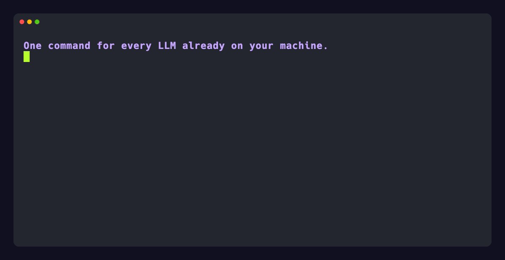

# llm-now

[](https://github.com/swartzrock/llm-now/actions/workflows/ci.yml)
[](https://github.com/swartzrock/llm-now/releases/latest)
[](https://github.com/swartzrock/llm-now/blob/main/LICENSE)
[](https://github.com/swartzrock/llm-now/releases/latest)
[](https://github.com/swartzrock/llm-now/releases/latest)
[](https://github.com/swartzrock/llm-now/releases/latest)

## A tiny CLI for prompting models you already use.

`llm-now` sends one text-generation prompt through a provider you already use: an already-running local server, an authenticated CLI, or a cloud API. It uses [`@swartzrock/byok-runtime`](https://github.com/swartzrock/byok-runtime) for discovery, model listing, and generation; it does not install or start providers.

```console
$ llm-now daily --input "Explain this error in plain English: ECONNREFUSED 127.0.0.1:5432"
```

| Native releases | Passive discovery | Secure credentials | Scriptable output |
| --- | --- | --- | --- |
| macOS, Linux, and Windows | Installs and starts nothing | Environment first; native fallback on enabled targets | Model response only on stdout |

## Contents

- [Install](#install)
- [Quick Start](#quick-start)
- [Common commands](#common-commands)
- [Voice](#voice)
- [Configuration](#configuration)
- [Credentials](#credentials)
- [CLI reference](docs/cli-reference.md)

## Install

### Homebrew (macOS and Linux)

```bash
brew install swartzrock/tap/llm-now
```

### Direct download

[Download the latest release](https://github.com/swartzrock/llm-now/releases/latest), choose the archive for your platform and architecture, then place the extracted executable somewhere on your `PATH`.

- **macOS:** choose Apple silicon (`llm-now-v<version>-macos-arm64.zip`) or Intel (`llm-now-v<version>-macos-x64.zip`). Both builds are signed and notarized.
- **Linux:** choose `llm-now-v<version>-linux-arm64.zip` or `llm-now-v<version>-linux-x64.zip`. These are glibc builds; Alpine and other musl systems are not supported.
- **Windows:** choose `llm-now-v<version>-windows-x64.zip`. This is unsigned early access, so Windows may warn or block it according to local security policy. Do not weaken security controls to run `llm-now`.

Each release includes `SHA256SUMS` and GitHub artifact attestations alongside the archives.

## Quick Start

Before starting, make sure at least one provider is available: an Ollama or LM
Studio server is running, `codex` or `claude` is installed and authenticated,
or a supported cloud API credential is configured.

Open the interactive launcher:

```bash
llm-now
```

Then follow this path without choosing another launcher branch:

1. Select `Create a new shortcut…`.
2. Select `Use an available provider…`.
3. Choose a provider, then choose its model.
4. At `Name this shortcut`, enter a name such as `daily`.
5. At `Optional instructions for this shortcut (press Enter to skip)`, enter
   reusable guidance or press Enter to skip it. If you entered guidance, press
   Tab to select `[ save ]`, then press Enter to save.
6. After the shortcut is saved, enter your first prompt at
   `Prompt for daily · <provider> · <model>` and receive the response.

Reuse the saved shortcut from any directory:

```bash
llm-now daily --input "Summarize the three most important points"
```

## See llm-now in action



## Common commands

| Task | Command |
| --- | --- |
| Open the interactive launcher | `llm-now` |
| Run a saved shortcut | `llm-now daily --input "Summarize this idea"` |
| Pipe a prompt to a saved shortcut | <code>printf 'Explain this diff' &#124; llm-now daily</code> |
| Choose a provider and model explicitly | `llm-now --provider ollama --model llama3 --input "Hello"` |
| List the alias inventory | `llm-now --aliases` |
| Print the configuration path | `llm-now --config-path` |
| Migrate legacy configuration | `llm-now --migrate-config` |
| Route a dictated prompt | `llm-now --voice-route --input "hey daily, summarize this"` |
| Speak a response on macOS | `llm-now --alias daily --speak --input "Summarize this"` |

Arguments, `--input`, piped input, and noninteractive execution bypass the
launcher. Noninteractive generation needs exactly one prompt source (`--input`
or stdin) plus a saved shortcut or an explicit provider and model. Successful
generation writes only the model response to stdout; interactive UI and
diagnostics use stderr. `--aliases`, `--config-path`, and `--migrate-config`
are standalone commands.

`llm-now --help` shows command syntax, option summaries, recognized API-key
environment variables, and a generic secure-storage note. Platform-specific
storage requirements are in the [credentials guide](docs/credentials.md).
See the [CLI reference](docs/cli-reference.md) for exact invocation, selection,
input, instruction, output, diagnostic, and exit-code behavior.

## Voice

`--voice-route` selects a saved shortcut from a dictated name and question on
every supported platform. On macOS, `--speak` sends a validated response to
`/usr/bin/say` instead of stdout; the two flags can be used independently or
together. Neither reads or changes the clipboard.

For a two-action global Apple Shortcut, optional spoken names, routing and
speech settings, privacy guidance, and troubleshooting, see
[Talk to an llm-now alias from a macOS shortcut](examples/macos-voice-shortcut.md).
Installed releases do not need Python, uv, or a repository checkout. The
[`macos-voice-router` Python example](examples/macos-voice-router/) remains a
contributor-only independent parity oracle.

## Configuration

Saved shortcuts and voice settings share one versioned `config.toml`. Shortcut
saves may rewrite it canonically, and legacy `aliases.json` and
`voice-router.toml` data can be migrated with `llm-now --migrate-config`.
Instructions are plaintext and credentials never belong in this file. See the
[configuration guide](docs/configuration.md) for paths, schema, field behavior,
migration, backups, authority rules, and deliberate downgrade recovery.

## Credentials

Recognized environment variables take precedence and are recommended for
scripts and headless use. When no recognized environment credential is set, an
enabled release target may use the operating system's native credential store;
saved shortcut records never contain keys or credential identifiers.

Use the launcher's `Manage connections…` path to add, replace, or delete stored
fallbacks. See the [credentials guide](docs/credentials.md) for recognized
variables, native record behavior, compiled-target support, platform
prerequisites, and recovery when secure storage is unavailable.
