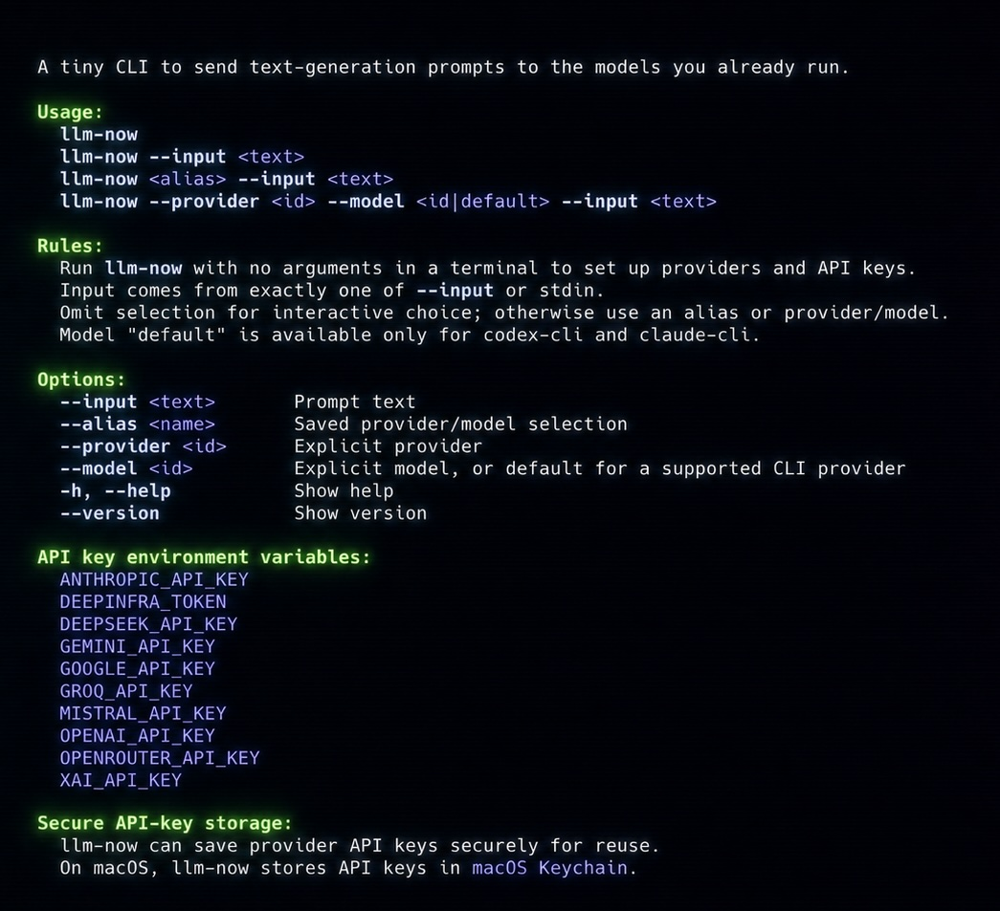

# llm-now

[](https://github.com/swartzrock/llm-now/actions/workflows/ci.yml)
[](https://github.com/swartzrock/llm-now/releases/latest)
[](https://github.com/swartzrock/llm-now/blob/main/LICENSE)
[](https://github.com/swartzrock/llm-now/releases/latest)
[](https://github.com/swartzrock/llm-now/releases/latest)
[](https://github.com/swartzrock/llm-now/releases/latest)

## A tiny CLI for the local models you already run.

`llm-now` sends one text-generation prompt through an LLM provider already available on your machine. It uses [`@swartzrock/byok-runtime`](https://github.com/swartzrock/byok-runtime) for discovery, model listing, and generation; it does not install or start providers.

```console
$ llm-now --input "Explain this error in plain English: ECONNREFUSED 127.0.0.1:5432"
```

| Native releases | Passive discovery | Secure credentials | Scriptable output |
| --- | --- | --- | --- |
| macOS, Linux, and Windows | Installs and starts nothing | Environment first; native fallback on enabled targets | Model response only on stdout |

## See llm-now in action


Want something to try? Open the [cookbook of 20 reusable examples](examples/README.md).

## Install

### Homebrew (macOS and Linux)

```bash
brew install swartzrock/tap/llm-now
```

### Direct download

[Download the latest release](https://github.com/swartzrock/llm-now/releases/latest), choose the archive for your platform and architecture, then place the extracted executable somewhere on your `PATH`.

- **macOS:** choose Apple silicon (`llm-now-v<version>-macos-arm64.zip`) or Intel (`llm-now-v<version>-macos-x64.zip`). Both builds are signed and notarized.
- **Linux:** choose `llm-now-v<version>-linux-arm64.zip` or `llm-now-v<version>-linux-x64.zip`. These are glibc builds; Alpine and other musl systems are not supported.
- **Windows:** choose `llm-now-v<version>-windows-x64.zip`. This is unsigned early access, so Windows may warn or block it according to local security policy. Do not weaken security controls to run `llm-now`.

Each release includes `SHA256SUMS` and GitHub artifact attestations alongside the archives.

## Usage

Run the bare command in an interactive terminal to open setup:

```bash
llm-now
```



Setup offers saved aliases, on-demand provider discovery, and cloud-provider API-key management. API keys are entered through hidden terminal input, authenticated before saving, and never accepted through command-line arguments or generation stdin.

A generation call without a saved alias prompts you to choose a discovered provider and model.

If you have saved aliases, an interactive call offers those first. Choose “Select a new provider and model…” for a fresh selection. Alias, provider, and model lists are sorted and filter as you type.

Use a saved global alias:

```bash
llm-now daily --input "Summarize this idea"
printf 'Explain this diff' | llm-now daily
```

List the saved alias inventory without prompting or contacting a provider:

```console
$ llm-now --aliases
aliases → Codex CLI · provider default
daily → OpenAI · gpt-5
```

Inventory output has one uncolored, unpadded `alias → Provider Label · model`
row per canonical lowercase alias, sorted by canonical alias, with no header. A
null model is shown as `provider default`. A missing or empty alias store exits
`0` with zero stdout bytes. Successful inventory writes only to stdout and
leaves stderr empty.

`--aliases` is standalone and ignores stdin. Combining it with any other option
or positional value exits `2`, leaves stdout empty, and writes a `usage:`
diagnostic to stderr. An invalid, unreadable, or case-conflicting alias store
exits `1`, leaves stdout empty, and writes the existing `config:` diagnostic to
stderr. Inventory returns before prompt handling, provider discovery or runtime
calls, credential access, and alias mutation. The bare word `aliases` remains a
positional alias and generates normally when that alias is configured.

Alias names are ASCII case-insensitive but spelling-exact: `daily`, `Daily`, and
`DAILY` select the same alias, while `dailly` does not. Aliases are stored and
displayed in lowercase. Options may appear before or after the alias, though the alias-first form above is recommended. The explicit
`--alias daily` form remains available for scripts and for resolving any future command-name
ambiguity.

Choose deterministically, including a supported CLI provider's default model:

```bash
llm-now --input "Hello" --provider ollama --model llama3
printf 'Hello' | llm-now --provider claude-cli --model default
```

Exactly one prompt source is required: `--input` or stdin. Non-interactive calls require a positional alias, `--alias`, or both `--provider` and `--model`. A second positional argument is never treated as prompt text. Successful generation writes the model response, byte-for-byte, to stdout. Interactive UI and diagnostics use stderr, so the response remains safe to redirect or pipe. After an interactive response, stderr resets terminal styling and adds a clean visual boundary without changing stdout.

## Aliases and configuration

After a successful unnamed interactive call, `llm-now` shows a green contextual field such as `Enter an alias name for OpenAI · gpt-3.5 (Enter to exit)`, with the provider and model emphasized. Type a name to save that exact provider/model pair, or press Enter to exit. If the selected provider/model is already saved, it reports the existing alias and suggests an executable command such as `llm-now daily --input "<prompt>"` for next time instead of asking for a duplicate. A call that selected an existing alias does not ask again. Aliases contain no credentials and are available from every working directory.

- macOS/Linux: `~/.config/llm-now/aliases.json`
- Windows: `%APPDATA%\\llm-now\\aliases.json`, otherwise `%USERPROFILE%\\AppData\\Roaming\\llm-now\\aliases.json`

Saving the same name and target, in any capitalization, reports that it is already saved. Reusing a name for a different target requires overwrite confirmation, defaulting to No. A stale alias fails without selecting a replacement.

Existing version 1 alias files need no eager migration. Case-only legacy entries
that point to the same provider and model collapse to one lowercase alias in
memory without rewriting the file; the next successful alias save persists all
keys in lowercase. If case-only entries point to different targets, `llm-now`
fails closed with a diagnostic naming the entries and alias-file path so you can
keep the intended target. It never chooses between conflicting targets.

## Secure API-key storage

Recognized environment variables are always authoritative. They are the recommended credential source for scripts, automation, and headless systems. When no recognized environment credential is set, an enabled release target may use one provider-specific key from the operating system's native credential store.

Use bare `llm-now` to add, replace, or delete a stored fallback. Replacement verifies the new key before changing the existing record, and save/delete confirmations default to No. Deleting a stored fallback does not remove an active environment credential. Aliases remain version 1 provider/model records and never contain keys or credential identifiers.

### How secure storage works

For each cloud provider, `llm-now` creates at most one native credential record under the service `llm-now`, using the non-secret record name `api-key:<provider>`. The API key itself is passed to the operating system's credential API; `llm-now` does not write it to the alias file or another configuration file. Encryption, locking, and access control are delegated to the native credential service for the logged-in user.

When resolving a provider credential, `llm-now` checks the provider's recognized environment variables first. It reads the native record only when no environment credential is present. A successful replacement is verified before the old native record changes, and deleting a native record does not affect an environment variable. There is no plaintext or self-encrypted fallback.

### macOS Keychain

On a supported macOS release target, the native record is stored in the current user's macOS Keychain. Keychain owns the encrypted storage and user-session access controls. `llm-now` retrieves the record only when a command needs that provider and no recognized environment variable is set.

### Linux Secret Service

On supported Linux glibc targets, the native record is stored through the Secret Service in the current user D-Bus session. GNOME Keyring and KWallet are common providers. A provider must be running and unlocked; a Linux kernel or desktop package alone is not enough. Minimal containers, servers, SSH sessions, WSL sessions, and locked desktops may not expose a usable Secret Service.

If Secret Service is unavailable, `llm-now` does not save the key elsewhere. It reports the failure without exposing backend details and suggests either setting the provider's environment variable for the current shell or starting and unlocking GNOME Keyring or KWallet before retrying.

### Target support and help

Native storage is capability-gated per compiled release target. If it is not enabled for the current target, setup performs no credential-store read and directs you to the provider's environment variable instead.

| Compiled target | Native store | Bun 1.3.14 policy |
| --- | --- | --- |
| macOS ARM64 | Keychain | Enabled after compiled lifecycle gate |
| macOS x64 | Keychain | Environment-only; Bun 1.3.14 failed the compiled lifecycle gate |
| Linux x64 / ARM64 glibc | Secret Service | Enabled after compiled lifecycle gate; requires an available user-session service |
| Windows x64 baseline | Credential Manager | Enabled after compiled lifecycle gate |

The target and pinned Bun version must both match the tested policy. Run `llm-now --help` for platform-specific storage requirements and the complete list of recognized API-key environment variables. In an interactive terminal, unavailable native storage is presented with colored `Error:` and `Tip:` headings; `NO_COLOR` and non-terminal output remain plain. Provider discovery and API-key management reuse the same recovery guidance.

## Discovery and diagnostics

Discovery checks already-running Ollama and LM Studio servers, installed `codex` and `claude` commands on `PATH`, recognized cloud-provider environment variables, and—on enabled targets—stored cloud-provider fallbacks. A candidate is verified only when selected. Discovery never starts software, downloads models, or changes machine configuration.

If no provider is found, stderr lists every checked provider class and manual setup steps. Runtime failures identify the discovery, model-list, generation, or credential-store operation. Diagnostic text removes terminal controls, normalizes line endings, bounds runtime detail, and redacts recognized environment, stored, and candidate credential values.

Exit codes:

- `0`: successful generation or alias inventory, help, version, or completed/declined setup action (including declined/cancelled post-success alias saving)
- `1`: discovery, model-list, generation, configuration (including an invalid, unreadable, or case-conflicting alias store), credential-store, or post-credential alias failure
- `2`: invalid usage, including combining `--aliases` with another option or positional value
- `130`: interactive setup or alias/provider/model selection cancelled before a durable action
