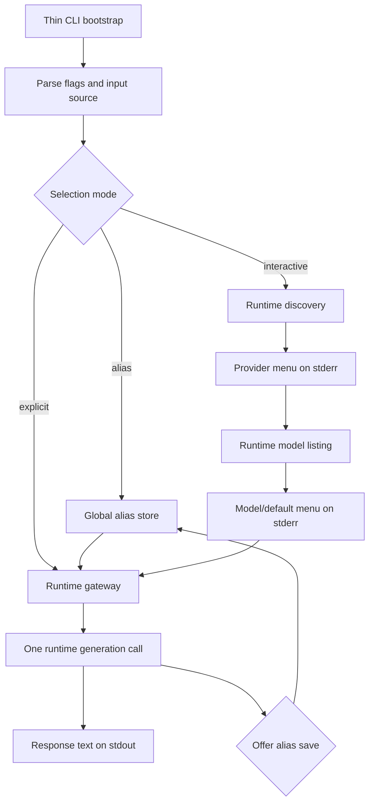
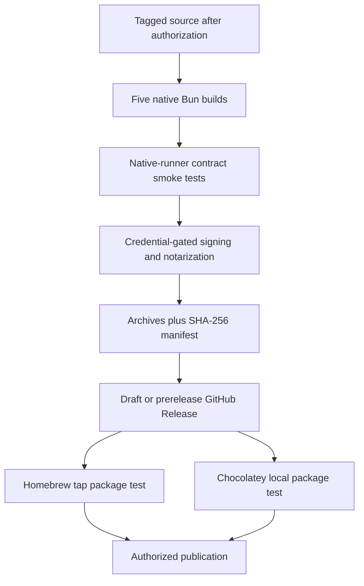

# LLM Now - Plan

## Goal Capsule

- **Objective:** Let a user with any supported LLM already available install `llm-now` and receive generated text within 60 seconds of launching it.
- **Authority:** The Product Contract below defines behavior. `llm-now` owns terminal orchestration, selection, aliases, diagnostics, and distribution; `@swartzrock/byok-runtime` owns provider adapters, discovery primitives, model listing, and generation.
- **Execution profile:** Deliver in two stacked phases: the complete CLI contract first, then native release and package-manager automation.
- **Stop conditions:** Stop for a required product-scope change, an incompatible published runtime API, or release credentials/authorization. Do not publish releases, Homebrew artifacts, or Chocolatey packages without explicit authorization.
- **Tail ownership:** Each phase is implemented, verified, committed, pushed, and opened as a pull request before the next phase begins.

---

## Product Contract

### Summary

`llm-now` is a separate open-source CLI that ships self-contained native executables for mainstream macOS, Linux, and Windows systems. It discovers providers through `byok-runtime`, guides an interactive first call, and supports deterministic one-shot reuse through global aliases.

### Problem Frame

Calling an LLM already available on a machine often requires installing plugins, writing provider configuration, or understanding provider-specific endpoints. The product advantage is the shortest path from an available LLM to a successful response without managing provider configuration files or credentials.

### Actors

- A1. **First-time evaluator:** Has a supported local server, authenticated AI CLI, or cloud key and wants a successful response without configuration.
- A2. **Recurring shell user:** Uses a saved alias for repeatable one-shot prompts and pipelines.
- A3. **Automation caller:** Runs without an interactive terminal and needs deterministic selection, clean stdout, and meaningful failures.
- A4. **Release maintainer:** Publishes one version across the supported binary and package-manager matrix.

### Key Flows

- F1. **First interactive success:** A TTY user supplies `--input`, chooses a discovered provider and model, receives one response on stdout, then may save the successful selection as an alias.
- F2. **No provider available:** Discovery reports no candidates, explains what was checked, provides manual setup guidance, and makes no machine changes.
- F3. **Saved alias call:** A user supplies `--alias` and input; the CLI resolves the global selection, generates once, and writes only the response to stdout.
- F4. **Non-interactive call:** Piped stdin or a non-TTY invocation requires an alias or explicit provider/model selection and fails before generation when selection is ambiguous.
- F5. **Native release:** Automation builds and tests the platform matrix, publishes checksummed GitHub Release artifacts after authorization, and validates Homebrew and Chocolatey installations.

### Requirements

#### Product boundary

- R1. `llm-now` must remain a separate repository and product from `byok-runtime`.
- R2. The CLI must use `byok-runtime` as the only source of provider adapters, model listing, and text generation.
- R3. The CLI must support one-shot text generation from `--input` or stdin without storing conversations.
- R4. The CLI must not store API keys or authentication tokens.

#### Discovery and selection

- R5. The CLI must discover all provider candidates returned by `byok-runtime` without provider configuration files.
- R6. An interactive first call without a saved selection must present a provider menu followed by a model menu.
- R7. Generation must begin only after a provider and applicable model are selected or supplied deterministically.
- R8. A non-interactive call must require `--alias` or explicit provider and model inputs.
- R9. When no providers are found, the CLI must report checked provider classes and actionable manual setup guidance.
- R10. Discovery must not install software, start provider runtimes, pull models, or create credentials.

#### Aliases and user configuration

- R11. After successful generation, an interactive call must offer to save the provider/model selection under a user-chosen alias.
- R12. A saved alias must contain only provider and model selection data.
- R13. User aliases must be global to the operating-system account and available from every working directory.
- R14. macOS and Linux must honor `$XDG_CONFIG_HOME` and fall back to `~/.config/llm-now`; Windows must use the roaming application-data directory.

#### Terminal and automation contract

- R15. Successful generation must write response text only to stdout.
- R16. Menus, selection context, and operational diagnostics must not contaminate response stdout.
- R17. Failures must return nonzero exit codes and identify the failed stage without exposing credential values.
- R18. Help must document interactive, alias, explicit-selection, stdin, configuration, and diagnostic behavior.

#### Native distribution

- R19. Release artifacts must be self-contained executables that require neither Node.js nor Bun.
- R20. The initial matrix must cover macOS x64, macOS ARM64, Linux x64, Linux ARM64, and Windows x64.
- R21. Every released binary must pass the same user-facing command and behavioral contract.
- R22. GitHub Actions must build and test the binary matrix and publish versioned, checksummed GitHub Release artifacts.
- R23. Homebrew must provide supported installation and upgrade paths on macOS and Linux.
- R24. Chocolatey must provide supported installation and upgrade paths on Windows.
- R25. The release process must verify package-manager-installed binaries, not only raw build artifacts.
- R26. `bun build --compile` is the preferred packaging mechanism while self-contained compatibility remains the governing requirement.

### Acceptance Examples

- AE1. **First poem:** With Ollama and an authenticated Claude CLI available, a TTY call presents both providers, lists models after provider choice, writes the poem alone to stdout, and offers to save the successful selection. Covers F1 and R5-R7, R11, R15-R16.
- AE2. **No providers:** With no local endpoint, supported executable, or recognized key, the call exits nonzero and shows manual next steps without modifying the machine. Covers F2 and R9-R10, R17.
- AE3. **Alias reuse:** After saving `llamqwen`, the alias works from another directory and resolves the same provider/model selection without storing credentials. Covers F3 and R11-R14.
- AE4. **Broken alias target:** If the saved provider or model is unusable, the call fails clearly and never selects a replacement. Covers R12 and R17.
- AE5. **Pipeline safety:** A piped call without deterministic selection fails before generation; a piped call with an alias emits only response text to stdout. Covers F4 and R8, R15-R17.
- AE6. **Cross-platform installation:** A released version installs through Homebrew on supported macOS/Linux targets and Chocolatey on Windows x64, runs without Node.js or Bun, and reports the same version and help contract. Covers F5 and R19-R25.

### Success Criteria

- A user with one supported provider receives text within 60 seconds of launching the installed CLI.
- The first successful call requires no provider configuration file, plugin installation, credential copy, or endpoint entry.
- The one-shot and alias workflows pass on every initial native target.
- Homebrew and Chocolatey installations are release gates.
- No alias or diagnostic artifact contains credential values.

### Scope Boundaries

#### Deferred for later

- Windows ARM64.
- Linux musl artifacts.
- Additional x64 variants beyond the baseline-compatible release targets.
- Additional package managers or installer scripts.

#### Outside this product's identity

- Interactive chat, sessions, or history.
- RAG, attachments, tools, or agents.
- Credential storage or key setup.
- Provider plugins or CLI-owned adapters.
- Installing runtimes or downloading models.
- npm, `npx`, or `bunx` distribution.

### Product Contract Preservation

Product Contract unchanged. The markdown conversion preserves R1-R26, A1-A4, F1-F5, AE1-AE6, success criteria, and scope from `docs/2026-07-12-001-feat-llm-now-plan.html`; planning decisions below resolve implementation questions without widening product scope.

---

## Planning Contract

### Key Technical Decisions

- KTD1. **Pin the public runtime contract at `@swartzrock/byok-runtime` 1.1.0.** PR #22 merged and npm publishes 1.1.0 with `findAvailableProviders` and `createByokNodeProvider` under the public `/node` entrypoint. The first implementation uses exact 1.1.0 plus `bun.lock` because an unreleased major change already exists upstream.
- KTD2. **Use one runtime gateway for all providers.** A small adapter assembles public `ByokProviderConfig` values and calls `createByokNodeProvider`, keeping provider-specific SDK behavior out of CLI code and making discovery, model listing, and generation injectable in tests.
- KTD3. **Treat availability as a candidate signal.** Discovery does not prove authentication or generation readiness. Interactive model-list failure returns to provider selection when alternatives exist; an empty successful list may offer a supported provider default. An explicit or aliased selection fails at the named stage without fallback.
- KTD4. **Represent a runtime-supported provider default as `model: null`.** Codex and Claude can generate without a model while their model listing can be empty. Interactive users receive a visible “provider default” choice; providers that require a model fail closed. Alias records remain limited to `provider` and `model` fields.
- KTD5. **Define interactivity as readable stdin plus writable diagnostic TTY.** Menus and prompts use stdin and stderr only when both are TTYs. Piped stdin or redirected diagnostics is non-interactive and requires deterministic selection.
- KTD6. **Reject ambiguous arguments before discovery.** Exactly one input source is allowed; `--alias` is mutually exclusive with explicit selection; explicit selection requires both provider and model. `--model default` is the sole deterministic syntax for requesting a runtime-supported CLI provider default; provider-only input remains invalid. Usage errors return exit code 2, cancellation before generation returns 130, and operational failures return 1.
- KTD7. **Use a versioned JSON alias store with atomic replacement.** Unix uses `$XDG_CONFIG_HOME/llm-now/aliases.json` or `~/.config/llm-now/aliases.json`; Windows uses `%APPDATA%\\llm-now\\aliases.json` and falls back to `%USERPROFILE%\\AppData\\Roaming\\llm-now\\aliases.json`. Writes use a same-directory temporary file and rename, directories use private permissions where supported, and corrupt or invalid data fails closed.
- KTD8. **Make output channels and sanitization dependencies.** The application receives response, diagnostic, and prompt channels rather than scattering console calls. Only the final generated text reaches the response channel. The diagnostic boundary removes terminal controls, normalizes line breaks, caps runtime-derived detail, and replaces an ephemeral allowlist of recognized credential environment values before writing stderr. It never persists or serializes that redaction set.
- KTD9. **Compile hermetically with Bun 1.3.14.** Standalone builds disable dotenv, bunfig, tsconfig, and package-json autoloading so the caller's working directory cannot change behavior. Linux x64 and Windows x64 use baseline targets; every artifact runs on a native runner before release.
- KTD10. **Stage distribution behind authorization.** A project Homebrew tap is the first Homebrew channel, Chocolatey targets the community repository, and signing/publishing jobs require explicit secrets and approval through a protected GitHub Environment. Release jobs accept only a matching version tag whose commit is reachable from protected `main`. Pull requests deliver verified automation and package definitions without creating public releases.

### Acceptance Timing Budget

- The automated first-call acceptance path uses scripted immediate menu choices and a provider fixture that returns within five seconds.
- Discovery receives 5 seconds, model listing receives 10 seconds, and generation receives 45 seconds through propagated abort signals; the composed installed-binary scenario must complete within 60 seconds.
- Manual acceptance records wall-clock launch-to-text time with timely user selections and one already-available provider. Human decision time beyond the scripted interaction is reported separately rather than hidden inside runtime performance.

### No-Provider Diagnostic Contract

| Checked class | Required diagnostic | Manual next step |
|---|---|---|
| Local servers | State that Ollama on `127.0.0.1:11434` and LM Studio on `127.0.0.1:1234` were checked. | Start an already-installed server with a model, then retry. |
| Authenticated AI CLIs | State that `codex` and `claude` were checked on `PATH`. | Install and authenticate a supported CLI separately, then retry. |
| Environment-backed cloud providers | State that recognized Anthropic, OpenAI, Google, xAI, and OpenRouter key variables were checked without printing values. | Export a supported provider key in the shell, then retry. |

### Assumptions

- Bun 1.3.14 can bundle the runtime's HTTP and child-process paths; U1 proves this on the five native targets before terminal behavior is implemented.
- Provider identifiers accepted by aliases are validated against the runtime's public types/registry behavior, not a CLI-owned adapter registry.
- Alias names are case-sensitive ASCII identifiers matching `^[A-Za-z0-9][A-Za-z0-9_-]{0,63}$`; surrounding whitespace is rejected rather than normalized.
- An existing alias name requires explicit overwrite confirmation in an interactive terminal and fails non-interactively.
- Declining or cancelling the post-generation save prompt leaves configuration unchanged and preserves exit 0. Invalid names re-prompt with a cancel path; declining overwrite preserves the existing alias and exit 0.
- Empty prompt text, conflicting input sources, invalid UTF-8-decoded text, corrupt config, and cancelled menus fail before generation.
- Signing and package-repository credentials are unavailable during pull-request verification; their absence is an expected manual-release gap, not permission to weaken gates.
- Response stdout remains byte-faithful even when attached to a terminal. This preserves the shell contract; runtime-derived diagnostics, not requested model output, receive terminal-control sanitization.

### High-Level Technical Design





### Output Structure

```text
.
├── index.ts
├── src/
│   ├── app.ts
│   ├── args.ts
│   ├── aliases.ts
│   ├── io.ts
│   ├── prompts.ts
│   └── runtime.ts
├── tests/
│   ├── app.test.ts
│   ├── args.test.ts
│   ├── aliases.test.ts
│   ├── prompts.test.ts
│   └── runtime.test.ts
├── scripts/
│   ├── build.ts
│   └── release-validate.ts
├── packaging/
│   ├── homebrew/llm-now.rb
│   └── chocolatey/
│       ├── llm-now.nuspec
│       └── tools/chocolateyinstall.ps1
└── .github/workflows/
    ├── runtime-compat.yml
    ├── ci.yml
    └── release.yml
```

### Phased Delivery and PR Strategy

1. **Phase 1 — Core CLI:** U1-U4 on `codex/llm-now-core`, based on `main`. Include both source planning HTML files and this implementation plan. Deliver a complete locally usable CLI with tests, documentation, and a current-platform compiled smoke test.
2. **Phase 2 — Native distribution:** U5-U6 on `codex/llm-now-distribution`, based on `codex/llm-now-core`. Deliver the native matrix, artifact integrity, signing gates, Homebrew tap formula, Chocolatey package, and release validation without publishing.

---

## Implementation Units

### U1. Establish the runtime boundary and compiled compatibility spike

- **Goal:** Install the pinned runtime and prove its public Node surface works from source and a standalone current-platform executable before expanding the CLI.
- **Requirements:** R1-R2, R4, R19, R26.
- **Dependencies:** None.
- **Files:** `package.json`, `bun.lock`, `index.ts`, `src/runtime.ts`, `tests/runtime.test.ts`, `tests/fixtures/fake-cli.ts`, `tsconfig.json`, `.github/workflows/runtime-compat.yml`.
- **Approach:** Define a narrow gateway for discovery, model listing, and generation using only package root and `/node` exports. Assemble environment-backed cloud, default local-server, and CLI-command configs without reading credential values. Add an executable smoke fixture that exercises injected discovery, HTTP generation, and a fake PATH command.
- **Execution note:** Start with failing gateway contract tests, then run the compiled spike before building terminal behavior.
- **Patterns to follow:** Bun ESM/strict TypeScript settings in `tsconfig.json`; public examples in `byok-runtime` v1.1.0 `README.md` and `examples/provider-smoke`.
- **Test scenarios:**
  - Discovery returns every runtime candidate in runtime order without launching commands.
  - Each provider class maps to a valid public runtime config without embedding an environment value in output.
  - A CLI provider with `model: null` omits the model and can generate through a fake PATH executable.
  - Model-list and generation errors retain their stage and redact environment values.
  - A minimal five-target native-runner matrix imports both public entrypoints, performs an injected HTTP call, and spawns the fake executable without Node.js or a separate Bun runtime.
- **Verification:** Runtime gateway tests pass, the locked dependency is exactly 1.1.0, and all five native compatibility probes are green before U2 begins. An unavailable native runner is a phase blocker rather than evidence inferred from cross-compilation.

### U2. Implement deterministic arguments, input, and terminal selection

- **Goal:** Resolve prompt and provider/model selection with explicit non-interactive behavior and interactive numbered menus confined to stderr.
- **Requirements:** R3, R5-R10, R15-R18; F1, F2, F4; AE1, AE2, AE5.
- **Dependencies:** U1.
- **Files:** `src/args.ts`, `src/io.ts`, `src/prompts.ts`, `tests/args.test.ts`, `tests/prompts.test.ts`.
- **Approach:** Parse `--input`, `--alias`, `--provider`, `--model`, `--help`, and `--version` without a third-party parser. Resolve exactly one input source, calculate interactivity from stdin/stderr TTY state, and use a replaceable numbered prompt interface. `--model default` maps to `model: null` only for runtime-supported CLI providers. On model-list failure, return to provider selection when alternatives exist; on an empty successful list, offer the provider default only when supported. Otherwise fail without substitution.
- **Execution note:** Implement parsing and stream behavior test-first because stdout cleanliness is a public CLI contract.
- **Patterns to follow:** Bun's standard runtime plus compatible built-in `node:util` and `node:readline/promises`; dependency-injected stream/TTY interfaces.
- **Test scenarios:**
  - `--input` and stdin each produce the exact prompt; both together, neither, or blank input return usage errors before discovery.
  - Alias and explicit provider/model combinations reject ambiguity; partial explicit selection returns exit 2.
  - `--provider codex-cli --model default` resolves the provider default; `--provider codex-cli` alone and `--model default` for a required-model provider return exit 2.
  - Covers F1 / AE1. A TTY with two providers receives provider then model menus on diagnostics and returns the selected pair.
  - Covers F2 / AE2. Empty discovery emits every class-specific checked-state and manual next step from the No-Provider Diagnostic Contract, changes no files, and returns operational failure.
  - Covers F4 / AE5. Piped stdin never opens a menu and requires deterministic selection.
  - Cancellation at either menu returns 130 without generation or alias writes.
  - Model-list failure re-prompts provider when another candidate exists; explicit selection fails without substitution.
  - Help documents every supported path and `--version` is stable.
- **Verification:** Unit tests prove all argument branches, exact stdout remains empty before generation, and menus/diagnostics are observable only through stderr.

### U3. Add global aliases with validated atomic persistence

- **Goal:** Save and resolve OS-user-global provider/model selections without storing secrets or risking partial updates.
- **Requirements:** R4, R11-R14, R17; F3; AE3, AE4.
- **Dependencies:** U1, U2.
- **Files:** `src/aliases.ts`, `tests/aliases.test.ts`, `tests/fixtures/aliases/valid.json`, `tests/fixtures/aliases/corrupt.json`.
- **Approach:** Use a versioned JSON document containing validated alias names mapped only to provider and nullable model. Resolve XDG and Windows roaming paths from injected environment/home/platform values. Acquire a same-directory exclusive lock with bounded retry and stale-lock recovery, re-read and validate under the lock, write through a unique temporary file, then rename and release the lock. Confirm interactive overwrite and reject non-interactive collisions.
- **Execution note:** Characterize filesystem failure and corruption paths before connecting persistence to the application.
- **Patterns to follow:** Bun file operations for file content and platform-compatible rename/mode operations where atomicity or permissions require them.
- **Test scenarios:**
  - Unix honors `XDG_CONFIG_HOME` and otherwise uses `~/.config/llm-now`; Windows honors `APPDATA` and uses its documented fallback.
  - Covers AE3. Saving an alias from one directory resolves the same provider/model selection from another.
  - Alias JSON contains only schema version, alias names, provider, and model; injected credential values never appear.
  - Corrupt JSON, unknown providers, malformed names, and invalid model values fail closed without replacing the original file.
  - An interrupted temporary write leaves the prior valid file readable; successful rename replaces it fully.
  - Two concurrent save processes serialize under the lock and preserve both aliases; a timed-out or invalid lock fails without changing the store, and a stale lock recovers by the documented age rule.
  - Covers AE4. A stale alias generation failure is reported without fallback or mutation.
  - Alias collision requires affirmative TTY confirmation and fails in non-interactive mode.
- **Verification:** All path/schema/atomicity tests pass on platform-neutral fixtures, permission checks pass where supported, and a secret-scan assertion finds no credential values.

### U4. Compose the one-shot application and document the CLI

- **Goal:** Connect input, selection, runtime, alias persistence, streams, and exit behavior into the complete user-facing CLI.
- **Requirements:** R3-R18; F1-F4; AE1-AE5.
- **Dependencies:** U1-U3.
- **Files:** `index.ts`, `src/app.ts`, `tests/app.test.ts`, `README.md`, `package.json`.
- **Approach:** Keep `index.ts` as a thin bootstrap that passes process dependencies to an application returning an exit code and sets `process.exitCode`. Generate exactly once, write response text only after success, then offer alias persistence through the interactive prompt interface. Centralize stage-labeled diagnostics with credential redaction, terminal-control removal, line normalization, and bounded runtime detail. Post-success save decline, cancellation, invalid-name recovery, or rejected overwrite never changes the completed generation's exit 0.
- **Execution note:** Add end-to-end application tests before replacing the scaffold entrypoint.
- **Patterns to follow:** Functional dependency injection established in U1-U3; no direct `process.exit()` and no scattered console output.
- **Test scenarios:**
  - Covers F1 / AE1. The full interactive flow discovers, selects, lists, generates once, writes exact response stdout, and offers alias save afterward.
  - Covers F3 / AE3. Alias reuse skips discovery/menus and generates the stored selection from another working directory.
  - Covers F4 / AE5. Piped input plus alias is machine-clean; piped input without deterministic selection fails before runtime generation.
  - Discovery, model listing, generation, config, and usage failures use documented exits and stage diagnostics without credential values.
  - Cancellation returns 130 and flushes diagnostics naturally.
  - Cancelling or declining alias save after response output preserves exit 0 and configuration; invalid names re-prompt until valid or cancelled, and declining overwrite preserves the existing alias.
  - Malicious runtime errors containing credential values, terminal controls, excessive length, or mixed line endings are safely bounded before stderr.
  - The installed scripted first-call scenario completes within the Acceptance Timing Budget; timeouts identify discovery, model-list, or generation stage.
  - `--help` and README examples cover interactive input, stdin, alias, explicit selection, config paths, diagnostics, and exit semantics.
  - A current-platform compiled `llm-now` passes help, version, deterministic failure, fake HTTP, and fake CLI smoke cases.
- **Verification:** `bun test`, type checking, and the complete current-platform executable smoke suite pass; README examples match actual parser behavior.

### U5. Build and verify the five-target native release matrix

- **Goal:** Produce reproducible self-contained archives and checksums, then exercise the public CLI contract on native GitHub runners.
- **Requirements:** R19-R22, R26; F5; AE6.
- **Dependencies:** U4.
- **Files:** `scripts/build.ts`, `scripts/release-validate.ts`, `tests/build.test.ts`, `.github/workflows/ci.yml`, `.github/workflows/release.yml`, `package.json`.
- **Approach:** Extend the U1 native compatibility matrix into the full product matrix. Map the five product targets to pinned Bun compile targets, choosing baseline Linux/Windows x64. Disable ambient project loading in compile options. Build stable versioned archive names, generate one SHA-256 manifest, upload artifacts between native-runner jobs, and test help/version, stream separation, HTTP, and fake PATH-command behavior on each native OS/architecture.
- **Execution note:** Treat packaging as smoke-first verification; cross-compilation success alone is insufficient.
- **Patterns to follow:** Official Bun executable targets and `oven-sh/setup-bun` pinned to a full action commit SHA; least-privilege GitHub Actions permissions.
- **Test scenarios:**
  - The target map emits exactly macOS x64/ARM64, Linux x64/ARM64, and Windows x64 artifacts with stable names.
  - Every archive contains one executable and matches the SHA-256 manifest.
  - Covers AE6. Native runners execute the binary without project dependencies and observe identical help/version/exit behavior.
  - Linux and Windows x64 artifacts use baseline targets; Linux artifacts are glibc and musl remains absent.
  - Compiled binaries ignore caller `.env`, `bunfig.toml`, `tsconfig.json`, and `package.json` files.
  - Release jobs cannot publish from pull requests and lack write permissions until the authorized release job.
- **Verification:** CI validates source tests plus every available native target; any unavailable architecture is reported as a manual gap rather than inferred from cross-compilation.

### U6. Add signing gates and package-manager installation validation

- **Goal:** Make Homebrew and Chocolatey installations release gates while keeping signing and publication explicitly authorization-controlled.
- **Requirements:** R22-R25; F5; AE6.
- **Dependencies:** U5.
- **Files:** `packaging/homebrew/llm-now.rb`, `packaging/chocolatey/llm-now.nuspec`, `packaging/chocolatey/tools/chocolateyinstall.ps1`, `scripts/release-validate.ts`, `.github/workflows/release.yml`, `README.md`.
- **Approach:** Ship a project-tap formula selecting immutable checksummed archives by OS/architecture and a Chocolatey portable package using the Windows archive checksum. For pull-request validation, render a temporary formula against a runner-local HTTP server serving the exact built archives, exercise install/upgrade/uninstall, and separately verify that the release formula renders immutable GitHub Release URLs. Sign/notarize macOS artifacts with `notarytool` and sign/timestamp Windows artifacts with SignTool only in a protected, reviewer-approved GitHub Environment after tag/version/main ancestry validation. Validate package creation, install, behavioral smoke, upgrade, and uninstall before promotion or repository publication.
- **Patterns to follow:** Homebrew Formula Cookbook and project taps; Chocolatey `Install-ChocolateyZipPackage`; Apple `notarytool`; Microsoft SignTool SHA-256 verification.
- **Test scenarios:**
  - Homebrew selects the correct macOS/Linux architecture asset and rejects a checksum mismatch.
  - A temporary tap installs, runs a deterministic non-interactive contract test, upgrades, and uninstalls on supported runners.
  - Chocolatey packs locally, installs from the local source, creates the `llm-now` shim, runs the contract test, upgrades, and uninstalls.
  - Covers AE6. Package-installed binaries report the same version/help/exit contract as raw artifacts.
  - Missing signing or publication credentials skips no verification silently; it blocks only the authorized release stage with actionable output.
  - Secret-bearing jobs cannot start without protected-environment reviewer approval, a matching package/tag version, and a tag commit reachable from protected `main`.
  - Signed macOS artifacts pass codesign, notarization, and Gatekeeper checks; signed Windows artifacts pass Authenticode verification when credentials are supplied.
- **Verification:** Package definitions pass their native lint/audit and local install lifecycle. Publication remains unexecuted until explicit release authorization and credentials exist.

---

## Verification Contract

| Gate | Applies to | Required outcome |
|---|---|---|
| `bun install --frozen-lockfile` | U1-U6 | Dependency graph matches committed `bun.lock`; runtime remains 1.1.0. |
| `bun test` | U1-U6 | Unit and application scenarios pass with no live credentials or providers. |
| `bun run typecheck` | U1-U6 | Strict TypeScript passes with no unchecked indexed access or runtime-only import errors. |
| `bun run check` | U4-U6 | Formatting, tests, type checking, and current-platform compiled smoke tests pass. |
| `bun run build:native` | U5-U6 | The five deterministic archives and checksum manifest are produced. |
| `bun run release:validate` | U5-U6 | Native executable and package-manager installation contracts pass where the required native runner is available. |
| GitHub Actions matrix | U5-U6 | All five target contracts are decided; cross-compilation alone never substitutes for native execution. |

Behavioral verification must assert exact stdout, stderr, exit code, runtime call count, filesystem mutation, and credential redaction for every conditional flow. Release verification may report signing/publication as authorization-gated, but it may not mark package installation or raw-binary contract failures as acceptable.

---

## Risks and Dependencies

- **Runtime churn:** v1.1.0 is published, but upstream already carries an unreleased major metadata removal. Mitigation: exact pin plus lockfile and public-contract tests; upgrade deliberately.
- **Compiled child processes:** Bun documents broad Node compatibility, but the runtime uses PATH discovery and `node:child_process`. Mitigation: U1 compiled spike and native fake-command tests on every release target.
- **Candidate versus readiness:** Discovery can find an unauthenticated or failing provider. Mitigation: isolate model-list/generation failures and never silently replace explicit or alias selections.
- **Alias integrity:** Interrupted writes can corrupt config and overlapping processes can lose valid updates. Mitigation: schema validation, an exclusive lock with bounded stale recovery, same-directory atomic rename, private permissions, and failure-injection tests.
- **CPU/libc compatibility:** Standard x64 builds may require AVX2 and Linux defaults to glibc. Mitigation: baseline x64 targets and explicit musl deferral.
- **Signing and package publication:** Apple, Windows, Homebrew, and Chocolatey require external accounts and secrets. Mitigation: credential-gated native jobs, immutable assets, and no public publication during this LFG run.

---

## Documentation and Operational Notes

- README installation sections distinguish source development from future native installation commands until package publication is authorized.
- Release documentation names required secrets and the authorization checkpoint without exposing secret values.
- GitHub Actions use minimal permissions and pin third-party actions to full commit SHAs.
- Homebrew begins in a project tap because the binary-only cross-platform CLI does not fit homebrew-core Formula policy; Chocolatey begins with locally validated community-package metadata.

---

## Sources and Research

- `docs/2026-07-12-001-feat-llm-now-plan.html` — authoritative requirements-only Product Contract.
- `docs/2026-07-12-byok-runtime-cli-distribution-ideation.html` — library/CLI boundary and distribution rationale.
- [byok-runtime v1.1.0 package and public Node exports](https://github.com/swartzrock/byok-runtime/blob/v1.1.0/package.json) and [PR #22](https://github.com/swartzrock/byok-runtime/pull/22) — minimum version and discovery API.
- [byok-runtime provider discovery](https://github.com/swartzrock/byok-runtime/blob/v1.1.0/src/provider-discovery.ts), [Node provider factory](https://github.com/swartzrock/byok-runtime/blob/v1.1.0/src/providers/node-provider-factory.ts), and [public types](https://github.com/swartzrock/byok-runtime/blob/v1.1.0/src/types.ts) — runtime boundary and candidate/readiness distinction.
- [Bun standalone executables](https://bun.sh/docs/bundler/executables) and [Node compatibility](https://bun.sh/docs/runtime/nodejs-compat) — target matrix, compile isolation, CPU compatibility, and signing constraints.
- [XDG Base Directory specification](https://specifications.freedesktop.org/basedir-spec/latest/) — Unix config location and permissions.
- [Homebrew Formula Cookbook](https://docs.brew.sh/Formula-Cookbook) and [acceptable formulae](https://docs.brew.sh/Acceptable-Formulae) — project-tap packaging decision.
- [Chocolatey package creation](https://docs.chocolatey.org/en-us/create/create-packages/) — portable archive and local install validation.
- [Apple notarization](https://developer.apple.com/documentation/security/notarizing-macos-software-before-distribution) and [Microsoft SignTool](https://learn.microsoft.com/en-us/windows/win32/seccrypto/signtool) — credential-gated signing verification.

---

## Definition of Done

- U1-U4 ship a documented CLI that satisfies F1-F4 and AE1-AE5 with exact stream, exit, runtime-call, alias, and redaction assertions.
- The installed scripted first-call scenario completes within 60 seconds under the Acceptance Timing Budget, and manual acceptance reports launch-to-text time separately.
- U5-U6 ship a reproducible five-target build and release pipeline satisfying F5 and the automatable portions of AE6 without publishing externally.
- The current platform's raw executable and supported package lifecycle pass locally or in CI; every other target has a native CI result or is named as an unresolved runner gap.
- No source file duplicates a provider adapter, stores credential values, or introduces chat/history/plugin scope. The diagnostic boundary may read recognized credential environment values only into an ephemeral redaction set that is never logged, persisted, or serialized.
- Both source planning HTML artifacts and this plan are committed on the first implementation branch.
- Abandoned experimental code, generated archives, temporary config files, and unrelated `.DS_Store` files are absent from commits.
- Each phase is committed, pushed, and opened as its own focused pull request in the documented stack.
- Public release, signing, Homebrew tap publication, and Chocolatey community publication remain pending explicit authorization and credentials.
