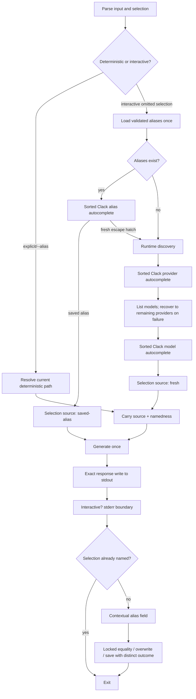

# Interactive Alias UX - Plan

## Goal Capsule

- **Objective:** Make interactive `llm-now` runs alias-first, searchable, deterministically ordered, and visually separated from model output without changing byte-faithful stdout or non-interactive behavior.
- **Authority:** The Product Contract below defines the behavior. The ideation artifact records the UX rationale; this plan resolves implementation and verification details.
- **Execution profile:** One cohesive implementation phase and one pull request. Prompt infrastructure, selection provenance, alias persistence semantics, and finish UI ship together because partial combinations create inconsistent public behavior.
- **Stop conditions:** Stop for an incompatible Clack/Bun standalone-executable boundary, a required change to the persisted alias schema, or a product decision that changes stdout/non-interactive contracts.
- **Tail ownership:** Implement, verify, simplify, review, commit, push, open the pull request, and watch CI in this run.

---

## Product Contract

### Summary

An interactive run with no explicit selection starts from saved aliases when they exist, then offers fresh provider/model discovery as an escape hatch. All selectable lists support type-ahead filtering and deterministic ordering. After every interactive generation, stderr creates a clear terminal boundary; when the selection is not already named by an alias, it asks directly for an optional alias name with enough context to know what will be saved.

### Problem Frame

Saved aliases are currently invisible unless the user remembers a flag and name. Provider/model menus require numeric scanning, preserve arbitrary runtime order, and are rendered twice. After generation, the confirmation prompt can touch output that lacks a trailing newline, while the two-step save question does not explain immediately what the requested alias will contain.

### Actors

- A1. **Recurring interactive user:** Wants to see and select a saved alias without recalling its spelling.
- A2. **First-time or fresh-selection user:** Wants searchable, predictable provider/model choices and a quick way to save the result.
- A3. **Automation caller:** Requires unchanged deterministic arguments, exit codes, and exact response bytes on stdout.

### Key Flows

- F1. **Saved alias fast path:** An interactive omitted-selection run with saved aliases shows a sorted searchable alias picker. Choosing an alias bypasses discovery, generates once, and finishes without another save prompt.
- F2. **Fresh discovery:** Choosing the fresh-selection escape hatch, or having no aliases, shows sorted searchable provider and model pickers. Model-list failure removes the failed provider and redraws remaining choices.
- F3. **Interactive finish:** After any interactive generation, the response is written byte-for-byte to stdout and stderr opens a clean visual boundary. If the run did not use an alias, one contextual field accepts a new alias or Enter/cancel to exit successfully; already-named selections finish after the boundary.
- F4. **Deterministic invocation:** Explicit aliases, explicit provider/model selection, and every non-interactive invocation retain deterministic routing, exact stdout, and failure behavior. Interactive explicit executions still receive the universal R13 stderr boundary, and unnamed explicit provider/model selections receive the R14 alias field.

### Requirements

#### Alias-first startup

- R1. Only an interactive omitted-selection run may open the alias picker. Explicit and non-interactive paths retain deterministic routing, exact stdout, and failure behavior; interactive explicit executions still receive the R13 boundary and unnamed explicit provider/model selections receive the R14 alias field.
- R2. The application must load the validated alias document once before interactive discovery. A corrupt store must fail closed as it does today.
- R3. When at least one alias exists, present aliases in a searchable list with alias name as label and `<runtime provider label> · <raw model>` as hint; represent a `null` model as `provider default`.
- R4. Keep one unambiguous final escape-hatch option, “Choose a provider and model…”, after all aliases. With no aliases, skip this picker.
- R5. Choosing an existing alias must bypass discovery and must not offer to save that selection again.

#### Searchable deterministic selection

- R6. Use `@clack/prompts` for alias, provider, and model lists, with canonical alias/provider/model identifiers as option values and human text only as labels or hints. Provider display text comes from the runtime's public provider metadata.
- R7. Sort copied option arrays by case-folded visible label and then canonical raw value. The escape hatch remains last and upstream arrays are not mutated.
- R8. Model rows must expose the friendly label and raw ID so type-ahead search preserves identity even when labels collide.
- R9. Preserve supported provider-default behavior and model-list recovery: report the failed stage, remove that provider for the run, and redraw remaining sorted providers.
- R10. Escape/Ctrl-C before generation returns exit 130 without generation or configuration writes.

#### Output boundary and alias capture

- R11. Write the generated response exactly once and unchanged to stdout, including a missing trailing newline and any response ANSI bytes.
- R12. All Clack output, app-owned styling, cursor separation, diagnostics, and alias messages must use stderr only.
- R13. Every interactive success receives the post-generation stderr boundary defined in the Boundary State Contract. For ordinary text, line breaks, and SGR styling, it must reset inherited SGR state and put subsequent UI or the returning shell prompt on a clean terminal line with one blank visual row without modifying stdout. Cursor-positioning or terminal-mode-changing response sequences remain byte-preserved but are outside the clean-placement guarantee. Non-interactive success emits no boundary.
- R14. When an interactive selection is unnamed—fresh discovery or explicit provider/model—prompt with the semantic copy `Enter an alias name for <provider label> · <raw model> (Enter to exit)` and a dim `e.g. fast` example. The provider/model shown are the values that will be stored. Explicit and picker-selected aliases are already named and do not receive the field.
- R15. Use Picocolors for app-owned green prompt/success text and dim context/example while honoring stderr capability and `NO_COLOR`; let Clack own list chrome.
- R16. Empty input or post-generation cancellation exits 0 without changing configuration. Invalid nonempty names re-prompt.
- R17. Saving an alias that already maps to the selected target returns a distinguishable `already-saved` outcome and reports “Already saved” without overwrite confirmation. A different target returns the observed old target, shows old and new targets, and defaults overwrite confirmation to No outside the filesystem lock. On approval, the store reacquires the lock and saves only if the current target still matches the observed conflict; otherwise it returns the updated conflict for another decision. Decline returns a distinguishable `declined` outcome.
- R18. A successful save reports `Saved alias <name> → <provider label> · <raw model>` in green. Persistence failure after generation returns exit 1 while preserving the already-written response.

#### Compatibility and documentation

- R19. Existing help/version, explicit alias, explicit provider/model, input, diagnostic sanitization, timeouts, and exit-code contracts remain unchanged except for documented interactive UX.
- R20. Pin exact runtime dependency versions consistent with the repository and prove both dependencies work in Bun 1.3.14 source tests and standalone native compilation.
- R21. Update help, README, and manual-test coverage for alias-first startup, type-ahead, ordering, finish copy, output separation, cancellation, colors, and native behavior.

### Acceptance Examples

- AE1. **Alias reuse:** Given aliases `Daily` and `fast`, an interactive omitted-selection call shows them in deterministic order plus the final escape hatch. Choosing `fast` generates with its stored raw selection, performs no discovery, and asks no save question. Covers F1 and R1-R5.
- AE2. **Fresh fallback:** Given saved aliases, choosing “Choose a provider and model…” opens sorted searchable provider/model lists; selecting a model returns its raw ID even when another model has the same visible label. Covers F2 and R6-R9.
- AE3. **No aliases:** Given an absent store, the call goes directly to provider selection and does not show an empty alias picker. Covers F2 and R2-R4.
- AE4. **Clean finish without stdout mutation:** Given response `done` with no newline, stdout is exactly `done` and stderr follows the Boundary State Contract before the contextual alias prompt. Enter exits 0 without a write. Repeat with `done\n`, and with an interactive saved alias that has no alias field: exact stdout is preserved and the shell returns after the same defined blank row. Covers F3 and R11-R16.
- AE5. **Collision safety:** Given `fast` already maps to the same selection, entering `fast` reports “Already saved” without confirmation. Given a different mapping, the prompt shows old/new targets and defaults to No; declining preserves the file and exit 0. Covers R17-R18.
- AE6. **Automation safety:** A piped explicit or aliased invocation has no Clack/Picocolors bytes on stdout or stderr beyond existing diagnostics and does not load interactive choices. Covers F4 and R1, R11-R12, R19.
- AE7. **Cancellation:** Cancelling alias/provider/model selection returns 130 before generation; cancelling the alias-name field after output returns 0. Covers R10 and R16.

### Success Criteria

- A recurring user can select an existing alias without remembering or typing its full name.
- Every alias/provider/model list filters as the user types and has repeatable first-option ordering.
- The output/prompt seam is visually clear for responses with and without trailing newlines while stdout remains byte-identical.
- The finish prompt tells the user both what to type and which provider/model the alias will contain.
- Current automated checks, native compilation, and focused terminal behavior tests pass.

### Scope Boundaries

#### In scope

- Interactive selection and finish UX, prompt dependencies, selection provenance, same-target collision handling, tests, and documentation.

#### Out of scope

- A bare `llm-now` prompt-entry mode; alias list/create/delete commands; changes to generation or provider discovery; persisted friendly model labels; alias-schema migration; non-interactive fuzzy selection; broad terminal UI redesign.

### Product Contract Preservation

This feature refines original F1/R6/R11/R15-R16 behavior from `docs/plans/2026-07-12-001-feat-llm-now-plan.md`. It preserves explicit alias reuse, non-interactive determinism, byte-faithful stdout, failure staging, configuration paths, and the two-field alias schema.

---

## Planning Contract

### Key Technical Decisions

- KTD1. **Carry namedness and selection provenance through orchestration.** Replace the provider/model-only result at the application seam with a selection plus source (`saved-alias`, `fresh`, or `explicit`). Explicit aliases and alias-picker choices are named; fresh and explicit provider/model choices are unnamed. This makes alias-field eligibility a property of the resolved path instead of re-inferring it from arguments.
- KTD2. **Keep Clack behind a framework-neutral prompt contract.** The adapter owns only Clack rendering, explicit input/stderr output, and cancellation-symbol normalization into framework-neutral results. Application/prompt-domain code owns sorting, canonical option construction, sanitization, validation/retry, provider recovery, copy, provenance, exit codes, and persistence interpretation. Test fakes never import Clack types or symbols; alias/provider/model IDs remain the returned identities and labels never become lookup keys.
- KTD3. **Sort deterministic option records, not display strings.** Copy and sort aliases/providers/models with an explicit case-folded label plus raw-value tie-breaker before conversion to Clack options. This prevents wrong-selection bugs and makes Clack's empty-Enter first choice consistent across environments.
- KTD4. **Keep the interactive terminal boundary on stderr.** The response remains one unchanged stdout write. After every interactive success, the application resets inherited SGR state on stderr and writes the Boundary State Contract's separator; eligible alias UI continues on stderr. This guarantees clean placement for ordinary text, line breaks, and SGR styling, not arbitrary cursor or terminal-mode controls. Visual terminal behavior is verified separately from stream bytes because stdout/stderr interleaving is a terminal property.
- KTD5. **Make color detection output-aware.** Picocolors' singleton detects stdout, but UI is on stderr. Construct colors from injected stderr TTY capability and environment policy, with nonempty `NO_COLOR` disabling color; never embed ANSI in stored alias values or stdout.
- KTD6. **Use optimistic conflict confirmation and distinguish outcomes.** `saveAlias` compares targets under its short-lived filesystem lock. Equal targets return `already-saved`; different targets return the observed conflict without waiting on a human while locked. After approval, a second save attempt carries that expected record, reacquires the lock, and commits only if it still matches; a changed target is re-presented. This avoids stale-lock takeover while retaining `saved`, `already-saved`, and `declined` UI outcomes.
- KTD7. **Treat Clack/Bun compatibility as a release constraint.** Pin `@clack/prompts` 1.7.0 and `picocolors` 1.1.1. Clack is ESM and declares Node >=20.12 while using Node terminal APIs; the implementation is accepted only after Bun source, compiled-runtime, and PTY behavior checks prove the supported surface.

### Boundary State Contract

| Response suffix | Interactive stderr boundary | Observable result |
|---|---:|---|
| No trailing `\n` | SGR reset + `\n\n` | Reset inherited styling, end the response row, then leave one blank visual row before alias UI or the returning shell prompt. |
| Trailing `\n` | SGR reset + `\n` | Reset inherited styling; the response already ended its row, so add one blank visual row before alias UI or the returning shell prompt. |
| Any suffix, non-interactive | No boundary | Preserve the existing automation contract and emit no success UI. |

### Assumptions

- Alias names remain case-sensitive and use the current ASCII validation; display sorting does not normalize stored keys.
- Alias hints use stored raw model IDs because resolving friendly labels would require model listing and break the fast path.
- Provider labels come from `byokProviderDefinition(id).label`; canonical provider IDs remain stored and returned values.
- The fresh-discovery escape hatch uses a collision-proof internal value and stays last, independent of sorting.
- Invalid nonempty alias input may re-render through Clack validation; blank input remains a successful opt-out.
- Current corrupt-store and persistence failures remain operational exit 1 behavior.
- Prompt option text derived from runtimes or files is sanitized before Clack renders it, preserving existing terminal-control and credential defenses.
- Clack is invoked only under the existing stdin/stderr TTY gate; it is never a fallback for non-interactive input.
- Interactive explicit provider/model runs remain eligible for alias capture because they have no alias name; explicit and picker-selected aliases are not.
- Exact terminal cursor behavior with stdout redirected and stderr attached must be observed in PTY tests because Clack internally consults stdout width in some paths.

### High-Level Technical Design

The sketch is directional: exact helper names and module boundaries may follow existing local conventions.

### Single-Phase Delivery and PR Strategy

- **Phase 1 — Interactive alias UX:** U1-U4 on `codex/interactive-alias-ux`, based on `main`. Include the ideation HTML and this plan. Ship the prompt dependency boundary, alias-first routing, finish flow, persistence semantics, documentation, and complete verification as one pull request.

---

## Implementation Units

### U1. Establish the searchable prompt and color boundary

- **Goal:** Replace numbered-menu primitives with an injectable Clack adapter and deterministic typed option construction.
- **Requirements:** R6-R10, R12, R15, R19-R20; F2; AE2, AE7.
- **Dependencies:** None.
- **Files:** `package.json`, `bun.lock`, `src/prompts.ts`, `src/app.ts`, `tests/prompts.test.ts`, focused prompt-adapter fixtures as needed.
- **Approach:** Pin Clack/Picocolors; define one framework-neutral prompt contract for autocomplete, text, and confirm; pass injected input/stderr explicitly to every Clack call; normalize cancellation symbols before returning from the adapter. Keep structured option construction, sanitization, sorting, validation, copy, and the existing failed-provider recovery loop in application/prompt-domain code rather than leaking Clack types outward.
- **Execution note:** Start with failing prompt selection/order/cancellation tests. Keep Clack integration tests focused while orchestration tests use a fake prompt contract.
- **Patterns to follow:** Existing dependency injection in `src/app.ts`; current `InteractiveSelectionResult`; diagnostic sanitization boundary; upstream Clack injected-stream tests.
- **Test scenarios:**
  - Providers and models sort case-insensitively with a raw-value tie-break and select the correct canonical ID when labels collide.
  - Type-ahead can match label, hint, and raw value; cancellation at provider or model yields the existing cancelled result.
  - Model-list failure reports the stage, removes the provider, and redraws remaining sorted choices; CLI-provider default remains selectable.
  - Clack writes only to injected stderr, returns no ANSI-bearing identity, and sanitizes hostile option text.
  - Picocolors emits green/dim only when stderr/environment policy allows it and honors `NO_COLOR`.
- **Verification:** Focused prompt tests demonstrate identity-safe ordering, filtering, recovery, cancellation, channel isolation, and color policy; typecheck accepts the dependency boundary.

### U2. Route omitted interactive selection through saved aliases

- **Goal:** Make saved aliases the repeat-use home while preserving fresh discovery and deterministic calls.
- **Requirements:** R1-R5, R10, R19; F1-F2, F4; AE1-AE3, AE6-AE7.
- **Dependencies:** U1.
- **Files:** `src/app.ts`, `src/prompts.ts`, `src/aliases.ts` only if a read helper is needed, `tests/app.test.ts`, `tests/prompts.test.ts`.
- **Approach:** Inject `loadAliases`, load once for interactive omitted selection, and represent the resolved source alongside the provider/model record. Build sorted alias options with raw target hints plus one last collision-proof escape hatch. Saved choices bypass discovery; empty stores and the escape hatch enter the existing discovery path.
- **Execution note:** Add failing orchestration tests before changing the selection result shape.
- **Patterns to follow:** `applicationAliasPath()` dependency seams; current explicit alias resolution and fail-closed `loadAliases()` behavior.
- **Test scenarios:**
  - Existing aliases appear sorted with target hints; selecting one makes zero discovery/model-list calls and carries `saved-alias` provenance.
  - The escape hatch enters sorted fresh discovery; an empty or missing alias store skips the alias prompt.
  - A corrupt alias store returns configuration failure without discovery or generation.
  - Explicit `--alias`, explicit provider/model, and non-interactive calls retain their current routing and diagnostics.
  - Cancellation in the alias picker returns 130 before generation and configuration changes.
- **Verification:** App tests prove alias-first routing, one-time load, provenance, discovery bypass/fallback, and regression safety for deterministic callers.

### U3. Implement the clean terminal epilogue and one-field alias save

- **Goal:** Make every interactive output boundary unmistakable and reduce unnamed post-generation saving to one contextual action without weakening persistence safety.
- **Requirements:** R11-R18; F3; AE4-AE5, AE7.
- **Dependencies:** U1-U2.
- **Files:** `src/app.ts`, `src/aliases.ts`, `tests/app.test.ts`, `tests/aliases.test.ts`, terminal/PTY fixture as needed.
- **Approach:** After the single exact stdout write, add the SGR reset and boundary for every interactive run. Branch on namedness: named selections finish, while fresh or explicit provider/model selections show contextual provider/model text and one alias field. Treat blank/cancel as successful completion; validate nonblank names; compare targets under a short-lived alias lock; prompt on conflicts outside the lock; then use expected-current compare-and-save so concurrent changes cause a re-prompt instead of stale overwrite. Emit green success/already-saved messaging from distinguishable outcomes.
- **Execution note:** Begin with byte-level stream and collision tests, including response values with and without final newline.
- **Patterns to follow:** Existing `offerAliasSave`, `saveAlias` lock/atomic replacement, and application exit-code handling.
- **Test scenarios:**
  - For response `done` and `done\n`, stdout equals the response exactly once; stderr emits the Boundary State Contract's SGR reset plus `\n\n` or `\n` respectively, and all prompt/style bytes remain stderr-only.
  - Every interactive success receives the stderr boundary; only fresh and explicit provider/model selections receive the exact contextual alias field, while explicit and picker-selected aliases do not.
  - Empty input and post-generation cancellation preserve exit 0; invalid nonempty names re-prompt.
  - Same-target alias returns `already-saved` inside the lock without confirmation and reports “Already saved”; a declined conflict returns a separate outcome.
  - Different-target alias shows old/new values outside the lock, defaults No, preserves data when declined, and saves only when the reacquired lock still sees the expected old target.
  - A concurrent change between conflict display and approval returns the updated conflict and re-prompts without stale overwrite or stale-lock takeover.
  - Persistence failure returns 1 after keeping the response intact.
- **Verification:** App/alias tests prove byte-faithful stdout, terminal UI separation, provenance gating, exact finish semantics, collision safety, and exit codes.

### U4. Document and prove packaged terminal behavior

- **Goal:** Update public guidance and verify the prompt dependencies in supported Bun/native paths.
- **Requirements:** R19-R21; AE6.
- **Dependencies:** U1-U3.
- **Files:** `src/args.ts`, `README.md`, `docs/manual-testing.md`, native smoke fixtures/scripts only where needed.
- **Approach:** Document alias-first/type-ahead behavior, deterministic ordering, prompt copy, Enter/cancellation semantics, stderr-only epilogue, color behavior, and unchanged automation contract. Extend the narrowest existing compiled/native smoke surface for Clack/Picocolors import and terminal behavior rather than building a separate harness unnecessarily.
- **Execution note:** Keep documentation synchronized with verified behavior; do not promise cursor guarantees the PTY checks cannot demonstrate.
- **Patterns to follow:** Existing CLI help, MT-10/MT-11/MT-13–15/MT-20/MT-21 sections, `runtime:smoke`, native build and release validation scripts.
- **Test scenarios:**
  - Source checks pass with exact pinned dependencies.
  - A current-platform standalone executable opens searchable prompts, handles Ctrl-C, blank alias exit, and default-No overwrite without Bun/Node installed separately.
  - With stdout redirected and stderr on a PTY, filtering, wrapping/cursor restoration, `NO_COLOR`, and response-channel cleanliness behave correctly.
  - Help/README/manual steps describe all new behavior and retain deterministic non-interactive guidance.
- **Verification:** Full repository check, standalone runtime smoke, native build, and focused PTY/manual evidence pass or any platform-only gap is called out explicitly in the pull request.

---

## Verification Contract

- **Unit/integration:** `bun test` covers option ordering and identity, alias routing, provenance, stream bytes, cancellation, collision equality/overwrite, validation, and failures.
- **Static:** `bun run typecheck` passes with exact Clack/Picocolors versions.
- **Runtime smoke:** `bun run runtime:smoke` proves the application/runtime boundary remains compatible.
- **Native:** `bun run build:native` builds all configured targets; current-platform standalone smoke exercises imported prompt/color code.
- **Terminal:** A PTY case redirects stdout while keeping stderr interactive and verifies the exact Boundary State Contract for both response suffixes, filter input, cancellation, cursor restoration, no prompt bytes on stdout, and `NO_COLOR`.
- **Documentation:** Help, README, and the manual guide agree on startup routing, option ordering, prompt copy, channels, and exit codes.

## System-Wide Impact

- **Entry and routing:** `runApplication()` gains selection provenance/namedness and an interactive alias-load branch; parsing and non-interactive selection rules do not change.
- **Prompt boundary:** Numbered readline lists are removed in favor of one injected Clack contract. Every prompt must receive the same input/stderr channels and cancellation mapping.
- **Mode/provenance matrix:** Verification covers fresh omitted selection, alias-picker selection, explicit named alias, and explicit provider/model, across interactive/non-interactive modes where each is valid; only interactivity controls the boundary and only namedness controls alias capture.
- **Persistent state:** Alias schema and path stay unchanged. Same-target detection and conflict reads happen under short-lived locks; approved overwrite uses expected-current compare-and-save on a new lock acquisition. Atomic rename, permissions, validation, and corrupt-store behavior remain intact.
- **Output/data flow:** The model response remains an opaque one-time stdout payload. Every interactive success gets an stderr boundary; only unnamed selections add the alias field. All new visible UI, ANSI, and spacing are isolated to stderr.
- **Packaging:** Two runtime dependencies become part of standalone executables; native compile and PTY behavior are acceptance gates.
- **Failure propagation:** Pre-generation cancellation remains 130; post-generation skip/cancel remains 0; prompt/discovery/config failures preserve their existing stage/exit behavior; save failure after output remains 1.

## Risks and Dependencies

- **Clack custom-output leakage:** A missed output option would contaminate stdout. Mitigate with one adapter and a redirected-stdout integration test.
- **Clack/Bun terminal compatibility:** Clack 1.7.0 declares Node >=20.12 and consults stdout width internally. Mitigate with pinned versions, Bun type/runtime/native checks, and PTY coverage before acceptance.
- **Identity loss after sorting:** Duplicate labels could select the wrong model. Mitigate with canonical primitive values and tie-break tests.
- **ANSI/credential injection through labels:** Direct Clack rendering bypasses the current diagnostic writer. Mitigate by sanitizing runtime/store-derived prompt text before option construction.
- **Incorrect color detection:** Picocolors defaults to stdout capability. Mitigate with explicit stderr-aware `createColors()` policy and `NO_COLOR` tests.
- **Terminal stream interleaving:** Separate file descriptors do not guarantee arbitrary control-rich output appearance. Guarantee printable/line-break/SGR placement with an stderr SGR reset, preserve stdout bytes, explicitly exclude cursor/mode-changing sequences, and verify representative PTY cases.
- **Concurrent alias collision:** Holding the current stale-detectable filesystem lock across human input can allow takeover; confirming without a compare can overwrite newer state. Return the conflict, confirm outside the lock, and require expected-current equality after reacquisition.

## Documentation and Operational Notes

- Update `--help`, README Usage/Aliases sections, and manual tests for alias-first navigation, type-ahead keys, sorted order, fresh-selection escape hatch, exact alias prompt, blank/cancel behavior, collision messages, `NO_COLOR`, and redirected stdout.
- Do not start a development server; this is a terminal-only feature.
- No alias migration or release publication is required.
- Cross-platform interactive PTY validation that cannot run locally remains a named manual/CI gap, not inferred success.

## Sources and Research

- [Interactive UX ideation](../ideation/2026-07-13-llm-now-interactive-ux-ideation.html) — ranked, repository-grounded UX direction and exact finish copy.
- [Existing llm-now plan](./2026-07-12-001-feat-llm-now-plan.md) — preserved CLI, output, alias, native, and exit contracts.
- [Clack prompts documentation](https://bomb.sh/docs/clack/packages/prompts/) — autocomplete, text, confirmation, cancellation, and custom streams.
- [Clack autocomplete source](https://github.com/bombshell-dev/clack/blob/main/packages/prompts/src/autocomplete.ts) — searchable fields and typed option values.
- [Clack core prompt source](https://github.com/bombshell-dev/clack/blob/main/packages/core/src/prompts/prompt.ts) — custom output and terminal-width/cursor behavior.
- [Clack 1.7.0 release](https://github.com/bombshell-dev/clack/releases/tag/%40clack%2Fprompts%401.7.0) — current pinned release.
- [Picocolors source](https://github.com/alexeyraspopov/picocolors/blob/main/picocolors.js) — detection behavior and `createColors`.
- [Picocolors 1.1.1 release](https://github.com/alexeyraspopov/picocolors/releases/tag/v1.1.1) — current pinned release.
- [Bun standalone executables](https://bun.sh/docs/bundler/executables) — dependency bundling and runtime compatibility boundary.
- [NO_COLOR](https://no-color.org/) — environment convention.

## Definition of Done

- R1-R21 and AE1-AE7 are traceable to implemented U1-U4 behavior and tests.
- Interactive omitted selection is alias-first when aliases exist and discovery-first when they do not.
- Alias/provider/model choices are searchable, deterministically ordered, identity-safe, cancellable, and stderr-only.
- Every interactive generation ends with the defined clean terminal seam for ordinary text/line breaks/SGR; unnamed selections add the contextual single-field alias flow, green/dim app-owned styling, and same/different-target collision safety.
- Model response stdout remains byte-for-byte unchanged for interactive and automated calls.
- Exact dependency pins, full repository checks, standalone/native compilation, and focused PTY verification pass; unresolved platform-only manual gaps are documented.
- Help, README, and manual testing guide reflect verified behavior.
- Ideation and plan artifacts are included in the implementation pull request.
