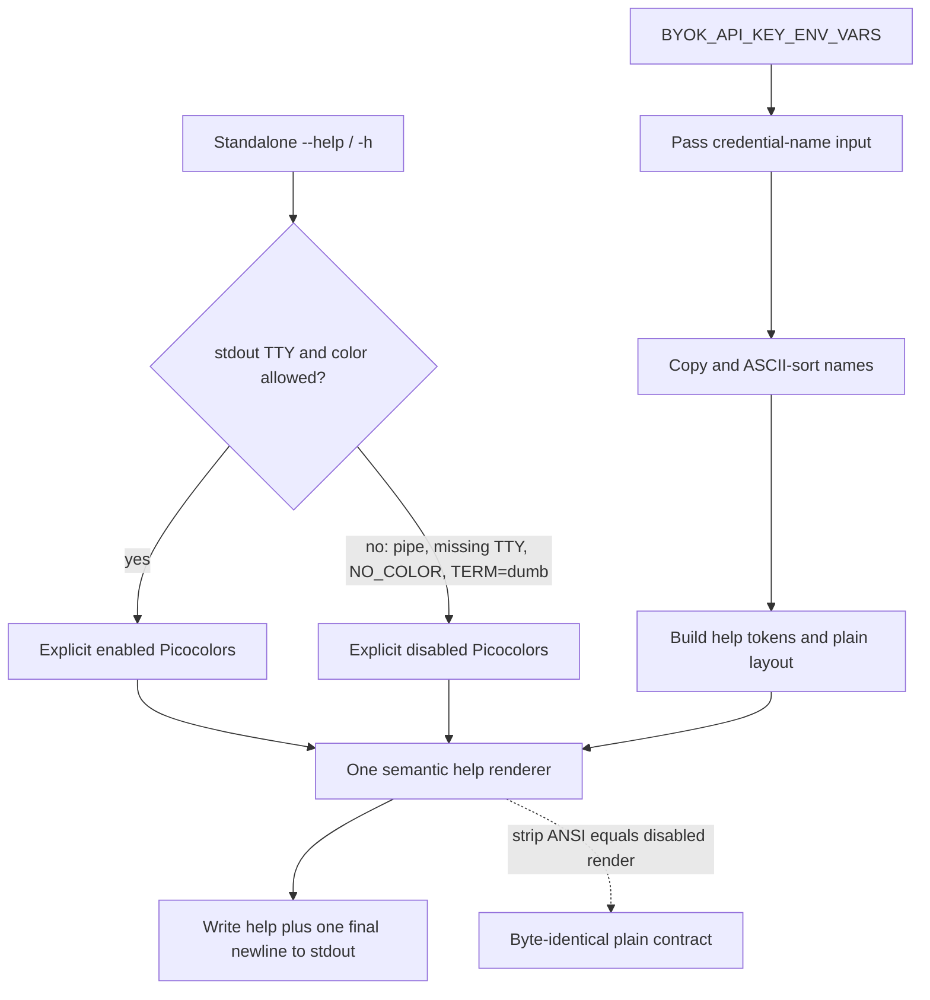

# Cargo-Inspired CLI Help - Plan

## Goal Capsule

- **Objective:** Turn `llm-now --help` into a compact quick-start reference with Cargo-inspired semantic color and an alphabetized, runtime-derived list of supported API-key environment variables.
- **Authority:** The Product Contract below defines behavior; `docs/ideation/2026-07-15-concise-cli-help-ideation.html` records the selected direction and visual rationale.
- **Execution profile:** One implementation phase on the existing `codex/byok-api-key-help` branch and pull request because this is a focused refinement of the BYOK help change already under review.
- **Stop conditions:** Stop if the runtime export cannot be consumed without mutating shared state, if a required color behavior contradicts the approved redirected-output contract, or if implementation would require changing argument parsing or runtime selection behavior.
- **Tail ownership:** Implement, verify, simplify, review, commit, push, update the existing pull request, and watch CI in this run.

---

## Product Contract

### Summary

The help screen will lead with three representative invocation forms, state the input and selection rules compactly, list the six options, and finish with one alphabetized API-key environment-variable list. A capable stdout terminal receives restrained Cargo-inspired color; redirected or color-disabled output receives identical plain text.

### Problem Frame

The current help grew into a reference manual: seven invocation examples repeat stdin behavior, and separate Selection, Input, Aliases, Output, and Exit codes sections obscure the commands users need first. The API-key list is useful but its two-header table and runtime order add visual noise. Users need a fast path to form a command and discover credential names, while detailed configuration paths, exit semantics, and operational behavior already belong in the README.

### Actors

- A1. **First-time user:** Needs to understand how to provide a prompt, choose a model, and name a supported credential.
- A2. **Returning user:** Needs a quick reminder of alias and explicit provider/model syntax.
- A3. **Automation caller:** Needs stable, escape-free help when stdout is captured, piped, or redirected.

### Key Flows

- F1. **Terminal help:** A standalone `--help` or `-h` call with a capable stdout TTY prints the compact help with semantic ANSI roles and exits 0 without reading input, aliases, or runtime state.
- F2. **Plain help:** The same call with non-TTY or missing stdout capability, nonempty `NO_COLOR`, or `TERM=dumb` prints the exact same words, spaces, and newlines without ANSI and exits 0.
- F3. **Credential discovery:** Help renders every name from `BYOK_API_KEY_ENV_VARS` exactly once, alphabetized under the single `API key environment variables:` heading.
- F4. **Invalid help combination:** Help combined with another option or positional remains invalid usage, emits the existing diagnostic on stderr, and does not render help.
- F5. **Compiled CLI:** The native executable preserves the same help contract; captured stdout stays plain and stderr stays empty.

### Requirements

- R1. Replace the current seven-example Usage block with exactly three representative commands: interactive, positional alias, and explicit provider/model selection.
- R2. Add one compact Rules block explaining that input comes from exactly one of `--input` or stdin, omitted selection is interactive while non-interactive use requires an alias or provider/model, and `default` is limited to `codex-cli` and `claude-cli`.
- R3. Retain all six current options and their concise descriptions without changing parser behavior.
- R4. Remove `printf` examples and the separate Selection, Input, Aliases, Output and diagnostics, and Exit codes sections from short help. Detailed behavior and platform-specific alias paths remain documented in the README.
- R5. Render one `API key environment variables:` heading followed by a copied, ASCII-alphabetized view of the complete `BYOK_API_KEY_ENV_VARS` export. Do not mutate the runtime-owned array or duplicate a table-column header/divider.
- R6. Use semantic terminal roles inspired by Cargo: bold bright-green section headings; bold bright-cyan commands and flags; ANSI cyan for metavariables and API-key names; default foreground for descriptions.
- R7. ANSI is supplemental. Stripping terminal sequences from colored help must reproduce the plain help exactly, including indentation, alignment, capitalization, and section order.
- R8. Enable help color only when the actual stdout dependency has `isTTY === true`, `NO_COLOR` is empty or absent, and `TERM` is not exactly `dumb`. Missing capability is non-TTY.
- R9. Never emit help ANSI to piped, redirected, or captured stdout. `FORCE_COLOR` does not override this help-specific rule; existing interactive stderr prompt coloring remains unchanged.
- R10. Preserve standalone help parsing, exit 0, stdout-only output with one final newline, usage exit 2 for invalid combinations, and the early return before input, alias, discovery, or generation work.
- R11. Preserve the current runtime dependency version (`@swartzrock/byok-runtime` 2.1.0), provider/model behavior, alias behavior, generated-response output, and diagnostics outside help.

### Acceptance Examples

- AE1. **Compact plain contract:** Given non-TTY stdout, `llm-now --help` prints the intro, three Usage lines, three Rules lines, six Options rows, and the one API-key heading/list; it contains no `printf`, `Exit codes:`, config paths, or verbose selection prose.
- AE2. **Alphabetized credentials:** Given the current runtime export, the help rows are `ANTHROPIC_API_KEY`, `DEEPINFRA_TOKEN`, `DEEPSEEK_API_KEY`, `GEMINI_API_KEY`, `GOOGLE_API_KEY`, `GROQ_API_KEY`, `MISTRAL_API_KEY`, `OPENAI_API_KEY`, `OPENROUTER_API_KEY`, and `XAI_API_KEY`, with the source export left unchanged.
- AE3. **Colored terminal:** Given stdout `isTTY: true` with ordinary environment values, help contains the approved ANSI role classes and stripping those sequences equals the plain contract byte-for-byte.
- AE4. **Color suppression:** Given a stdout TTY plus nonempty `NO_COLOR`, a stdout TTY plus `TERM=dumb`, missing/non-TTY stdout capability, or non-TTY stdout plus `FORCE_COLOR=1`, help contains no escape bytes and matches the plain contract.
- AE5. **Stream ownership:** Given stdout is non-TTY and stderr is TTY, help remains plain on stdout and stderr remains empty; stderr capability never controls help color.
- AE6. **Compiled help:** Given the standalone executable is spawned with captured streams, `--help` exits 0, emits the compact escape-free help on stdout, and emits nothing on stderr.
- AE7. **Parser compatibility:** `--help` and `-h` still succeed alone, while help combined with an alias or another option still returns the existing usage error without rendering help.

### Success Criteria

- A user can identify the interactive, alias, and explicit invocation forms without scanning duplicated examples.
- The credential list is complete, alphabetized, runtime-derived, and visually subordinate to a single heading.
- Terminal users receive a Cargo-like scan hierarchy without making plain output less understandable.
- Captured help is deterministic and contains no ANSI under every suppression case.
- Existing tests, typecheck, compiled runtime smoke, and the repository validation suite pass.

### Scope Boundaries

#### In scope

- Help copy and ordering, semantic ANSI styling, stdout/env color detection, runtime-key sorting, focused unit/application/native-smoke coverage, and the ideation/plan artifacts that define the change.

#### Out of scope

- Parser grammar changes; new help flags such as `--color`; exact RGB/true-color output; changes to interactive prompt styling; README restructuring; removal of detailed documentation; changes to aliases, providers, models, generation, diagnostics, or exit codes.

---

## Planning Contract

### Key Technical Decisions

- KTD1. **`session-settled:user-approved` — Make short help a quick-start surface.** Use three representative commands, a compact Rules block, Options, and the API-key list. This was chosen over retaining the seven-example reference-manual shape because the user explicitly prioritized fast scanning and identified the duplicated stdin and operational material as excess.
- KTD2. **`session-settled:user-directed` — Keep operational detail out of `--help`.** Remove `printf`, exit-code, detailed alias/configuration, and output-channel prose while retaining that material in long-form documentation. This was chosen over duplicating README-level details in the CLI.
- KTD3. **`session-settled:user-directed` — Use Cargo-inspired semantic roles.** Headings are bold bright green, literal commands/flags are bold bright cyan, replaceable values and credential names use ANSI cyan, and explanations use the terminal default foreground. This was chosen over monochrome help to create a restrained scan hierarchy. Picocolors' ANSI-16 palette is terminal-themed, so cyan may appear lavender in some themes; the mockup color is not treated as an exact RGB contract.
- KTD4. **`session-settled:user-approved` — Treat redirected output cleanliness as stronger than force-color conventions.** Color is permitted only on a capable stdout TTY and is suppressed by nonempty `NO_COLOR` or `TERM=dumb`; `FORCE_COLOR` cannot color redirected help. This was chosen over unconditional/global color detection so scripts, captures, and pipes remain byte-clean.
- KTD5. **`session-settled:user-directed` — Alphabetize a copied runtime list under one heading.** Render a copied, ordinary lexicographically sorted view of `BYOK_API_KEY_ENV_VARS`. This was chosen over runtime order and the two-header table so scanning is predictable without mutating dependency state.
- KTD6. **Render plain and colored help from one pure token-aware formatter.** Inject explicitly enabled or disabled Picocolors plus the credential-name input into one renderer, and keep the exported `HELP_TEXT` as its disabled-color render of `BYOK_API_KEY_ENV_VARS` for compatibility. This avoids drift between two templates, makes copied sorting independently testable, and avoids Picocolors' process-global capability snapshot.
- KTD7. **Keep help color policy local to the stdout help boundary.** The application evaluates the injected stdout/environment contract and passes explicit colors to the renderer. Do not reuse or change the stderr-oriented interactive prompt helper, whose existing `FORCE_COLOR` behavior is outside this feature.
- KTD8. **Style tokens only after layout is established.** Keep padding, indentation, and newline construction independent of ANSI wrappers so escape bytes cannot corrupt visible alignment and the strip-to-plain invariant remains mechanically testable.
- KTD9. **Do not introduce a shared terminal-color abstraction.** Help and interactive prompts intentionally use different streams and `FORCE_COLOR` rules. A common capability helper would either encode exceptions or change prompt behavior, so the focused renderer/application seam is the smaller compatibility boundary.

### Assumptions

- The runtime export continues to contain flat uppercase ASCII environment-variable names; ordinary copied `.sort()` therefore supplies stable ASCII ordering without locale-sensitive behavior.
- `NO_COLOR=""` does not disable color, following the existing truthiness convention and the published NO_COLOR convention.
- Only exact lowercase `TERM=dumb` disables color, matching the current application convention.
- Bright ANSI-16 colors are sufficient for the approved Cargo-inspired hierarchy; exact lavender color matching is intentionally outside scope.
- The existing `TextOutput.isTTY?` field is the authoritative capability seam; no dependency-interface expansion or terminal color-depth probing is required.
- The ideation artifact's displayed copy is authoritative for wording unless implementation reveals a parser-truth mismatch; such a mismatch is a product blocker rather than permission to silently change behavior.

### High-Level Technical Design

The sketch is directional. Exact helper names may follow local naming conventions, but the shared renderer, stdout-owned policy, and plain/colored equivalence are contractual.

### Delivery and PR Strategy

- **Single phase — concise colored help:** U1-U2 on the existing `codex/byok-api-key-help` branch, based on `main`, updating pull request #20. The ideation artifact and this plan ship with the implementation because they materially define the accepted help design.

---

## Implementation Units

### U1. Build the compact semantic help renderer

- **Goal:** Replace the verbose monolithic help template with one deterministic renderer that produces the approved compact plain or styled text and alphabetizes runtime key names.
- **Requirements:** R1-R7, R11; F3; AE1-AE3.
- **Dependencies:** None.
- **Files:** `src/args.ts`, `tests/args.test.ts`.
- **Approach:** Define the compact structure once, accept credential names as renderer input, copy and sort them before rendering, apply semantic color roles only to literal token substrings, and export the disabled-color render of the runtime export as `HELP_TEXT`. Expose only the minimal renderer seam required by the application. Keep parser definitions and validation untouched.
- **Patterns to follow:** Existing `HELP_TEXT` ownership in `src/args.ts`; Picocolors' explicit `createColors(boolean)` API; existing terminal-sequence stripping behavior for equivalence assertions.
- **Test scenarios:**
  - The disabled renderer equals the full approved compact help text exactly and omits each rejected verbose section/example.
  - With a frozen, deliberately unsorted sentinel list, API-key rows are copied, ASCII-sorted, and rendered once without attempting to mutate the input; the production plain output contains the complete runtime export.
  - The enabled renderer contains bright-green heading, bright-cyan literal, and cyan metadata roles.
  - Removing ANSI from the enabled renderer produces `HELP_TEXT` exactly, including spaces and newlines.
  - Existing standalone help/version parsing and invalid-combination behavior remains unchanged.
- **Verification:** Focused argument/help tests make the copy and formatting contract observable without application or terminal state.

### U2. Wire stdout-aware color and prove executable behavior

- **Goal:** Render color only for capable stdout terminals while preserving plain redirected output and the current help control flow.
- **Requirements:** R7-R11; F1-F2, F4-F5; AE3-AE7.
- **Dependencies:** U1.
- **Files:** `src/app.ts`, `tests/app.test.ts`, `tests/runtime-compile-smoke.ts`.
- **Approach:** In the existing early help branch, compute the strict help-specific color gate from injected stdout and environment values, create explicit enabled/disabled Picocolors, render once, and write the existing final newline. Extend the app test dependency builder with stdout capability. Strengthen native smoke so captured help is demonstrably escape-free and contains the compact/sorted landmarks.
- **Patterns to follow:** Existing dependency-injected `TextOutput` and `ByokEnvironment`; current help early return; current compiled runtime smoke harness.
- **Test scenarios:**
  - stdout TTY with ordinary environment values emits ANSI on stdout, nothing on stderr, exit 0, and no runtime calls.
  - stdout non-TTY or missing capability emits exact plain help; stderr TTY does not change the result.
  - nonempty `NO_COLOR` and exact `TERM=dumb` suppress ANSI on a stdout TTY.
  - `FORCE_COLOR=1` with non-TTY stdout remains plain, while this feature leaves interactive stderr color tests unchanged.
  - A representative invalid combined-help call returns exit 2, leaves stdout empty, writes the existing usage diagnostic to stderr, and makes no runtime calls.
  - The compiled CLI's captured `--help` output has no escape byte, includes the compact Usage/Rules/API-key landmarks in order, exits 0, and leaves stderr empty.
- **Verification:** Application tests prove the full capability truth table and early-return behavior; compiled smoke proves the packaged boundary, followed by the repository-wide checks.

---

## System-Wide Impact

- **Public CLI surface:** Help wording and presentation intentionally change; accepted arguments, selection behavior, and exit codes do not.
- **Dependency boundary:** `@swartzrock/byok-runtime` remains the single source of credential names. The implementation reads a copied view and does not change or wrap the runtime API.
- **Terminal boundary:** Help color follows stdout, while interactive UI continues to follow stderr. Keeping separate policies prevents help work from changing prompt behavior.
- **Data and state:** No persisted data, aliases, caches, credentials, or runtime calls are read or modified by help.
- **Failure propagation:** Rendering is synchronous and data-only. Existing parser failures remain the only help failure path.
- **Packaging:** Native compilation must retain the injected capability behavior and escape-free captured output.

## Verification Contract

### Focused gates

- Argument/help tests pass with the exact compact plain output, sorted keys, semantic ANSI roles, and strip-to-plain invariant.
- Application help tests pass for stdout TTY, missing/non-TTY stdout, stderr-only TTY, `NO_COLOR`, `TERM=dumb`, and redirected `FORCE_COLOR` cases.
- Compiled runtime smoke passes with ordered compact-help landmarks, no escape byte, exactly one final newline, exit 0, and empty stderr; it does not duplicate the full U1 snapshot.

### Repository gates

- The full Bun test suite passes.
- TypeScript typecheck passes.
- Runtime/native smoke passes.
- The aggregate repository check passes.
- The final diff is limited to help behavior, its tests, and the accepted ideation/plan artifacts.

## Risks and Dependencies

- **ANSI contrast varies by terminal theme.** Mitigation: use Cargo-like standard semantic slots, default foreground for explanations, and color only as supplemental hierarchy.
- **Exact lavender is unavailable in Picocolors' ANSI-16 API.** Mitigation: use the closest cool accent supported by the installed library and keep exact RGB outside the contract.
- **Global Picocolors detection could leak ANSI into captures.** Mitigation: always inject an explicit boolean and test redirected output with `FORCE_COLOR` present.
- **ANSI bytes can break column alignment.** Mitigation: establish padding before styling and assert stripped output equals the exact plain template.
- **Sorting could mutate dependency state.** Mitigation: copy before sorting and lock the source-order preservation in a test.
- **Help tests can become brittle.** Mitigation: use one intentional exact plain contract plus focused role/capability assertions, rather than duplicating full expected text across layers.

## Documentation and Operational Notes

- Ship `docs/ideation/2026-07-15-concise-cli-help-ideation.html` and this plan in the same pull request as the implementation.
- Do not remove detailed README material; the short help and long-form documentation serve different scanning depths.
- No migration, rollout flag, configuration change, telemetry, or release-note mechanism is required for this presentation-only CLI change.

## Sources and Research

### Repository evidence

- `src/args.ts` owns parsing, the current help constant, and runtime-key rendering.
- `src/app.ts` owns the help early return and already receives injected stdout and environment dependencies.
- `src/prompts.ts` contains stderr-oriented color behavior whose `FORCE_COLOR` semantics must remain outside this help-specific policy.
- `tests/args.test.ts`, `tests/app.test.ts`, and `tests/runtime-compile-smoke.ts` provide the focused, orchestration, and packaged verification seams.
- `node_modules/picocolors/picocolors.js` and `picocolors.d.ts` confirm explicit `createColors(boolean)`, bright ANSI roles, disabled identity formatters, and safe nested styling.

### External references

- [clap-cargo published styles](https://docs.rs/clap-cargo/latest/src/clap_cargo/style.rs.html#10-13) informed the green-heading, bright-cyan-literal, cyan-value semantic hierarchy.
- [NO_COLOR convention](https://no-color.org/) informed the nonempty `NO_COLOR` suppression behavior.
- [Node.js TTY documentation](https://nodejs.org/api/tty.html) supports treating `isTTY === true` as the attached-terminal signal.
- [Bun environment-variable documentation](https://bun.sh/docs/runtime/environment-variables) documents Bun's color environment behavior; llm-now deliberately applies the stricter approved redirected-help policy through explicit Picocolors injection.

## Definition of Done

- The compact Idea #1 help copy and section order are implemented exactly.
- Runtime key names are complete, copied, alphabetized, and shown under one heading.
- Cargo-inspired styles appear only on an allowed stdout TTY and plain/colored renders are textually identical after stripping ANSI.
- Redirected, captured, `NO_COLOR`, and `TERM=dumb` help contain no ANSI; `FORCE_COLOR` cannot override redirected help.
- Parsing, exit codes, stderr behavior, runtime behavior, and interactive prompt styling are unchanged outside the intended help presentation.
- Focused tests, the full suite, typecheck, compiled smoke, and aggregate checks pass.
- The final change is simplified and reviewed, the ideation and plan artifacts are committed, pull request #20 is updated, and CI is green.
