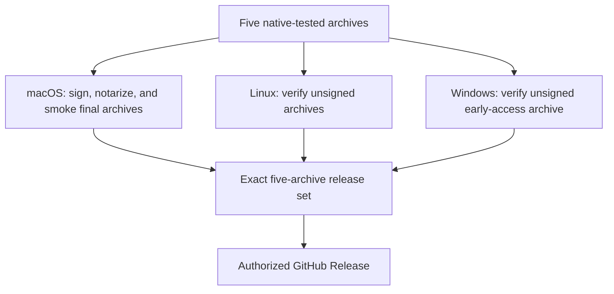
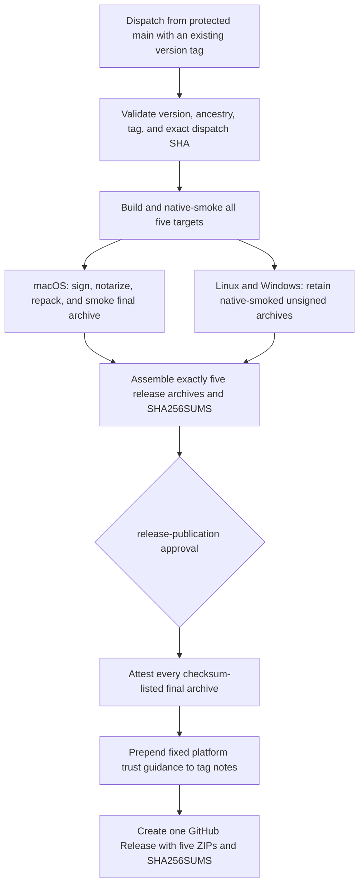

# Linux and Windows Release Assets - Plan

## Goal Capsule

- **Objective:** Publish the existing Linux x64, Linux ARM64, and Windows x64 standalone executables as direct GitHub Release assets alongside the existing macOS assets.
- **Product authority:** The Product Contract below defines release contents, trust labels, verification, and scope boundaries.
- **Execution profile:** One implementation phase on one feature branch; use smoke-first workflow policy tests, then run the full Bun verification contract.
- **Stop conditions:** Stop if provenance cannot identify the exact validated tag commit, if any public target bypasses its native smoke or trust gate, or if publication can proceed with an incomplete target set.
- **Tail ownership:** The implementing branch owns workflow policy tests, user and maintainer documentation, first-release commissioning instructions, and removal of abandoned implementation attempts.
- **Open blockers:** None. Public release remains subject to the repository's existing authorization and first-release commissioning gates.

---

## Product Contract

### Summary

llm-now will publish one five-target GitHub Release containing signed and notarized macOS archives, unsigned glibc Linux archives, and an unsigned Windows x64 early-access archive.
Every archive will be native-tested, checksummed, and covered by machine-verifiable provenance before publication.

### Problem Frame

The repository already builds and native-smoke-tests five standalone executables, but public releases currently contain only the two macOS archives.
Linux and Windows users therefore cannot download the artifacts that CI already validates.

Windows code signing would add publisher identity and reduce trust friction, but it is not required for direct GitHub distribution to the project's technical audience.
Requiring it now would add certificate onboarding and signing-pipeline operations before user demand demonstrates that cost is justified.

### Key Decisions

- **Ship Windows unsigned as early access.** (session-settled: user-approved — chosen over immediate Windows code signing: direct GitHub distribution for technical users does not justify the certificate and pipeline burden yet) Windows documentation will state the trust limitation instead of presenting the artifact as equivalent to a signed Windows release.
- **Keep platform trust requirements distinct.** macOS remains signed and notarized; Linux and Windows rely on native verification, checksums, provenance, and an authorized GitHub Release.
- **Publish one exact release set.** The five target archives and checksum manifest represent one version from one validated commit; a missing or unexpected target blocks publication.
- **Keep package managers downstream.** This increment makes direct GitHub downloads complete without reintroducing Homebrew or Chocolatey publication.

### Actors

- A1. **Windows CLI user:** Downloads a portable executable from GitHub and can evaluate an explicit unsigned-software warning.
- A2. **Linux CLI user:** Downloads the archive matching their architecture and glibc environment.
- A3. **Release maintainer:** Authorizes one version only after every target satisfies its declared trust and verification contract.

### Key Flows

- F1. **Cross-platform publication**
  - **Trigger:** A maintainer authorizes publication of a validated version.
  - **Actors:** A3
  - **Steps:** The final macOS, Linux, and Windows archives complete their platform-specific gates; the exact set is assembled; checksums and provenance are generated; publication occurs once.
  - **Outcome:** The GitHub Release exposes all five supported target archives from the same validated commit.
  - **Covered by:** R1-R8, R11-R15
- F2. **Windows direct download**
  - **Trigger:** A1 selects the Windows x64 archive.
  - **Actors:** A1
  - **Steps:** The release identifies the archive as unsigned early access, explains possible Windows warnings or blocks, and provides integrity and provenance verification guidance.
  - **Outcome:** The user can make an informed trust decision without mistaking the archive for signed software.
  - **Covered by:** R9-R13
- F3. **Linux direct download**
  - **Trigger:** A2 selects a Linux archive.
  - **Actors:** A2
  - **Steps:** The release identifies the supported architecture and glibc requirement, then provides checksum and extraction guidance.
  - **Outcome:** The user selects a compatible artifact without interpreting internal build-target names.
  - **Covered by:** R4-R5, R11-R12, R16

### Requirements

**Release contents**

- R1. A public version must contain archives for macOS x64, macOS ARM64, Linux x64, Linux ARM64, and Windows x64 plus one `SHA256SUMS` manifest.
- R2. Every archive in a public version must originate from the same validated commit and declare the same product version.
- R3. Final assembly must reject missing, extra, duplicate, misnamed, or wrongly contained archives.
- R4. Linux assets must be labeled as glibc builds and identify their supported x64 or ARM64 architecture.
- R5. Linux x64 must retain the baseline CPU target, and musl compatibility must not be implied.
- R6. The Windows asset must retain the stable `windows-x64` target identity and contain only the standalone `llm-now.exe` executable.

**Trust and verification**

- R7. Final macOS archives must retain the existing signing, notarization, and verification requirements.
- R8. Linux and Windows publication must not require code-signing credentials.
- R9. The Windows archive must be described as unsigned early access wherever users choose or verify the download.
- R10. Windows guidance must explain that SmartScreen may require a manual bypass and that Smart App Control or enterprise policy may prevent execution.
- R11. Every final downloadable archive must pass its target-native command and generation smoke contract before publication.
- R12. The checksum manifest must cover the final downloadable bytes for all five archives.
- R13. Every final archive must receive machine-verifiable provenance that binds it to the authorized repository workflow and validated commit.

**Publication and rollout**

- R14. Publication must retain the existing version, tag, protected-main ancestry, least-privilege, and explicit authorization gates.
- R15. The first public release containing Linux and Windows must complete the documented full functional pass on Linux x64 and Windows x64 plus native smoke on Linux ARM64.
- R16. Release notes and installation guidance must provide platform-specific download, checksum verification, extraction, and first-run instructions.
- R17. Windows documentation must not claim frictionless consumer installation, verified publisher identity, or enterprise compatibility while the executable remains unsigned.
- R18. Homebrew and Chocolatey publication must remain outside this release workflow increment.

### Acceptance Examples

- AE1. **Complete authorized release**
  - **Given:** All five final target archives pass their declared platform gates for one validated version.
  - **When:** A maintainer authorizes publication.
  - **Then:** The GitHub Release contains exactly those five archives and one checksum manifest, with provenance covering each final archive.
  - **Covers:** R1-R3, R7-R8, R11-R15
- AE2. **Unsigned Windows download**
  - **Given:** A user opens the Windows installation guidance.
  - **When:** They select the Windows x64 archive.
  - **Then:** The guidance identifies it as unsigned early access before presenting verification and first-run instructions.
  - **Covers:** R6, R9-R10, R16-R17
- AE3. **Strict Windows policy**
  - **Given:** Smart App Control or enterprise policy refuses to run the unsigned executable.
  - **When:** The user consults the release guidance.
  - **Then:** The guidance describes this as a known trust limitation rather than a binary malfunction and does not promise a bypass.
  - **Covers:** R9-R10, R17
- AE4. **Incomplete target set**
  - **Given:** A finishing or verification path fails to produce one expected archive.
  - **When:** Final assembly runs.
  - **Then:** Publication stops without creating a partial public release.
  - **Covers:** R1-R3, R14
- AE5. **Linux compatibility choice**
  - **Given:** A Linux user reviews the available downloads.
  - **When:** They choose an archive.
  - **Then:** The guidance makes architecture and glibc compatibility visible and does not imply Alpine or other musl support.
  - **Covers:** R4-R5, R16

### Success Criteria

- One authorized release can publish the existing five supported native targets without any Windows signing account or certificate secret.
- The Windows trust limitation is visible before first-run instructions and is not hidden in maintainer-only documentation.
- Every published archive has target-native verification, a matching checksum entry, and provenance for the final downloadable bytes.
- A missing target or failed platform gate cannot produce a partial public release.
- No package-manager publication job or credential is added by this increment.

### Scope Boundaries

**Deferred for later**

- Windows Authenticode signing, required before Windows is promoted beyond early access or targeted at enterprise users.
- Homebrew and Chocolatey publication.
- Automated testing against the oldest claimed glibc runtime.

**Outside this increment**

- Windows ARM64.
- Linux musl or Alpine-compatible artifacts.
- Microsoft Store, MSI, or other installer formats.
- A guarantee that Windows reputation systems will not warn about a newly published binary.

### Dependencies and Assumptions

- The initial Windows audience is comfortable evaluating an explicit warning and verifying a GitHub-hosted developer CLI.
- Checksums and provenance improve integrity and origin verification but do not suppress SmartScreen or Smart App Control.
- GitHub's artifact-attestation capability is available to the public repository and can cover the post-finishing archives.
- If Windows later graduates from early access, planning must revisit managed code signing rather than silently changing the trust label.

### Sources and Research

- `.github/workflows/ci.yml` and `.github/workflows/release.yml` — current five-target native validation and macOS-only publication boundary.
- `scripts/build.ts` and `scripts/release-validate.ts` — target registry, deterministic archives, exact-set assembly, and checksums.
- `tests/release-policy.test.ts` — current Windows-signing exclusion, protected secret boundary, and package-manager deferral.
- `docs/RELEASING.md` and `docs/manual-testing.md` — distribution state and first-release native commissioning expectations.
- `docs/ideation/2026-07-16-linux-windows-release-executables-ideation.html` — ranked release directions and rejected scope expansions.
- [Microsoft SmartScreen reputation guidance](https://learn.microsoft.com/en-us/windows/apps/package-and-deploy/smartscreen-reputation) — unsigned warnings, publisher reputation, and enterprise restrictions.
- [Microsoft Smart App Control](https://learn.microsoft.com/en-us/windows/apps/develop/smart-app-control/overview) — blocking behavior for unknown unsigned code.
- [GitHub artifact attestations](https://docs.github.com/en/actions/concepts/security/artifact-attestations) — workflow and commit provenance for release artifacts.

---

## Planning Contract

Product Contract scope: unchanged. The implementation decisions below refine how the existing requirements are delivered without changing their intent.

### Key Technical Decisions

- KTD1. **Ship Windows unsigned as early access.** (session-settled: user-approved — chosen over immediate Windows code signing: direct GitHub distribution for technical users does not justify the certificate and pipeline burden yet) Preserve the explicit absence of Windows certificate secrets, SignTool, and a Windows signing job; carry the trust limitation into the release page, README, maintainer guide, and commissioning checks.
- KTD2. **Require the public tag to equal the protected-main dispatch commit.** (session-settled: user-approved — chosen over a custom provenance predicate that supports older ancestor tags: the built-in GitHub SLSA attestation should identify the same commit that produced the release) Keep the existing ancestry and remote-tag verification, and add an exact `release-sha == github.sha` publication invariant before provenance is issued.
- KTD3. **Generate a fixed release trust preamble while preserving tag-authored notes.** (session-settled: user-approved — chosen over relying on each tag message to contain platform warnings: every release page must expose the compatibility and trust contract at the download surface) Build the release body from fixed Linux and Windows guidance followed by the annotated-tag contents or associated commit message, then pass that body to `gh release create`.
- KTD4. **Finalize signed macOS and native unsigned archives directly.** Keep the existing `sign-macos` matrix, then have the platform-neutral finalizer download `release-macos-*`, `native-linux-*`, and `native-windows-*` into distinct artifact subdirectories without `merge-multiple: true`. The recursive exact-set assembler sees every original basename, rejects cross-target collisions, and avoids copy-only promotion jobs that add no trust or byte transformation.
- KTD5. **Attest verified final archives only after protected publication approval.** The platform-neutral finalizer assembles exactly the signed macOS and native unsigned archives and writes `SHA256SUMS`. The protected `publish` job downloads those bytes, verifies `SHA256SUMS` against the downloaded ZIPs, uses `actions/attest` pinned to the reviewed v4.2.0 commit with `subject-checksums: dist/SHA256SUMS`, and only then creates the GitHub Release. Grant `id-token: write` and `attestations: write` only to the publication job alongside its existing `contents: write`; do not add artifact-registry permissions.
- KTD6. **Reuse the existing target registry and exact-set assembler.** `scripts/build.ts` already defines the supported target identities and archive shape, while `scripts/release-validate.ts` already rejects missing, extra, duplicate, misnamed, or wrongly contained archives and hashes their final bytes. Do not add a second target list or change these scripts unless an implementation test exposes a real gap.
- KTD7. **Smoke the final macOS bytes after signing and repacking.** The native matrix already smokes the unchanged Linux and Windows archives. Add a secret-free native smoke after macOS signing, notarization, and repacking so every downloadable byte sequence has passed the command and generation contract.

### High-Level Technical Design

The secret boundary remains narrow: only `sign-macos` receives Apple signing credentials, and no repository script runs in a step holding those secrets. The unsigned inputs, exact-set assembly, provenance, release-note construction, and publication paths receive no signing credentials.

### Implementation Constraints

- Preserve the existing `validate-ref` main-branch, version, ancestry, validated-checkout, authenticated remote-tag refresh, `--verify-tag`, protected-environment, and duplicate-release refusal controls.
- Preserve deterministic `SOURCE_DATE_EPOCH` handling and the Windows baseline Bun download.
- Preserve the hidden macOS staging upload and standalone notarization verification.
- Use the immutable `actions/attest` v4.2.0 commit `f7c74d28b9d84cb8768d0b8ca14a4bac6ef463e6`; update the workflow-policy allowlist for that exact ref.
- Construct release notes without evaluating tag contents as shell code. Treat the tag or commit message as text appended after the fixed preamble.
- Keep asset filenames stable. Express `glibc` compatibility and `unsigned early access` in surrounding release and installation guidance rather than renaming target identities.
- Stop a `publish: true` run unless `github.event.repository.visibility` is `public`; repository visibility is a manual GitHub setting and must not be changed by the workflow.
- Do not add Windows signing, package-manager publication, installer formats, musl artifacts, Windows ARM64, or unrelated release refactors.

### Sequencing

This is one implementation phase and one PR because the workflow graph, policy assertions, and release guidance are one atomic publication contract.

1. Change the release-policy tests first so the current macOS-only publication behavior fails against the new five-target, unsigned-Windows, exact-SHA, attestation, and release-note contract.
2. Update the release workflow until the focused policy tests pass, preserving every existing security and reproducibility assertion.
3. Update public, maintainer, and manual-testing documentation, then run the complete verification contract.

### Risks and Mitigations

| Risk | Impact | Mitigation |
| --- | --- | --- |
| Workflow-dispatch provenance records ambient `github.sha` instead of the checked-out tag commit | Users verify a real attestation that names the wrong source commit | KTD2 requires the tag commit and dispatch commit to be identical before public publication; verify this in policy tests and the first real attestation. |
| Raw native and signed macOS artifacts collide during finalization | An unsigned or wrong-target archive could overwrite a trusted peer before validation | KTD4 keeps each downloaded workflow artifact in a separate subdirectory; recursive exact-set assembly observes and rejects duplicate basenames. |
| macOS signing changes bytes after the existing native smoke | The downloadable macOS archive lacks final-byte command coverage | KTD7 reruns the native archive smoke after signing, notarization, and repacking. |
| Required Windows and Linux warnings are absent from a tag message | Users reach downloads without the declared trust or compatibility context | KTD3 injects a fixed preamble at publication and documentation repeats the guidance. |
| Windows security policy blocks the unsigned executable | Users may interpret a trust-policy decision as a broken binary | Documentation names SmartScreen, Smart App Control, and enterprise policy behavior, gives verification steps, and promises no bypass. |
| Attestation action or permission behavior changes | Publication fails or provenance is incomplete | Pin the reviewed action commit, limit permissions to the protected publication job, and commission the first release with `gh attestation verify`. |
| The repository remains private or lacks artifact-attestation eligibility | A workflow can complete without producing the promised public download and verification surface | Block public publication unless repository visibility is public, and confirm visibility plus attestation availability before the first protected dispatch. |

### Research That Shapes Implementation

- Historical release workflow at `65bb582^:.github/workflows/release.yml` — prior copy-only Linux promotion confirms the unsigned archive identities, but direct separated download keeps the same trust boundary with fewer jobs; do not restore Windows signing or package-manager work.
- [GitHub `actions/attest`](https://github.com/actions/attest) — `subject-checksums` creates one signed attestation containing every archive named by the checksum manifest; current v4.2.0 release is immutable at the pinned commit above.
- [GitHub artifact-attestation workflow guidance](https://docs.github.com/en/actions/how-tos/secure-your-work/use-artifact-attestations/use-artifact-attestations) — OIDC and attestation permissions, public-repository support, and post-build sequencing.
- [GitHub CLI attestation verification](https://cli.github.com/manual/gh_attestation_verify) — public verification command and optional signer-workflow constraint.
- [Microsoft SmartScreen reputation guidance](https://learn.microsoft.com/en-us/windows/apps/package-and-deploy/smartscreen-reputation) and [Smart App Control](https://learn.microsoft.com/en-us/windows/apps/develop/smart-app-control/overview) — unsigned warnings, reputation reset, user bypass limits, and managed-device blocks.

---

## Implementation Units

### U1. Expand and harden the five-target publication graph

- **Goal:** Produce one exact five-target final artifact set while preserving macOS trust gates and treating Linux and Windows as explicitly unsigned finished artifacts.
- **Requirements:** R1-R8, R11-R12, R14, R18; F1; AE1; AE4.
- **Key decisions:** KTD1, KTD2, KTD4, KTD6, KTD7.
- **Files:** `.github/workflows/release.yml`, `tests/release-policy.test.ts`, `tests/build.test.ts`.
- **Approach:** Make `native` build all five targets in both candidate and publish modes. Add the secret-free final macOS smoke after repacking. Replace the macOS-only `signed-assets` finalizer with a platform-neutral finalizer that downloads signed `release-macos-*` and unsigned `native-linux-*`/`native-windows-*` artifacts into separate subdirectories, never flattens them with `merge-multiple: true`, invokes the default all-target assembler without a target subset, and uploads the five ZIPs plus `SHA256SUMS`. In public mode, require public repository visibility and require `release-sha` to equal the workflow dispatch SHA while retaining the existing ancestry and remote-tag checks.
- **Test scenarios:** The focused policy test fails on the current macOS-only publish matrix; publish mode contains all five native targets; no Windows signing job, secret, tool, or copy-only promotion job appears; final macOS archives run the post-repack smoke; the finalizer keeps source artifacts separated and assembles without a macOS-only subset; duplicate basenames in nested input directories fail exact assembly; public publication stops for non-public visibility; publication retains its existing authorization and tag protections; package-manager steps remain absent.
- **Verification:** `bun test tests/release-policy.test.ts`; inspect the workflow diff for secret-bearing steps and exact job dependencies; `bun test tests/build.test.ts` confirms the reused exact-set assembler contract.
- **Dependencies:** None.

### U2. Add final-archive provenance and deterministic release guidance

- **Goal:** Bind every published ZIP to the protected workflow and exact release commit, and guarantee that the GitHub download surface states the Linux compatibility and Windows trust contract.
- **Requirements:** R4-R5, R9-R10, R13-R14, R16-R17; F1-F3; AE1-AE3; AE5.
- **Key decisions:** KTD1, KTD2, KTD3, KTD5.
- **Files:** `.github/workflows/release.yml`, `tests/release-policy.test.ts`.
- **Approach:** Extend the protected `publish` job permissions with OIDC and attestation writes, keeping them job-scoped. After downloading `release-assets` and revalidating the remote tag, run `sha256sum --check SHA256SUMS` from `dist`, then attest the subjects listed by `dist/SHA256SUMS` with the immutable v4.2.0 action commit. Generate a release-notes file containing fixed platform selection, Linux glibc/architecture, Windows unsigned-early-access, SmartScreen/Smart App Control, checksum, and `gh attestation verify` guidance constrained to `swartzrock/llm-now/.github/workflows/release.yml` and the exact release source digest, then append the tag annotation or associated commit message as inert text. Create the release from that file and the unchanged archive set.
- **Test scenarios:** The policy test rejects a moving attestation action ref; checksum verification runs after protected approval and after the exact final assets are downloaded but before attestation and `gh release create`; `subject-checksums` names the verified final manifest; the publish job has only the required write permissions; fixed release guidance precedes tag-authored notes; tag text is not executed; verification guidance constrains repository, signer workflow, and source digest; the release command still rejects duplicate releases and verifies the tag.
- **Verification:** `bun test tests/release-policy.test.ts`; confirm the generated workflow strings include the Windows and Linux labels and both verification commands; manually inspect that no archive mutation occurs after attestation.
- **Dependencies:** U1.

### U3. Document installation, trust, and first-release commissioning

- **Goal:** Give users executable platform-specific installation and verification steps, and give maintainers a complete commissioning checklist for the first public Linux and Windows release.
- **Requirements:** R4-R5, R9-R10, R15-R18; F2-F3; AE2-AE3; AE5.
- **Key decisions:** KTD1, KTD3, KTD5.
- **Files:** `README.md`, `docs/RELEASING.md`, `docs/manual-testing.md`.
- **Approach:** Add a concise installation section that maps stable asset names to macOS, glibc Linux x64/ARM64, and unsigned Windows x64; include target-specific checksum verification that works when only one archive is downloaded, extraction/permission commands, and `gh attestation verify <archive> --repo swartzrock/llm-now --signer-workflow swartzrock/llm-now/.github/workflows/release.yml`. Put the Windows trust warning before first-run steps, explain permitted SmartScreen interaction without promising it, state that Smart App Control or enterprise policy may block execution, and never advise disabling protections. Update the maintainer distribution status and exact-SHA/provenance policy. Expand MT-25 into the exact five-archive plus manifest public-release gate, including a public-visibility and attestation-eligibility prerequisite, macOS signing/notarization, Linux x64 and Windows x64 full passes, Linux ARM64 smoke, unsigned Windows signature confirmation, checksum verification, and provenance inspection with the expected source digest.
- **Test scenarios:** A Linux user can choose architecture and sees glibc/no-musl boundaries; a Windows user sees `unsigned early access` before execution steps and can compare a PowerShell SHA-256 result; a strict-policy user is told a block may have no supported bypass; a maintainer can verify every final archive's provenance and the exact source commit; the commissioning guide still requires no Bun or Node.js.
- **Verification:** Review rendered Markdown for command correctness and ordering; use `rg` to confirm the required trust phrases and verification command appear at user and maintainer surfaces; run `bun test tests/release-policy.test.ts` so the workflow-owned release preamble remains automation-backed.
- **Dependencies:** U2.

---

## Verification Contract

| Gate | Command or evidence | Units | Pass condition |
| --- | --- | --- | --- |
| Smoke-first red case | `bun test tests/release-policy.test.ts` before workflow edits | U1, U2 | Existing macOS-only assertions fail for the intended five-target/public-provenance contract, demonstrating that the test protects the behavior change. |
| Focused workflow policy | `bun test tests/release-policy.test.ts` | U1, U2 | All matrix, trust-boundary, action-pin, permission, ordering, tag, release-note, and package-manager assertions pass. |
| Existing archive contract | `bun test tests/build.test.ts` | U1 | The unchanged target registry, archive identity, exact-set rejection, nested duplicate-basename detection, final-byte copy, and checksum behavior pass. |
| Full automated suite | `bun test` | U1-U3 | All repository tests pass with no skipped or weakened release-policy coverage. |
| Static type safety | `bun run typecheck` | U1-U3 | TypeScript reports no errors. |
| Compiled runtime smoke | `bun run runtime:smoke` | U1-U3 | The standalone runtime compile smoke passes. |
| Consolidated project check | `bun run check` | U1-U3 | Tests, typecheck, and runtime smoke pass in the repository's canonical order. |
| Documentation review | Render or read `README.md`, `docs/RELEASING.md`, and `docs/manual-testing.md` | U3 | Commands are platform-correct; Windows warnings precede execution; Linux compatibility is explicit; package managers remain deferred. |
| First public release commissioning | Execute the revised MT-25 on the authorized release workflow | U1-U3 | Repository visibility is public and attestations are available; the GitHub Release has exactly five ZIPs plus `SHA256SUMS`; every checksum verifies; every attestation matches the release workflow and exact tag/dispatch source digest; macOS gates pass; required Linux and Windows functional coverage is recorded. |

The PR can merge on automated gates. The first real `publish: true` dispatch is a post-merge operational gate because signing credentials, protected-environment approval, GitHub attestation issuance, and clean Linux/Windows machines are unavailable to the implementation branch.

---

## Definition of Done

### Global

- Every requirement is implemented by at least one completed unit and has automated or explicitly post-merge commissioning evidence.
- The public workflow can produce only the exact five-archive set plus `SHA256SUMS`; no partial or extra target set can reach `gh release create`.
- The default GitHub attestation identifies the same commit as the validated tag and covers every final downloadable ZIP.
- macOS remains signed, notarized, and final-byte smoked; Linux and Windows remain unsigned, native-smoked, checksummed, and attested.
- Windows trust limitations and Linux glibc compatibility appear on the release page and in user documentation.
- Existing authorization, secret isolation, deterministic-build, tag verification, and duplicate-release controls remain intact.
- Homebrew, Chocolatey, Windows signing, musl, Windows ARM64, and installer work remain absent.
- `bun run check` passes, and abandoned or superseded implementation code is removed from the diff.

### Per Unit

- U1 is done when focused policy tests prove the five-target graph, separated signed/unsigned inputs, collision-safe exact assembly, exact dispatch/tag SHA, public-visibility gate, final macOS smoke, and preserved security gates.
- U2 is done when every downloaded final ZIP matches `SHA256SUMS`, every checksum-listed ZIP is attested after protected approval, verification constrains signer workflow and source digest, and the release body deterministically includes fixed trust guidance before inert tag-authored notes.
- U3 is done when user and maintainer docs provide correct selection, verification, extraction, Windows trust, Linux compatibility, and first-release commissioning instructions.
