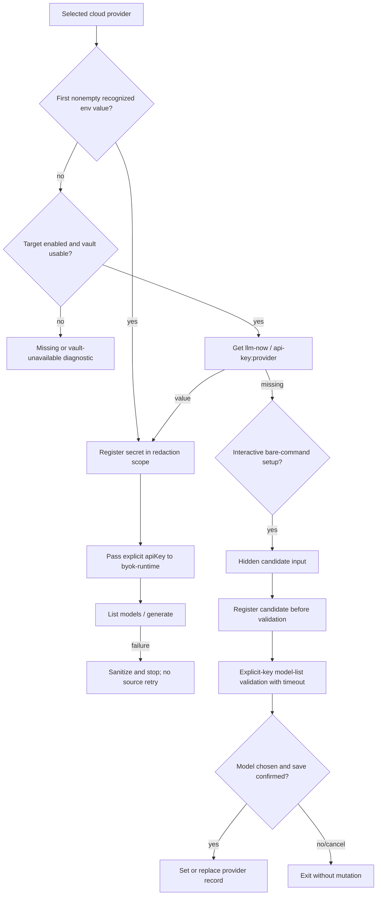

# Secure API Key Storage - Plan

## Goal Capsule

- **Objective:** Add secure, interactive API-key onboarding to `llm-now` with one native-vault fallback per cloud provider, environment-first resolution, explicit runtime injection, fail-closed source selection, secret-aware diagnostics, and target-gated compiled support.
- **Authority:** The Product Contract below preserves R1-R10 and AE1-AE7 from the ideation artifact. The HTML remains the authority for product rationale and rejected alternatives.
- **Execution profile:** Three implementation phases delivered as stacked pull requests because the change has separable security boundaries: credential resolution, interactive lifecycle, and native release enablement.
- **Stop conditions:** Stop if implementation requires plaintext/self-encrypted storage, changes alias schema v1, passes raw keys through argv or generation stdin, makes `byok-runtime` own persistence, retries another source after a selected credential fails, enables a target without native compiled lifecycle evidence, or requires inferring portable vault states from unstable backend message text.
- **Tail ownership:** Implement, verify, simplify, review, remediate, commit, push, open the ordered stack, run browser QA for affected documentation, and watch CI in this run. Report any native-session gate that cannot be proven rather than weakening it.

---

## Product Contract

### Summary

`llm-now` will preserve recognized environment variables as the authoritative credential source. When a provider's recognized variables are empty or absent, the host application may resolve one provider-specific key from the native OS vault. Interactive users can use the bare-command setup lane to add, replace, or delete that fallback through hidden input and provider validation. Scripts continue to use environment variables, and ordinary stdin remains generation prompt text.

### Actors

- A1. **Existing shell/CI user:** Already injects a recognized environment variable and expects unchanged behavior.
- A2. **Interactive desktop user:** Wants to enroll and reuse one provider key without putting it in shell history or a plaintext file.
- A3. **Headless/server user:** May not have a native vault session and needs actionable environment-only guidance.
- A4. **Release maintainer:** Must prove native-vault behavior in each supported compiled target before enabling that target.

### Key Flows

- F1. **Environment-backed generation:** Resolve the first nonempty recognized variable for the selected cloud provider, register it for redaction, and pass it explicitly to `byok-runtime` without reading the vault.
- F2. **Vault-backed generation:** If no recognized provider variable is nonempty, read the provider's single vault record, register it for redaction, and pass it explicitly to the runtime.
- F3. **Fail-closed provider call:** Once environment or vault is selected, a rejection, timeout, revocation, or runtime failure ends that operation and never retries another credential source.
- F4. **Interactive add:** A bare TTY invocation enters setup before prompt resolution, selects a cloud provider, accepts a nonblank key through hidden input, registers it for redaction, validates it with provider model listing, obtains save consent, then writes it once.
- F5. **Interactive replacement:** If a selected provider already has a stored key, validate the hidden candidate before consent and replacement. The existing key remains until the final successful set.
- F6. **Interactive deletion:** Confirm deletion with a default-No prompt, delete only the selected provider record, and explain when a nonempty environment variable keeps that provider usable.
- F7. **Cancellation and failure:** Cancellation returns 130 before mutation. Validation, timeout, or vault failure returns 1, prints only sanitized diagnostics, and leaves previous durable state unchanged.
- F8. **Headless missing credential:** Do not prompt or read generation stdin as a key. Return environment-variable instructions for the selected provider.
- F9. **Target validation:** Run a compiled disposable lifecycle probe natively on every target; only targets represented by a passing checked capability manifest may expose vault onboarding.

### Requirements

- R1. For a cloud provider with a nonempty recognized environment variable, `llm-now` must use that value without reading or prompting for the native-vault value.
- R2. When the recognized environment variable is absent or empty, `llm-now` must resolve the provider's single native-vault credential.
- R3. A selected source must fail closed: rejection, revocation, or runtime failure must not cascade to another credential source.
- R4. Missing credentials and unavailable, locked, or interaction-required vaults must produce distinct actionable outcomes wherever the exact platform result can be identified reliably.
- R5. Direct API-key entry must use hidden interactive terminal input; raw keys must not be accepted through arguments, ordinary generation stdin, alias files, or other config files.
- R6. Enrollment and replacement must validate the candidate with a provider-specific authenticated operation before attempting to store it.
- R7. Aliases must remain version-1 provider/model records; they inherit provider-level environment-first resolution and contain no credential reference.
- R8. Every resolved or candidate secret must join the diagnostic redaction scope before model listing, validation, or generation can expose provider-controlled text.
- R9. The interactive management surface must support add, validated replacement, and deletion for the provider's single vault credential.
- R10. Native-vault onboarding must remain disabled on any release target until the pinned Bun version's compiled executable passes real `get`, `set`, replace, and `delete` checks in a representative user session.

### Acceptance Examples

- AE1. With OpenAI environment and vault keys present, use the environment key, perform zero vault reads, and show no ambiguity prompt.
- AE2. With no OpenAI environment key and an OpenAI vault key present, resolve the vault key, add it to redaction scope, and supply it explicitly to the runtime.
- AE3. If the environment key is rejected while a valid vault key exists, fail against the environment source and perform no vault read or retry.
- AE4. With no environment or stored key, offer secure enrollment only to an interactive user; give a headless user provider-specific environment instructions.
- AE5. If an entered add/replace key is invalid, write nothing and redact the value from every diagnostic.
- AE6. If the vault is unavailable or locked and no environment key exists, report the reliably known vault condition and remediation without an insecure fallback.
- AE7. If a user deletes a vault key while an environment key is present, remove the fallback and explain that the provider remains usable through the environment source.

### Success Criteria

- Existing environment-backed, local-server, and authenticated-CLI generation behavior remains compatible.
- No real or sentinel key appears in stdout, stderr, aliases, config files, test artifacts, workflow logs, or PR output.
- Environment presence short-circuits vault access; selected-source failures never trigger fallback.
- Add/replace perform hidden input, redaction registration, authenticated validation, consent, then mutation in that order.
- Delete is provider-scoped, explicit, default-No, and cancellation-safe.
- Alias schema remains exactly `{provider, model}` at version 1.
- Each enabled target has passing compiled lifecycle evidence under Bun 1.3.14; unavailable targets remain environment-only.

### Scope Boundaries

#### In scope

- One native-vault key per cloud provider; environment-first resolution; host-owned explicit-key injection; bare-TTY setup and add/replace/delete; shared redaction scope; typed store outcomes; unit/application/compiled tests; target capability policy; help, README, release, and manual-test updates.

#### Out of scope

- Named credential profiles, multiple accounts per provider, alias schema v2, alias-bound credential identity, `--api-key`, positional secrets, auth stdin, external helpers, provider-key inference, environment-to-vault auto-copy, plaintext or self-encrypted fallback, package-manager distribution changes, or storage inside `byok-runtime`.

---

## Planning Contract

### Key Technical Decisions

- KTD1. **One provider record in MVP** (session-settled: user-directed — chosen over multiple named credential profiles: minimize the first release and preserve alias schema v1 until multi-account demand exists). Use a stable Bun secrets identity of `service: "llm-now"` and `name: "api-key:<provider>"` for each cloud provider.
- KTD2. **Environment is authoritative** (session-settled: user-directed — chosen over vault-first precedence or ambiguity failure: preserve current shell, CI, and injected-secret behavior). Use `BYOK_PROVIDER_API_KEY_ENV_VARS` order, treat blank values as absent, and return before any vault call when a nonempty value exists.
- KTD3. **Keep storage in the host.** Add a `llm-now` credential boundary and pass `{provider, apiKey, model}` to `@swartzrock/byok-runtime` 2.1.0. Do not change the dependency or teach it persistence.
- KTD4. **Use Bun 1.3.14's typed object API only.** Call `get({service,name})`, `set({service,name,value})`, and `delete({service,name})`; omit `allowUnrestrictedAccess`. Reject blank enrollment before `set` because Bun treats an empty value as deletion.
- KTD5. **Normalize operations, not backend prose.** Represent missing as the documented `get -> null` / `delete -> false` outcomes. Wrap rejected operations in app-owned typed errors with operation and provider. Default to a safe unavailable/access diagnostic; classify locked or interaction-required only where native probes establish stable codes. Never branch on localized backend messages.
- KTD6. **Use one ephemeral secret redaction scope.** Register environment, resolved vault, and candidate values before any provider-controlled operation. Inject the same scope into runtime and application diagnostic boundaries, retaining terminal-control removal, newline normalization, and the 1,024-character bound.
- KTD7. **Route setup before generation input.** Only `args.length === 0` with TTY stdin and stderr enters the control-plane setup lane. Any `--input`, alias, provider/model, or piped stdin follows the existing generation grammar; generation stdin is never credential input. A missing credential during generation fails closed and directs an interactive user to bare `llm-now` rather than enrolling and resuming mid-command.
- KTD8. **Use Clack's password prompt through the existing abstraction.** Extend `SearchablePrompter` with a hidden input method backed by `@clack/prompts` 1.7.0 `password`; tests inject values without terminal manipulation.
- KTD9. **Validate an explicit candidate, not the active resolver.** A runtime `validateCredential(provider, key, signal?)` path registers and passes that exact key to provider model listing. Add/replace may not accidentally validate an environment override. Apply the existing model-list timeout/cancellation policy and ignore late completion after cancellation. A resolved empty model list is authentication success: saving may continue, but model/alias creation is skipped with an explanation.
- KTD10. **Commit after the last cancellable decision.** Candidate flow is provider -> replacement-intent confirmation when applicable -> hidden key -> validation/model list -> model and optional alias intent -> final default-No save consent -> vault set -> alias save. Replacement leaves the old record intact until the successful final set. Cancellation before set changes no durable state; an alias write failure after set reports partial success and never deletes the valid replacement as rollback.
- KTD11. **Keep alias persistence untouched.** Setup can save a selected provider/model through the existing alias store, but no source, account, vault identifier, or key enters the record.
- KTD12. **Use explicit target enablement.** A checked manifest maps the five `platform/arch` release targets to vault-enabled status. Application capability requires both manifest enablement and a usable runtime adapter; `process.platform` alone is insufficient.
- KTD13. **Prove the same adapter in a compiled native probe.** A dedicated fixture imports the production Bun vault adapter, uses unique non-provider identifiers and fake values, asserts missing -> set/get -> replace/get -> delete -> missing, and cleans up in `finally` without printing a value. Native CI runs it before archive upload.
- KTD14. **Treat Linux storage as a user-session capability.** The Linux gate must run with libsecret, D-Bus, a Secret Service daemon, and an unlockable test collection. A missing service is a failed/disabled gate, not a skipped success.
- KTD15. **Make Bun upgrades reopen the gate.** The repository and workflow remain pinned to 1.3.14. A Bun version change must invalidate the target manifest evidence and rerun every native lifecycle lane because `Bun.secrets` is experimental.
- KTD16. **Validate hidden input without transforming it.** Reject empty values, leading/trailing whitespace, CR/LF/NUL or other control characters, and values larger than 2,048 UTF-8 bytes. Do not trim or infer provider formats; authenticated validation remains authoritative.
- KTD17. **Do not let broad discovery erase usable providers.** Add/Manage uses a static catalog of the nine cloud providers. Ordinary discovery preserves usable env/local/CLI providers when vault inspection fails, reports the store condition when no usable choice remains, and still fails a specifically selected vault-backed alias/provider without substitution. Do not add synthetic timeouts around `Bun.secrets`, whose promises have no abort contract.

### Assumptions and Resolved Defaults

- Stable vault naming is app-owned and contains no user data: service `llm-now`, name `api-key:<provider>`.
- Provider key format is not guessed locally. Nonblank input is accepted for authenticated validation; provider failure supplies the result.
- A missing record is different from a rejected store operation. A missing key enables enrollment; a store rejection does not.
- Management explicitly reads only the selected provider record. Normal environment-backed generation reads no vault record.
- R1's no-vault-read rule applies to execution resolution and discovery short-circuiting; explicit Add/Replace/Delete management may inspect or mutate the selected fallback even while environment credentials are active.
- Delete returning `false` is an idempotent “already absent” result, not a fatal platform error.
- Setup and management write UI only to stderr; generation remains the only producer of model output on stdout.
- Cancellation before credential commit returns 130 and mutates neither vault nor aliases. If the vault commit succeeds and the subsequent alias write fails, retain the key, report partial success, and return 1.
- Headless operation remains environment-only even on a vault-enabled target; no noninteractive key ingestion is introduced.
- Target enablement is committed only in the phase whose native CI proves the lifecycle. If a lane cannot establish a representative session, that target remains disabled and the PR documents the gap.

### High-Level Technical Design

### Delivery and PR Strategy

- **Phase 1 — credential foundation:** U1-U2 on `codex/secure-api-key-storage-core`, based on `codex/secure-api-key-storage-plan` (PR #21). Include this plan file on the branch. The vault target manifest remains disabled by default while tests inject capability.
- **Phase 2 — interactive onboarding:** U3-U4 on `codex/secure-api-key-onboarding`, based on `codex/secure-api-key-storage-core`. Add the bare-command setup and lifecycle UI without changing generation stdin or aliases.
- **Phase 3 — native gates and enablement:** U5-U6 on `codex/secure-api-key-native-gates`, based on `codex/secure-api-key-onboarding`. Add compiled lifecycle gates, enable only passing targets, and update operational documentation.

---

## Implementation Units

### U1. Add the credential store, resolver, and redaction boundaries

- **Goal:** Establish a testable host-owned security boundary with deterministic source resolution and no UI dependency.
- **Requirements:** R1-R5, R7-R8; F1-F3, F8; AE1-AE3, AE6.
- **Dependencies:** None.
- **Files:** New `src/credentials.ts`; new `src/secrets.ts` or equivalent focused redactor; `index.ts`; new `tests/credentials.test.ts`; focused updates to `tests/app.test.ts` test composition.
- **Approach:** Define cloud-provider metadata from runtime exports, stable record identifiers, an injectable vault interface, the Bun object-form adapter, typed operation/missing outcomes, provider-specific environment lookup, and an ephemeral longest-first redaction scope. Compose the production adapter and scope only in `index.ts`. Keep the checked target policy disabled until U5.
- **Test scenarios:** Every provider maps to one record; Google honors documented variable order; whitespace/nonempty values remain opaque; blank variables fall through; env resolution performs zero vault calls; missing vault key differs from rejected get; set rejects blank; set/replace/delete call exact object-form options without unrestricted access; delete false is idempotent; hostile causes are redacted and never stored.
- **Verification:** `bun test tests/credentials.test.ts`; `bun run typecheck`.

### U2. Inject resolved keys into discovery, validation, and calls

- **Goal:** Make cloud availability and runtime operations use the host resolver explicitly while preserving local and CLI providers.
- **Requirements:** R1-R3, R6-R8; F1-F3; AE1-AE3, AE5.
- **Dependencies:** U1.
- **Files:** `src/runtime.ts`; `tests/runtime.test.ts`; `tests/fixtures/runtime-smoke-entry.ts`; `tests/runtime-compile-smoke.ts` as needed.
- **Approach:** Extend the runtime gateway with explicit candidate validation and asynchronous cloud config creation. Merge vault-resolvable cloud providers into discovery without duplicating runtime-discovered environment providers and without reading a provider vault when its env value exists. Register secrets before provider construction. Preserve one selected source through list/generate and use existing stage errors/timeouts.
- **Test scenarios:** Exact explicit `apiKey` configs for environment and vault; vault-only discovery; stable discovery order/deduplication; local/CLI configs unchanged; env rejection with a valid stored key makes zero vault calls; vault rejection makes one read and no alternate call; candidate validation uses the supplied candidate despite an env override; candidate is redacted from list errors; timeout/cancellation produces no store action.
- **Verification:** `bun test tests/runtime.test.ts tests/credentials.test.ts`; `bun run typecheck`; `bun run runtime:smoke`; `bun run check`.

### U3. Add hidden credential input and the zero-argument setup route

- **Goal:** Make bare interactive invocation a safe control-plane lane before generation prompt resolution.
- **Requirements:** R4-R6, R8-R9; F4-F8; AE4-AE6.
- **Dependencies:** U1-U2.
- **Files:** `src/prompts.ts`; `src/app.ts`; `src/args.ts` help copy only; `tests/prompts.test.ts`; `tests/app.test.ts`; `tests/args.test.ts`.
- **Approach:** Add a hidden prompter method with strict opaque-value validation. Route only an argument-free TTY call into setup. Present saved selections and discovered local/CLI/environment/vault providers plus a clear API-key management choice backed by the static nine-provider cloud catalog. Keep explicit/piped calls on the current generation path. Give missing generation credentials setup guidance interactively and provider-specific environment names headlessly.
- **Test scenarios:** Bare TTY reaches setup before `resolvePrompt`; piped stdin remains prompt text; `--input` retains generation; cancellation at every selection returns 130 with zero mutation; empty, surrounding-whitespace, control-character, and oversized candidates are rejected without echo; hidden candidate never appears in prompt messages or output; setup UI remains stderr-only; help keeps the runtime-derived environment list and adds concise setup discoverability.
- **Verification:** `bun test tests/prompts.test.ts tests/app.test.ts tests/args.test.ts`; `bun run typecheck`.

### U4. Implement add, validated replacement, deletion, and optional alias completion

- **Goal:** Complete the provider-scoped lifecycle with safe commit ordering and precise terminal states.
- **Requirements:** R4-R9; F4-F7; AE4-AE7.
- **Dependencies:** U3.
- **Files:** `src/app.ts`; `src/prompts.ts`; `tests/app.test.ts`; `tests/aliases.test.ts` only for a no-secret regression if existing coverage is insufficient.
- **Approach:** For a selected cloud provider, read status, choose add/replace/delete, obtain replacement intent before hidden input, register candidates before validation, model-list with timeout, gather model/optional alias intent, confirm final save default-No, then mutate once and save the alias. A successful empty model list may still save the key but skips alias creation. Confirm delete default-No. Emit distinct missing versus unavailable outcomes and preserve the old record on validation/set failure.
- **Test scenarios:** Validate-before-set ordering; invalid candidate writes nothing; replacement-intent decline collects no candidate; replacement validation/set failure preserves old key; final consent decline and cancellation write nothing; successful replacement writes once; empty model-list saves only after consent and creates no alias; delete decline writes nothing; delete success and already-absent/concurrent-delete outcomes; deletion with env present explains continued availability; candidate/stored values absent from all output; post-commit alias write failure retains key and reports partial success; alias file remains v1 and secret-free.
- **Verification:** `bun test tests/app.test.ts tests/prompts.test.ts tests/aliases.test.ts`; `bun run check`.

### U5. Add native compiled lifecycle gates and target policy

- **Goal:** Turn Bun's experimental backend into evidence-backed, per-target capability rather than platform inference.
- **Requirements:** R4, R10; F9; AE6.
- **Dependencies:** U1-U4.
- **Files:** New `tests/fixtures/secrets-compile-smoke.ts`; `scripts/build.ts` or a focused probe builder; `scripts/release-validate.ts`; `tests/build.test.ts`; `tests/release-policy.test.ts`; `.github/workflows/ci.yml`; `.github/workflows/release.yml`; target policy in `src/credentials.ts` or a focused module.
- **Approach:** Compile a native probe importing the production adapter on each matching runner. Use a UUID-like service/name and synthetic values, assert missing/set/get/replace/get/delete/missing, and clean up in `finally`. Provision an isolated Linux D-Bus/Secret Service session and test collection. Add the probe before artifact upload in CI and release-candidate lanes. Enable only target IDs with passing gates and assert manifest/matrix parity. Never print values or weaken failures into skips.
- **Test scenarios:** Probe source contains no provider record name; cleanup runs after intermediate failure; output reports stages only; all five release targets have explicit policy entries and matching native jobs; a disabled target returns environment-only guidance; Bun pin mismatch fails policy validation; archive smoke still passes.
- **Verification:** Focused script/policy tests; `bun run check`; native CI lifecycle jobs for macOS x64/arm64, Linux x64/arm64, Windows x64; release-candidate validation where required.

### U6. Align user, maintainer, and security documentation

- **Goal:** Replace the obsolete “never stores credentials” statement with the narrower secure-storage contract and record repeatable manual evidence.
- **Requirements:** R1-R10; AE1-AE7.
- **Dependencies:** U3-U5.
- **Files:** `README.md`; `docs/manual-testing.md`; `docs/RELEASING.md`; the ideation artifact only if implementation evidence requires a factual correction.
- **Approach:** Document environment-first precedence, one provider fallback, bare-command hidden setup, no argv/stdin secret lane, add/replace/delete, unavailable-vault operation, alias v1, and per-target status. Add hermetic sentinel procedures and a report field for target/store/session/cleanup evidence. Keep environment variables prominent for automation and headless Linux.
- **Test scenarios:** Documentation commands match parser truth; no example contains a plausible real key; headless remediation names supported variables; release blockers include leakage, fallback, vault unavailability misclassification, missing cleanup, or absent compiled evidence.
- **Verification:** Search docs for obsolete absolute no-storage claims and unsafe key flags; render/open the affected HTML/Markdown surfaces through browser QA; run repository checks after copy changes.

---

## System-Wide Impact

- **Public CLI:** A bare interactive invocation changes from prompt-missing usage failure to setup/management. Calls with prompt input preserve their grammar and stdout contract.
- **Runtime:** Cloud provider configs change from runtime env lookup to host-resolved explicit keys. Local servers and authenticated CLI providers are unchanged.
- **Discovery:** Vault-backed providers become discoverable only after env short-circuit and target capability checks. Provider order and deduplication remain deterministic.
- **Persistent state:** New secrets live only in native OS storage under one stable provider record. Alias JSON remains nonsecret and schema-compatible.
- **Diagnostics:** One ephemeral scope redacts all known secret values at runtime and application boundaries. Storage causes are sanitized and never used for portable branching.
- **Security:** There is no plaintext fallback, raw-key argument, auth stdin, environment auto-copy, or cross-source retry. macOS unrestricted access is never requested.
- **Packaging:** Bun remains pinned. Native runners gain compiled store lifecycle work and Linux session provisioning before target enablement.
- **Rollback:** Disabling a target manifest entry returns it to environment-only operation without deleting existing native records. Removing the feature does not require alias migration.

## Verification Contract

### Focused gates

- Resolver tests prove environment short-circuit, provider mapping, missing/error separation, and exact vault operations.
- Runtime tests prove explicit injection, fail-closed behavior, discovery merge, candidate validation, and resolved-secret redaction.
- Application tests prove routing, hidden intake, validate-before-write, replacement preservation, deletion, cancellation, output channels, exit codes, and alias v1.
- Probe tests prove disposable identifiers, guaranteed cleanup, no secret output, target-policy parity, and Bun-pin coupling.

### Repository gates

- `bun test`
- `bun run typecheck`
- `bun run runtime:smoke`
- `bun run check`
- Five matching native build/smoke lanes
- Five native compiled secret lifecycle lanes before enablement
- Browser QA for the ideation artifact and changed user documentation
- Final diff review confirms no secret material, dependency update, alias schema change, or out-of-scope ingestion path

### Manual/native evidence

- macOS x64 and arm64: default-access Keychain lifecycle in an ordinary logged-in runner/user session.
- Linux x64 and arm64: compiled lifecycle under libsecret with isolated D-Bus, Secret Service, and unlocked test collection; also verify environment-only remediation with no service.
- Windows x64: compiled lifecycle under a local interactive-capable Credential Manager session.
- For each lane record commit, Bun version, target, OS/session, probe stages, exit code, cleanup result, and artifact identity. Never record values.

## Risks and Dependencies

- **Experimental Bun API changes:** Object and error behavior may change. Mitigation: pin 1.3.14, compile against tagged types, and bind target evidence to that version.
- **Unstructured platform errors:** Linux and Windows cannot support universal locked/interaction parsing. Mitigation: normalize conservatively, expose actionable unavailable/access guidance, and add narrower distinctions only from stable observed codes.
- **Linux session availability:** CI images may lack a usable Secret Service. Mitigation: provision an isolated session explicitly; keep the target disabled if the gate cannot run.
- **Secret leakage through provider errors:** Validation and generation can echo input. Mitigation: register before calls and assert hostile sentinel errors at both boundaries.
- **Late validation completion:** A timeout/cancelled setup must not later write. Mitigation: separate validation result from mutation, use abort signals, and commit only after awaited success and consent.
- **Partial setup after key commit:** Alias saving can fail or be cancelled. Mitigation: key commit remains valid, report it explicitly, and avoid rollback that could destroy a replacement.
- **Discovery cost and prompts:** Reading native records can prompt or block. Mitigation: never read when provider env exists, preserve other discovered provider classes if a vault lookup rejects, use the static catalog for management, add no fake timeout to non-abortable vault calls, and validate interaction behavior on each target.
- **Target manifest drift:** CI and application policy can diverge. Mitigation: derive or test exact parity against `RELEASE_TARGETS` and workflow matrices.

## Documentation and Operational Notes

- Update the README's absolute no-storage claim in Phase 2, while retaining the stronger claims that aliases/config files contain no credentials and scripts use environment variables.
- Add target status and native lifecycle procedure to release documentation in Phase 3. Public distribution remains macOS-only unless separately authorized.
- Use only synthetic sentinels and non-provider test record names. Tests and workflows must clean up records in `finally` and avoid printing retrieved values.
- A target that fails its lifecycle gate ships environment-only behavior; failure is not permission to add a file fallback.

## Sources and Research

### Repository evidence

- `src/runtime.ts` owns provider config construction and currently passes environment credentials; `byok-runtime` 2.1.0 already supports explicit `apiKey` configs.
- `src/app.ts` owns early routing, timeouts, diagnostics, and injected dependencies; prompt resolution currently occurs before selection.
- `src/prompts.ts` owns Clack integration and stderr UI; installed Clack 1.7.0 provides a password prompt.
- `src/aliases.ts` enforces version-1 `{provider, model}` records and rejects extra fields.
- `tests/runtime.test.ts`, `tests/app.test.ts`, and `tests/runtime-compile-smoke.ts` provide the resolver/runtime/orchestration/compiled patterns.
- `scripts/build.ts`, `scripts/release-validate.ts`, `.github/workflows/ci.yml`, and `.github/workflows/release.yml` centralize the five native targets and current artifact gates.
- `docs/manual-testing.md` and `docs/RELEASING.md` require hermetic native evidence and currently publish only macOS artifacts.

### External references

- [Bun secrets documentation](https://bun.com/docs/runtime/secrets) documents the experimental native-store API and backend mapping.
- [Bun 1.3.14 type definition](https://github.com/oven-sh/bun/blob/bun-v1.3.14/packages/bun-types/bun.d.ts) supplies the object-form signatures and macOS unrestricted-access option.
- [Bun 1.3.14 secrets binding and tests](https://github.com/oven-sh/bun/blob/bun-v1.3.14/src/jsc/bindings/JSSecrets.cpp) establish missing/delete/set semantics, including blank-set deletion.
- [Bun standalone executable documentation](https://bun.com/docs/bundler/executables) confirms built-in APIs compile into native executables but does not prove OS service availability.
- [Secret Service specification](https://specifications.freedesktop.org/secret-service/latest-single/) establishes user-session, collection, lock, and prompt behavior on Linux.
- [Windows CredWrite documentation](https://learn.microsoft.com/en-us/windows/win32/api/wincred/nf-wincred-credwritew) documents Credential Manager session/access constraints; [CREDENTIAL](https://learn.microsoft.com/en-us/windows/win32/api/wincred/ns-wincred-credentialw) documents value-size limits.

## Definition of Done

- R1-R10 and AE1-AE7 are traceable to implementation units and passing evidence.
- Environment-first resolution, zero-read short-circuit, explicit runtime injection, and fail-closed behavior pass focused tests.
- Hidden add/replace/delete is cancellation-safe, validates before mutation, preserves old state on failure, and never uses argv or generation stdin.
- Every resolved/candidate key is redacted before provider-controlled work; sentinel leakage tests pass across stdout and stderr.
- Aliases remain version 1 with exactly provider/model data.
- The compiled lifecycle probe passes natively for every enabled target under Bun 1.3.14; unproven targets remain environment-only.
- Full Bun checks, native matrices, simplification, code review, remediation, browser QA, commits, pushes, pull requests, and CI watching are complete.
