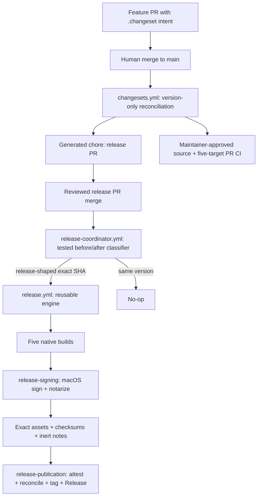
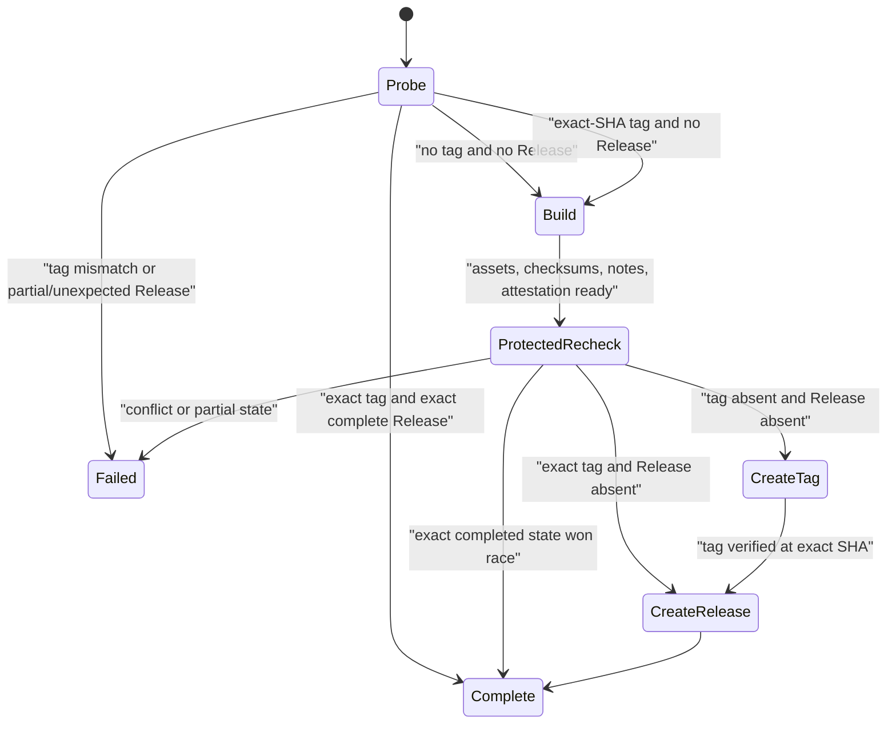

# Reviewed Changesets Release Train - Plan

## Goal Capsule

- **Objective:** Let contributors record semantic release intent with Changesets, collect that intent into one reviewable release PR, and promote the exact merged release commit through llm-now's protected five-platform binary pipeline.
- **Authority:** The selected "Reviewed release train with protected promotion" design in `docs/ideation/2026-07-16-changesets-release-automation-ideation.html` controls architecture and scope. Existing release-policy tests and protected environments control the security boundary. Official Changesets and GitHub behavior control integration details.
- **Execution profile:** One implementation phase with four ordered units on one feature branch and one pull request.
- **Stop conditions:** Stop if the stable Changesets v1 action cannot maintain a private-package version PR, if a reusable workflow cannot retain the existing environment secrets and attestation signer identity, or if exact-SHA tag-last publication would require weakening the protected publication boundary.
- **Tail ownership:** The implementation owns package scripts, Changesets configuration, release automation, policy tests, contributor and maintainer documentation, and first-run commissioning checks. It does not own npm publication, package-manager distribution, Windows signing, or automatic ordering of multiple distinct releases awaiting approval.

---

## Product Contract

### Summary

Changesets will become llm-now's release-intent and versioning layer without becoming its publisher. Feature pull requests may add patch, minor, or major intent as `.changeset/*.md`. Merges to `main` update one generated `chore: release` pull request that consumes those files, bumps `package.json`, and writes `CHANGELOG.md`. Merging that reviewed PR is the normal release command: a separate classifier proves that the merge is release-shaped and explicitly calls the protected binary engine with the exact merge SHA.

The binary engine remains responsible for the five native archives, macOS signing and notarization, checksums, attestations, protected publication, the late `vX.Y.Z` tag, and the GitHub Release. Manual dispatch remains available for unsigned candidates and exact-SHA recovery through the same engine.

### Problem Frame

The current release process requires a maintainer to choose and create a tag before manually dispatching a release. That keeps publication controlled, but it does not collect semantic intent from feature work or produce a reviewable version and changelog diff. Copying the sibling `byok-runtime` workflow directly would add the desired authoring experience but would also introduce npm publication, broader permissions, and early tag semantics that do not fit a signed multi-platform binary.

The new release train must preserve the useful review boundary while accounting for three GitHub behaviors: repository-token-created pull requests receive approval-required CI runs while most other token-created events remain suppressed, reusable workflows cannot elevate caller permissions, and cancelable reconciliation work needs different concurrency semantics from protected publication.

### Actors

- A1. **Contributor:** records release-worthy behavior changes in a Changeset and commits the generated file with the feature.
- A2. **Maintainer:** reviews the generated version/changelog PR, merges it when the previous promotion is complete, and approves protected signing or publication.
- A3. **Release automation:** reconciles the release PR, proves a release-shaped merge, builds and verifies the exact commit, and reconciles remote tag/release state.
- A4. **CLI user:** downloads one of the five GitHub Release archives and verifies its checksum and attestation.

### Requirements

**Contributor and version intent**

- R1. The repository provides `bun run changeset`, `bun run changeset:status`, and `bun run changeset:version` using exact `@changesets/cli` version `2.31.0`.
- R2. Changesets versions the private root package, updates `CHANGELOG.md`, and never publishes to npm or creates release tags.
- R3. Releasable feature pull requests may commit patch, minor, or major `.changeset/*.md` intent, while docs-only and maintenance-only pull requests are not forced to add an empty declaration.
- R4. This implementation includes one patch Changeset so the first merge exercises the new release-PR loop without changing `package.json` directly.

**Reviewed release PR**

- R5. A push-to-`main` coordinator uses stable `changesets/action` v1.9.0 in version-only mode to create or update one `chore: release` PR.
- R6. The Changesets job receives only `contents: write` and `pull-requests: write`; it receives no signing secrets, environment access, OIDC, attestations, or publication permission.
- R7. Superseded release-PR reconciliation runs cancel, while the generated PR's repository-token-created `pull_request` checks remain approval-required until a maintainer explicitly starts them.
- R8. Generated release PRs receive the existing source, five-target native, and exact-asset CI checks before merge; maintainers treat approval of those checks as part of release-PR review.

**Exact-SHA promotion**

- R9. A separate coordinator with a read-only classification job promotes only a strict stable SemVer increase from the push event's `before` SHA to its exact `github.sha` when `before` is the first parent of that SHA and `package.json`, `CHANGELOG.md`, and at least one consumed `.changeset/*.md` deletion prove a generated release merge.
- R10. Equal versions are clean no-ops; malformed/decreased versions or incomplete release-shaped version changes fail with an operator-facing diagnostic.
- R11. The coordinator explicitly calls `.github/workflows/release.yml` with the exact merge SHA and `publish: true`; it does not depend on Changesets outputs, tag events, PR titles, or actor identity to start promotion.
- R12. The reusable release engine retains a manual `workflow_dispatch` entry that accepts an explicit protected-`main` SHA and derives the version and `vX.Y.Z` tag from that checkout. `publish: true` additionally requires the SHA to pass the same release-shaped first-parent transition check as automatic promotion, unless an existing exact-SHA tag is being resumed; `publish: false` may build any protected-`main` SHA as an unsigned candidate.
- R13. `publish: false` builds an unsigned candidate and never signs, tags, attests, or creates a GitHub Release; `publish: true` keeps the existing public-repository and protected-environment gates.

**Protected binary publication**

- R14. Every non-no-op promotion builds the existing macOS x64, macOS ARM64, Linux x64, Linux ARM64, and Windows x64 archives from the validated SHA, with the existing native smoke and exact-asset checks.
- R15. macOS signing secrets remain available only to jobs using `release-signing`, and repository/OIDC/attestation writes remain available only to the protected publication path.
- R16. Final checksums and attestations are created before the tag; the protected publication job creates the tag at the exact SHA only when absent and always verifies its peeled commit before creating a Release.
- R17. Remote state reconciles as follows: no tag/release starts work only when no higher stable release is public, an exact-SHA tag without a Release resumes, a cryptographically verified exact complete Release is a successful no-op, and a mismatched tag or partial/unverified Release fails closed.
- R18. Release notes retain the existing platform and trust guidance and append only the matching Changesets changelog section as inert text.
- R19. Retries for one release SHA serialize without canceling active promotion; later feature merges and release-PR refreshes do not cancel protected build, signing, or publication work.

**Operations and evidence**

- R20. Policy and unit tests prove Changesets' private version-only configuration, release-merge classification, immutable action pins, caller permission ceilings, protected environments, late-tag order, state reconciliation, release-note extraction, and five-target preservation.
- R21. Maintainer documentation explains contributor intent, release-PR review, the one-release-at-a-time merge rule, manual candidate/recovery use, bot-PR CI commissioning, tag-rule commissioning, and retry/failure states.

### Key Flows

- F1. Feature intent enters the release queue
  - **Trigger:** A releasable feature PR is ready for review.
  - **Actors:** A1, A3
  - **Steps:** The contributor runs `bun run changeset`, selects the root package and bump type, writes a summary, and commits the generated file. After merge, the Changesets coordinator consumes all pending intent into one generated release PR. The version remains unchanged on `main` until that PR is merged.
  - **Outcome:** Maintainers can review the next version and changelog independently from individual feature merges.
  - **Covered by:** R1-R8
- F2. Reviewed release promotion
  - **Trigger:** A maintainer merges the generated release PR.
  - **Actors:** A2, A3
  - **Steps:** The classifier validates the before/after version transition and release-shaped diff, passes the exact after SHA to the reusable engine, builds five native archives, signs macOS, assembles and verifies final bytes, attests checksums, waits for protected approvals, creates/verifies the late tag, and creates the GitHub Release.
  - **Outcome:** `vX.Y.Z` points to the reviewed merge and exposes the exact verified assets.
  - **Covered by:** R9-R19
- F3. Candidate and recovery
  - **Trigger:** A maintainer manually dispatches the reusable engine or reruns a failed promotion.
  - **Actors:** A2, A3
  - **Steps:** The engine validates the explicit SHA is reachable from protected `main`, derives the version/tag, and probes remote state. Candidate mode may build any such SHA; publication mode must also prove the SHA is a release-shaped first-parent transition unless it is resuming an existing exact-SHA tag. The engine then creates an unsigned candidate, resumes an exact-SHA partial publication, returns a verified completed no-op, or fails closed.
  - **Outcome:** Recovery reuses the production graph and never overwrites a conflicting release.
  - **Covered by:** R12-R19
- F4. Release verification
  - **Trigger:** A user downloads a published archive.
  - **Actors:** A4
  - **Steps:** The user verifies the archive against `SHA256SUMS`, the reusable `release.yml` signer workflow, and the recorded source digest.
  - **Outcome:** The existing trust story remains valid after orchestration moves into a reusable workflow.
  - **Covered by:** R14-R18

### Acceptance Examples

- AE1. **Patch intent:** Given `package.json` is `0.1.0` and a merged feature contributes a patch Changeset, when the coordinator runs, then the generated PR changes the package to `0.1.1`, creates the matching changelog section, consumes the Changeset, and receives full CI without publishing.
- AE2. **Batched intent:** Given pending patch and minor Changesets, when the release PR is refreshed, then the root package receives one minor bump and both summaries appear in `CHANGELOG.md`.
- AE3. **Unrelated push:** Given a `main` push does not change the package version, when the release classifier runs, then promotion is a successful no-op even if there are no pending Changesets.
- AE4. **Malformed manual bump:** Given a `main` push increases `package.json` without a matching changelog change and consumed Changeset deletion, when classification runs, then it fails and does not call the release engine.
- AE5. **Normal promotion:** Given a valid generated release merge from `0.1.0` to `0.1.1`, when the maintainer approves protected stages, then all five archives and `SHA256SUMS` are published, `v0.1.1` resolves to the exact merge SHA, and release notes include only changelog section `0.1.1` after the trust guidance.
- AE6. **Pre-tag failure:** Given a build, signing, validation, or attestation failure occurs before tag creation, when the exact workflow is rerun, then it repeats safely with no public tag left behind.
- AE7. **Post-tag failure:** Given `v0.1.1` already points to the exact release SHA but no Release exists, when the exact promotion is rerun, then the workflow resumes Release creation without moving or duplicating the tag.
- AE8. **Completed retry:** Given `v0.1.1` points to the exact SHA and a non-draft, non-prerelease Release contains exactly five expected archives plus `SHA256SUMS`, when recovery verifies every checksum and archive attestation against `release.yml` and the source SHA, then it succeeds without rebuilding or mutating the Release.
- AE9. **Conflicting state:** Given the tag points elsewhere or the existing Release has missing/extra assets, when promotion or recovery runs, then it fails before mutation with a precise recovery diagnostic.
- AE10. **Unsigned candidate:** Given a protected-`main` SHA and `publish: false`, when manually dispatched, then the five unsigned candidate archives and checksum artifact are built without signing environments, attestations, tag creation, or Release creation.
- AE11. **Manual publish binding:** Given a later protected-`main` SHA retains the current package version but is not itself a release-shaped transition and has no exact tag to resume, when manually dispatched with `publish: true`, then validation fails before build or public mutation.

### Success Criteria

- A contributor can add and inspect release intent using Bun scripts, and a real pending Changeset opens the first generated release PR after this feature merges.
- Merging the generated PR is the only automatic publication trigger and passes its exact SHA into one reusable binary engine.
- The release PR gets the same CI evidence as ordinary PRs after a maintainer approves its repository-token-created workflow runs.
- Existing five-platform, signing, checksum, attestation, and environment policy tests continue to pass with the new orchestration.
- Tag-last retries converge only for safe states and never overwrite conflicting public state.

### Scope Boundaries

**Deferred for later**

- Automatically queueing multiple distinct releases behind protected approval. The first implementation uses SHA-keyed non-canceling concurrency and a documented rule not to merge a newer release PR while the prior promotion is incomplete.
- Richer cross-workflow release dashboards or a dedicated `llm-now release status` maintainer command.
- Homebrew, Chocolatey, npm publication, and Windows executable signing.

**Outside this release train**

- Requiring a Changeset or explicit empty declaration on every pull request.
- Immediate public publication for every individual feature Changeset.
- Tag-triggered orchestration or a second implementation of the binary engine.
- Automatic repair, replacement, deletion, or movement of an existing tag or GitHub Release.

### Dependencies

- GitHub repository Actions settings must allow the repository token to create and update pull requests.
- Maintainers with write access must be able to approve the generated PR's workflow runs before branch protection permits merge.
- Existing `release-signing` and `release-publication` environments and Apple credentials remain configured.
- Repository tag rules must allow the protected publication job to create `v*` tags while preventing unauthorized movement or deletion.

---

## Planning Contract

### Key Technical Decisions

- KTD1. **Changesets is version-only.** Use Changesets for semantic intent, the generated version PR, and changelog updates; do not add `changeset publish`, npm setup, or Changesets-owned tags. (session-settled: user-directed — chosen over copying byok-runtime's npm publish flow: llm-now distributes protected GitHub binary assets rather than an npm package.)
- KTD2. **The reviewed release PR merge is the automatic release command.** Promote only the exact after SHA of a validated release-shaped `main` push and explicitly call the binary engine. (session-settled: user-directed — chosen over immediate release per feature merge or tag-triggered handoff: cadence stays reviewable and repository-token recursion cannot drop the release.)
- KTD3. **Protected promotion remains the trust boundary.** Keep environment secrets and public mutation inside the existing signing/publication stages rather than granting the Changesets path broad rights. (session-settled: user-directed — chosen over direct publication from the Changesets job: version automation must not bypass signing, attestation, or human approval.)
- KTD4. **Use the stable Changesets compatibility line.** Pin `@changesets/cli` to `2.31.0` and `changesets/action` v1.9.0 to full SHA `a45c4d594aa4e2c509dc14a9f2b3b67ba3780d0d`. The action repository's v2 work targets Changesets v3 and uses a different input contract.
- KTD5. **Split orchestration into three workflow trust domains.** `.github/workflows/changesets.yml` maintains the version PR, `.github/workflows/release-coordinator.yml` classifies the merge and calls the engine, and `.github/workflows/release.yml` is the reusable/manual engine. This keeps the attestation signer path stable and makes permission ceilings testable.
- KTD6. **Use GitHub's approval-required CI path for the generated PR.** Keep the Changesets action on the repository token with only contents/PR writes. Current GitHub behavior creates `opened`, `synchronize`, and `reopened` pull-request workflow runs in an approval-required state, so the maintainer approves those runs as part of reviewing `chore: release`. A dedicated GitHub App token can remove this click later if release volume justifies its credential lifecycle.
- KTD7. **Classify a release merge from content, not metadata.** Tested TypeScript reads both exact package manifests and the git diff, accepts only a stable SemVer increase with unchanged package name, exact changelog section, and consumed Changeset deletion, and writes normalized outputs for the caller. This works across merge and squash strategies without trusting actor, title, or `hasChangesets`.
- KTD8. **Reconcile and verify public state twice.** The engine probes before expensive work for early no-op/fail behavior and repeats the authoritative probe inside protected publication to close races. A completed no-op must download the public assets, verify `SHA256SUMS`, and verify every archive attestation against the reusable signer and exact source SHA. Only absent state with no higher public stable version and an exact-SHA tag without a Release are mutable; all conflicts fail.
- KTD9. **Generate inert notes before the privileged job.** A tested `scripts/release-notes.ts` creates the complete trust guidance and exact changelog excerpt in `final-assets`; the protected publisher only verifies/downloads artifacts, attests checksums, reconciles state, creates/verifies the tag, and invokes `gh release create`.
- KTD10. **Manual recovery names a release-bound source SHA.** Replace the pre-existing-tag input with a full SHA reachable from `origin/main`; derive version and tag from that checkout. For `publish: true`, require the selected SHA to pass the same release-shaped first-parent transition check as automatic promotion unless its exact tag already exists for resume. This permits exact-tag recovery after newer commits reach `main` without allowing an unreviewed later commit that merely retains the version to become the release identity. Candidate-only `publish: false` runs remain available for any protected-`main` SHA.
- KTD11. **Serialize retries, not unrelated development.** Changesets refresh uses cancel-in-progress; release engine concurrency uses the immutable SHA with `cancel-in-progress: false`. A documented one-release-at-a-time merge rule prevents out-of-order protected approvals until a durable multi-version queue is justified.

### High-Level Technical Design

### Integration and Permission Boundaries

- `changesets.yml` runs only on `push` to `main`. Its reconciliation job owns `contents: write` and `pull-requests: write`; it owns no Actions, OIDC, attestation, or environment authority.
- `release-coordinator.yml` uses a read-only classification job. Its reusable-workflow call job explicitly grants `contents: write`, `id-token: write`, and `attestations: write` because a called workflow may only reduce caller permissions.
- `release.yml` defaults to `contents: read`. Native/final jobs stay read-only. `sign-macos` declares `release-signing`; `publish` declares `release-publication` and the exact write scopes.
- No caller passes repository secrets to `release.yml`. GitHub environment secrets are resolved by the called jobs that declare those environments.
- Attestations are produced inside `release.yml`, so public verification continues to name `swartzrock/llm-now/.github/workflows/release.yml` as the signer workflow.

### Release Classification Contract

`scripts/release-plan.ts` exposes pure classification helpers for tests and a CLI used by `release-coordinator.yml`.

- Read `package.json` at `github.event.before` and the checked-out `github.sha`.
- Check out the coordinator source with `fetch-depth: 0` so both exact commits and their full diff are available.
- Require `github.event.before` to equal the first parent of `github.sha`; reject multi-commit and force-push ranges while retaining ordinary merge-commit and squash-merge transitions.
- Return no-op when name/version are unchanged.
- Reject a changed package name, missing/zero before SHA, non-`X.Y.Z` versions, or a non-increasing transition.
- Require the diff to modify `package.json` and `CHANGELOG.md` and delete at least one `.changeset/*.md` other than `.changeset/README.md`.
- Require exactly one `## <new version>` changelog section.
- Write `should-release`, `release-sha`, and `version` to `GITHUB_OUTPUT` only after all checks pass.

### Release State Contract

An exact complete Release is non-draft, non-prerelease, anchored by a tag that peels to the validated SHA, and contains exactly these public asset names for the derived version:

- `llm-now-v<version>-macos-x64.zip`
- `llm-now-v<version>-macos-arm64.zip`
- `llm-now-v<version>-linux-x64.zip`
- `llm-now-v<version>-linux-arm64.zip`
- `llm-now-v<version>-windows-x64.zip`
- `SHA256SUMS`

Before returning a completed no-op, the engine downloads all six assets, verifies each archive against `SHA256SUMS`, and verifies each archive's GitHub attestation against this repository, `.github/workflows/release.yml`, and the validated source SHA. Any missing, extra, checksum-invalid, or provenance-invalid asset is conflicting state.

When the proposed tag is absent, the protected authoritative recheck also refuses to create it if any higher stable version is already public. Exact-SHA tag resume and verified completed no-op remain allowed so an interrupted older transaction can finish without moving public identity. The engine never deletes, edits, replaces, or moves public state.

For a manual `publish: true` run with no exact tag to resume, the engine classifies the selected SHA against its first parent using the same release-transition contract as the coordinator. A reachable SHA whose parent has the same package version, or whose diff is otherwise not release-shaped, cannot mint a new tag. This binding is not required for `publish: false` candidate builds.

### Implementation Constraints

- Use Bun scripts and `bun:test`; do not introduce a second package manager or Node-only test runner.
- Keep every action reference aligned with `tests/release-policy.test.ts`: GitHub-owned release tags may remain version refs, while third-party actions use full immutable SHAs.
- Do not execute checked-in repository scripts in steps that hold signing secrets or after the protected publication job receives mutation/OIDC authority. Prepare release notes before that boundary.
- Preserve unrelated untracked ideation files; include only the selected Changesets ideation artifact with this implementation.
- Do not create the release tag before checksum verification and attestation.

### Risks and Mitigations

- **Generated PR checks require a maintainer click.** Add a first-run manual test confirming the approval-required checks attach, can be approved, and satisfy branch protection before relying on the train.
- **Reusable caller permissions can silently under-scope publication.** Policy tests inspect both the caller's grant and the called workflow's narrower job permissions.
- **A tag rule may reject the late push.** Commission the publication actor against `v*` rules before approving the first release; failure is safe because no Release is created.
- **Two distinct versions may wait for approval concurrently.** SHA-keyed groups prevent retry cancellation but do not impose total ordering, so maintainers must not merge a newer release PR until the prior promotion completes; the protected recheck also refuses a new absent lower tag after a higher stable release is public.
- **Public state can change between preflight and publish.** Repeat the complete state probe immediately before tag/Release mutation and fail closed on anything outside the state table.
- **Changesets action v2 is visible but incompatible.** Pin stable v1.9.0 and record the v2/Changesets-v3 migration as future dependency work.

### Sources and Research

- Current binary release graph and trust rules: `.github/workflows/release.yml`, `.github/workflows/ci.yml`, `tests/release-policy.test.ts`, `scripts/release-validate.ts`, `docs/RELEASING.md`.
- Local authoring precedent: [swartzrock/byok-runtime](https://github.com/swartzrock/byok-runtime) informed scripts and release-PR ergonomics only; its npm publish path is explicitly excluded.
- [Changesets CLI 2.31.0](https://github.com/changesets/changesets/releases/tag/%40changesets%2Fcli%402.31.0), [private application versioning](https://github.com/changesets/changesets/blob/main/docs/versioning-apps.md), and [configuration options](https://github.com/changesets/changesets/blob/main/docs/config-file-options.md).
- [Changesets action v1.9.0](https://github.com/changesets/action/releases/tag/v1.9.0) and [stable v1 behavior](https://raw.githubusercontent.com/changesets/action/maintenance/v1/README.md).
- [GitHub token recursion behavior](https://docs.github.com/en/actions/concepts/security/github_token), [reusable workflow permissions and environment secrets](https://docs.github.com/en/actions/reference/workflows-and-actions/reusing-workflow-configurations), and [reusable workflow artifact attestation identity](https://docs.github.com/en/actions/how-tos/secure-your-work/use-artifact-attestations/increase-security-rating).
- [GitHub CLI release creation and `--verify-tag`](https://cli.github.com/manual/gh_release_create) and [attestation verification for reusable workflows](https://cli.github.com/manual/gh_attestation_verify).

---

## Implementation Units

### U1. Add private version-only Changesets authoring

- **Goal:** Establish the contributor-facing release-intent format and prove that it batches semantic changes into the expected private-package version/changelog update.
- **Requirements:** R1-R4, R20
- **Files:** `package.json`, `bun.lock`, `.changeset/config.json`, `.changeset/README.md`, `.changeset/<generated-name>.md`, `tests/changesets.test.ts`
- **Approach:** Install exact `@changesets/cli@2.31.0`; add authoring, status, and version scripts; configure explicit private versioning and no private tags; document bump selection and no-npm scope; add a patch Changeset for this feature. Build a temporary git-backed fixture test with patch and minor intent that runs `changeset version`, asserts one minor bump and both changelog summaries, and confirms consumed files are removed. Add negative policy assertions for publish scripts and npm workflow inputs.
- **Test Scenarios:**
  - A patch and minor Changeset coalesce into one minor root-package bump.
  - `CHANGELOG.md` contains both summaries under the new version.
  - Consumed Changeset files are deleted while `.changeset/README.md` remains.
  - Private versioning is enabled, private tagging is disabled, and no `changeset:publish` script exists.
- **Verification:** `bun test tests/changesets.test.ts`; `bun run typecheck`
- **Dependencies:** None

### U2. Maintain and fully test the generated release PR

- **Goal:** Create/update one reviewable Changesets PR with a narrow token and make its approval-required CI step explicit to maintainers.
- **Requirements:** R5-R8, R19-R21
- **Files:** `.github/workflows/changesets.yml`, `tests/release-policy.test.ts`, `docs/RELEASING.md`, `docs/manual-testing.md`
- **Approach:** Add the stable pinned Changesets action in version-only mode with job-local contents/PR permissions and cancelable reconciliation concurrency. Rely on GitHub's approval-required `pull_request` workflow runs for repository-token-created PRs, and document the maintainer approval as part of the release-PR review gate. Test the repository settings and first generated-PR commissioning check without adding a second CI entry path or automation credential.
- **Test Scenarios:**
  - Pending non-empty Changesets configure one `chore: release` PR and omit `publish`.
  - The Changesets job cannot request actions, OIDC, attestations, or environment access.
  - No Changesets workflow job receives `actions: write`, OIDC, attestation, or environment access.
  - After maintainer approval, the unchanged `pull_request` CI retains all five target checks and exact asset assembly.
  - Superseding `main` updates cancel only release-PR reconciliation.
- **Verification:** `bun test tests/release-policy.test.ts`; `bun run typecheck`
- **Dependencies:** U1

### U3. Convert protected publication into an exact-SHA reusable engine

- **Goal:** Make a validated generated-release merge call the existing binary pipeline directly, then create the version tag only after final verified bytes and attestations exist.
- **Requirements:** R9-R20
- **Files:** `.github/workflows/release-coordinator.yml`, `.github/workflows/release.yml`, `scripts/release-plan.ts`, `scripts/release-notes.ts`, `tests/release-plan.test.ts`, `tests/release-notes.test.ts`, `tests/release-policy.test.ts`, `tests/build.test.ts`
- **Approach:** Implement and test the first-parent before/after release classifier using a full-history checkout, then call `release.yml` as a reusable workflow with the exact SHA and explicit caller permissions. Replace tag-based engine input with source SHA and derived version/tag while retaining manual dispatch; require untagged manual publication SHAs to pass the same classifier, while allowing any protected-main SHA for unsigned candidates and exact-tag resume. Add preflight and protected recheck state reconciliation, cryptographically verify exact completed releases before no-op, reject absent lower tags after a higher stable release, preserve conflict refusal, key non-canceling concurrency by SHA, generate inert release notes before publication, attest before tag creation, and retain all five target/signing/final-asset jobs.
- **Test Scenarios:**
  - Equal version returns no-op; valid generated transition returns normalized release outputs.
  - Malformed/decreased versions, changed package name, a before SHA that is not the first parent, missing changelog section, or missing consumed Changeset deletion fail classification.
  - Both merge and squash shaped diffs classify from content rather than actor/title.
  - Manual and automatic callers check out and propagate the same exact SHA.
  - Untagged manual publication rejects a later protected-main SHA that merely retains the release version; exact-tag resume remains allowed.
  - Candidate mode never enters signing/publication; publish mode keeps both protected environments.
  - No tag/no release and exact tag/no release proceed; exact complete Release no-ops only after checksum and attestation verification; mismatched, partial, provenance-invalid, or out-of-order absent-tag states fail.
  - Attestation precedes tag push, tag verification precedes `gh release create`, and no repository script executes in the privileged publisher.
  - Release notes include one exact changelog section and exclude adjacent versions or executable interpretation.
- **Verification:** `bun test tests/release-plan.test.ts tests/release-notes.test.ts tests/release-policy.test.ts tests/build.test.ts`; `bun run typecheck`; `bun run runtime:smoke`
- **Dependencies:** U1, U2

### U4. Finish operator guidance and end-to-end policy proof

- **Goal:** Make the reviewed release train operable and recoverable without hidden setup knowledge or a second publication path.
- **Requirements:** R3, R12-R13, R17-R21
- **Files:** `docs/RELEASING.md`, `docs/manual-testing.md`, `tests/release-policy.test.ts`, `README.md` only if its public verification command needs correction
- **Approach:** Rewrite the maintainer flow from pre-created tags to Changesets intent, generated-PR review, exact-SHA promotion, and late-tag recovery. Add commissioning checks for generated-PR CI, protected environment access, tag rules, complete/no-op state, exact-tag resume, conflict refusal, and unsigned manual candidates. Re-run the full repository checks and inspect the final diff for permission or action-pin drift.
- **Test Scenarios:**
  - Documentation names every workflow entry, required repository setting, protected environment, and state-table outcome.
  - Verification guidance still names `release.yml` as the reusable attestation signer and the exact source digest.
  - Manual tests distinguish safe rerun, safe no-op, and states requiring operator repair.
  - The complete source test, typecheck, runtime smoke, and native release-policy suite pass together.
- **Verification:** `bun run check`; `bun run release:validate --help` is not required because the existing command intentionally has no help mode; review `git diff --check`
- **Dependencies:** U1-U3

---

## Verification Contract

| Gate | Command or evidence | Proves | Units |
| --- | --- | --- | --- |
| Changesets integration | `bun test tests/changesets.test.ts` | Private version-only configuration, batched bump, changelog, consumption, no npm publish | U1 |
| Release classification | `bun test tests/release-plan.test.ts` | Exact before/after semantics and fail-closed release shape | U3 |
| Release notes | `bun test tests/release-notes.test.ts` | Exact inert changelog extraction and fixed trust guidance | U3 |
| Workflow policy | `bun test tests/release-policy.test.ts` | Pins, permissions, reusable call, targets, environments, concurrency, tag order, state table | U2-U4 |
| Release asset behavior | `bun test tests/build.test.ts` | Existing exact target/assembly behavior remains intact | U3 |
| Full source suite | `bun test` | No regression across CLI, aliases, packaging, runtime, and release policy | U1-U4 |
| Static types | `bun run typecheck` | New scripts and tests satisfy strict TypeScript | U1-U4 |
| Compiled runtime | `bun run runtime:smoke` | Native compilation/runtime contract remains valid | U3-U4 |
| Full local gate | `bun run check` | Repository-standard source verification succeeds | U4 |
| Diff hygiene | `git diff --check` | No whitespace or patch-format defects | U4 |
| First generated PR | Manual commissioning in `docs/manual-testing.md` | Changesets can open/update the PR and maintainer-approved CI checks attach and satisfy branch protection | U2, U4 |
| First tag-last promotion | Manual commissioning behind protected environments | Tag rules, exact-SHA resume, signing, attestation, and Release state work on GitHub-hosted runners | U3, U4 |

No browser test is required because the change has no web UI. CI/CD behavior that cannot be faithfully reproduced locally is covered by static policy tests plus explicit first-run commissioning cases.

---

## Definition of Done

### Global

- All R1-R21 requirements and AE1-AE11 acceptance examples are implemented or represented by an explicit commissioning test where GitHub-hosted state is required.
- The implementation plan and selected ideation artifact are included in the branch; unrelated untracked ideation files remain untouched.
- `bun run check` and `git diff --check` pass.
- All third-party actions are full-SHA pinned and every new write permission is job-local and justified by a tested workflow behavior.
- The generated PR, automatic promotion, and manual recovery share one version source and one binary engine; no npm or tag-triggered publication path exists.
- Abandoned workflow branches, experimental scripts, unused outputs, and superseded documentation are removed before commit.

### Per Unit

- U1 is done when the repository can author, inspect, and version a private Changesets fixture and includes the patch intent for this feature.
- U2 is done when a version-only Changesets PR is configured with narrow permissions and its approval-required exact head receives the unchanged full CI graph after maintainer approval.
- U3 is done when a tested release-shaped merge calls the exact-SHA reusable engine, safe state retries converge, conflicts fail, and the tag is created only after attestation.
- U4 is done when maintainers can commission, operate, verify, and recover the release train from the documentation and all repository-standard checks pass.
