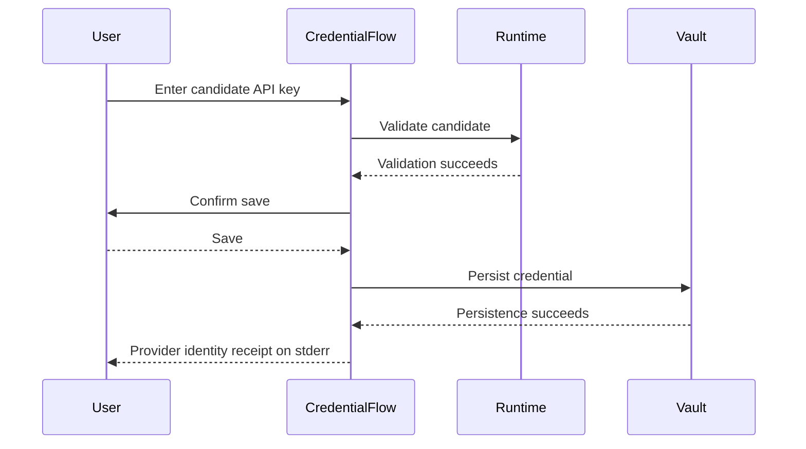

# Provider Identity Cues - Plan

## Goal Capsule

- **Objective:** Make provider identity and connection type immediately recognizable in terminal provider pickers, then confirm a successfully saved API key with a compact provider receipt.
- **Authority:** The Product Contract defines user-visible behavior; session-settled decisions constrain the implementation shape; repository tests and terminal output contracts govern integration details.
- **Stop conditions:** Stop if the change would require a custom terminal renderer, disclose credential material, imply an unverified state, or alter generated-response stdout.
- **Execution profile:** One bounded delivery phase with two implementation units and no new runtime dependency or asset.
- **Tail ownership:** The implementation includes terminal-focused tests, type checking, the full repository check, review fixes, and pull-request delivery.

---

## Product Contract

### Summary

Extend the existing Clack provider choices with focused connection-type hints and replace the plain saved-key message with a compact, terminal-safe provider identity receipt after successful credential persistence.

### Problem Frame

Provider rows currently show names without explaining whether access comes from an API key, an authenticated CLI, or a local server.
That makes Anthropic and Claude CLI look more interchangeable than they are, and the API-key flow ends with a generic sentence instead of a visible, trustworthy state transition.
The current UI is an ANSI-cell Clack flow on stderr, so literal SVG or emulator-specific image rendering would add a new rendering and fallback subsystem for a small recognition benefit.

### Requirements

#### Provider selection

- R1. Every interactive provider picker shows a focused hint for the provider's connection class: `API key`, `authenticated CLI`, or `local server`.
- R2. Pickers backed by successful provider discovery append `available` to the connection-class hint, while the static API-key management catalog does not claim current availability.
- R3. Anthropic and Claude CLI retain distinct canonical labels and connection-class hints.

#### Credential transition

- R4. A successful API-key vault write emits a compact receipt that identifies the provider, states that the API key was verified, and says `stored as: saved credential` without claiming it is the active runtime credential.
- R5. The receipt appears only after persistence succeeds; validation failure, cancellation, declined save, or vault failure must not render a saved-credential receipt.

#### Terminal and secret safety

- R6. Provider identity remains understandable as plain text without color, emoji, vendor artwork, terminal-image protocols, or fixed alignment.
- R7. New provider cues render only on the interactive stderr surface and never expose API-key material or alter generated-response stdout.

### Key Decisions

- **A+B hybrid.** Use focused-row provider hints plus one compact credential transition receipt. (session-settled: user-directed — chosen over a persistent provider header: the hybrid preserves orientation at decision and confirmation points without repeating vendor-heavy UI.) Governs R1-R5.
- **Terminal-native identity.** Use canonical provider text and connection state rather than vendor SVGs or terminal image protocols. (session-settled: user-approved — chosen over literal SVG or bitmap logo rendering: the current Clack surface is portable ANSI-cell output and image protocols would require disproportionate detection, placement, packaging, and fallback work.) Governs R6-R7.

### Acceptance Examples

- AE1. Given discovered Anthropic and Claude CLI providers, when the provider picker opens, then their focused hints read `API key · available` and `authenticated CLI · available` respectively.
- AE2. Given the static API-key management catalog, when its provider picker opens, then every option uses the `API key` hint without claiming availability.
- AE3. Given a candidate key that validates and is saved for Anthropic, when persistence completes, then stderr contains an Anthropic receipt with `API key verified` and `stored as: saved credential`, stdout remains empty, and the candidate is absent from all visible output.
- AE4. Given a candidate key that validates but the user declines saving, when credential management exits, then no saved-credential receipt is emitted.
- AE5. Given an environment credential already takes precedence, when a different verified key is persisted to the vault, then the receipt confirms only the saved record and does not claim active runtime provenance or expose either credential.

### Scope Boundaries

- No SVGL assets, vendor artwork, Unicode logo sprites, custom prompt renderer, or emulator-specific image protocol.
- No persistent provider header in the model or alias prompts.
- No new inference of environment-versus-vault provenance in provider rows; the hint describes connection class, not credential source.
- Existing model selection, alias persistence, credential precedence, and failure diagnostics retain their behavior.

### Sources

- `docs/ideation/2026-07-26-provider-aware-terminal-branding-ideation.html` records the terminal-rendering feasibility work and the provider identity direction.
- `src/prompts.ts` supplies the canonical provider labels, Clack option hint contract, sorting, text sanitization, and color fallback.
- `src/app.ts` owns provider setup, credential validation and persistence, and the existing `◆` terminal status convention.

---

## Planning Contract

### Key Technical Decisions

- KTD1. **Central connection-class metadata.** Extend the canonical provider identity seam in `src/prompts.ts` with one terminal-safe connection-class hint per provider, then reuse it at every provider-option construction site. (session-settled: user-directed — chosen over bare provider rows: focused hints distinguish API-key, CLI, and local connections inside the existing Clack interaction model.) Implements R1-R3.
- KTD2. **Context owns availability wording.** The shared metadata contains only the stable connection class; discovery-backed pickers add `available`, while the static key-management picker does not. `Available` means present in the successful discovery snapshot that built the current picker, not that model listing or generation has succeeded.
- KTD3. **Receipt follows successful persistence.** Replace the generic saved-key sentence with `◆ <Provider> · API key verified` followed by `  stored as: saved credential` after the vault write and resolver invalidation succeed. ANSI styling is supplemental and must strip to this exact two-line template. This keeps `saved credential` truthful and leaves validation, cancellation, and error branches unchanged. (session-settled: user-directed — chosen over a persistent provider header: a one-shot transition card confirms meaningful state without carrying branding through every later prompt.) Implements R4-R7.

### High-Level Technical Design

The credential receipt follows the existing lifecycle; the vault write remains the state boundary that authorizes saved-state copy.

### Assumptions

- The identity receipt replaces the existing `Saved the <Provider> API key.` line instead of adding a second success message.
- `stored as: saved credential` describes the record just persisted, not the credential source a later generation will resolve; it is shown only after `vault.set` and resolver invalidation complete.
- Receipt content comes only from canonical provider identity plus fixed literals, never candidate values, environment names, runtime model metadata, resolver output, or vault error text.
- Existing Picocolors capability checks remain the only styling gate, so `NO_COLOR` and `TERM=dumb` preserve the exact receipt words without ANSI sequences; non-TTY setup remains unreachable under the existing application-level interactivity gate.

### Delivery Phase

One phase delivers the complete A+B hybrid: provider connection hints first, followed by the credential receipt using the same identity metadata.

---

## Implementation Units

### U1. Add provider connection hints

- **Goal:** Show truthful connection-class hints in every provider picker.
- **Requirements:** R1-R3, R6-R7; covers AE1-AE2; implements KTD1-KTD2.
- **Dependencies:** None.
- **Files:** `src/prompts.ts`, `src/app.ts`, `tests/prompts.test.ts`, `tests/app.test.ts`.
- **Approach:**
  1. Add an exhaustive provider-to-connection-class mapping alongside the existing provider labels.
  2. Include `API key` hints in the static cloud credential options.
  3. Add `available` only when options came from successful runtime discovery in the main selection and setup discovery flows.
- **Patterns to follow:** `PROVIDER_LABELS`, `PromptOption.hint`, `sortPromptOptions`, and existing model-hint assertions in `tests/prompts.test.ts`.
- **Test scenarios:**
  1. Covers AE1. Discovered Anthropic, Claude CLI, and Ollama options retain sorted canonical labels and expose `API key · available`, `authenticated CLI · available`, and `local server · available`.
  2. Covers AE2. Static cloud credential options remain sorted and each exposes `API key` without `available`.
  3. When one discovered provider fails model listing, the retry picker removes it and preserves discovery-backed availability hints for the remaining providers.
  4. Provider option hints contain no ANSI controls or secret-derived data.
  5. A real Clack adapter interaction focuses or filters to a provider option and renders its canonical label plus complete connection-class hint after ANSI stripping.
- **Verification:** Provider and setup tests prove all picker construction paths use the same connection vocabulary and preserve sorting and selection values.

### U2. Render the saved credential identity receipt

- **Goal:** Confirm a verified and persisted API key with a compact provider-aware receipt.
- **Requirements:** R4-R7; covers AE3-AE5; implements KTD3.
- **Dependencies:** U1.
- **Files:** `src/app.ts`, `tests/app.test.ts`.
- **Approach:**
  1. Replace the current saved-key sentence after successful vault persistence with the exact KTD3 two-line template using only the canonical provider label, fixed receipt copy, and existing terminal colors.
  2. Keep the source line indented and textual so it remains meaningful without color or special alignment.
  3. Preserve the current ordering of credential persistence, resolver invalidation, optional alias persistence, and diagnostics.
- **Execution note:** Strengthen the existing credential-management tests before changing the success output so failure and cancellation branches remain characterized.
- **Patterns to follow:** Alias-save status output in `offerAliasSave`, `createTerminalColors`, secret-sentinel assertions, and the event-order assertions in credential-management tests.
- **Test scenarios:**
  1. Covers AE3. A validated and saved Anthropic key emits the provider label, `API key verified`, and `stored as: saved credential` on stderr after the vault write and resolver invalidation.
  2. Covers AE3. With `NO_COLOR=1` or `TERM=dumb`, the exact receipt words contain no ANSI escapes, stdout stays empty, and candidate, old, and environment credential values remain absent.
  3. Covers AE4. Existing validation-failure and pre-persistence cancellation branches each produce zero vault writes and zero receipt occurrences, preserve their exit behavior, leave stdout empty, and expose no candidate or old key.
  4. A vault write failure emits the existing secure-storage diagnostic without a success receipt.
  5. Replacing an existing key emits exactly one receipt after the successful replacement and exposes neither old nor replacement credential.
  6. An optional alias write failure after key persistence leaves the one saved-credential receipt intact, then emits the existing partial-success diagnostic.
  7. Covers AE5. An active environment credential does not change the saved-record receipt or leak environment names or values.
- **Verification:** Credential-management tests prove the receipt trigger, ordering, secret safety, plain-text fallback, and unchanged failure behavior.

---

## Verification Contract

| Gate | Applies to | Done signal |
|---|---|---|
| `bun test tests/prompts.test.ts tests/app.test.ts` | U1-U2 | Focused provider hints and credential receipt scenarios pass. |
| `bun run typecheck` | U1-U2 | Exhaustive provider metadata and option construction type-check. |
| `bun run check` | Entire change | Full tests, type checking, and runtime compile smoke check pass. |
| Browser testing | Not applicable | The change is terminal-only and has no browser surface. |
| Release validation | Not applicable | No dependency, packaging, or native archive shape changes. |

---

## Definition of Done

- U1 is complete when every provider picker renders the correct connection-class hint and discovery-only availability suffix without changing option values or sort order.
- U2 is complete when successful API-key persistence renders one compact, provider-aware stderr receipt and all branches without successful API-key persistence remain receipt-free.
- The Anthropic and Claude CLI distinction is covered by automated tests.
- Plain-text fallback, stdout purity, and credential secrecy are covered by automated tests.
- The full repository check passes with no new dependency, runtime asset, custom renderer, or abandoned experimental code in the diff.
