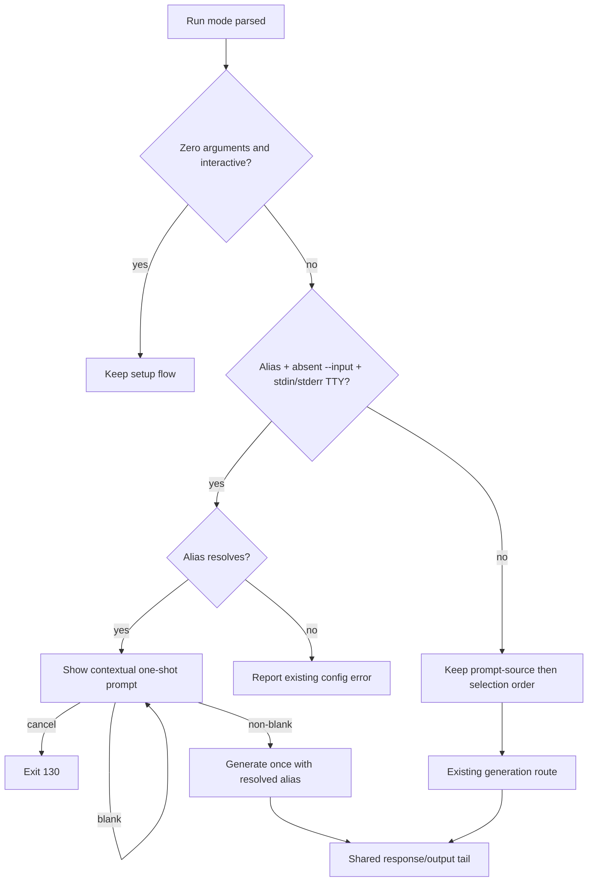

# Alias One-Shot Input - Plan

## Goal Capsule

- **Objective:** Let an interactive alias-only invocation collect one prompt, generate one response, and exit.
- **Authority:** The user's session-settled decisions and Product Contract govern behavior; the Planning Contract governs implementation within those boundaries.
- **Execution profile:** Standard public-CLI change delivered atomically in one implementation phase and one pull request.
- **Stop conditions:** Stop if the exact alias-only route cannot preserve existing explicit-input, piped-input, or non-interactive error precedence, or if terminal validation/cancellation cannot be verified with the pinned prompt library.
- **Tail ownership:** The LFG pipeline owns implementation, verification, review fixes, publication, and CI follow-through.
- **Open blockers:** None.

---

## Product Contract

### Summary

When a user invokes a saved alias without `--input` in an interactive terminal, `llm-now` asks for one prompt and completes one generation.
Explicit input, piped input, non-interactive behavior, and bare setup retain their current roles.

### Problem Frame

A saved alias already identifies the provider and model, but an alias-only interactive invocation currently exits with a usage error before resolving that alias.
Users must repeat the invocation with `--input`, even though the terminal can safely collect the missing prompt without changing script behavior.

### Key Decisions

- **One-shot interactive convenience.** Prompt once and exit after one response rather than retaining strict failure or opening a continuous session. Governs R1, R4-R6. (session-settled: user-directed — chosen over strict input failure or a continuous session because it removes ceremony without changing `llm-now`'s one-shot identity.)
- **Resolve the alias before collecting input.** Fail before prompt entry when the named target cannot be resolved. Governs R2. (session-settled: user-approved — chosen over collecting input before alias validation because users should not compose a prompt for a nonexistent target.)
- **Blank submission validates; cancellation exits.** Keep an empty submission at the input prompt while Escape or Ctrl-C cancels. Governs R3. (session-settled: user-approved — chosen over treating blank Enter as cancellation because validation and cancellation express different intent.)
- **Show the resolved target in the prompt.** Render `Prompt for <alias> · <provider> · <model>`, using `default model` when the alias delegates model choice to its provider. Governs R1, R7, R9. (session-settled: user-directed — chosen over alias-only or generic prompt copy because the user wants confirmation of the provider/model target and identified `provider default` as ambiguous.)

### Requirements

**Interactive alias flow**

- R1. When a positional alias or `--alias` is supplied without `--input` and both stdin and stderr are TTYs, `llm-now` resolves the alias and asks the user for one prompt.
- R2. If the alias cannot be resolved, `llm-now` reports the existing alias error without opening the input prompt or attempting generation.
- R3. Blank or whitespace-only input remains at the prompt with validation feedback, while Escape or Ctrl-C exits `130` without generation.
- R4. Submitting non-blank input generates exactly once with the resolved alias and then exits.
- R9. The input prompt names the alias, provider, and model; a null model is labeled `default model`, while a pinned model uses its sanitized ID.

**Compatibility boundaries**

- R5. Alias invocations with `--input` or non-empty piped stdin retain their current non-prompting behavior.
- R6. An alias invocation without a prompt source outside an interactive stdin-and-stderr TTY fails with the existing usage-error class.
- R7. The model response remains byte-for-byte on stdout, while the input prompt, validation, cancellation UI, and post-response guidance remain on stderr.
- R8. A zero-argument interactive invocation continues to enter setup rather than the one-shot input flow.

### Key Flows

- F1. Interactive alias-only generation
  - **Trigger:** A user runs a positional alias or `--alias` without `--input` while stdin and stderr are TTYs.
  - **Steps:** Resolve the alias; display its contextual target; ask for one prompt; validate the submission; generate once; exit.
  - **Outcome:** The user receives one response without constructing a second command.
  - **Covers:** R1-R4, R7, R9.
- F2. Existing deterministic input paths
  - **Trigger:** An alias invocation includes `--input` or receives non-empty piped stdin.
  - **Steps:** Use the supplied prompt without opening an interactive input prompt.
  - **Outcome:** Existing scripts and pipelines behave unchanged.
  - **Covers:** R5, R7.

### Acceptance Examples

- AE1. **Covers R1, R4, R7, R9.** Given a valid alias and interactive stdin and stderr, when the user runs the alias without `--input` and submits non-blank text, then `llm-now` shows the contextual target, generates once, writes only the response to stdout, and exits successfully.
- AE2. **Covers R2.** Given an unknown or invalid alias, when the user invokes it without `--input` in an interactive terminal, then `llm-now` reports the alias failure without asking for prompt text or generating.
- AE3. **Covers R3.** Given the one-shot input prompt, when the user submits blank text, then validation keeps the prompt open; when the user subsequently cancels, then the process exits `130` without generating.
- AE4. **Covers R5.** Given a valid alias and `--input`, when the command runs in an interactive terminal, then generation begins without displaying the one-shot input prompt.
- AE5. **Covers R5-R7.** Given a valid alias and non-empty piped stdin, when the command runs, then the piped text is used without interactive prompting and the response remains clean on stdout.
- AE6. **Covers R1, R7.** Given interactive stdin and stderr with stdout redirected, when the user invokes a valid alias without `--input`, then the one-shot prompt still appears on stderr and the resulting response is captured on stdout.
- AE7. **Covers R6.** Given a valid alias with neither `--input` nor non-empty stdin outside an interactive stdin-and-stderr TTY, when the command runs, then it retains the existing usage-error behavior and does not generate.
- AE8. **Covers R8.** Given an interactive terminal, when the user runs `llm-now` with no arguments, then setup opens and no generation-input prompt is requested.
- AE9. **Covers R3-R4.** Given whitespace around an otherwise non-blank interactive prompt, when it is submitted, then validation accepts it and generation receives the original string unchanged.

### Scope Boundaries

- No continuous conversation, prompt history, follow-up loop, or persistent session.
- No multiline terminal editor; `--input` and piped stdin remain the multiline input paths.
- No new command receipt after named-alias generation.
- No change to the zero-argument setup experience.
- No equivalent prompt fallback for explicit provider/model selection in this work.
- No change to alias storage, provider/model resolution semantics, credential handling, or response formatting.
- No change to the definition of interactivity: stdin and stderr TTY state remain authoritative.

### Sources / Research

- `src/app.ts` — application routing, alias resolution order, generation, cancellation handling, and output channels.
- `src/io.ts` — prompt-source validation and the stdin/stderr interactivity contract.
- `src/args.ts` — positional and `--alias` normalization plus public help.
- `src/prompts.ts` — Clack input, validation, and cancellation adapter.
- `tests/app.test.ts`, `tests/prompts.test.ts`, and `tests/args.test.ts` — current orchestration, terminal-adapter, input-source, and exit-code coverage.
- `README.md`, `docs/manual-testing.md`, and `tests/runtime-compile-smoke.ts` — mirrored public and packaged-runtime contracts.
- `docs/ideation/2026-07-27-no-input-launcher-experience-ideation.html` — broader launcher directions from which the one-shot behavior was selected.

---

## Planning Contract

**Product Contract preservation:** Changed R3 and added R9 to capture the session-settled whitespace and contextual-copy clarifications; all prior scope remains unchanged.

### Key Technical Decisions

- KTD1. Add an exact-mode branch in `runApplication` guarded by alias selection, `parsed.input === undefined`, and `isInteractive(stdin, stderr)`, after the existing bare-setup branch. All other routes retain `resolvePrompt` before `resolveSelection`. Governs R1-R2, R5-R8.
- KTD2. Extract a non-throwing blank-prompt validator in `src/io.ts` and reuse it from both `resolvePrompt` and the interactive text prompt. Validation checks `trim()` only for blankness and returns accepted input unchanged. Governs R3-R5, R9.
- KTD3. Resolve the alias exactly once before prompting, carry the named selection into the existing generation/output tail, and keep provider discovery and model listing out of this route. Governs R2, R4, R7.
- KTD4. Build the prompt label from the sanitized alias, provider label, and sanitized model ID, using the literal `default model` for a null model. Keep this copy local to the one-shot prompt so unrelated provider/model receipts retain their existing contract. Governs R7, R9. (session-settled: user-directed — chosen after the user clarified that `Claude CLI` is the provider and the fallback phrase must identify the model dimension.)
- KTD5. Verify application orchestration with dependency-injected Bun tests and verify actual Escape, Ctrl-C, blank validation, and output rendering through the real Clack adapter. Do not add a prompt dependency or custom terminal renderer. Governs R1-R9.

### High-Level Technical Design

The new route changes control-flow order only when all four KTD1 conditions hold.
The application resolves the alias, builds its contextual label, collects one validated text value, and then rejoins the existing generation tail.
The shared `resolvePrompt` path continues to own explicit flags, piped stdin, UTF-8 checks, dual-source conflicts, and non-interactive failures.

### Assumptions and Constraints

- `@clack/prompts` 1.7.0 continues to run text validation before submission and normalize Escape/Ctrl-C through the existing cancellation sentinel.
- Any `null` returned by the prompt abstraction is cancellation and exits `130`.
- The one-shot terminal field is single-line.
- A stale but structurally valid alias resolves before prompt entry and may fail later during generation, matching current alias semantics.
- Stdout TTY state does not affect interactivity.
- This is one atomic delivery phase. U1-U3 are implementation units for sequencing and review, not separate shipping phases.

### Delivery Sequence

1. Establish the shared validator and terminal-adapter proofs.
2. Add failing application behavior tests, then implement the narrowly guarded route and contextual copy.
3. Update public help, documentation, screenshot, manual verification, runtime smoke expectations, and release intent.

---

## Implementation Units

### U1. Share prompt validation and lock terminal input semantics

- **Goal:** Provide one blankness rule for deterministic and interactive prompt sources and prove the real adapter's validation/cancellation behavior.
- **Requirements:** R3-R5, R7.
- **Files:** `src/io.ts`, `tests/args.test.ts`, `tests/prompts.test.ts`.
- **Dependencies:** None.
- **Approach:** Add the non-throwing validator from KTD2; retain the existing `UsageError` text in `resolvePrompt`; add real-adapter tests for whitespace validation followed by success, Escape cancellation, Ctrl-C cancellation, and rendering through the injected output stream.
- **Test scenarios:** Empty and whitespace-only values reject; valid surrounding whitespace is preserved; Escape and Ctrl-C return `null`; existing explicit and piped input behavior remains unchanged.
- **Verification:** `bun test tests/args.test.ts tests/prompts.test.ts`.

### U2. Route alias-only TTY calls through one contextual prompt

- **Goal:** Implement F1 without altering F2 or other invocation modes.
- **Requirements:** R1-R9.
- **Files:** `src/app.ts`, `tests/app.test.ts`.
- **Dependencies:** U1.
- **Approach:** Add the KTD1 guard after bare setup; resolve and retain the named alias; collect one prompt labeled per KTD4; return `130` on cancellation; rejoin the existing generation/output code with no second alias lookup.
- **Test scenarios:** Positional and `--alias` parity; alias resolve before input; invalid/corrupt alias opens no prompt; blank mock value defensively reprompts; whitespace-preserving success; cancellation returns `130`; one generation; no discovery/model list; stdout redirection; stdin/stderr TTY matrix; explicit `--input`, piped stdin, explicit provider/model, and zero-argument setup regressions.
- **Verification:** `bun test tests/app.test.ts tests/args.test.ts tests/prompts.test.ts`.

### U3. Publish the new CLI contract and release intent

- **Goal:** Make the alias-only invocation discoverable and keep every mirrored public contract consistent.
- **Requirements:** R1, R5-R9.
- **Files:** `src/args.ts`, `tests/args.test.ts`, `tests/runtime-compile-smoke.ts`, `README.md`, `docs/manual-testing.md`, `docs/demos/help-screen.jpg`, `.changeset/*.md`, `docs/ideation/2026-07-27-no-input-launcher-experience-ideation.html`, `docs/plans/2026-07-27-001-feat-alias-one-shot-input-plan.md`.
- **Dependencies:** U2.
- **Approach:** Add `llm-now <alias>` to help; explain that an interactive alias without an input source asks once while scripts still use `--input` or stdin; update exact help/smoke expectations; document real-terminal validation, cancellation, redirection, and bypass checks; refresh the visible help artifact; add a minor Changeset; include the informing ideation and plan artifacts in the branch.
- **Test scenarios:** Approved help text and runtime compile smoke reflect the new usage; documentation keeps deterministic input and stdout/stderr guarantees; the screenshot matches rendered help; Changeset status recognizes the release entry.
- **Verification:** `bun test tests/args.test.ts && bun run runtime:smoke && bun run changeset:status`.

---

## Verification Contract

- **Focused behavior:** `bun test tests/args.test.ts tests/prompts.test.ts tests/app.test.ts`
- **Static and packaged-runtime gate:** `bun run typecheck && bun run runtime:smoke`
- **Full repository gate:** `bun run check`
- **Release intent:** `bun run changeset:status`
- **Terminal acceptance:** In a real PTY, verify alias resolution precedes entry; blank validation remains active; Escape and Ctrl-C exit `130`; redirected stdout contains only response bytes; explicit and piped input bypass the one-shot prompt; zero arguments still open setup.
- **Release validation:** `bun run release:validate` is not required because native packaging and release-policy code are unchanged; `runtime:smoke` still compiles and executes the packaged CLI entry surface.
- **Browser evaluation:** Not applicable; this change has no browser UI.

---

## Definition of Done

- U1-U3 satisfy their cited requirements and test scenarios.
- The new path fires only for an alias with absent `--input` when stdin and stderr are TTYs.
- Alias resolution happens once before prompt entry; generation happens at most once after valid submission.
- Cancellation exits `130` with no generation or stdout response.
- Prompt UI stays on stderr and generated bytes stay unchanged on stdout, including stdout redirection.
- Help, README, manual testing, runtime smoke expectations, screenshot, and Changeset agree with the shipped behavior.
- `bun run check` and `bun run changeset:status` pass.
- The diff contains no abandoned experiments, new dependency, continuous-session behavior, or unrelated cleanup.
