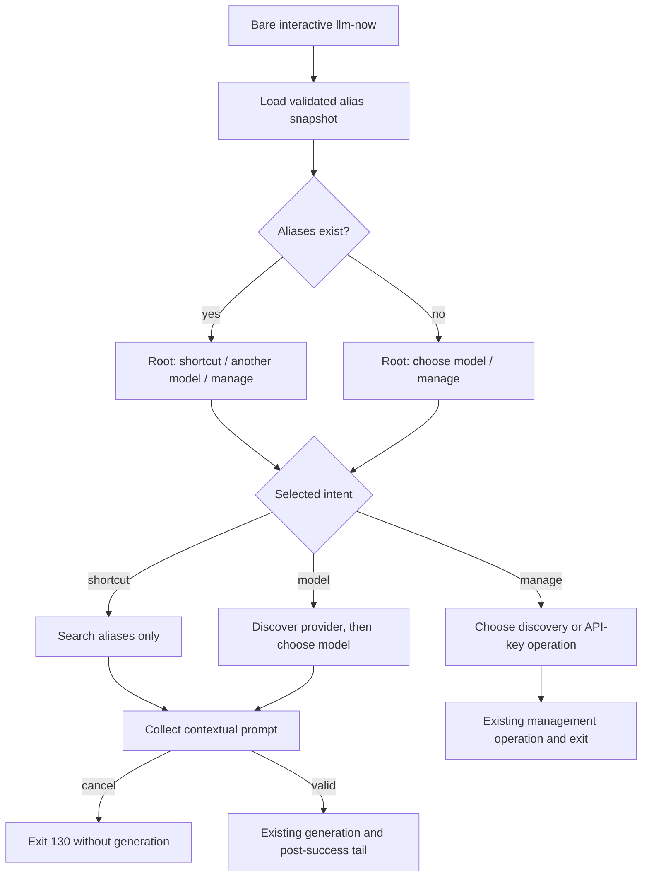

# Adaptive Launcher - Plan

## Goal Capsule

- **Objective:** Turn bare interactive `llm-now` into a state-aware launcher that separates work from connection management and completes work routes in one invocation.
- **Authority:** The session-settled Product Contract governs user-visible behavior; the Planning Contract governs implementation within those boundaries.
- **Execution profile:** Standard public-CLI change delivered atomically in one implementation phase and one pull request stacked on the alias one-shot input work.
- **Stop conditions:** Stop if the launcher cannot preserve lazy discovery, existing timeout and diagnostic behavior, credential redaction, or the stdout/stderr contract without changing non-launcher invocations.
- **Tail ownership:** The implementing workflow owns tests, code, documentation, release intent, terminal acceptance, review fixes, publication, and CI follow-through.
- **Open blockers:** None.

---

## Product Contract

### Summary

Bare interactive `llm-now` becomes a bounded, state-aware launcher.
Users with saved aliases can run a shortcut, choose another model, or manage connections; users without shortcuts can choose a model or manage connections.
Every work route collects one prompt and generates once before teaching reuse.

### Problem Frame

The current root prompt asks what the user wants to “set up,” then flattens saved aliases, provider discovery, and API-key management into one searchable list.
Selecting an alias or discovered provider stops with a command template, so the launcher teaches a second invocation instead of completing the task.
The application already has focused alias, provider, and model pickers plus a shared generation tail; the missing piece is an intent-first route that composes them.

### Key Decisions

- **Adaptive work and management hierarchy.** With saved aliases, the root shows run-shortcut, choose-another-model, and management actions in that order; without aliases, it shows choose-a-model and management. Governs R1-R3. (session-settled: user-approved — chosen over a literal two-row home because fresh-model selection must remain visible to configured users.)
- **Complete work before teaching reuse.** Shortcut and fresh-model routes collect one prompt and generate in the current process rather than printing a command template and exiting. Governs R4-R7. (session-settled: user-approved — chosen over second-invocation handoffs because a successful launcher branch should finish the user’s task.)
- **Keep management within existing capabilities.** The management route contains provider discovery and API-key management; shortcut rename and deletion remain follow-up work. Governs R8. (session-settled: user-approved — chosen over adding shortcut administration because this plan should fix launcher hierarchy without expanding alias lifecycle scope.)
- **Name the model dimension clearly.** User-facing null-model labels use `default model`, while the deterministic CLI token remains `--model default`. Governs R9. (session-settled: user-directed — chosen over `provider default` because Claude CLI is the provider and the delegated choice is the model.)
- **Use task-first nested prompt copy.** Nested picker messages name the user’s immediate task, management actions retain their existing explicit labels, and work prompts show the selected target. Governs R4, R6, R8-R9. (session-settled: user-approved — chosen over compact CLI language and target-oriented terminology because it is clearest for new users and reuses the root’s `saved shortcut` vocabulary.)

### Requirements

**Adaptive launcher**

- R1. Bare `llm-now` enters the adaptive launcher only when stdin and stderr are interactive TTYs and no arguments are supplied.
- R2. When at least one alias exists, the root prompt is `What would you like to do?` and presents `Run with a saved shortcut…`, `Choose another model…`, and `Manage connections…` in that fixed order.
- R3. When no alias exists, the same root prompt presents `Choose a model to use…` followed by `Manage connections…`.

**Work routes**

- R4. The shortcut action opens a searchable aliases-only picker sorted deterministically with sanitized provider/model hints.
- R5. The model action starts provider discovery only after selection, continues through the existing provider/model flow, and preserves model-list recovery and timeout behavior.
- R6. After a shortcut or fresh target is selected, the launcher asks for one contextual prompt; blank input validates in place, while Escape or Ctrl-C exits `130` without generation.
- R7. Non-blank input reaches the existing generation/output tail exactly once; named aliases suppress alias saving, while fresh targets retain existing-alias receipts and optional post-success alias saving.

**Management and compatibility**

- R8. The management action opens a management-only picker for existing provider discovery and API-key operations without exposing shortcut rename or deletion.
- R9. Launcher target hints, prompt labels, and delegated-model choices use `default model` for a null model without changing the accepted `--model default` value.
- R10. Provider discovery does not run while rendering or cancelling the root, selecting or cancelling an alias, or opening the static management picker.
- R11. Prompt UI, validation, receipts, and diagnostics remain on stderr; generated response bytes remain unchanged on stdout, including when stdout is redirected.
- R12. Positional and long-form aliases, explicit provider/model selection, `--input`, piped stdin, noninteractive validation, and zero-argument non-TTY behavior do not enter the launcher and retain their current semantics.
- R13. Alias-load failures, empty discovery, provider/model failures, timeouts, credential-vault failures, cancellation after durable work, and redaction retain their current exit-code and diagnostic contracts.

### Key Flows

- F1. Run a saved shortcut
  - **Trigger:** An interactive user with at least one alias chooses the shortcut action.
  - **Steps:** Open the aliases-only picker; select a validated alias snapshot; show its contextual prompt; validate input; generate once.
  - **Outcome:** The response is produced in the current invocation without provider discovery or another alias-save prompt.
  - **Covers:** R1-R2, R4, R6-R7, R9-R11.
- F2. Choose a fresh model
  - **Trigger:** A user chooses `Choose another model…` or `Choose a model to use…`.
  - **Steps:** Run discovery; select a provider and model; show the selected target; collect one prompt; generate once; run the existing post-success alias logic.
  - **Outcome:** The user receives a first response and can save or reuse the target without constructing a second command.
  - **Covers:** R1-R3, R5-R7, R9-R11, R13.
- F3. Manage connections
  - **Trigger:** A user chooses the management action.
  - **Steps:** Open the management-only picker; choose passive provider discovery or API-key management; run the existing selected operation.
  - **Outcome:** Connection work remains deliberate and separate from generation work.
  - **Covers:** R1-R3, R8, R10-R11, R13.
- F4. Existing deterministic invocations
  - **Trigger:** The call includes arguments, piped input, or is not an interactive stdin-and-stderr TTY.
  - **Steps:** Bypass the adaptive launcher and follow the current argument, prompt-source, and selection routes.
  - **Outcome:** Existing scripts and direct commands behave unchanged.
  - **Covers:** R12-R13.

### Acceptance Examples

- AE1. **Covers R1-R2, R4, R10.** Given aliases exist, when bare interactive `llm-now` opens, then the root shows the three fixed actions rather than individual aliases and performs no provider discovery.
- AE2. **Covers R1, R3, R10.** Given the alias store is empty, when bare interactive `llm-now` opens, then the root shows choose-model and management actions only and performs no provider discovery.
- AE3. **Covers R4, R6-R7, R9-R11.** Given a saved alias, when the user selects it and submits a non-blank prompt, then the contextual alias/provider/model label is shown, generation runs once, and only the response is written to stdout.
- AE4. **Covers R5-R7, R9-R11.** Given a discovered target, when the user selects its provider and model and submits a prompt, then generation runs once and the existing alias receipt/save behavior runs after success.
- AE5. **Covers R6, R13.** Given any pre-generation launcher prompt, when the user cancels, then the process exits `130`, generates nothing, and writes no response bytes.
- AE6. **Covers R8, R10, R13.** Given the management action, when the user opens its picker, then provider discovery and credential work remain separate choices and neither starts until explicitly selected.
- AE7. **Covers R9.** Given a CLI provider with no pinned model, when the target appears in a launcher picker or prompt, then it reads `default model`, while `--model default` remains valid.
- AE8. **Covers R12-R13.** Given an explicit, piped, or noninteractive invocation, when it runs, then no adaptive launcher prompt appears and existing output, error precedence, and exit codes remain.

### Interaction Copy Contract

- The aliases-only picker message is `Choose a saved shortcut`.
- The management picker message is `What would you like to manage?`.
- The management actions are `Discover available providers…` and `Add or manage API keys…`, in that order.
- A shortcut work prompt uses `Prompt for <alias> · <provider> · <model>`.
- A fresh-model work prompt uses `Prompt for <provider> · <model>`.
- Provider, model, and alias placeholders use their sanitized display values, including `default model` for a null model.

### Scope Boundaries

- No shortcut rename, deletion, bulk administration, recency ranking, or favorites.
- No dedicated `llm-now setup` command.
- No no-provider recovery screen that automatically redirects into credential management; existing diagnostics remain terminal for that invocation.
- No continuous conversation, prompt history, multiline editor, or follow-up loop.
- No eager provider readiness scan or launcher status line.
- No change to alias storage, provider/model identity, credential persistence, generation timeout, or the canonical `--model default` token.
- No new prompt dependency, terminal renderer, or provider API.

### Sources / Research

- `docs/ideation/2026-07-27-no-input-launcher-experience-ideation.html` — Idea 1 supplies the adaptive work/management hierarchy; Idea 2 supplies the same-invocation outcome.
- `docs/plans/2026-07-27-001-feat-alias-one-shot-input-plan.md` — existing one-shot prompt, validation, cancellation, and shared generation-tail decisions.
- `src/app.ts` — current root setup seam, selection orchestration, credential management, generation tail, receipts, and diagnostics.
- `src/prompts.ts` — searchable prompt adapter, deterministic option sorting, alias/provider/model selection, target formatting, and discovery failure behavior.
- `tests/app.test.ts` and `tests/prompts.test.ts` — dependency-injected route coverage, picker contracts, cancellation, redaction, timeouts, and output-channel assertions.
- `README.md`, `docs/manual-testing.md`, `docs/demos/llm-now-demo.tape`, and `tests/runtime-compile-smoke.ts` — public, manual, demo, and compiled-entry contracts that encode the current launcher.
- No `CONCEPTS.md` or `<root>/solutions/` learning corpus exists; current code, tests, ideation, and prior plan are authoritative.

---

## Planning Contract

### Key Technical Decisions

- KTD1. Replace the zero-argument `runSetup` exit-only seam with a launcher outcome that either returns a completed management exit code or a selected work target and prompt to the existing generation/output tail. This keeps timeout, stdout fidelity, terminal-boundary, receipt, and alias-save behavior single-owned. Governs R1-R8, R11, R13.
- KTD2. Load and validate the alias document once for pre-generation launcher state, selection, and existing-alias receipt decisions, then carry the selected record as that invocation’s snapshot. Concurrent edits apply on the next invocation. Post-success alias creation and credential-management alias writes retain the existing lock-protected reload used to prevent concurrent overwrites. Governs R2-R4, R7, R13.
- KTD3. Keep intent actions in fixed product order and keep searchable data collections independently sorted. The root is not alphabetized; aliases, providers, models, and credential providers retain their existing deterministic ordering. Governs R2-R5, R8.
- KTD4. Extract the fresh provider/model resolution seam so the launcher and existing interactive selection share model-list timeout wrapping, failure recovery, selected-target construction, and existing-alias detection without reopening the alias picker. Governs R5, R7, R12-R13.
- KTD5. Generalize the contextual one-shot prompt seam so an alias target and fresh target render the exact Interaction Copy Contract templates, both using the shared blank validator and preserving accepted input bytes. Governs R6-R7, R9, R11.
- KTD6. Build the management picker from static intent options and delegate to the existing provider-discovery and credential-management operations. Each operation keeps its current terminal receipt or exit behavior rather than looping back to the launcher. Governs R8, R10, R13.
- KTD7. Normalize visible null-model copy in target hints and model choices through the existing formatting seam while preserving raw stored `null` values and the deterministic CLI token. Governs R9.
- KTD8. Prove orchestration with dependency-injected Bun tests before changing the root seam, then verify real terminal behavior through the existing Clack adapter and compiled CLI artifact. Governs R1-R13.

### High-Level Technical Design

The adaptive launcher introduces an intent gate before the existing selection and execution components.
It does not create a second generation path.

### Assumptions and Constraints

- The current `@clack/prompts` `1.7.0` autocomplete and text-input adapters remain the terminal interaction surface.
- The root action menu is intentionally small and fixed; searchable child pickers own collections that can grow.
- A successfully loaded alias document is the stable pre-generation selection snapshot for one launcher invocation; later alias writes retain their existing lock-protected reload.
- Empty discovery and exhausted model-list choices emit existing diagnostics and exit `1`; they do not redirect into management.
- Cancellation before generation or a credential write exits `130`; cancellation or declined alias work after a successful generation retains the existing successful-exit contract.
- Existing provider discovery remains passive and never starts software, downloads models, or changes machine configuration.
- This is one atomic delivery phase. U1-U3 are implementation units for sequencing and review, not separate shipping phases.

### Delivery Sequence

1. Establish aliases-only selection, target formatting, and focused picker tests.
2. Add failing adaptive-root and end-to-end route tests, then replace the root orchestration seam while preserving the shared execution and management tails.
3. Update public contracts, release intent, demo assets, and real-terminal acceptance.

### Risks & Dependencies

- The implementation branch depends on `codex/alias-one-shot-input`, which depends on `codex/provider-identity-cues`; merge and review order must preserve that stack.
- Fresh-model selection becomes a potentially billable generation route, so every cancellation and blank-input case must prove zero generation calls.
- Credential tests currently enter management directly from the root. Mechanical fixture updates could hide routing regressions unless exact root and management ordering assertions remain separate.
- Calling `selectProviderAndModel` without the existing runtime wrapper would drop model-list timeout behavior.
- Alias and model text can contain hostile terminal controls or registered sensitive values; launcher hints and contextual prompts must retain diagnostic sanitization and redaction.
- Demo images are binary review artifacts. Their source tape and rendered output must change together.

---

## Implementation Units

### U1. Add focused launcher selection primitives

- **Goal:** Provide homogeneous alias selection and consistent target copy without disturbing the existing mixed interactive-selection route.
- **Requirements:** R4, R9-R10, R13; F1.
- **Dependencies:** None.
- **Files:** `src/app.ts`, `src/prompts.ts`, `tests/prompts.test.ts`, `tests/app.test.ts`.
- **Approach:**
  1. Reuse the existing deterministic alias option formatting for an aliases-only picker while keeping `selectAliasOrFresh` behavior available to non-launcher interactive selection.
  2. Route launcher alias hints through the application’s sensitive-aware formatter.
  3. Normalize visible null-model labels per KTD7 without changing raw model identity.
- **Execution note:** Start with failing picker and formatting tests so the visible option contract is fixed before root orchestration changes.
- **Patterns to follow:** `sortPromptOptions`, `sanitizePromptText`, `safeFormatSelection`, `selectedString`, and the discriminated result types in `src/prompts.ts`.
- **Test scenarios:**
  - An unsorted alias map produces a sorted aliases-only option list under `Choose a saved shortcut`, with provider/model hints and no fresh-model escape row.
  - Selecting a valid alias returns its exact name/record identity; cancellation returns the established cancelled result; a value outside the offered set throws.
  - Alias labels and hints strip terminal controls and redact registered sensitive values before reaching prompt options.
  - A null model renders `default model` in selection summaries and the supported CLI default-model choice, while pinned IDs remain unchanged.
  - Existing `selectAliasOrFresh` tests continue to prove its fresh-model escape path for non-launcher interactive selection.
- **Verification:** Focused prompt and option tests prove sorting, sanitization, cancellation, invalid-selection defense, and terminology without provider runtime work.

### U2. Route the adaptive launcher through the shared execution tail

- **Goal:** Implement F1-F4 while preserving existing work, management, failure, and output contracts.
- **Requirements:** R1-R13; F1-F4; AE1-AE8.
- **Dependencies:** U1.
- **Files:** `src/app.ts`, `tests/app.test.ts`.
- **Approach:**
  1. Replace the zero-argument setup branch with the KTD1 launcher outcome and fixed root actions from R2-R3.
  2. Carry the KTD2 alias snapshot through the shortcut route; route the fresh action through the shared selection seam from KTD4.
  3. Collect contextual input through KTD5 and rejoin the existing generation/output and post-success alias tail.
  4. Place current provider discovery and credential management behind the static management picker per KTD6.
  5. Update existing management fixtures mechanically while retaining dedicated assertions for each root state and submenu.
- **Execution note:** Add route-level failures first, then make the smallest orchestration change that rejoins the existing tail.
- **Patterns to follow:** `ResolvedSelection`, `resolveSelection`, `collectAliasPrompt`, `generateWithTimeout`, `writeResponse`, `writeInteractiveBoundary`, `offerAliasSave`, and `runCredentialManagement`.
- **Test scenarios:**
  - Covers AE1. With aliases, the exact three root actions appear in fixed order, individual aliases do not appear at root, and root cancellation performs no discovery, model listing, generation, vault mutation, or stdout write.
  - Covers AE2. Without aliases, the exact two root actions appear in fixed order and rendering the root performs no discovery.
  - Covers AE3. Selecting a sanitized alias opens only the alias picker, renders `Prompt for <alias> · <provider> · <model>`, performs no discovery or model listing, validates blank input, generates once with the loaded record, writes response bytes only to stdout, and does not offer another alias save.
  - If the injected alias loader would return a different record on a second pre-generation call, the launcher calls it exactly once and generation uses the initially selected snapshot; post-success lock-protected save reloads remain outside this assertion.
  - Cancelling at the root, alias picker, or shortcut prompt exits `130` with zero generation and no stdout response.
  - Covers AE4. Both configured and unconfigured fresh-model actions run discovery only after selection, preserve provider/model sorting and model-list fallback, render `Prompt for <provider> · <model>`, generate once, and retain existing-alias receipt or alias-save behavior.
  - Cancelling at provider, model, or fresh-target prompt exits `130`; model-list timeout and exhausted-provider failures retain existing diagnostics and exit `1`.
  - Covers AE6. The `What would you like to manage?` picker contains `Discover available providers…` followed by `Add or manage API keys…`; opening or cancelling it does not start either operation, and selecting each operation preserves its current receipt, confirmations, durable-action cancellation semantics, redaction, and exit code.
  - Covers AE7. CLI default targets display `default model` while generation still receives `model: null`.
  - Covers AE8. Positional aliases, `--alias`, explicit provider/model, `--input`, piped stdin, noninteractive missing-selection failures, help, and version bypass the launcher unchanged.
  - Redirected stdout contains only response bytes while every launcher prompt, terminal boundary, receipt, validation message, and diagnostic stays on stderr.
- **Verification:** Application tests prove exact prompt sequencing, call counts, exit codes, timeout propagation, sensitive-data exclusion, output-channel separation, and unchanged non-launcher routes.

### U3. Publish and demonstrate the adaptive launcher contract

- **Goal:** Align public help, documentation, demos, compiled smoke expectations, manual acceptance, and release metadata with the new launcher.
- **Requirements:** R1-R13; AE1-AE8.
- **Dependencies:** U2.
- **Files:** `src/args.ts`, `tests/args.test.ts`, `tests/runtime-compile-smoke.ts`, `README.md`, `docs/manual-testing.md`, `docs/demos/llm-now-demo.tape`, `docs/demos/demo.gif`, `docs/demos/help-screen.jpg`, `docs/ideation/2026-07-27-no-input-launcher-experience-ideation.html`, `.changeset/*.md`, `docs/plans/2026-07-28-001-feat-adaptive-launcher-plan.md`.
- **Approach:**
  1. Replace setup-first help and README language with the state-aware work/management contract and same-invocation outcomes.
  2. Update exact help and compiled-smoke landmarks without weakening deterministic input guidance.
  3. Extend manual acceptance for both root states, lazy discovery, every pre-generation cancellation boundary, output redirection, management isolation, and unchanged direct invocations.
  4. Build an explicit executable from the current branch and use that same artifact for real-PTY acceptance, the VHS render, and the help screenshot so evidence cannot resolve an older installed release.
  5. Correct the tape’s render comment to `vhs docs/demos/llm-now-demo.tape` and its output directive to `Output docs/demos/demo.gif`, refresh the VHS source and rendered terminal assets, clean up the temporary executable, then add minor-release intent.
- **Patterns to follow:** Existing help landmark tests, runtime compile-smoke cases, numbered manual-test scenarios, VHS source-controlled demo workflow, and Changesets release entries.
- **Test scenarios:**
  - Help and README describe adaptive bare launch, one-invocation work, management separation, lazy discovery, deterministic input, and output-channel guarantees consistently.
  - Compiled help smoke preserves ordering, platform-specific secure-storage guidance, no ANSI output, and one final newline.
  - Manual instructions cover configured and empty alias stores, alias filtering, fresh target selection, root and nested cancellation, no eager discovery, default-model copy, redirected stdout, and credential safety.
  - The VHS tape resolves the explicit branch-built executable, waits for the exact Interaction Copy Contract messages, and its generated demo reflects the maintained launcher path without displaying a credential.
  - Changeset status recognizes a minor `llm-now` release.
- **Verification:** Public text and visual artifacts agree with tested behavior, the compiled CLI surface matches help expectations, and release metadata includes the user-visible feature.

---

## Verification Contract

| Gate | Scope | Done signal |
|---|---|---|
| Focused behavior | `bun test tests/app.test.ts tests/prompts.test.ts tests/args.test.ts` | Adaptive root, nested pickers, work completion, management, terminology, and compatibility scenarios pass. |
| Static and packaged runtime | `bun run typecheck` and `bun run runtime:smoke` | TypeScript and the compiled CLI entry surface pass without Bun/Node runtime assumptions leaking into the artifact. |
| Full repository | `bun run check` | All repository tests, type checking, and runtime smoke pass together. |
| Release intent | `bun run changeset:status` | The adaptive launcher appears as a valid minor release entry. |
| Terminal acceptance | Real PTY against an explicit executable built from the current branch | Both root states, alias filtering, fresh selection, blank validation, Escape/Ctrl-C, management isolation, and stdout redirection match R1-R13. |
| Demo fidelity | Render and inspect `docs/demos/llm-now-demo.tape` with that same branch-built executable first on `PATH` | `docs/demos/demo.gif` shows the maintained adaptive flow and contains no credential or stale prompt copy. |

`bun run release:validate` is not required because native packaging and credential-adapter policy are unchanged.
Browser evaluation is not applicable because this feature has no browser UI.

---

## Definition of Done

- U1-U3 satisfy their cited requirements, flows, acceptance examples, and test scenarios.
- The root is bounded and state-aware; collections move into homogeneous searchable child pickers.
- Alias selection and root cancellation perform no provider discovery or model listing.
- Shortcut and fresh-model work routes collect one validated prompt, generate at most once, and rejoin the existing output and post-success tail.
- Management contains only existing provider discovery and API-key operations, with no implied shortcut editing.
- Nested picker messages, action labels, and contextual work prompts match the Interaction Copy Contract exactly.
- Pre-generation cancellation exits `130` with no generation or stdout response; post-durable cancellation retains existing semantics.
- `default model` is the visible null-model label while stored/runtime `null` and `--model default` remain unchanged.
- Non-launcher invocations, diagnostics, timeouts, credential redaction, and stdout/stderr separation remain compatible.
- Help, README, manual testing, compiled smoke, demo source/output, ideation terminology, and Changeset agree with shipped behavior.
- The Verification Contract passes and the diff contains no abandoned experiments, duplicated generation tail, new dependency, or unrelated cleanup.
