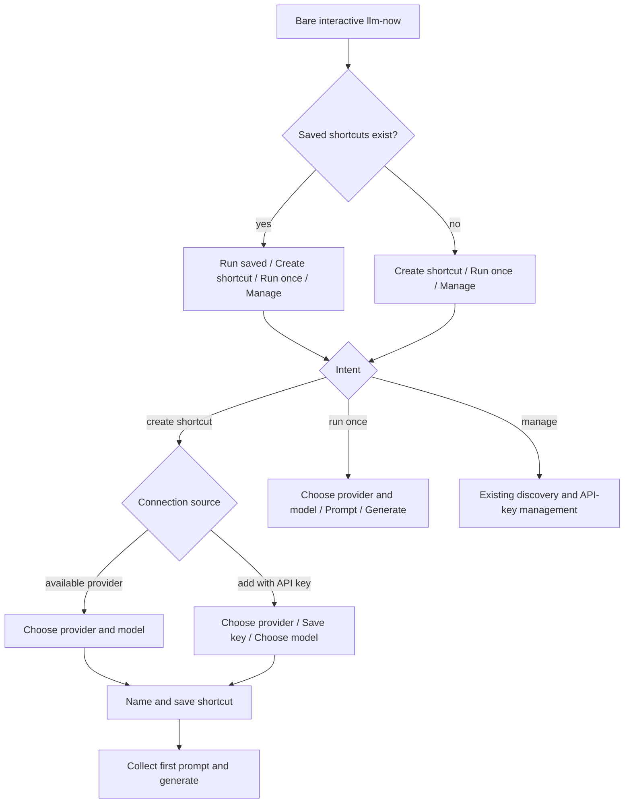
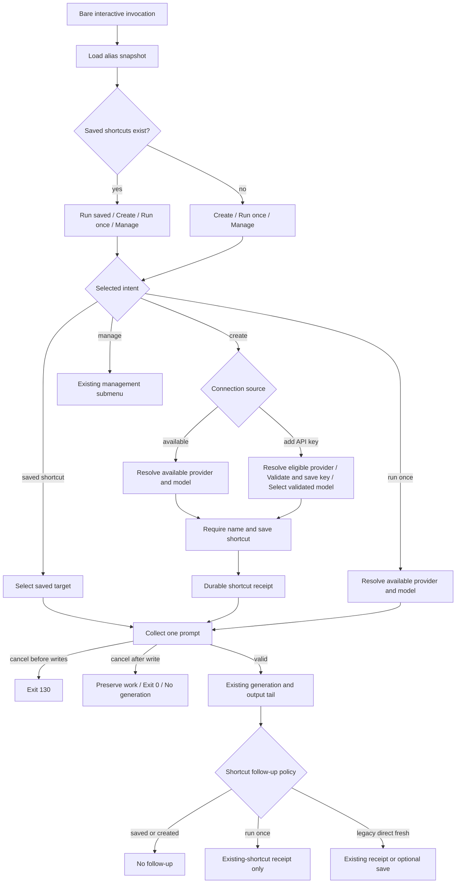

# Shortcut Creation Launcher - Plan

## Goal Capsule

- **Objective:** Make shortcut creation a first-class launcher intent that can connect an available provider or add an API-key provider, save the selected target, and complete a first run.
- **Authority:** This follow-on Product Contract governs user-visible behavior without rewriting the completed adaptive-launcher contract; the Planning Contract governs implementation within those boundaries.
- **Execution profile:** Standard public-CLI change delivered atomically in one implementation phase and one pull request stacked on the adaptive-launcher branch.
- **Stop conditions:** Stop if shortcut creation cannot preserve lazy root behavior, credential redaction and precedence, lock-protected alias writes, shared generation/output ownership, or existing non-launcher behavior.
- **Tail ownership:** The implementing workflow owns tests, code, textual documentation, release intent, review fixes, publication, CI follow-through, and manual terminal instructions; the user retains GIF rendering.
- **Open blockers:** None.

---

## Product Contract

> **Product Contract preservation note:** R1-R16, F1-F4, AE1-AE8, their scope boundaries, and all session-settled decisions are carried forward without changing their meaning. The Planning Contract below may choose implementation mechanics but may not weaken or reinterpret them.

### Summary

The bare interactive launcher gains a top-level shortcut-creation route.
Users can build a shortcut from an available provider or add a cloud provider with an API key, then run the shortcut immediately.

### Problem Frame

The adaptive launcher separates saved work from connection management, but creating a shortcut is still a side effect of another task.
General shortcut creation appears after an unnamed generation, while API-key setup offers it after credential work.
Users who arrive intending to configure a reusable target must therefore enter a one-off or management flow first.

The configured launcher also labels fresh work as choosing another model even though the user selects both a provider and a model.
That copy describes an intermediate choice rather than whether the result will be reusable.

### Key Decisions

- **Expose shortcut creation as a top-level intent.** Governs R2-R8. (session-settled: user-directed — chosen over a unified provider catalog and name-first setup: an explicit connection-source choice best matches the intended setup flow.)
- **Finish creation with the shortcut's first run.** Governs R9-R11. (session-settled: user-approved — chosen over saving and exiting or returning to the launcher: the same invocation should prove the shortcut works and deliver a result.)
- **Keep the root state-aware.** Governs R2-R3. (session-settled: user-approved — chosen over showing a saved-shortcut action with nothing to run: each root state should contain only usable actions.)
- **Separate one-off work from reusable setup.** Governs R4, R12. The one-off route runs a target without offering to save it.
- **Keep standalone connection management.** Governs R7, R13. (session-settled: user-approved — chosen over moving all credential work into shortcut creation: replacement, deletion, and passive discovery remain useful independent operations.)
- **Preserve existing terminology boundaries.** Governs R14. (session-settled: user-directed — chosen over a global alias-to-shortcut rename: current interactive, CLI, and storage vocabulary remains stable.)
- **Fail closed on credential-bearing generated output.** Governs R10, R16. A response is eligible for the unchanged stdout contract only when it contains no registered sensitive value; otherwise no response bytes are written and a redacted generation diagnostic is emitted.

### Launcher Shape

### Requirements

**Launcher states**

- R1. The launcher appears only for bare `llm-now` when stdin and stderr are interactive TTYs; arguments, `--input`, piped input, and noninteractive execution bypass it.
- R2. With at least one saved shortcut, the root shows `Run with a saved shortcut…`, `Create a new shortcut…`, `Run once with another provider and model…`, and `Manage connections…` in that order.
- R3. Without saved shortcuts, the root shows `Create a new shortcut…`, `Run once with a provider and model…`, and `Manage connections…` in that order.
- R4. Rendering or cancelling either root state performs no provider discovery, model listing, generation, or credential access.

**Shortcut creation**

- R5. `Create a new shortcut…` opens `How should this shortcut connect?` with `Use an available provider…` followed by `Add a provider with an API key…`.
- R6. The available-provider path discovers providers only after selection, then asks for a provider and model using the existing availability rules.
- R7. The API-key path selects an eligible cloud provider, validates and securely saves its key, then asks for one of that provider's models; providers already available through an environment or stored credential remain available through R6.
- R8. After the target is selected, the user names the shortcut, receives existing name validation and overwrite protection, and saves only provider/model identity in the shortcut.
- R9. A saved shortcut immediately asks for one contextual first prompt in the same invocation.
- R10. Non-blank first input generates exactly once with the saved target and writes the unchanged response to stdout unless R16 detects a registered credential in the generated content; that exceptional response is withheld in full.
- R11. Cancellation before a durable write exits `130` without mutation; cancellation after a key or shortcut is saved preserves that work and reports the completed action without generation.

**One-off work and management**

- R12. The run-once route selects an available provider and model, collects one prompt, generates once, and exits without offering shortcut creation.
- R13. `Manage connections…` continues to own passive provider discovery plus standalone API-key addition, replacement, and deletion.

**Compatibility and safety**

- R14. Interactive copy continues to use `shortcut`, while `--alias`, alias storage, and existing direct-invocation terminology remain unchanged.
- R15. Positional and long-form aliases, explicit provider/model selection, `--input`, piped stdin, help, version, and noninteractive validation retain their current behavior.
- R16. Credentials never appear in shortcut storage, prompt copy, receipts, stdout, or stderr, and existing redaction, timeout, diagnostic, and output-channel contracts remain in force.

### Key Flows

- F1. Create from an available provider
  - **Trigger:** The user chooses `Create a new shortcut…` and `Use an available provider…`.
  - **Steps:** Discover providers; choose provider and model; name and save the shortcut; enter the first prompt; generate once.
  - **Outcome:** A reusable shortcut and its first response are produced in one invocation.
  - **Covers:** R4-R6, R8-R11, R16.
- F2. Create by adding an API-key provider
  - **Trigger:** The user chooses `Create a new shortcut…` and `Add a provider with an API key…`.
  - **Steps:** Choose a cloud provider; enter, validate, and save its key; choose a model; name and save the shortcut; enter the first prompt; generate once.
  - **Outcome:** The provider becomes available, the shortcut is durable, and its first response is produced.
  - **Covers:** R5, R7-R11, R16.
- F3. Run once
  - **Trigger:** The user chooses the configured or unconfigured run-once action.
  - **Steps:** Discover providers; choose provider and model; enter one prompt; generate once.
  - **Outcome:** The response is produced without creating or offering a shortcut.
  - **Covers:** R2-R4, R12, R16.
- F4. Use existing entry points
  - **Trigger:** The user runs a saved shortcut, manages connections, supplies arguments or input, or invokes the CLI noninteractively.
  - **Steps:** Follow the existing focused route without entering shortcut creation.
  - **Outcome:** Existing shortcut, management, and deterministic invocation contracts remain available.
  - **Covers:** R1-R4, R13-R16.

### Acceptance Examples

- AE1. **Covers R1-R4.** Given saved shortcuts exist, when bare interactive `llm-now` opens, then the configured four actions appear in fixed order and no provider or credential work starts.
- AE2. **Covers R1-R4.** Given no shortcuts exist, when bare interactive `llm-now` opens, then the unconfigured three actions appear in fixed order without a saved-shortcut row.
- AE3. **Covers R5-R6, R8-R10.** Given an available provider, when the user creates and names a shortcut from one of its models, then the shortcut is saved before one first prompt generates exactly one response.
- AE4. **Covers R5, R7-R10, R16.** Given a supported cloud provider needs a credential, when the user adds a valid API key and completes shortcut setup, then the key is stored securely, the shortcut contains only provider/model identity, and the first prompt generates once.
- AE5. **Covers R7, R11.** Given the key was saved but later shortcut setup is cancelled or fails, when the flow ends, then the saved credential remains and the terminal clearly distinguishes completed work from incomplete work.
- AE6. **Covers R8, R11.** Given the shortcut was saved and the user cancels its first prompt, when the flow ends, then the shortcut remains available and no generation occurs.
- AE7. **Covers R12.** Given the user selects a run-once action, when generation succeeds, then the response is returned and no shortcut-save prompt appears.
- AE8. **Covers R13-R16.** Given the user manages connections or uses a direct invocation, when that route runs, then existing behavior, diagnostics, redaction, exit semantics, and stdout/stderr separation remain unchanged.

### Scope Boundaries

- No global rename of shortcut, alias, CLI flags, files, or stored fields.
- No shortcut rename, deletion, bulk administration, favorites, or recency ranking.
- No unified ready/setup-required provider catalog in this iteration.
- No removal of the run-once route or standalone connection management.
- No change to credential precedence, provider discovery rules, secure-storage availability, model identity, or generation timeout.
- No continuous conversation, prompt history, multiline editor, or follow-up loop.

### Dependencies and Assumptions

- The adaptive launcher and one-shot prompt behavior described by `docs/plans/2026-07-28-001-feat-adaptive-launcher-plan.md` are the baseline for this follow-on work.
- Native secure storage remains platform-dependent; when it is unavailable, the API-key path retains current environment-variable guidance rather than storing credentials elsewhere.
- Available providers include local runtimes, authenticated CLI providers, and cloud providers with an environment or stored credential.
- Durable credential and shortcut writes remain successful even when a later optional first-run step is cancelled.

### Sources and Research

- `docs/plans/2026-07-28-001-feat-adaptive-launcher-plan.md` — current launcher states, one-shot work routes, management separation, and compatibility contracts.
- `docs/plans/2026-07-27-001-feat-alias-one-shot-input-plan.md` — contextual prompt, cancellation, and shared-generation-tail behavior.
- `docs/ideation/2026-07-27-no-input-launcher-experience-ideation.html` — earlier work/management hierarchy and same-invocation outcome.
- `src/app.ts` — current launcher orchestration, post-generation shortcut saving, credential management, and durable-action behavior.
- `src/runtime.ts`, `src/credentials.ts`, and `src/aliases.ts` — provider availability, credential precedence, secure storage, and shortcut persistence boundaries.
- `tests/app.test.ts`, `tests/runtime.test.ts`, and `tests/aliases.test.ts` — existing behavioral, discovery, credential, output, and persistence contracts.

---

## Planning Contract

### Key Technical Decisions

- KTD1. Extend the existing `runLauncher` intent gate rather than creating a second setup command or a new terminal framework. The root remains a static, state-aware choice list backed only by the validated alias snapshot; provider discovery and credential access begin inside the selected child route. Governs R1-R6, R13, R15.
- KTD2. Replace the overloaded `ResolvedSelection.named` decision with explicit post-generation shortcut behavior. Saved and newly created shortcuts suppress all shortcut follow-up, run-once selections may report an already-existing shortcut but never offer a save prompt, and legacy direct fresh selections retain their current receipt-or-save behavior. Governs R9-R12, R15.
- KTD3. The available-provider creation branch reuses the existing provider/model resolver, including deferred discovery, deterministic sorting, model-list timeout wrapping, provider recovery, CLI default-model support, and existing-alias detection. Extend that selector with an optional creation-only model-eligibility predicate that filters sanitized/redacted IDs before prompt options are constructed and reports an explicit no-eligible-model outcome; run-once and legacy callers omit the predicate and remain unchanged. Governs R6, R8-R10, R15-R16.
- KTD4. Extract one required shortcut-preparation and persistence seam from the current credential-alias and post-generation alias helpers. It owns validated-list model filtering for the API-key branch, required name validation, secret rejection, lock-protected collision handling, overwrite confirmation, the durable save, and shortcut-language prompts, diagnostics, and receipts. Governs R8-R11, R14, R16.
- KTD5. Extract the add-only credential transaction from `runCredentialManagement`: hidden candidate entry, validation against the exact provider, save consent, provider-scoped mutation lock, native-vault write, resolver invalidation, durable receipt, and the validated model list. Shortcut creation consumes its successful result directly; standalone management keeps replacement, deletion, and its existing optional post-save shortcut behavior, with all app-owned add/replace/delete writes using the same lock. Governs R7, R11, R13, R16.
- KTD6. Resolve API-key eligibility only after `Add a provider with an API key…` is selected. Environment- or vault-backed cloud providers are excluded from the add picker and remain selectable through the available-provider path; only providers with a missing credential are offered for a new saved key. Re-resolve under KTD5's lock immediately before an add-only write and abort rather than replace if another invocation made the provider available. Governs R4, R6-R7, R13, R16.
- KTD7. Model durable progress as explicit outcomes rather than treating every later cancellation as an aborted invocation. Cancellation before any write exits `130`; after a key or shortcut write, the completed receipt remains visible, the invocation ends successfully without generation, and later runtime failures retain their normal failure exit while preserving prior writes. Governs R9-R11, R16.
- KTD8. Keep the shared generation/output tail single-owned. Launcher work returns a target, prompt, and shortcut-follow-up policy; generation timeout, terminal boundaries, diagnostics, and error redaction continue through the existing tail. Before any stdout write, compare generated content against the sensitive registry: ordinary responses retain exact bytes, while a response containing a registered credential is withheld in full and fails with a redacted generation diagnostic. Governs R9-R12, R15-R16.
- KTD9. Update textual public contracts and the VHS source, but do not render or modify GIF/JPEG assets in this implementation. The user will generate visual artifacts manually from the updated source after reviewing terminal behavior; the implementation pull request may open before that step but must remain draft and must not merge or publish until the refreshed primary demo is committed and reviewed. Governs R1-R16.

### High-Level Technical Design

The launcher gains two work intents but continues to return completed work to the existing generation tail.
Shortcut creation introduces durable checkpoints before the first prompt; run once changes only the post-generation shortcut policy.

### Assumptions and Constraints

- “Eligible cloud provider” means native secure storage is enabled and the credential resolver reports the provider as missing. A provider available through an environment variable or stored key is not offered for another add operation; replacement and deletion remain in connection management.
- If native secure storage is unavailable, the add-key creation branch emits the existing environment-variable guidance and exits without offering an insecure fallback.
- If every cloud provider is already available, the add-key branch reports that there is nothing to add and makes no mutation; the user can use the available-provider branch or connection management on a later invocation.
- The add-key branch may inspect cloud credential availability only after its connection-source action is selected. The root and source-choice menu themselves remain free of discovery, vault reads, model listing, and generation.
- Credential mutation locks are cross-process, provider-scoped files in the existing private application configuration directory. Prompt entry and remote validation occur outside the short critical section; the lock covers only the final state recheck and native-vault mutation.
- At the credential mutation boundary, add requires a freshly resolved missing state; replace and delete require the stored value observed when the operation began to remain current. A concurrent change aborts with a redacted diagnostic and never overwrites or deletes the newer value.
- Required shortcut naming uses `Name this shortcut`; blank input validates in place instead of skipping. Existing name grammar, sensitive-value rejection, provider/model-only storage, and overwrite protection remain authoritative.
- Both creation branches filter out model IDs that would be changed by terminal sanitization or sensitive-value redaction before they can be offered or stored. If an available provider has no safe model, creation fails before a write; if a newly validated key returns no safe model, the key remains saved, the shortcut is not created, and the invocation exits `1` with a partial-success diagnostic.
- A new creation receipt uses interactive `shortcut` vocabulary. Existing CLI flags, storage types, direct-invocation receipts, and management copy keep `alias` where they already use it.
- An already-saved identical shortcut target counts as a durable successful result and continues to the first prompt; a declined overwrite returns to required naming rather than silently converting creation into run once.
- The validated models returned by API-key verification are reused for selection, so the new credential is not listed a second time before it has been persisted and no redundant provider request is made.
- Credential persistence retains the existing default-No confirmation after remote validation. Choosing No exits `0` without mutation; cancelling the confirmation exits `130`; only explicit confirmation creates the durable key boundary.
- The alias snapshot that shapes the root is not treated as write authority. `saveAlias` reloads under its existing lock and performs collision confirmation against current data.
- After any durable write, cancellation prints or retains the completed-action receipt plus an incomplete-step diagnostic, exits `0`, and performs no generation. Remote validation failures remain terminal and redacted rather than reprompting; only local candidate-format errors reprompt.
- Each launcher route is one-shot. It does not loop back to the root after completion, cancellation, decline, or failure.
- Sensitive-output detection occurs before the first stdout write and never includes the withheld response in diagnostics. It applies through the shared tail so launcher and direct routes honor the same R16 boundary.
- This is one atomic delivery phase. U1-U3 are implementation units for sequencing and review, not separate shipping phases.

### Interaction Copy Contract

- Configured root, in order: `Run with a saved shortcut…`, `Create a new shortcut…`, `Run once with another provider and model…`, `Manage connections…`.
- Unconfigured root, in order: `Create a new shortcut…`, `Run once with a provider and model…`, `Manage connections…`.
- Creation source prompt: `How should this shortcut connect?`.
- Creation source options, in order: `Use an available provider…`, `Add a provider with an API key…`.
- Required naming prompt: `Name this shortcut`.
- Saved and newly created shortcut work prompts use `Prompt for <shortcut> · <provider> · <model>`.
- Run-once work prompts use `Prompt for <provider> · <model>`.
- New creation naming, overwrite, partial-success, and saved-target copy uses `shortcut`; management and direct CLI/storage-facing copy retains its established `alias` wording.
- All dynamic placeholders use the existing sanitized, redacted display format, including `default model` for a null CLI model.

### Delivery Sequence

1. Pin the new root/source choices and explicit post-generation shortcut policies with failing application tests.
2. Extract required shortcut persistence and add-only credential outcomes, then implement available-provider and API-key creation through the shared generation tail.
3. Update textual help, README, manual testing, compiled help landmarks, VHS source, and release intent; leave visual rendering to the user.

### Risks & Dependencies

- The implementation depends on the adaptive-launcher branch and its one-shot prompt tail; the pull request must remain based on that branch until the prerequisite lands.
- `runCredentialManagement` currently combines replacement/deletion, add, optional shortcut creation, and durable partial-success handling. An over-broad rewrite could regress credential precedence or management behavior; extraction must be covered before routing creation through it.
- Existing application tests encode long prompt-choice arrays. Mechanical fixture updates can hide root-order or lazy-work regressions unless exact root and source-menu assertions stay separate from downstream flows.
- The current `named` boolean conflates target origin and post-run behavior. Marking run-once as named would suppress useful existing-shortcut receipts, while leaving it unnamed would reopen the save prompt.
- Picker-time credential eligibility can become stale before the vault write. Without the KTD5 mutation lock and in-lock recheck, simultaneous add flows can silently replace one another.
- Current provider/model selection constructs prompt options before returning a target. Creation-only safety filtering must therefore enter the selector before option construction rather than rejecting an unsafe model after it was displayed.
- Credential eligibility checks can expose secret values to application memory. Every resolved environment/vault value must be registered with the sensitive registry immediately and must never enter option copy, diagnostics, or stored aliases.
- Shortcut creation writes before the first prompt. Exit-code and receipt tests must distinguish cancellation before any write, after credential save, and after shortcut save.
- Visual demo output will temporarily lag the updated VHS source on the draft implementation pull request until the user renders it. The draft/merge gate must be called out in the pull request and final manual-test instructions so stale product evidence is never released.

---

## Implementation Units

### U1. Add state-aware creation and run-once intent contracts

- **Goal:** Expose the confirmed root and connection-source choices while making post-generation shortcut behavior explicit.
- **Requirements:** R1-R6, R12-R15; F3-F4; AE1-AE2, AE7-AE8.
- **Dependencies:** None.
- **Files:** `src/app.ts`, `tests/app.test.ts`.
- **Approach:**
  1. Add fixed creation and run-once action values and exact state-specific root options.
  2. Add the static creation-source submenu without starting discovery or credential work until a child action is selected.
  3. Replace the overloaded `named` decision with KTD2’s explicit shortcut-follow-up policy and carry it through the existing generation tail.
  4. Route run once through the existing fresh provider/model and one-shot prompt seams with save offers disabled.
- **Execution note:** Add failing exact-option, lazy-side-effect, and run-once follow-up tests before changing launcher orchestration.
- **Patterns to follow:** `runLauncher`, `ResolvedSelection`, `resolveFreshSelection`, `collectOneShotPrompt`, `selectAlias`, the static management picker, and dependency-injected call counters in `tests/app.test.ts`.
- **Test scenarios:**
  - Configured and unconfigured root options match R2-R3 exactly and remain in product order rather than alphabetical order.
  - Root rendering and cancellation load aliases once but perform no discovery, model listing, generation, resolver/vault access, or alias mutation.
  - Selecting create opens only the exact source prompt/options; cancelling it exits `130` without side effects.
  - Run once starts discovery only after selection, collects one contextual prompt, generates exactly once, and never displays or calls shortcut persistence.
  - A run-once target with an existing shortcut may emit the existing-shortcut receipt but never offers a name; a target without one exits after the response.
  - Saved-shortcut, management, help/version, explicit, alias, `--input`, piped, and noninteractive routes preserve current behavior.
- **Verification:** Focused application tests prove exact prompt sequences, lazy boundaries, generation call counts, and route-specific shortcut follow-up behavior.

### U2. Create and immediately run durable shortcuts

- **Goal:** Implement both creation branches with secure, concurrency-safe durable writes before one first prompt.
- **Requirements:** R5-R11, R13-R16; F1-F2, F4; AE3-AE6, AE8.
- **Dependencies:** U1.
- **Files:** `src/app.ts`, `src/prompts.ts`, `src/credentials.ts`, `tests/app.test.ts`, `tests/prompts.test.ts`, `tests/credentials.test.ts`.
- **Approach:**
  1. Extract KTD4’s required shortcut preparation/persistence result from the optional alias helpers, reusing current validation, sanitization, overwrite, and lock-protected save behavior.
  2. Add KTD3's optional creation-only model predicate at the existing selector boundary, route the available-provider branch through it, then require and persist its shortcut.
  3. Extract KTD5’s add-only credential transaction and reuse its validated model inventory in required shortcut preparation while leaving standalone management behavior intact.
  4. Resolve and filter eligible API-key providers per KTD6, registering any observed credential value with the sensitive registry.
  5. Add KTD5's cross-process provider mutation lock; recheck add/replace/delete preconditions inside the lock and abort on concurrent credential changes.
  6. Emit each durable receipt at its write boundary, collect the first prompt after the shortcut receipt, and rejoin the shared generation/output tail with shortcut follow-up suppressed.
- **Execution note:** Lock down durable event ordering and partial-success exits in tests before extracting the credential code; do not change `src/aliases.ts` or credential precedence unless a failing contract proves it necessary.
- **Patterns to follow:** `prepareCredentialAlias`, `offerAliasSave`, `runCredentialManagement`, `cloudCredentialProviderOptions`, `validateCredentialCandidate`, `saveAlias`, `sameAliasRecord`, and existing credential event-order/redaction tests.
- **Test scenarios:**
  - Available-provider creation performs discovery/model listing only after its source choice, applies the creation-only safety predicate before constructing model options, validates a required name, persists provider/model identity before prompting, generates once, and never offers another shortcut save.
  - Run-once and legacy provider/model selection omit the predicate and preserve their current offered model options and outcomes.
  - If every model returned for an available provider is unsafe for storage, creation exits `1` before naming, mutation, first-prompt collection, or generation.
  - Blank or invalid names validate in place; sensitive names are rejected; a same-target existing name is accepted; different-target collisions require overwrite confirmation against current lock-protected state.
  - Declining overwrite returns to naming, and a concurrent alias change cannot be overwritten using stale root data without a fresh confirmation.
  - API-key creation offers only missing cloud providers after the add source is chosen; environment- and vault-backed providers remain absent from that picker and available through the normal discovery branch.
  - Two simultaneous add flows for the same provider cannot overwrite one another: the first durable write wins, and the second in-lock recheck emits a concurrent-change diagnostic without calling the vault writer.
  - Concurrent management replacement or deletion cannot overwrite or remove a key that changed after the operation began; different providers do not block one another.
  - A valid candidate is registered as sensitive, validated for the exact provider, explicitly confirmed with the existing default-No posture, stored securely, invalidates the resolver cache, and supplies its returned safe models without a second model-list call.
  - Declining credential-save consent exits `0` without mutation; cancelling it exits `130`; remote validation rejection or timeout exits `1` without saving, while local candidate-format failures reprompt.
  - The API key is absent from options, prompts, diagnostics, receipts, generated stdout, and serialized alias data, including when validation, save, alias persistence, or generation throws text containing the candidate.
  - If successful generation returns content containing any registered sensitive value, the entire response is withheld before stdout, a redacted generation diagnostic is emitted, exit is `1`, and all prior credential/shortcut writes remain durable.
  - Cancellation before any write exits `130` with no mutation. Cancellation after key save exits `0`, keeps the key, and performs no alias save or generation. Cancellation after shortcut save exits `0`, keeps the shortcut, and performs no generation.
  - Alias-save failure after a credential write exits `1` with a partial-success diagnostic; generation failure after shortcut save exits `1` while preserving the shortcut.
  - Native storage unavailable and no-eligible-provider states make no mutation, issue actionable guidance, and do not fall back to plaintext storage.
  - A validated key with no alias-safe models remains saved, emits a key-only partial-success diagnostic, exits `1`, and opens no naming or first-prompt step.
  - Standalone API-key add/replace/delete and its current optional alias behavior retain their prompts, durable receipts, cancellation semantics, precedence, and redaction.
- **Verification:** Application and prompt tests prove both happy paths, eligibility, exact persistence order, collision/race handling, all durability boundaries, redaction, and management compatibility.

### U3. Publish the shortcut-creation launcher contract

- **Goal:** Align textual public surfaces and release intent with the implemented launcher while preserving the user-owned visual-rendering workflow.
- **Requirements:** R1-R16; F1-F4; AE1-AE8.
- **Dependencies:** U2.
- **Files:** `src/args.ts`, `tests/args.test.ts`, `tests/runtime-compile-smoke.ts`, `README.md`, `docs/manual-testing.md`, `docs/demos/llm-now-demo.tape`, `.changeset/*.md`, `docs/plans/2026-07-28-002-feat-shortcut-creation-launcher-plan.md`.
- **Approach:**
  1. Update help and README launcher language for create, run once, management separation, durable-first setup, and same-invocation generation.
  2. Extend compiled help landmarks and manual acceptance for both root states, both creation sources, every durability boundary, run-once suppression, output redirection, and unchanged direct routes.
  3. Update the VHS source to demonstrate the maintained path against an explicit branch-built executable, but leave `docs/demos/demo.gif` and other binary images unchanged for the user-owned render; keep the pull request draft until the refreshed primary demo is added and reviewed.
  4. Add minor release intent for first-class shortcut creation and true run-once behavior.
- **Execution note:** Do not run a development server or render GIF/JPEG assets. Final handoff must give the user the required pre-merge VHS render command separately from the implementation’s manual terminal checks.
- **Patterns to follow:** Existing help landmark tests, numbered manual-test scenarios, branch-built executable workflow, VHS tape conventions, and Changesets metadata.
- **Test scenarios:**
  - Help and README describe the exact state-aware roots, both creation sources, first-run outcome, run-once no-save behavior, management boundaries, and deterministic input contracts consistently.
  - Compiled help smoke preserves ordering, platform-specific native-storage guidance, no ANSI output, and one final newline.
  - Manual steps cover an empty and configured alias store, available-provider creation, API-key creation without exposing a real key, cancellations before/after writes, collision handling, run once, management, direct invocation, and redirected stdout.
  - The VHS source uses the exact Interaction Copy Contract and explicit branch-built executable; no binary demo file changes in this implementation.
  - The pull request and final handoff identify the user-owned render as a pre-merge/release gate, so the stale demo cannot ship as the primary visual for the new launcher.
  - Changeset status recognizes a minor `llm-now` release.
- **Verification:** Public text, executable help, manual checks, tape source, and release metadata agree with the tested behavior; visual artifacts remain deliberately user-owned.

---

## Verification Contract

| Gate | Scope | Done signal |
|---|---|---|
| Focused behavior | `bun test tests/app.test.ts tests/prompts.test.ts tests/args.test.ts` | Exact menus, both creation branches, run once, management compatibility, cancellation/durability boundaries, copy, and redaction pass. |
| Credential and storage regression | `bun test tests/credentials.test.ts tests/runtime.test.ts tests/aliases.test.ts` | Credential precedence/invalidation, provider discovery, exact-candidate validation, alias schema, atomic writes, collisions, and concurrency remain intact. |
| Static and compiled runtime | `bun run typecheck` and `bun run runtime:smoke` | TypeScript and the compiled CLI surface pass with the updated help contract. |
| Full repository | `bun run check` | All Bun tests, type checking, and runtime smoke pass together. |
| Release intent | `bun run changeset:status` | Shortcut creation is represented by a valid minor release entry. |
| Terminal acceptance | Real PTY against an explicit executable built from the current branch | Both root states, both creation paths, run once, cancellation checkpoints, management isolation, and stdout redirection match R1-R16. |
| Demo-source fidelity | Inspect `docs/demos/llm-now-demo.tape` against the same branch-built executable without rendering binaries | The tape uses current copy and a credential-free maintained flow; GIF/JPEG files remain unchanged for the user to render. |
| User-owned visual gate | User renders and reviews `docs/demos/demo.gif` from the committed tape before the draft pull request is marked ready, merged, or published | The refreshed primary demo is committed on the release branch and matches the current launcher. |

`bun run release:validate` is not required because native packaging targets and credential-adapter policy are unchanged.
Browser evaluation is not applicable because this feature has no browser UI.

---

## Definition of Done

- U1-U3 satisfy their cited requirements, flows, acceptance examples, and test scenarios in one implementation phase.
- Configured and unconfigured roots match the Interaction Copy Contract and perform no provider or credential work before the selected child route requires it.
- Shortcut creation can use an available provider or add an eligible API-key provider, then saves provider/model-only identity before one first prompt.
- Run once generates through the shared tail without offering shortcut creation; legacy direct fresh selection retains its existing post-success behavior.
- Credential and shortcut receipts occur at their durable boundaries, and exit behavior distinguishes cancellation before any write from cancellation or failure after durable progress.
- Required naming preserves validation, redaction, overwrite protection, and lock-protected concurrency behavior.
- Existing connection management, credential precedence, alias/shortcut vocabulary boundaries, direct invocations, timeouts, diagnostics, and stdout/stderr separation remain compatible.
- Generated content is scanned before stdout; ordinary responses retain exact bytes, while any response containing a registered credential is withheld in full with a redacted failure diagnostic.
- Help, README, compiled smoke landmarks, manual testing, VHS source, and Changeset agree with shipped behavior.
- The automated and agent-owned Verification Contract gates pass; no development server or binary visual rendering is performed by the agent; the final handoff includes manual tests and the required user-run VHS pre-merge/release gate.
- The diff contains no duplicate generation tail, plaintext credential fallback, new prompt framework, speculative alias administration, or unrelated cleanup.
