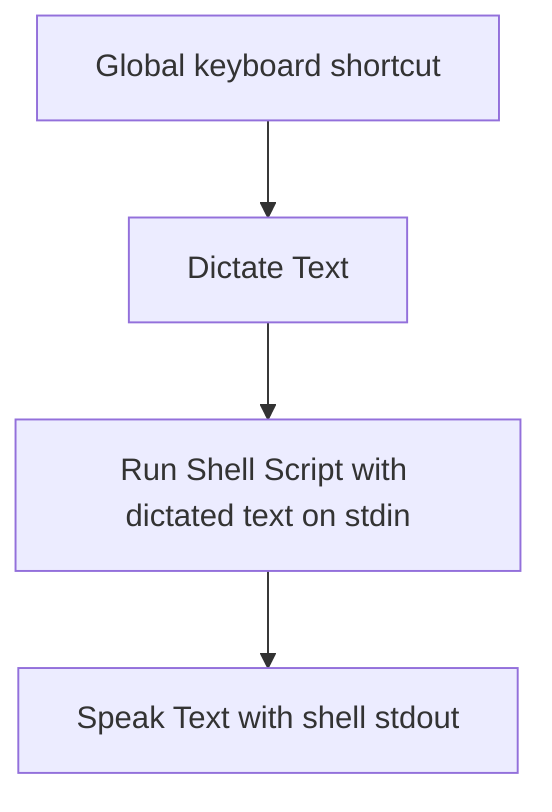
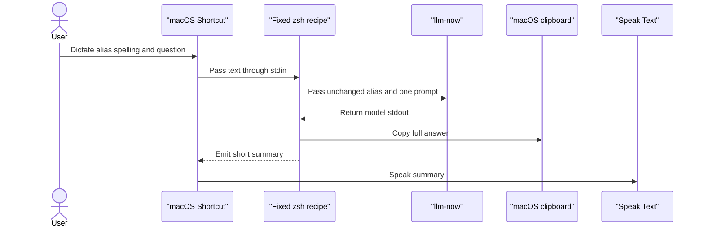
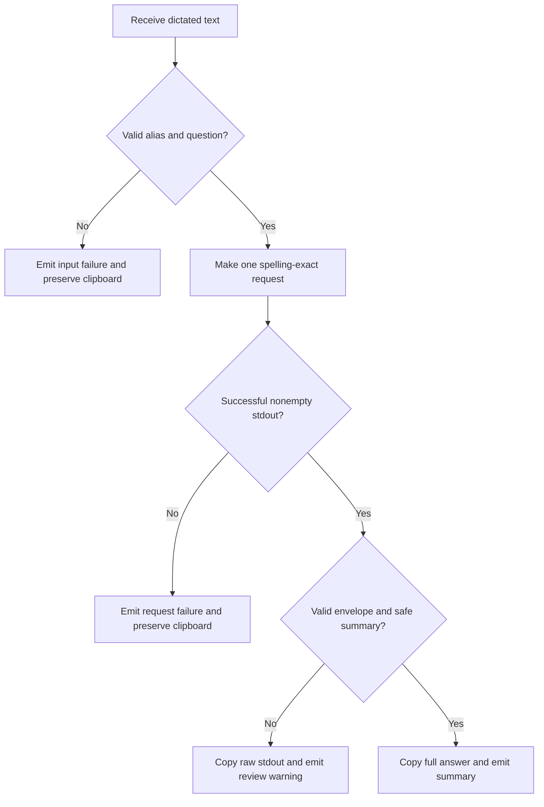

# macOS Voice Dictation Guide for llm-now - Plan

## Goal Capsule

- **Objective:** Ship one standalone Markdown guide that shows an existing `llm-now` user how to ask a spelling-exact saved alias a dictated question from a global macOS shortcut regardless of ASCII capitalization, hear a short answer, retain the full answer on the clipboard, and verify the workflow manually.
- **Authority hierarchy:** The Product Contract owns user-visible behavior. The Planning Contract owns the documentation shape and recipe boundaries. Existing `llm-now` CLI behavior and Apple’s macOS 15 documentation govern details not settled here.
- **Execution profile:** Docs-only voice-guide delivery. Core case-insensitive alias behavior is a companion prerequisite owned by its implementation plan.
- **Stop conditions:** Stop and re-plan before adding alias enumeration or fuzzy matching, normalizing aliases inside the Shortcut, expanding core behavior beyond case-insensitive spelling-exact aliases, adding a dependency, committing an executable wrapper, exporting a Shortcut, creating a Gist, or claiming support beyond validated macOS 15 behavior.
- **Tail ownership:** Repository checks and a temporary fake-command smoke test verify the Markdown and embedded shell recipe. A human on macOS 15.7 owns Dictation, permissions, global-keyboard behavior, live speech, and clipboard validation.
- **Open blockers:** None.

---

## Product Contract

> Product Contract preservation: the current request narrows the earlier voice-workflow plan to one standalone Markdown guide and its manual verification steps. The previously proposed separate wrapper, Bun test, video runbook, and Gist publication are no longer active deliverables. Existing requirement IDs retain their meaning where they remain; R13 is retired and R16 owns the new inline verification requirement.

### Summary

A global macOS keyboard shortcut will capture “hey `<alias>` `<question>`,” make one request to the spelling-exact saved `llm-now` alias case-insensitively, copy the full answer, and speak a short summary.
One local Markdown guide will contain the complete setup recipe and manual verification checklist.

### Problem Frame

Quick model questions currently require opening a browser, selecting ChatGPT, Claude, Gemini, or another destination, and typing.
The desired path is a fast keyboard shortcut followed by built-in Dictation and a spoken response.
The setup must remain understandable without installing another voice tool.

### Actors

- A1. **macOS user:** Builds the Shortcut, dictates an alias and question, listens to the summary, and pastes the full answer when needed.
- A2. **macOS Shortcut:** Captures Dictation, runs the fixed shell recipe, and speaks the recipe’s safe output.
- A3. **`llm-now`:** Resolves the spelling-exact saved alias case-insensitively and writes the selected model’s response to stdout.

### Key Decisions

- **Keyboard-invoked Dictation.** (session-settled: user-directed — chosen over Siri, background listening, and a menu-bar app: a global shortcut is faster and easier to set up.) Governs R1-R2.
- **Spelling-exact alias routing.** (session-settled: user-directed — chosen over fuzzy or proximity matching: exact pronunciation is acceptable and keeps the workflow predictable. ASCII capitalization is normalized by `llm-now`, not the Shortcut.) Governs R2-R4.
- **macOS owns the voice layer.** (session-settled: user-directed — chosen over another voice utility or a first-class `llm-now` voice mode: built-in Dictation and speech meet the fast-setup goal.) Governs R1, R11, R14-R15.
- **One request produces both output channels.** (session-settled: user-directed — chosen over a second summarization request: lower latency matters more than perfect format compliance.) Governs R5-R10.
- **Full answer to clipboard, short summary to speech.** (session-settled: user-directed — chosen over speaking the raw answer: code, URLs, and Markdown should remain available without being read aloud.) Governs R6-R10.
- **One local Markdown guide is the shipped artifact.** (session-settled: user-directed — chosen over a Gist, packaged Shortcut, separate wrapper, and video runbook: the current request is for a local setup file and manual verification.) Governs R12, R14-R16.

### Requirements

**Invocation and selection**

- R1. A global macOS keyboard shortcut must begin built-in Dictation without requiring an app switch or typed question.
- R2. The guide must define the spoken form “hey `<alias>`, `<question>`,” with spelling-exact and case-insensitive alias matching.
- R3. Missing, malformed, or oversized requests and unknown aliases must stop before generation or clipboard replacement.
- R4. The Shortcut must pass the dictated alias unchanged. `llm-now` must normalize ASCII capitalization while preserving spelling-exact routing, with no fuzzy matching or fallback selection.

**Response channels**

- R5. The recipe must make one `llm-now` generation request that asks for a separable spoken summary and full answer.
- R6. The spoken summary must use one to three short sentences and omit code, URLs, Markdown, and response-control labels.
- R7. The full answer must remain paste-ready and exclude response-control labels.
- R8. A valid response must copy the full answer before emitting only the summary to the Shortcut’s speech action.
- R9. A nonempty response that fails envelope or speech validation must copy the raw output and speak only a fixed warning.
- R10. Invalid input, generation failure, timeout, and empty output must produce brief audible feedback and leave the clipboard unchanged.

**Documentation and validation**

- R11. The workflow must require only `llm-now` and capabilities included with macOS.
- R12. `examples/macos-voice-shortcut.md` must contain prerequisites, privacy warnings, exact Shortcut actions, the complete fixed shell recipe, global-hotkey setup, troubleshooting, and recovery guidance.
- R14. A user with `llm-now` and one working alias must be able to finish the documented setup in under ten minutes.
- R15. The workflow must not require a new `llm-now` command or dependency. Core case-insensitive alias resolution is the only required `llm-now` behavior change; the Shortcut must not duplicate it.
- R16. The guide must contain manual checks for deterministic text input, live Dictation, capitalized and misspelled aliases, clipboard ordering and preservation, safe speech, malformed output, provider failure, cancellation, repeated response-format reliability, and hotkey conflicts.

### Key Flows

- F1. Successful dictated question
  - **Trigger:** A1 presses the configured global shortcut.
  - **Actors:** A1, A2, A3
  - **Steps:** A2 captures the phrase and passes it as data to the fixed recipe. A3 normalizes alias capitalization, resolves the exact spelling, and returns one response. A2 copies the full answer and speaks the short summary.
  - **Outcome:** A1 hears a concise answer and can paste the detailed answer without opening a browser.
  - **Covered by:** R1-R8
- F2. Invalid request or unavailable alias
  - **Trigger:** Dictation omits required content or names an alias that `llm-now` cannot resolve.
  - **Actors:** A1, A2, A3
  - **Steps:** A2 rejects invalid syntax locally. Otherwise A3 rejects an unknown spelling before provider generation. A2 emits one stable request-failure message.
  - **Outcome:** No alternative alias is selected and the existing clipboard remains intact.
  - **Covered by:** R2-R4, R10
- F3. Unusable model response
  - **Trigger:** A3 returns nonempty text that lacks the required channels or contains speech-unsafe summary content.
  - **Actors:** A1, A2, A3
  - **Steps:** A2 copies the raw response and emits only a warning.
  - **Outcome:** Useful output remains recoverable without reading code or markup aloud.
  - **Covered by:** R5-R6, R9

### Acceptance Examples

- AE1. **Covers R1-R8.** Given one lowercase saved alias, for example `qwen`, when the user dictates “hey Qwen, what is a perfect chord in music theory?”, one request reaches that alias, a concise explanation is spoken, and the detailed answer is copied without control labels.
- AE2. **Covers R1-R8.** Given the same configured alias, when the user asks it for a recommended Python library for colored terminal text, the speech omits installation commands while the clipboard retains the useful package details. AE1 and AE2 are alternative example prompts and do not require two aliases.
- AE3. **Covers R3-R4, R10.** Given only an alias named `qwen`, Dictation output `Qwen` reaches that alias, while the misspelling `kwen` selects no nearby alias, produces a stable failure message, and leaves the clipboard sentinel unchanged.
- AE4. **Covers R5-R6, R9.** Given a model response that ignores the channel format, the raw response is copied and only a review-before-pasting warning is spoken.
- AE5. **Covers R11-R12, R14-R16.** Given a working installation and alias, a reader follows only the standalone guide, completes setup in under ten minutes, and records the expected result for every manual verification case.

### Success Criteria

- The standalone guide can be followed without consulting the plan or source code.
- The setup uses a global shortcut, built-in Dictation, a spelling-exact case-insensitive alias, and built-in speech.
- Successful runs copy the detailed answer before speaking concise prose.
- Failure checks prove the clipboard is preserved and raw diagnostics are not spoken.
- The first three live questions after setup form a fixed acceptance window; all three must complete without response-envelope fallback before the guide’s reliability check passes.
- Any fallback in that window marks the selected alias and model as unvalidated. The user must not discard the failure and keep retrying solely to obtain a streak; a fresh window begins only after a configuration, prompt-contract, or model change intended to fix the recorded cause.

### Scope Boundaries

- No alias enumeration, pronunciation dictionary, fuzzy matching, spelling correction, or fallback model.
- No background listener, Siri phrase, Voice Control workflow, menu-bar app, or third-party speech utility.
- No executable wrapper, committed test harness, packaged Shortcut, Gist, video, or separate runbook.
- No new `llm-now` voice command, adapter-side lowercasing, dependency, or platform support. Case-insensitive alias resolution remains a core `llm-now` concern.
- No automatic clipboard clearing; the full answer is intentionally available for pasting.

### Dependencies and Assumptions

- The user runs macOS Sequoia 15.7 with Dictation enabled for the selected language.
- The user has one short, lowercase, speech-friendly saved alias whose provider succeeds from the actual Shortcuts `Run Shell Script` action. Dictation may capitalize that alias because `llm-now` resolves it case-insensitively. A Terminal-only success is preliminary because Shortcuts can have different startup configuration, credentials, and executable paths.
- The selected model usually follows the requested response envelope; the manual reliability check and safe fallback own noncompliance.
- Shortcuts action names and permission prompts may drift across macOS releases, so the guide claims only the version it validates.

### Sources and Research

- `README.md` — spelling-exact, case-insensitive aliases; prompt-source rules; stdout and stderr behavior.
- `src/aliases.ts` — alias grammar, lowercase canonical storage, and case-insensitive lookup.
- `src/args.ts` and `src/io.ts` — explicit `--alias` selection and stdin prompt handling.
- `src/app.ts` — byte-faithful stdout and the existing generation timeout.
- `examples/README.md` — macOS clipboard and `say` recipe conventions.
- `docs/manual-testing.md` — scenario-oriented manual verification conventions.
- [Run a Shortcut while working on macOS](https://support.apple.com/guide/shortcuts-mac/launch-a-shortcut-from-another-app-apd163eb9f95/7.0/mac/15.0)
- [Use Dictation on macOS 15](https://support.apple.com/guide/mac-help/use-dictation-mh40584/15.0/mac/15.0)
- [Action connections in Shortcuts](https://support.apple.com/guide/shortcuts-mac/action-connections-apda850ab0e1/7.0/mac/15.0)
- [Advanced Shortcuts settings](https://support.apple.com/guide/shortcuts-mac/advanced-shortcuts-settings-apdfeb05586f/7.0/mac/15.0)
- [Shortcut privacy settings](https://support.apple.com/guide/shortcuts-mac/adjust-privacy-settings-apd961a4fc65/7.0/mac/15.0)

---

## Planning Contract

### Key Technical Decisions

- KTD1. **Document a three-action Shortcut.** The action chain is `Dictate Text` → `Run Shell Script` → `Speak Text`. The shell action uses `/bin/zsh`, receives Dictated Text through stdin, contains the fixed recipe from the guide, and emits only speech-safe text.
- KTD2. **Keep all voice integration code inside the guide.** (session-settled: user-directed — chosen over a versioned wrapper and committed tests: the current request is one Markdown setup file.) The guide owns the canonical copyable shell block and passes alias input unchanged. Core `llm-now` owns case normalization under its companion implementation plan.
- KTD3. **Treat dictated text as bounded data.** The fixed recipe reads Shortcut input from stdin without `eval` or generated shell source. It requires the extracted alias to match `llm-now`’s existing 1–64 character ASCII alias grammar, preserves accepted alias bytes for quoted `--alias`, and accepts a nonempty question of at most 4,096 characters before creating response files or invoking the CLI.
- KTD4. **Use one strict response envelope.** The one-request prompt asks for a spoken block, a full-answer block, and fixed versioned markers. Parsing rejects missing, repeated, reversed, collided, empty, or extra-outside-envelope content.
- KTD5. **Validate speech separately from structure.** A valid spoken block contains one to three nonempty lines, one sentence per line, no line over 200 characters, no control marker, and no code fence, inline code, URL, Markdown heading, blockquote, list, image, link, table, or horizontal rule.
- KTD6. **Use restrictive temporary storage.** The recipe sets a restrictive umask, captures prompt, stdout, and stderr separately in a private temporary directory, and removes it on normal, handled-failure, and trappable-signal paths. Forced termination may leave private files and is disclosed.
- KTD7. **Make clipboard replacement the commit point.** Valid output copies only the full-answer block before emitting the summary. Nonempty malformed output copies raw stdout and emits a stronger review warning. Invalid input, nonzero CLI status, empty output, and copy failure never claim success.
- KTD8. **Use stable spoken failures.** The recipe emits these exact messages so `Speak Text` still runs and the manual checks have deterministic expectations:
  - Invalid input: “I couldn't understand the alias and question. Please try again.”
  - Request failure: “The request failed. Check the alias and provider, then try again.”
  - Clipboard failure: “I couldn't copy the answer. The clipboard was not changed.”
  - Malformed response after a successful copy: “I copied an unvalidated response. Review it before pasting.”
  Captured diagnostics never enter speech or the clipboard.
- KTD9. **Reuse the existing generation timeout and disclose cancellation limits.** The recipe does not add GNU `timeout`, retry another alias, or start a second request. The guide tells the user to wait for completion and warns that canceling Shortcuts cannot revoke a request already transmitted to a provider or guarantee immediate termination of every provider child process.
- KTD10. **Pin production commands during setup.** The guide has the user resolve `llm-now` in Terminal, paste its absolute path into the recipe, and test the same path before assigning the hotkey. The production recipe calls `/usr/bin/pbcopy` directly and exposes no runtime command override. Temporary fake-command verification rewrites a disposable copy of the recipe instead of adding a test seam to the published block.
- KTD11. **Ship one standalone guide and one discoverability link.** `examples/macos-voice-shortcut.md` is complete and Gist-ready, but no Gist is created. `examples/README.md` links to it without duplicating the recipe.
- KTD12. **Validate macOS 15.7 only.** The guide links to the macOS 15 versions of Apple documentation and labels later versions as unverified.
- KTD13. **Use the platform running indicator as the wait cue.** The guide tells users to watch Shortcuts’ active-run indicator after Dictation ends and not invoke the shortcut again until speech or failure feedback occurs. The manual checklist must confirm the cue is visible on the target version.
- KTD14. **Disclose every trust boundary before live Dictation.** The guide covers Apple Dictation processing, the selected provider—including provider-side retention or use under the account’s settings and policies—temporary local files, audible output, the general or Universal Clipboard, and untrusted model output. It tells users to verify Apple and provider terms before dictating sensitive material, use private audio, and inspect every answer before pasting it into terminals, scripts, configuration, or privileged applications.
- KTD15. **Keep credentials out of the Shortcut.** The guide prohibits pasting API keys, tokens, or other secrets into the shell recipe. The user must configure credentials through the existing `llm-now` or provider-supported credential mechanism and prove that the absolute `llm-now` command works from a non-interactive shell before continuing.

### High-Level Technical Design

**Shortcut action topology**

**One-request data flow**

**Outcome gates**

### Delivery Shape

The voice-guide unit has one implementation phase; core case-insensitive alias
resolution is delivered under its companion implementation plan:

1. Add the standalone guide with its complete recipe and manual checklist.
2. Link it from the existing cookbook.
3. Validate Markdown structure, shell syntax, fake-command behavior, repository checks, and the documented macOS handoff.

### Assumptions and Deferred Implementation Notes

- The guide will use action labels observed on macOS 15.7. If the target UI differs, implementation updates the guide before shipping rather than broadening the compatibility claim.
- A disposable rewritten copy of the recipe can substitute temporary fake `llm-now` and clipboard commands without exposing overrides in the published production block.
- A real live run depends on the user’s configured provider and privacy choices. The pull request may ship with those checks clearly marked for the user when credentials or microphone interaction are not appropriate for automated execution.
- Speech failure can happen after clipboard success. The guide explains how to inspect the existing clipboard before deciding whether to retry.
- Cancellation is not a provider-revocation control. The guide tells users not to rely on it for privacy, records observed local process behavior, and fails verification if speech or clipboard mutation occurs after cancellation.

---

## Implementation Units

### U2. Standalone macOS Voice Guide

- **Goal:** Add one self-contained guide and make it discoverable from the cookbook.
- **Requirements:** R1-R12 and R14-R16; F1-F3; AE1-AE5.
- **Dependencies:** Core spelling-exact case-insensitive alias resolution, plus existing stdin, stdout, timeout, clipboard, and speech patterns cited in Sources and Research.
- **Files:**
  - Add `examples/macos-voice-shortcut.md`.
  - Update `examples/README.md`.
- **Approach:**
  1. Open with the outcome, supported macOS version, under-ten-minute setup expectation, and prerequisites.
  2. Put privacy and trust-boundary warnings before the first live Dictation step.
  3. Show how to enable Dictation, confirm Voice Control is not replacing it, enable Shortcuts script actions, choose a microphone and language, resolve the absolute executable path, and verify one spelling-exact alias case-insensitively in a non-interactive shell without embedding credentials in the Shortcut. After the privacy disclosure and before hotkey assignment, replace Dictate Text with a disposable Text action and make one real-provider request through the actual `Run Shell Script` action; treat failure as an unmet prerequisite.
  4. Define the three actions and every relevant setting, including stdin handoff and the global keyboard shortcut.
  5. Provide one canonical zsh block that implements KTD3-KTD10 and prints only speech-safe output.
  6. Explain normal output, raw-response fallback, clipboard replacement, speech failure after copy, waiting, cancellation, and troubleshooting. Add a permission-recovery table for macOS 15.7 that covers Dictation at System Settings > Keyboard, microphone access at System Settings > Privacy & Security > Microphone, Allow Running Scripts at Shortcuts > Settings > Advanced, and per-shortcut decisions at the shortcut editor’s Details > Privacy view. Each row must state the symptom, setting to repair, rerun step, and observable recovery result.
  7. End with an ordered manual checklist that uses a clipboard sentinel and records expected results.
  8. Add one concise entry to the cookbook table and a short pointer near the existing spoken recipe.
- **Patterns to follow:** `examples/README.md` recipe tone and safety guidance; `docs/manual-testing.md` named scenarios and observable expected results.
- **Test scenarios:**
  - Covers AE1. A deterministic Text action using a capitalized form of the lowercase configured alias reaches fake `llm-now` once, copies only the full answer, and emits only the short summary.
  - Covers AE2. A live question to that same alias speaks prose without code or URLs while the clipboard retains the detailed answer.
  - Covers AE3. Capitalized alias input reaches the one lowercase saved alias; a misspelled alias preserves a preloaded clipboard sentinel and does not select another alias.
  - Empty Dictation, missing wake word, missing alias, missing question, invalid alias grammar, and a question over 4,096 characters preserve the clipboard, make no fake CLI call, and emit a short input failure.
  - Questions at the 4,096-character boundary succeed. Dictated quotes, dollar signs, command substitutions, backticks, semicolons, pipes, redirections, Unicode, newlines, and rejected control characters cannot run another shell command.
  - Provider failure, missing executable, timeout, and empty output preserve the clipboard and keep diagnostics out of speech.
  - Covers AE4. Malformed or speech-unsafe output copies the raw response and emits only the review-before-pasting warning.
  - Copy failure does not emit the success summary. Speech failure guidance identifies that the full answer may already be on the clipboard.
  - Canceling a run causes no later speech or clipboard change. The checklist records any surviving process and reiterates that cancellation cannot revoke provider transmission.
  - The first three live questions after setup form the fixed reliability window and all complete with valid response channels.
  - Any fallback marks the alias/model unvalidated and ends that window. A new window starts only after the user records and changes a likely cause; retries without a relevant change cannot convert the failed window into a pass.
  - The chosen global chord starts Dictation from multiple unrelated apps and does not conflict with a reserved shortcut.
  - Covers AE5. A clean setup from satisfied prerequisites completes in under ten minutes using only the guide.
- **Verification:** The Markdown is self-contained, every code block is complete, links resolve, the embedded recipe passes zsh syntax and fake-command smoke checks, repository checks pass, and the remaining macOS-only cases are clearly runnable without source inspection.

---

## Verification Contract

### Automated and Local Verification

- `git diff --check` reports no whitespace errors.
- The embedded zsh recipe is copied to a temporary file and passes `zsh -n`.
- A temporary rewritten copy of the recipe substitutes fake `llm-now` and clipboard commands to exercise success, invalid input, mixed-case success, spelling-exact failure, malformed output, provider failure, empty output, and shell-metacharacter cases without network access or real clipboard mutation. The published recipe itself pins `/usr/bin/pbcopy` and has no runtime command override.
- `bun run check` passes as the repository-wide regression gate.
- Markdown links and cookbook anchors point to existing paths.

### Manual macOS 15.7 Verification

The guide must tell the reader to record each result:

1. Confirm Dictation, language, microphone, Voice Control state, Allow Running Scripts, and requested privacy permissions.
2. Replace Dictate Text with a Text action and run deterministic success, invalid-input, malformed-output, and adversarial-input checks.
3. Restore Dictate Text and complete either AE1 or AE2 with a capitalized form of the one lowercase configured alias; optionally run both prompts through that same alias.
4. Preload a clipboard sentinel before every failure check and prove it remains unchanged.
5. Verify capitalization reaches the same saved alias and a misspelling does not reroute.
6. On a valid-envelope success run, confirm clipboard content exists before speech begins and contains no envelope markers. On the malformed-response check, confirm instead that raw stdout is recoverable in the clipboard and only the fixed review warning is spoken.
7. Confirm speech contains no code, URLs, Markdown, markers, or raw diagnostics.
8. Verify the active-run cue is visible during generation and a second invocation is not needed.
9. Cancel during generation, fail the check if later speech or clipboard mutation occurs, record any surviving process, and confirm the guide does not promise provider revocation.
10. Treat the first three live questions after setup as the fixed reliability window. All three must succeed without fallback. If any run falls back, mark the selected alias/model unvalidated and stop; record and change a likely cause before starting a new three-run window. Do not discard failures or retry solely to manufacture a passing streak.
11. Invoke the hotkey from multiple apps and check for shortcut conflicts.
12. Time setup from satisfied prerequisites; the result must be under ten minutes.

### Traceability

| Contract item | Owning unit | Evidence |
| --- | --- | --- |
| R1-R4 | U2 | Shortcut setup and spelling-exact, mixed-case alias verification |
| R5-R10 | U2 | Embedded recipe smoke checks and manual channel checks |
| R11-R12, R14-R16 | U2 | Standalone-guide review and timed manual checklist |
| F1-F3 | U2 | Success, failure, and malformed-response scenarios |
| AE1-AE4 | U2 | Fake-command checks plus live alias runs |
| AE5 | U2 | Timed clean-room setup |

### Human-Gated Checks

The implementation is not complete based on repository checks alone.
A human must verify native action labels, permissions, the Dictation-to-stdin handoff, active-run cue, global keyboard behavior, audible output, cancellation, and setup duration on macOS 15.7.

---

## Definition of Done

### Global

- This guide unit changes only the plan, `examples/macos-voice-shortcut.md`, and the cookbook link; the companion alias implementation is scoped by its own plan.
- No Gist, executable wrapper, guide-specific test file, packaged Shortcut, video, dependency, or additional voice source code is included.
- The guide is standalone, version-scoped, privacy-aware, and usable without consulting the plan.
- Repository checks and temporary fake-command verification pass.

### U2

- The guide contains prerequisites, permissions, privacy, all Shortcut actions and settings, the canonical recipe, hotkey setup, troubleshooting, recovery, and the full manual checklist.
- The recipe preserves alias bytes for core `llm-now` normalization, treats Dictation as data, makes one request, copies before speech, preserves the clipboard on failures, and never speaks raw response or diagnostics.
- The cookbook links to the guide without duplicating its contents.
- Every manual case states the action, expected speech, expected clipboard state, and pass/fail result.

### Cleanup

- Temporary verification files and fake commands are removed.
- No user-specific executable path, alias, credential, clipboard content, or provider response is committed.
- Abandoned wrapper, test-harness, Gist, and video artifacts from the earlier broader plan are absent from the diff.
