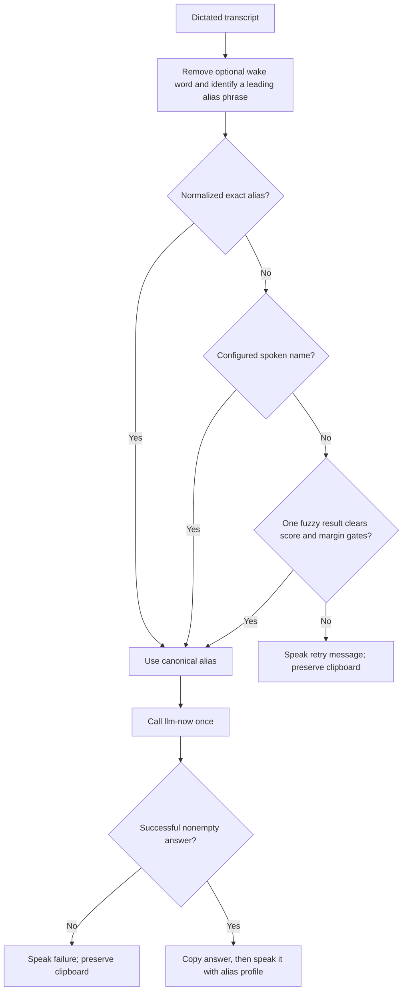
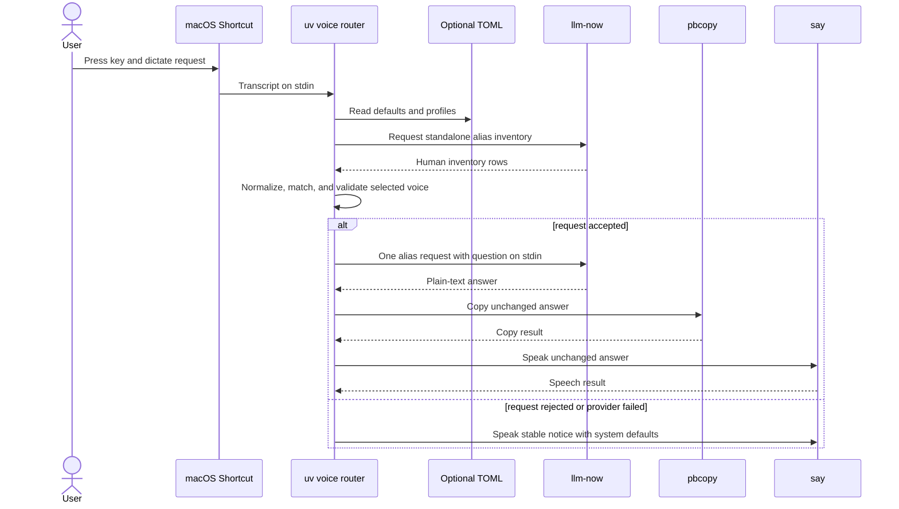
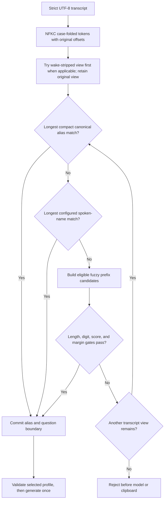

# macOS Voice Router for llm-now - Plan

> **Superseded behavior (2026-08-09):** The clipboard requirements in this
> historical plan no longer apply. The supported router does not invoke
> `pbcopy` or otherwise read or modify the clipboard; routing and speech
> requirements remain applicable.

## Goal Capsule

- **Objective:** Let a macOS user press a global keyboard shortcut, dictate an alias and question, and hear the selected `llm-now` model's answer without opening a browser or typing.
- **Product authority:** This Product Contract owns routing behavior, failure behavior, setup expectations, and the optional per-alias voice profile. Planning owns code structure and the final numeric matching thresholds, provided every acceptance example remains true.
- **Authority hierarchy:** The Product Contract and its session-settled decisions govern behavior. The Planning Contract governs implementation details. Repository instructions govern branch, release, CI, and Bun conventions.
- **Execution profile:** Standard plan, delivered as one coherent implementation phase after incorporating `main`; U1-U4 stay in one branch and pull request because the router, tests, and setup guide form one user-testable capability.
- **Stop conditions:** Do not change the version 1 alias store, add a JSON inventory mode, bundle Python into native archives, add a core voice command, or weaken fail-closed routing to make a fixture pass.
- **Tail ownership:** Automated tests own parsing, matching, orchestration, and CI compatibility. A human macOS check owns Dictation, Shortcuts permissions, audible voices, clipboard integration, and the three-minute setup target.
- **Open blockers:** None.

---

## Product Contract

### Summary

Add a small uv-managed voice router under `examples/` and a setup guide for a minimal macOS Shortcut.
The Shortcut dictates text and hands it to the router; the router discovers aliases, chooses only a confident match, calls `llm-now`, copies the answer, and speaks it with the selected alias's macOS voice.

### Problem Frame

Asking ChatGPT, Claude, Gemini, or a local model currently means opening the relevant browser or application and typing a question. That overhead is disproportionate for quick questions.

The earlier shell-only workflow also asked each model to produce a marked spoken summary and a separate full answer. Hosted models often followed that format, but a local Ollama model did not, turning model compliance into a reliability requirement for the voice interface.

### Actors

- A1. **macOS user:** Starts the Shortcut, dictates a request, listens to the answer, and optionally pastes it from the clipboard.
- A2. **macOS Shortcut:** Captures built-in Dictation and passes the transcript to the router.
- A3. **Voice router:** Discovers aliases, interprets the leading alias phrase, invokes `llm-now`, copies the result, and selects speech settings.
- A4. **`llm-now`:** Lists configured aliases and sends one prompt to the selected provider and model.
- A5. **macOS speech and clipboard:** Speak the answer and retain the same answer for later use.

### Key Decisions

- **Keep the Shortcut minimal.** (session-settled: user-directed — chosen over embedding parsing, clipboard, or speech logic in Shortcuts because setup and troubleshooting should stay small.) Governs R1 and R16.
- **Use a uv-managed Python router.** (session-settled: user-directed — chosen over a shell-only recipe and a macOS-specific `llm-now voice` command because matching and per-alias voices need a testable home without expanding the core CLI.) Governs R9-R17.
- **Match in fail-closed stages.** (session-settled: user-directed — chosen over exact-only routing and always selecting the nearest alias because common Dictation variants should work without sending a question to the wrong model.) Governs R3-R8.
- **Keep one flat profile section per alias.** (session-settled: user-directed — chosen over nested input/output sections because optional customization should require little typing.) Governs R7, R13, and R14.
- **Keep configured wake words optional.** (session-settled: user-directed — chosen over requiring a wake phrase because the keyboard shortcut already activates listening.) Governs R3.
- **Speak and copy one concise answer.** (session-settled: user-directed — chosen over model-generated channel markers because the same behavior must work with local and hosted models.) Governs R9-R12.
- **Discover aliases from the existing inventory.** (session-settled: user-directed — chosen over a duplicate alias list or a new JSON option because `llm-now --aliases` already exposes the needed roster.) Governs R2.
- **Use similarity as a gate, not a probability.** (session-settled: user-approved — chosen over presenting an uncalibrated probability because string similarity has no probabilistic meaning without labeled Dictation data.) Governs R5, R6, and R15.

### Requirements

**Shortcut and transcript contract**

- R1. The supported Shortcut must contain only built-in `Dictate Text` followed by `Run Shell Script`, with the dictated transcript passed to the router through stdin.
- R2. The router must discover the current canonical aliases by invoking standalone `llm-now --aliases`; each successful inventory row must remain a documented compatibility contract in the form `alias → Provider Label · model`, with one uncolored, unpadded row per alias and no header.
- R3. An optional top-level `wake_words` list must default to `["hey"]`; a configured wake word is stripped case-insensitively when present, but every alias request must also work without one.

**Alias matching and rejection**

- R4. Matching must first case-fold and remove spacing and punctuation so a dictated phrase can exactly match the canonical alias without fuzzy selection; when multiple exact or configured leading spans match, the longest span owns the question boundary.
- R5. If normalized exact matching fails, the router must try configured `spoken_names`, then a character-similarity fallback across discovered aliases, in that order.
- R6. Fuzzy matching must select an alias only when the best result satisfies a documented minimum similarity and beats the runner-up by a documented margin; the final thresholds must preserve every acceptance and rejection example in this contract.
- R7. An optional TOML profile must use one section per canonical alias and allow `spoken_names`, `voice`, and `rate` in that section; the canonical alias remains recognized when no section exists.
- R8. Missing questions, an empty or unavailable alias inventory, low-similarity inputs, and ambiguous results must not invoke a model or replace the clipboard; the router must speak a short retry message and keep technical diagnostics local.

**Model request and response**

- R9. An accepted request must make one non-interactive `llm-now` call to the matched canonical alias and ask for a concise plain-text answer suitable for speech.
- R10. A successful, nonempty model response must be copied before speech begins, and the clipboard and spoken channels must contain the same answer rather than separately generated variants.
- R11. The response must not depend on markers, JSON, Markdown conformance, or a second summarization request.
- R12. A failed or empty `llm-now` response must leave the clipboard unchanged, speak a brief stable failure message, and keep provider diagnostics out of speech and the clipboard.

**Per-alias speech**

- R13. Each discovered alias must use its configured macOS voice and optional rate when present, otherwise inheriting documented defaults.
- R14. Invalid profile fields and unavailable configured voices must fail before generation with actionable local diagnostics and must never cause a request to be routed to a different alias.

**Packaging, setup, and verification**

- R15. The router must be an isolated uv-managed Python example that uses RapidFuzz for similarity scoring; scores must be described as similarity rather than probability, and Jellyfish must not be required for the initial version.
- R16. A user who already has macOS Dictation enabled, `uv` installed, `llm-now` installed, and one working alias must be able to reach the first spoken answer in under three minutes by following the guide.
- R17. Automated tests must cover normalization, configurable phrases, unique fuzzy matches, runner-up ambiguity, poor matches, transcript parsing, inventory parsing, command construction, clipboard ordering, speech selection, and provider failure without contacting a real model.
- R18. The guide must include manual checks for the global shortcut, microphone access, configured and omitted wake words, the user's four requested match examples, rejection behavior, per-alias voices, clipboard contents, local and hosted providers, cancellation, privacy, and recovery from common configuration errors.

The optional profile governed by R3, R7, R13, and R14 stays flat and can be as small as:

```toml
wake_words = ["hey"]

[terra]
spoken_names = ["tara"]
voice = "Samantha"
rate = 205

[opus47]
spoken_names = ["op 47"]
```

### Matching Flow



### Key Flows

- F1. Successful normalized or configured match
  - **Trigger:** A1 dictates a leading alias phrase and question.
  - **Actors:** A1-A5
  - **Steps:** A3 discovers aliases, accepts a normalized exact alias or configured spoken name, and sends one request through A4. A3 copies the answer and asks A5 to speak it.
  - **Outcome:** The intended alias answers once, and the user hears the same text that is on the clipboard.
  - **Covered by:** R1-R5, R7, R9-R13
- F2. Successful unique fuzzy match
  - **Trigger:** Dictation produces a near spelling that has no exact or configured match.
  - **Actors:** A1-A5
  - **Steps:** A3 ranks discovered aliases, confirms that one candidate clears both matching gates, and continues through the normal one-request response path.
  - **Outcome:** A common transcription variant works without making nearest-alias selection the default.
  - **Covered by:** R5, R6, R9-R13
- F3. Rejected input
  - **Trigger:** The transcript has no question, names no usable alias, or produces a weak or ambiguous match.
  - **Actors:** A1-A3, A5
  - **Steps:** A3 stops before model invocation and clipboard replacement, then asks A5 to speak a retry message.
  - **Outcome:** No question is sent to an unintended model.
  - **Covered by:** R3, R6, R8
- F4. Provider or response failure
  - **Trigger:** A4 fails or returns an empty answer after an alias was accepted.
  - **Actors:** A3-A5
  - **Steps:** A3 preserves the existing clipboard, retains technical diagnostics locally, and asks A5 to speak a stable failure message.
  - **Outcome:** The user hears that the request failed without hearing credentials or provider diagnostics.
  - **Covered by:** R9 and R12

### Acceptance Examples

- AE1. **Covers R2-R5 and R9-R13.** Given the supplied alias inventory, when the user dictates “Deep seek 32, explain mixture of experts,” normalization maps the leading phrase to `deepseek32`, and only that alias receives the question.
- AE2. **Covers R2-R5 and R9-R13.** Given the supplied alias inventory, when the user dictates “haiku, write a love poem,” the exact alias `haiku` receives the question without fuzzy matching.
- AE3. **Covers R2-R6 and R9-R13.** Given the supplied alias inventory, when the user dictates “Tara, write a haiku about smoked brisket,” the unique fuzzy match selects `terra`; a diagnostic may report similarity and matching reason but must not call the score a probability.
- AE4. **Covers R2-R5, R7, and R9-R13.** Given `spoken_names = ["op 47"]` in the `opus47` section, when the user dictates “Op. 47, explain this chord,” the configured spoken name selects `opus47`.
- AE5. **Covers R6 and R8.** Given a transcript whose leading phrase is a poor match for every alias, the router speaks a retry message, does not invoke `llm-now`, and leaves a clipboard sentinel unchanged.
- AE6. **Covers R6 and R8.** Given two aliases whose top scores are inside the required runner-up margin, the router rejects the transcript rather than selecting the first or highest result.
- AE7. **Covers R7 and R13-R14.** Given `terra` and `fred` point to the same provider and model but configure different voices, each alias uses its own voice; an unavailable voice produces a configuration failure rather than silently switching aliases.
- AE8. **Covers R9-R12.** Given a local Ollama model that returns ordinary text without control markers, the router copies and speaks that text successfully; a hosted provider follows the same response path.
- AE9. **Covers R1, R15, R16, and R18.** Given the stated prerequisites, a new macOS user completes the documented Shortcut and reaches a first spoken answer within three minutes, then can add optional alias profiles without rebuilding the Shortcut.
- AE10. **Covers R3-R5.** Given `wake_words = ["hey", "computer"]`, “Hey Terra, answer this,” “Computer Terra, answer this,” and “Terra, answer this” all select `terra` and preserve the same question text.
- AE11. **Covers R5, R6, and R9-R13.** Given `qwen` is present and no competing alias falls within the runner-up margin, when Dictation produces “Kwen, explain perfect chords,” the fuzzy fallback selects `qwen`; if a competing alias makes the result ambiguous, the router rejects instead.

### Success Criteria

- The four requested inputs route as specified: `Deep seek 32` to `deepseek32`, `haiku` to `haiku`, `Tara` to `terra`, and configured `Op. 47` to `opus47`.
- Negative and ambiguous fixtures prove the router rejects uncertain input instead of always choosing the nearest alias.
- The same Shortcut works when aliases are added or removed through `llm-now`, without copying the alias roster into the router profile.
- Local Ollama, hosted API, and CLI-backed aliases use the same unmarked response path.
- Per-alias voice changes require editing only the optional profile, not the Shortcut.
- Adding or changing an optional wake word requires editing only the top-level profile setting, not any alias section or the Shortcut.
- The required short-name fuzzy fixtures route `Tara` to `terra` and `Kwen` to `qwen` without turning nearest-alias selection into a default.

### Scope Boundaries

- No changes to the version 1 `llm-now` alias-store schema; pronunciation and speech preferences remain example-specific configuration.
- No JSON alias-inventory option in this version; the documented human roster grammar is the compatibility surface used by the router.
- No trained probability model, automatic threshold learning, or claim that similarity is confidence probability.
- No Jellyfish dependency unless later Dictation fixtures demonstrate a failure RapidFuzz cannot address.
- No interactive “did you mean?” dialogue; uncertain matches ask the user to run the Shortcut again.
- No separate spoken-summary and full-answer channels, marker envelope, or second model request.
- No Siri trigger, background listening, menu-bar application, third-party speech service, or macOS-specific voice command in the core CLI.
- No exported Shortcut, Gist publication, or video deliverable; the local guide must remain concise enough to explain in those formats later.

### Dependencies and Assumptions

- The setup-time target assumes macOS Dictation is enabled and the user already has working `uv`, `llm-now`, and alias configuration.
- The router depends on the current case-insensitive canonical alias behavior and standalone `llm-now --aliases` inventory already present on `main`.
- The first uv run may need network access to resolve declared dependencies.
- macOS supplies Dictation, `/usr/bin/say`, and `/usr/bin/pbcopy`; the guide must help the user validate microphone permission and installed voice names.
- `llm-now` remains the authority for alias validity, provider/model selection, credentials, generation timeouts, and provider diagnostics.

### Planning Inputs Resolved Below

- KTD5 selects `RapidFuzz.fuzz.ratio`, a 65-point minimum similarity, a 15-point runner-up margin, and additional length and digit guards. The fixture corpus must prove AE1-AE6 and AE11 before these constants are accepted.
- KTD7 inherits the user's current macOS voice and rate when a profile omits them. Configured rates are integers from 80 through 500 words per minute, and configured voices are validated against the installed macOS inventory before generation.

### Sources and Research

- `README.md` — canonical alias behavior and the current `--aliases` output contract.
- `src/aliases.ts` — alias grammar, canonicalization, and case-insensitive resolution.
- `src/prompts.ts` — provider labels and deterministic human alias-inventory formatting.
- `src/app.ts` — standalone inventory behavior and non-interactive generation paths.
- `examples/macos-voice-shortcut.md` — the earlier shell-only workflow and its macOS setup lessons.
- [RapidFuzz scoring documentation](https://rapidfuzz.github.io/RapidFuzz/Usage/fuzz.html) — normalized 0-100 similarities and score cutoffs.
- [RapidFuzz process documentation](https://rapidfuzz.github.io/RapidFuzz/Usage/process.html) — ranked extraction, cutoffs, and returned similarity values.
- [Jellyfish function documentation](https://jamesturk.github.io/jellyfish/functions/) — phonetic algorithms primarily intended for English names.
- [uv script documentation](https://docs.astral.sh/uv/guides/scripts/) — isolated dependency management and executable scripts.
- [Apple Shortcuts for Mac](https://support.apple.com/guide/shortcuts-mac/intro-to-shortcuts-apdf22b0444c/mac) — Shortcuts and keyboard invocation on macOS.
- [Apple Dictation on Mac](https://support.apple.com/guide/mac-help/use-dictation-mh40584/mac) — built-in speech-to-text behavior and setup.
- `man say` — installed voice selection, speech rate, and stdin support on macOS.

---

## Planning Contract

### Key Technical Decisions

#### KTD1. Keep `llm-now` as the alias and provider authority

(session-settled: user-directed — chosen over changing the core CLI or adding JSON inventory: the router needs only canonical alias names.)

Incorporate current `main` before implementation so the branch has case-insensitive canonical aliases and standalone `--aliases`. The router calls the inventory once, accepts only uncolored rows in the documented `alias → Provider Label · model` grammar, and parses only the alias before the first exact arrow delimiter. Blank lines are ignored; a nonzero exit, invalid UTF-8, a malformed nonblank row, duplicate alias, or collision after routing normalization fails before matching. Successful stderr is retained as a local diagnostic but is never spoken or copied. Provider and model labels remain presentation data.

The generation boundary is one `llm-now --alias <canonical>` process with the question on stdin. No core source or native release archive changes are part of this feature.

#### KTD2. Package the router as a locked uv application

(session-settled: user-directed — chosen over a shell-only script or a macOS command in the core CLI: matching and speech orchestration need an isolated, testable home.)

Create a packaged application with a `src/` layout and the console command `llm-now-voice`. Declare Python 3.11 or newer so configuration uses standard-library `tomllib`; declare RapidFuzz 3.14-compatible releases and commit `uv.lock`. The Shortcut runs the console command through an absolute `uv` path, an absolute project path, `--locked`, and `--no-dev`, with an explicit PATH containing `llm-now`. This is independent of the Shortcut working directory and refuses stale dependency metadata.

Use standard-library `unittest` and mocks rather than adding a development test framework. Do not commit the generated `.venv` or Python caches.

#### KTD3. Treat the optional TOML file as a closed, flat profile

(session-settled: user-directed — chosen over nested input/output settings: each alias should require at most one small section.)

Read `$XDG_CONFIG_HOME/llm-now/voice-router.toml`, falling back to `~/.config/llm-now/voice-router.toml`. A missing file is valid and supplies `wake_words = ["hey"]` with no alias customizations; this preserves a zero-configuration exact-alias path. There is no second config override in the initial version.

The root accepts only `wake_words` plus tables named for canonical aliases. Each table accepts only `spoken_names`, `voice`, and `rate`. Reject malformed TOML, unknown fields, wrong types, blank normalized spoken names, duplicate active spoken names, or a configured spoken name that collides with another active canonical alias. Profiles for aliases no longer present in the inventory are inert rather than fatal, so removing an alias does not break the remaining roster.

The confirmed flat shape reserves the root name `wake_words`. A canonical alias with that literal name remains routable with defaults but cannot receive a profile in this version. Document the limitation; do not introduce nesting to work around it.

#### KTD4. Parse the transcript with token boundaries and compact comparison keys

(session-settled: user-directed — chosen over exact text matching or unbounded nearest-string routing: Dictation variants must work without losing the question boundary.)

Decode stdin as strict UTF-8 and tokenize a Unicode NFKC/case-folded view while retaining offsets into the original transcript. Punctuation becomes a token boundary; the compact comparison key removes those boundaries. This makes `Deep seek 32` equal `deepseek32` without changing the original question payload.

If the leading tokens equal one or more configured wake phrases, evaluate the longest wake-stripped interpretation first and the original interpretation second. This lets `Hey Terra …` prefer `terra` while preserving access to a literal `hey` alias when stripping does not produce a valid route. For each interpretation:

1. Match compact canonical aliases and select the longest matching leading span.
2. If none match, match configured spoken names and select the longest matching leading span.
3. If neither stage matches, enter KTD5's fuzzy gate.

Remove only the winning leading span and its adjacent delimiter whitespace or punctuation. Preserve the remaining question text verbatim and require it to contain a non-whitespace character.

#### KTD5. Use a fixed, conservative RapidFuzz gate

(session-settled: user-approved — chosen over a probability claim or always accepting the nearest alias: string similarity is useful only as a bounded rejection gate.)

Use `RapidFuzz.fuzz.ratio` with `processor=None` on the router's compact comparison keys. Do not use partial, token-weighted, phonetic, or Jaro-Winkler scoring in the first version.

Fuzzy candidates must satisfy all of these rules:

- Candidate and canonical alias keys contain at least four characters.
- Candidate length differs from alias length by no more than the larger of one character or 20 percent of the alias length, rounded up.
- If either side contains digits, their digit sequences are identical.
- The winning alias scores at least 65 on the 0-100 similarity scale.
- When at least two aliases are eligible, the winner beats the next-best alias by at least 15 points; ties and a missing margin reject. A roster with one eligible alias has no runner-up requirement.

Score every eligible leading span that leaves a nonempty question, retain the best span per alias, and prefer the shortest span only when one alias has an exact score tie between its own spans. The fixture corpus is the authority for these constants: `tara`/`terra` and `kwen`/`qwen` must pass, while near-neighbor, digit-version, weak, and equal-score fixtures must fail. The constants are intentionally not user-configurable until real Dictation evidence justifies a larger surface.

#### KTD6. Isolate subprocesses and preserve diagnostic boundaries

Use argument arrays with shell execution disabled, strict UTF-8, captured stderr, and explicit timeouts. Give alias and voice inventory five seconds, generation fifty seconds so the core CLI's current 45-second provider timeout remains primary, clipboard operations five seconds, and speech at most 120 seconds. Run every child in an isolated process group. Timeout or Shortcut cancellation must terminate, force-kill if necessary, and reap the active group before exit; check cancellation again before starting each downstream process.

The generated prompt contains a fixed request for a concise plain-text answer followed by the user's unmodified question. It must not request markers, JSON, a separate spoken summary, or a second model call. Treat whitespace-only stdout as failure. Before any clipboard or speech effect, also reject C0/C1 control characters other than tab/newline/carriage return, terminal escapes, and the macOS speech-command opener `[[`; the stable failure notice replaces the unsafe payload and the raw output stays out of diagnostics. Otherwise pass the same decoded stdout payload, including its original line endings, to both downstream channels.

#### KTD7. Validate the selected speech profile before generation and commit output copy-first

(session-settled: user-directed — chosen over model-authored speech markers and separate channel payloads: local and hosted models must use the same deterministic response path.)

Omit voice and rate flags when a profile does not provide them, inheriting the user's current macOS defaults. Validate configured rates as integers from 80 through 500. For the selected alias only, resolve a configured voice case-insensitively against `/usr/bin/say`'s installed voice inventory before generation; pass the installed canonical name to speech. Structural TOML errors still fail globally.

After successful generation, send the unchanged answer to `/usr/bin/pbcopy`. Only after copy succeeds, send the same payload to `/usr/bin/say` through stdin with the selected optional voice and rate. If copy fails, do not speak the answer. If speech fails after copy, retain the copied answer, emit a local diagnostic, and return failure; there is no unsafe attempt to restore the previous clipboard.

Stable retry, provider-failure, and configuration notices use the system speech defaults and never include provider stderr, paths, credentials, or similarity diagnostics.

#### KTD8. Make every terminal outcome explicit

| Outcome | Model invoked | Clipboard | Speech | Process result |
|---|---:|---|---|---|
| Accepted request and answer | Once | Replaced with answer | Same answer | Success |
| Missing question, weak match, or ambiguity | No | Unchanged | Short retry notice | Handled success when notice succeeds |
| Empty, malformed, or unavailable inventory | No | Unchanged | Short retry notice | Handled success when notice succeeds; diagnostic on stderr |
| Invalid profile or unavailable selected voice | No | Unchanged | Short configuration notice | Failure with actionable stderr |
| Provider timeout, nonzero exit, empty answer, or unsafe speech controls | Once | Unchanged | Stable request-failed notice | Handled success when notice succeeds; diagnostic on stderr |
| Clipboard failure | Once | Not restored; may be partially changed by macOS | Copy-failed notice only | Failure |
| Speech failure after copy | Once | Answer remains copied | May be partial or absent | Failure |
| Shortcut cancellation | At most once; every active child group reaped | Unchanged unless copy has begun; may be partially or fully changed by macOS and is not restored | Active speech is stopped; no new notice | Cancellation result |

Expected user and provider failures are handled after a stable spoken notice so Shortcuts does not add an opaque error dialog. Setup, configuration, and side-effect failures return nonzero because the user must inspect the action result.

#### KTD9. Add Python verification without changing the Bun release boundary

Keep `bun run check` authoritative for the TypeScript CLI and add the locked Python suite as a separate source-job step. CI installs Python 3.11 and uv with actions pinned to full commit SHAs, then runs tests using fake process, clipboard, and speech adapters. The native build matrix and archive contents remain unchanged because the example is not bundled.

Tests must assert exact alias inventory parsing, matching reason and boundary, command arguments, process counts, side-effect order, preserved payloads, stderr isolation, exit classes, and timeout/cancellation cleanup. No automated test may contact a provider or invoke the real macOS clipboard or speech tools.

#### KTD10. Replace the experimental guide with the supported two-action workflow

Rewrite the existing macOS guide around `Dictate Text` followed by one shell action. Preserve its useful Shortcuts troubleshooting, privacy, and data-via-stdin guidance, while removing the old case-sensitive alias rule, marker envelope, and third `Speak Text` action.

The guide starts with a Text-action smoke test, provides the single launcher command with resolved paths, then switches Text to Dictate Text and assigns a keyboard shortcut. It includes the optional profile only after the zero-config path works. Add a minor Changeset because this is a new executable user capability, even though native archives remain unchanged.

### High-Level Technical Design

The sequence diagram defines the process and side-effect boundary; prose and KTDs remain authoritative when implementation details evolve.



The matching diagram defines stage precedence and the point at which a question boundary becomes committed.



### Output Structure

```text
examples/
├── README.md
├── macos-voice-shortcut.md
└── macos-voice-router/
    ├── .python-version
    ├── pyproject.toml
    ├── uv.lock
    ├── src/
    │   └── llm_now_voice/
    │       ├── __init__.py
    │       └── cli.py
    └── tests/
        └── test_cli.py
```

### Implementation Constraints

- Keep the example self-contained; it may import only its own package, the Python standard library, and RapidFuzz.
- Keep subprocess, clipboard, and speech effects behind thin injectable boundaries so Linux tests remain deterministic.
- Do not parse provider or model names from inventory rows beyond validating the documented row grammar.
- Do not read credentials or duplicate `llm-now` provider configuration.
- Do not add fuzzy behavior to the core alias resolver; core aliases remain exact and case-insensitive.
- Do not make thresholds, timeouts, executable paths, or error wording into a broad configuration system in this version.

### Sequencing

1. Incorporate current `main` so the branch starts from the shipped alias inventory and case-insensitive resolver contracts.
2. Complete U1 before U2 because subprocess orchestration depends on deterministic parsing and matching results.
3. Complete U2 before U3 so CI runs the full behavior suite rather than scaffolding-only checks.
4. Complete U4 after behavior stabilizes so the guide and manual scenarios describe the actual interface.

---

## Implementation Units

### U1. Build the deterministic config, inventory, and transcript router

**Goal:** Produce a pure routing decision from a transcript, optional profile, and current alias inventory without invoking a model or macOS side effects.

**Requirements:** R2-R8, R13-R15, R17; F1-F3; AE1-AE7, AE10, and AE11; KTD1, KTD3-KTD5.

**Dependencies:** Current `main` incorporated.

**Files:**

- Create `examples/macos-voice-router/pyproject.toml`
- Create `examples/macos-voice-router/.python-version`
- Create `examples/macos-voice-router/uv.lock`
- Create `examples/macos-voice-router/src/llm_now_voice/__init__.py`
- Create `examples/macos-voice-router/src/llm_now_voice/cli.py`
- Create `examples/macos-voice-router/tests/test_cli.py`
- Modify `.gitignore`

**Approach:**

1. Establish the locked packaged application and console entry point from KTD2.
2. Separate parsing and validation into pure values for config, inventory rows, normalized transcript views, match candidates, and the final alias/question decision.
3. Implement exact canonical, configured spoken-name, and fuzzy stages in the fixed order from KTD4-KTD5.
4. Return structured internal outcomes that identify the canonical alias, original question, match reason, and similarity diagnostics without exposing provider/model presentation data.

**Patterns to follow:** Mirror `src/aliases.ts` fail-closed validation and canonical lowercase behavior; mirror the deterministic output expectations in `tests/args.test.ts`, `tests/prompts.test.ts`, and `tests/app.test.ts`.

**Test scenarios:**

- Covers AE1. `Deep seek 32, explain mixture of experts` compact-matches `deepseek32`, leaves the exact question text, and never enters fuzzy scoring.
- Covers AE2. `haiku, write a love poem` exact-matches `haiku` and commits the longest valid boundary.
- Covers AE3. `Tara, write a haiku about smoked brisket` uniquely fuzzy-matches `terra` at or above 65 and clears the 15-point margin.
- Covers AE4. Configured `op 47` matches `Op. 47, explain this chord` after canonical matching fails.
- Covers AE5 / AE6. Weak, tied, and inside-margin candidates return rejection without an alias decision.
- Covers AE10. Configured wake phrases work with case and punctuation variants, while the same alias request works without a wake phrase.
- Covers AE11. `Kwen` uniquely selects `qwen`; a competing near-neighbor forces rejection.
- A canonical `wake_words` alias routes with defaults, while TOML cannot define both the reserved list and a same-name profile.
- Exact-normalization collisions such as punctuation-distinct aliases fail inventory validation rather than selecting by row order.
- Digit mismatches, candidates shorter than four characters, and candidates outside the length window never enter the score gate.
- Missing config uses `hey` and default profiles; malformed TOML, unknown fields, invalid types, blank spoken names, and active spoken-name collisions fail with actionable diagnostics.
- A stale profile for an absent alias is inert, while an invalid field in any parsed profile remains a configuration error.
- Empty stdin, wake-only input, alias-only input, and punctuation-only questions reject with no alias decision.

**Verification:** The pure suite proves every accepted fixture returns the canonical lowercase alias and exact original question, and every rejected fixture returns no executable request.

### U2. Add provider, clipboard, and speech orchestration

**Goal:** Turn an accepted route into exactly one `llm-now` request followed by the copy-before-speak macOS response path.

**Requirements:** R1, R8-R14, R17; F1-F4; AE7-AE8; KTD1-KTD2 and KTD6-KTD8.

**Dependencies:** U1.

**Files:**

- Modify `examples/macos-voice-router/src/llm_now_voice/cli.py`
- Modify `examples/macos-voice-router/tests/test_cli.py`

**Approach:**

1. Add thin process, clipboard, and speech adapters with injected test doubles and no shell execution.
2. Discover inventory once, resolve the route through U1, and validate only the selected voice against the installed inventory before generation.
3. Run one generation process with the concise-answer instruction and question on stdin; keep stdout, stderr, and exit status separate.
4. Apply KTD8's outcome table, including child-group cleanup on timeout/cancellation and the irreversible copy-before-speech partial state.

**Execution note:** Implement orchestration from failing process-count and side-effect-order tests so the single-request and clipboard guarantees remain observable.

**Patterns to follow:** Follow `src/app.ts`'s non-interactive stdin/stdout boundary and provider-diagnostic separation; follow existing Bun tests' injected dependency and exact outcome style.

**Test scenarios:**

- An accepted request calls inventory once and generation once with the canonical alias; only the user question reaches generation stdin after the fixed concise-answer instruction.
- Covers AE7. Two aliases that share a provider/model select independent voice/rate arguments; a missing selected voice fails before generation.
- Covers AE8. Ordinary unmarked multiline Ollama output and hosted-provider output use the identical clipboard/speech path.
- Successful stdout is copied first and the exact same payload is then spoken, including internal newlines and a trailing newline.
- Nonzero generation, timeout, invalid UTF-8, whitespace-only stdout, control bytes, terminal escapes, and `[[` speech directives preserve the clipboard and speak only the stable failure notice.
- Rejected input and malformed inventory start no generation or clipboard operation and speak only a retry notice.
- Clipboard failure prevents answer speech and returns failure; speech failure after copy leaves the answer on the clipboard and returns failure.
- Cancellation before copy, during copy, and during speech terminates and reaps the active group; no downstream effect starts after cancellation, and an already completed copy remains.
- Provider stderr and diagnostics are emitted only to local stderr and never appear in clipboard or speech payloads.
- Missing `llm-now`, `pbcopy`, or `say` produces the KTD8 setup-failure outcome without a provider call.

**Verification:** Tests prove process counts, argument construction, timeouts, payload identity, side-effect order, and each terminal outcome without real providers or macOS commands.

### U3. Enforce the Python example in source CI

**Goal:** Make router regressions fail CI while preserving the Bun and native release boundaries.

**Requirements:** R15, R17; AE9; KTD2 and KTD9.

**Dependencies:** U1 and U2.

**Files:**

- Modify `.github/workflows/ci.yml`
- Modify `tests/release-policy.test.ts`

**Approach:**

1. Add pinned Python and uv setup to the source job only.
2. Run the committed lockfile and standard-library test suite without real services.
3. Extend release-policy coverage to require full-SHA pinning and the router test step while leaving native archive validation unchanged.

**Test scenarios:**

- The release-policy test accepts the new fully pinned actions and rejects tag-based or partial-SHA variants.
- The source job runs both `bun run check` and the locked router suite.
- Native matrix jobs continue building the existing single-file executable without Python or example assets.

**Verification:** A CI-shape test proves the new source check is required, and the complete local Bun and Python suites pass independently.

### U4. Publish the two-action setup and manual verification guide

**Goal:** Let a prepared macOS user reach a first spoken answer in under three minutes and diagnose the real Shortcut environment.

**Requirements:** R1-R3, R7-R16, R18; AE1-AE11; KTD2-KTD3, KTD7-KTD8, and KTD10.

**Dependencies:** U1-U3.

**Files:**

- Modify `examples/macos-voice-shortcut.md`
- Modify `examples/README.md`
- Modify `README.md`
- Modify `docs/manual-testing.md`
- Create `.changeset/*.md` through the repository's Changesets workflow

**Approach:**

1. Replace the shell/marker workflow with the packaged router and a two-action Shortcut.
2. Put the zero-config Text-action smoke test before Dictation, then add microphone/Dictation permissions and the keyboard shortcut.
3. Show how to resolve absolute `uv`, project, and `llm-now` paths without placing credentials in the Shortcut.
4. Add the optional flat profile, installed-voice discovery, failure expectations, privacy boundaries, and recovery steps after the first success path.
5. Record the new user-facing capability in a minor Changeset.

**Test scenarios:**

- Covers AE9. A timed clean walkthrough with the stated prerequisites reaches a spoken exact-alias answer in under three minutes.
- The Text-action smoke test distinguishes router/path problems from Dictation or microphone problems before the Shortcut is made global.
- Covers AE1-AE4 and AE11. The documented exact, compact, configured, and fuzzy phrases route to the intended aliases.
- Covers AE5 / AE6. Poor and ambiguous phrases speak a retry message and preserve a clipboard sentinel.
- Covers AE7. Two aliases use observably different configured voices/rates, and an unavailable voice fails before generation.
- Covers AE8. One local Ollama alias and one hosted or CLI-backed alias both copy and speak unmarked text.
- Covers AE10. Configured, omitted, and differently capitalized wake words produce the same alias/question boundary.
- Cancelling during generation prevents a later clipboard or speech effect; provider, clipboard, speech, stale profile, and PATH failures match KTD8.
- The guide states what Dictation sends to the model, where config lives, what remains on the clipboard, and that macOS/provider privacy policies still apply.

**Verification:** A reviewer can follow the guide from a fresh Shortcut without adding actions, infer no hidden shell state, and reproduce every manual scenario with stable expected outcomes.

---

## Verification Contract

### Automated Gates

- `uv run --project examples/macos-voice-router --locked python -m unittest discover -s examples/macos-voice-router/tests` passes without network access after dependencies are synced and without invoking real `llm-now`, `pbcopy`, or `say`.
- `bun run check` passes, including CLI, alias inventory, type checking, and runtime compile smoke coverage.
- `bun run changeset:status` recognizes the new minor Changeset.
- `git diff --check` reports no whitespace errors.
- The source CI job contains full-SHA-pinned Python/uv actions and requires both Bun and router suites.
- `bun run release:validate` is not required for this change because native archive inputs and release packaging remain unchanged; run it only if implementation expands beyond this plan and touches release artifacts.

### Fixture Matrix

| Category | Required proof |
|---|---|
| Canonical normalization | Case, spaces, punctuation, Unicode compatibility forms, and longest leading span |
| Wake handling | Default `hey`, configured multiword phrases, no wake word, wake phrase also present as an alias |
| Configured spoken names | `op 47`, duplicate/colliding spoken names, stale profiles, invalid types and fields |
| Fuzzy acceptance | `tara` → `terra`, `kwen` → `qwen`, one eligible alias, fixed reason and score diagnostics |
| Fuzzy rejection | Below 65, margin below 15, equal scores, digit mismatch, short and length-window exclusions |
| Inventory | Empty output, malformed rows, duplicates, normalization collisions, nonzero exit, successful stderr |
| Provider | Success, nonzero exit, timeout, cancellation, invalid UTF-8, whitespace-only stdout, control bytes and speech directives |
| Side effects | Exact payload equality, copy-before-speak order, copy failure, speech failure after copy |
| Speech profiles | System defaults, case-insensitive installed voice, unavailable voice, rate bounds |

### Manual macOS Gates

1. Run the Text-action smoke check in Shortcuts and verify one exact alias copies and speaks a response.
2. Replace Text with Dictate Text, grant microphone access when prompted, and repeat from the editor.
3. Assign the global keyboard shortcut and invoke it while another application is focused.
4. Verify `Deep seek 32`, `haiku`, `Tara`, configured `Op. 47`, and `Kwen` route as documented.
5. Verify configured and omitted wake words, a poor match, an ambiguous match, and an alias-only request.
6. Verify distinct voices/rates, an unavailable voice, answer equality with the clipboard, and copy/speech failure recovery.
7. Verify one local Ollama alias and one hosted or CLI-backed alias through the same Shortcut.
8. Cancel during a slow request and confirm no delayed speech or clipboard replacement occurs.
9. Time a prerequisites-ready setup from opening the guide to the first spoken answer; the result must stay under three minutes.

---

## Definition of Done

### Global

- Every Product Contract requirement and acceptance example is implemented, verified, or explicitly preserved as a manual macOS gate.
- The branch includes current `main` and does not regress case-insensitive aliases or standalone inventory output.
- Exact, configured, and fuzzy matching remain deterministic and fail closed under the fixture matrix.
- One successful request produces one model call, one clipboard payload, and one identical speech payload.
- The Shortcut contains exactly Dictate Text and Run Shell Script after setup.
- Bun checks, locked Python tests, Changeset status, and source CI policy pass.
- The guide's timed macOS walkthrough meets the three-minute target under the stated prerequisites.
- No provider credentials, model diagnostics, or technical errors enter speech or the clipboard.
- Provider output cannot inject terminal or macOS speech-control directives into downstream processes.
- Abandoned experiments, obsolete marker parsing, unused dependencies, generated environments, and dead test scaffolding are absent from the final diff.

### Per Unit

- **U1:** Every route is a pure deterministic decision with complete positive, boundary, and rejection coverage.
- **U2:** Every process and side-effect outcome matches KTD8, including cancellation and partial completion.
- **U3:** CI requires the router suite without changing native archives or weakening action pinning.
- **U4:** The supported guide has two Shortcut actions, a zero-config first path, optional profiles, manual expectations, and a minor Changeset.

---

## System-Wide Impact

- **CLI compatibility:** The example turns the current human alias-inventory grammar into a documented consumer boundary. Future changes to the arrow, provider/model separator, header policy, color, or padding must update the router and its contract tests together.
- **Configuration lifecycle:** The router profile is separate from the version 1 alias store. Removing an alias leaves an inert optional table rather than corrupting core configuration.
- **Release and CI:** Source CI gains Python and uv, but Bun remains authoritative for the shipped CLI and native archives remain TypeScript-only.
- **Privacy:** Dictation is handled by macOS; accepted questions and generated answers still cross whichever local or hosted provider the selected alias uses. The profile contains presentation preferences, not credentials.
- **macOS state:** Clipboard replacement is intentionally durable before speech. Speech failure cannot safely undo that state, so the guide and tests treat it as an explicit partial success.
- **Process lifecycle:** Inventory, generation, clipboard, and speech are all cancellable child processes. The router owns cleanup and may not start a later stage once cancellation is observed.

---

## Risks and Dependencies

| Risk | Mitigation |
|---|---|
| Human inventory grammar changes | Parse only the documented alias token, keep exact contract tests, and avoid provider/model semantics |
| Low fuzzy threshold needed for `tara`/`terra` | Add length, digit, and runner-up gates; require corpus fixtures; keep thresholds fixed and fail closed |
| Dictation changes punctuation or token spacing | Use Unicode token boundaries plus compact keys while retaining original question offsets |
| Shortcuts lacks interactive-shell PATH | Use resolved absolute `uv` and project paths plus an explicit minimal PATH in the one shell action |
| First uv execution delays the first request | Commit the lockfile, prefer wheels, and make the Text-action smoke test prewarm the environment |
| Linux cannot exercise macOS services | Inject all effects in automated tests and retain explicit real-macOS manual gates |
| Model output contains `say` control syntax or terminal escapes | Reject unsafe control payloads before copy or speech and keep raw output out of diagnostics |
| Cancellation leaves a provider, clipboard, or speech child alive | Apply the same bounded process-group lifecycle to every child and gate every stage transition |
| Copy succeeds but speech fails | Preserve the answer, return a visible failure, and document the irreversible order |

External dependencies are Python 3.11+, uv, RapidFuzz 3.x, macOS Dictation, `/usr/bin/pbcopy`, `/usr/bin/say`, and an installed `llm-now` that includes the current mainline alias features.

---

## Documentation and Operational Notes

- Keep the guide short enough to translate directly into a GitHub Gist or short demonstration video later, but do not create either deliverable in this scope.
- Put the working Text-action check before microphone troubleshooting; this separates shell/PATH failures from Dictation failures.
- Explain that “similarity” is a deterministic string score, not confidence or probability.
- List installed voices using the macOS command documented by `say`; do not hardcode Samantha or another default voice.
- Show technical diagnostics only in the Shortcut action result or Terminal smoke test. Spoken messages stay brief and stable.
- Update examples and manual-testing indexes in the same change so the old marker-based workflow is not discoverable as supported guidance.

### Additional Research

- [uv project structure and applications](https://docs.astral.sh/uv/concepts/projects/init/) — packaged application layout and build-system behavior.
- [uv locking and syncing](https://docs.astral.sh/uv/concepts/projects/sync/) — committed locks and `--locked` versus `--frozen` behavior.
- [Python 3.11 `tomllib`](https://docs.python.org/3.11/library/tomllib.html) — standard-library TOML parsing and binary file input.
- [Python subprocess management](https://docs.python.org/3.11/library/subprocess.html) — argument sequences, timeouts, and captured streams.
- [RapidFuzz process API](https://rapidfuzz.github.io/RapidFuzz/Usage/process.html) — ranked winner/runner-up extraction.
- [RapidFuzz ratio API](https://rapidfuzz.github.io/RapidFuzz/Usage/fuzz.html) — normalized 0-100 Indel similarity.
- [Apple Shortcuts scripting settings](https://support.apple.com/en-gb/guide/shortcuts-mac/apdfeb05586f/mac) — allowing script execution.
- [Apple Dictation guide](https://support.apple.com/guide/mac-help/use-dictation-mh40584/mac) — built-in Dictation behavior and permissions.
