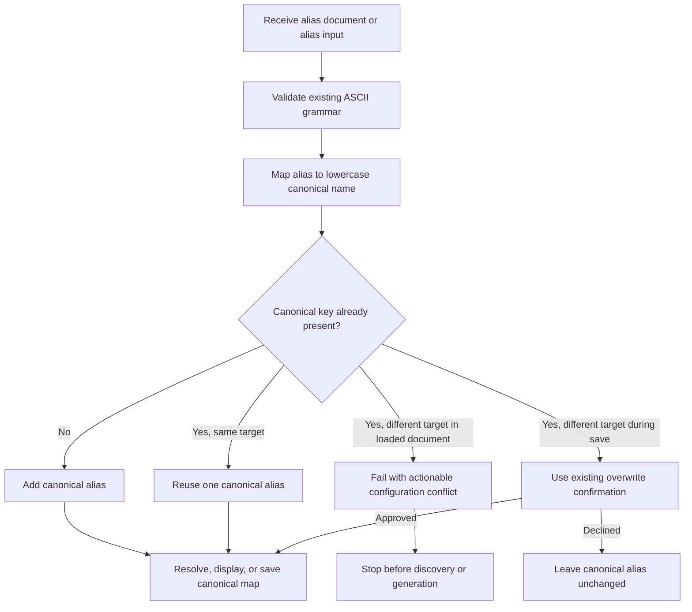

# Case-Insensitive Aliases - Plan

## Goal Capsule

- **Objective:** Make every `llm-now` alias producer and consumer use one ASCII case-insensitive namespace while preserving deterministic routing and existing overwrite protections.
- **Authority:** The Product Contract owns observable alias behavior. The Planning Contract owns canonicalization and compatibility mechanics. Repository instructions and tests remain binding where this plan is silent.
- **Execution profile:** One implementation phase covering the alias store, application surfaces, compiled runtime proof, documentation, and release intent.
- **Stop conditions:** Stop if compatibility requires silently choosing between different provider/model targets, if explicit provider/model calls begin depending on alias-store health, or if implementation would require fuzzy alias matching.
- **Tail ownership:** The implementing workflow verifies, reviews, and ships the focused change through the repository's branch and pull-request process.

---

## Product Contract

### Summary

`llm-now` will treat ASCII case as insignificant for saved aliases across terminal use, scripts, agents, and macOS Shortcuts.
The namespace remains exact in every other respect: `fred` and `Fred` are one alias, while `fred` and `fredd` are different aliases.

### Problem Frame

The current alias store accepts uppercase letters and resolves object keys exactly, so callers must reproduce saved capitalization byte-for-byte.
Speech recognition commonly capitalizes names, which forced the macOS Shortcut user to save duplicate aliases such as `fred` and `Fred` for one target.
A Shortcut-only lowercase conversion would leave terminal calls, scripts, agents, interactive setup, and future integrations with different behavior.

### Requirements

**Canonical namespace**

- R1. Every valid alias producer and consumer must compare aliases using ASCII case-insensitive semantics without adding phonetic, proximity, or typo matching.
- R2. New and updated aliases must persist and display under their lowercase canonical name.
- R3. Loading a legacy document with case-only variants for the same provider/model target must expose one lowercase alias without rewriting the file during the read.
- R4. Loading a legacy document with case-only variants for different targets must fail before discovery or generation. The diagnostic must identify the canonical alias, both original spellings and provider/model targets, the alias-store path, and the manual edit needed to retain one target.
- R5. Saving a case variant of an existing alias must use the existing already-saved, collision, confirmation, and concurrency behavior for that one canonical alias.

**Caller parity and compatibility**

- R6. Positional aliases, `--alias`, interactive alias selection, provider setup, post-generation saves, and compiled binaries must share the same canonical namespace.
- R7. Explicit provider/model calls that do not consult aliases must remain independent of alias-store validity.
- R8. The macOS voice adapter must pass the transcribed alias unchanged and rely on `llm-now` for case normalization.
- R9. User-facing documentation, manual verification, the prior voice-guide plan, and release intent must describe the new contract without suggesting case-only duplicate aliases.

### Key Decisions

- **Core-owned case normalization.** (session-settled: user-approved — chosen over lowercasing only in the macOS Shortcut: every caller should receive the same routing behavior.) Governs R1, R6, and R8.
- **One canonical alias per spelling.** (session-settled: user-approved — chosen over preserving `fred` and `Fred` as distinct aliases: Dictation capitalization must not change the selected target.) Governs R2 and R5.
- **Fail closed on conflicting legacy targets.** (session-settled: user-approved — chosen over selecting an exact-case or first-seen target: ambiguous configuration must never route a request silently.) Governs R3 and R4.

### Acceptance Examples

- AE1. **Covers R1, R2, and R6.** Given one saved alias `fred`, when callers use `fred`, `Fred`, or `FRED` through either positional or `--alias` syntax, every call reaches the same target and the store contains only the lowercase key.
- AE2. **Covers R3 and R6.** Given a legacy document containing `fred` and `Fred` with identical records, when aliases are loaded for resolution or an interactive picker, one lowercase alias is available and the read does not rewrite the file.
- AE3. **Covers R4 and R7.** Given a legacy document containing `fred` and `Fred` with different records, when an alias-dependent call runs, it exits with a configuration diagnostic and makes no discovery or generation call, while an explicit provider/model call remains usable.
- AE4. **Covers R5.** Given canonical alias `fred`, when setup attempts to save `Fred` for the same target it reports already saved, and when it attempts a different target it follows the normal overwrite confirmation without creating a second key.
- AE5. **Covers R8 and R9.** Given Dictation returns `Fred`, when the macOS Shortcut invokes `llm-now`, the unmodified name resolves to `fred` and no case-only duplicate is required.

### Scope Boundaries

- Alias grammar remains 1-64 ASCII letters, numbers, hyphens, or underscores.
- Misspellings remain errors; `fred` does not match `fredd` or a nearby alias.
- New alias-enumeration interfaces, alias-management commands, pronunciation dictionaries, and fuzzy matching are outside this change. The existing interactive picker remains in scope and displays the canonicalized alias map.
- Provider/model discovery, credential storage, generation output, and prompt-input contracts do not change.

---

## Planning Contract

### Key Technical Decisions

- KTD1. **Canonicalize at the alias-store boundary.** (session-settled: user-approved — chosen over adapter-specific normalization: persistence, lookup, and every loaded alias map need one shared contract.) Validate the existing ASCII grammar, then use the lowercase canonical name for store keys, resolution, and save collision checks. Governs R1-R6.
- KTD2. **Canonicalize the complete loaded map.** `loadAliases` must return a deterministic lowercase map so pickers, duplicate-target detection, setup, and direct resolution cannot diverge. Equal records may collapse; unequal records produce a dedicated store error. Governs R3, R4, and R6.
- KTD3. **Preserve argument parsing as transport.** Positional and long-form syntax continue passing the caller's alias to the resolver; canonicalization occurs when the alias store validates and resolves it. This keeps argument parsing independent of persistence policy. Governs R6.
- KTD4. **Reuse locked save semantics.** A successful save rewrites the already-loaded canonical document while holding the existing lock, so concurrent writers cannot restore mixed-case keys. Existing expected-current and overwrite-confirmation behavior applies to the canonical key. Governs R2, R3, and R5.
- KTD5. **Keep alias document version 1.** The stored provider/model record shape is unchanged, and the loader remains backward compatible with mixed-case version-1 keys. The next successful save performs canonical persistence. Governs R2-R5.

### High-Level Technical Design

### Assumptions

- Read operations normalize legacy aliases in memory but do not write user configuration; the next successful locked save persists the canonical map.
- A user-visible changeset will classify the documented case-sensitive-to-case-insensitive transition according to the repository's release policy.
- Existing test injection seams may observe the original argument casing before the real store resolver runs; behavioral parity is proven with store-backed and compiled-runtime tests.

### Sequencing

Implement and prove canonical store behavior first.
Then align application messaging and compiled runtime behavior.
Update documentation and release intent only after the executable contract is verified.

---

## Implementation Units

### U1. Canonical alias-store behavior

- **Goal:** Make loaded, resolved, and saved aliases use one lowercase namespace with deterministic legacy compatibility.
- **Requirements:** R1-R5; AE1-AE4; KTD1, KTD2, KTD4, and KTD5.
- **Dependencies:** None.
- **Files:** `src/aliases.ts`, `tests/aliases.test.ts`
- **Approach:**
  1. Add one alias-name canonicalization path after existing grammar validation.
  2. Build the loaded alias map by canonical key and compare records before collapsing case-only variants.
  3. Route resolution and locked save collision checks through the canonical key.
  4. Preserve prototype-key protections, file permissions, atomic rename, and concurrent-save behavior.
- **Execution note:** Add failing alias-store tests for case variants and conflicting legacy documents before changing the implementation.
- **Patterns to follow:** Existing schema validation, `Object.hasOwn` checks, `sameAliasRecord`, lock acquisition, expected-current reconfirmation, and atomic temporary-file rename in `src/aliases.ts`.
- **Test scenarios:**
  - Covers AE1. Save `Fred`, verify the persisted key is `fred`, and resolve the record through `fred`, `Fred`, and `FRED`.
  - Covers AE2. Load legacy `fred` and `Fred` entries with identical records, verify one lowercase in-memory key, and verify the source file bytes are unchanged after the read.
  - Covers AE3. Load case-only variants with different records in both JSON orders and verify a deterministic conflict diagnostic identifies the canonical alias, both original spellings and targets, the store path, and a manual repair instruction without choosing either target.
  - Covers AE4. Save a same-target case variant and verify `already-saved`; save a different-target variant and verify collision, decline, and approved-overwrite paths operate on one lowercase key.
  - Run concurrent same-target saves using different casing and verify the final document has one canonical key.
  - Save and resolve prototype-like aliases such as `toString` and `constructor` through case variants without inherited-property access.
  - Reject invalid alias grammar before canonicalization and preserve the existing error category.
- **Verification:** Alias-store tests prove canonical persistence, deterministic collapse, fail-closed conflicts, overwrite behavior, concurrency, permissions, and prototype safety.

### U2. Application and compiled-runtime parity

- **Goal:** Make every CLI-facing alias workflow present and exercise the canonical namespace without changing unrelated selection paths.
- **Requirements:** R4-R7; AE1, AE3, and AE4; KTD2-KTD4.
- **Dependencies:** U1.
- **Files:** `src/app.ts`, `tests/app.test.ts`, `tests/runtime-compile-smoke.ts`
- **Approach:**
  1. Use canonical names for interactive preflight lookups, overwrite prompts, save diagnostics, and suggested commands.
  2. Keep positional and `--alias` application plumbing identical while the real resolver owns normalization.
  3. Extend compiled smoke coverage so save casing and invocation casing differ.
  4. Preserve the no-alias-store path for explicit provider/model selection.
- **Execution note:** Characterize current positional and long-form parity, then add integration failures that prove a legacy conflict stops before runtime calls.
- **Patterns to follow:** `resolveSelection`, `prepareCredentialAlias`, `offerAliasSave`, dependency-injected runtime call counters, and the compiled test harness in `tests/runtime-compile-smoke.ts`.
- **Test scenarios:**
  - Covers AE1. Resolve one store-backed alias through positional and `--alias` calls using multiple case variants with identical stdout and runtime calls.
  - Covers AE3. Surface the complete conflicting legacy-store repair diagnostic with exit code `1`, empty stdout, and zero discovery, listing, or generation calls.
  - Covers AE3. Run an explicit provider/model selection while an unrelated alias document is conflicting and verify generation remains available.
  - Covers AE4. Enter an uppercase alias in post-generation and credential-setup flows and verify prompts, saved-name diagnostics, and next-command suggestions use lowercase.
  - Compile the CLI after saving mixed-case input, invoke a different case variant, and verify the fake provider generates successfully.
  - Preserve cancellation, stale-alias, existing-target suggestion, and prompt sanitization behavior.
- **Verification:** Application tests and the compiled-runtime smoke prove parity across human, script, and binary entry points without adding alias-store dependencies to explicit selection.

### U3. Contract documentation and release intent

- **Goal:** Replace the case-sensitive contract everywhere users and implementers rely on it.
- **Requirements:** R8 and R9; AE5.
- **Dependencies:** U1 and U2.
- **Files:** `README.md`, `docs/manual-testing.md`, `examples/macos-voice-shortcut.md`, `docs/plans/2026-07-30-001-feat-macos-voice-shortcut-plan.md`, `.changeset/*.md`
- **Approach:**
  1. Document ASCII case-insensitive matching, lowercase persistence, spelling-exact behavior, and legacy conflict handling.
  2. Revise manual checks so case variants succeed and misspellings still fail.
  3. Keep the Shortcut parser's extracted alias unchanged and update its deterministic test matrix and troubleshooting guidance.
  4. Correct the prior voice-guide plan's case-sensitive requirements and acceptance expectations so the active documentation has no contradictory contract.
  5. Record release intent for the user-visible CLI behavior change.
- **Patterns to follow:** Existing concise CLI contract prose in `README.md`, outcome-led scenarios in `docs/manual-testing.md`, and the guide's fake-command verification table.
- **Test scenarios:**
  - Covers AE5. Follow the documented Shortcut test using a Dictation-capitalized alias and verify it routes without a duplicate saved alias.
  - Search active documentation for claims that aliases are case-sensitive, preserve alias capitalization for matching, or treat wrong case as a failure.
  - Verify examples still distinguish case normalization from prohibited fuzzy matching.
- **Verification:** Documentation, manual checks, the voice guide, its prior plan, and the changeset describe one consistent contract that matches U1 and U2.

---

## System-Wide Impact

- **Humans:** Alias capitalization no longer changes model selection; prompts and saved commands show the lowercase canonical name.
- **Scripts and agents:** Existing positional and `--alias` syntax remains stable, while case variants resolve consistently through the shared store.
- **Persistence:** Version-1 files remain readable unless they encode two different targets that become the same canonical alias; those files fail closed until the conflict is resolved.
- **Concurrency:** Canonicalization occurs inside the existing locked save transaction so concurrent writes retain one namespace.
- **macOS Shortcuts:** Dictation output flows unchanged into the CLI, removing the need for case-only duplicate aliases or adapter-specific lowercasing.

---

## Risks and Dependencies

- Existing users may intentionally have case-only aliases pointing to different targets. The new contract cannot preserve both, so the error must name the conflict clearly and never invoke a provider.
- Canonicalizing only resolution would leave duplicate picker entries and save races. The loaded map and locked save path must share the same canonicalization.
- Rewriting during load would introduce surprising mutation and bypass the save lock. Legacy normalization remains in memory until a successful save.
- User-facing messages can drift if application code prints raw prompt input after the store canonicalizes it. Application tests must pin lowercase display.
- The change depends only on existing Bun, TypeScript, and alias-store infrastructure; no new runtime dependency is needed.

---

## Verification Contract

| Gate | Applies to | Required outcome |
|---|---|---|
| Targeted alias and application tests | U1, U2 | All canonicalization, collision, concurrency, and call-parity scenarios pass. |
| `bun run check` | U1-U3 | Bun tests, TypeScript checking, and compiled-runtime smoke all pass. |
| `bun run changeset:status` | U3 | Release intent is valid and reports the intended package impact. |
| Documentation contradiction scan | U3 | No active user documentation describes alias case as significant or recommends case-only duplicates. |
| Manual Shortcut handoff | U3 | Final instructions let the user verify that a Dictation-capitalized alias routes through one lowercase saved alias and produces the expected spoken response. This user-run GUI check is not an automated shipping gate. |

---

## Definition of Done

- R1-R9 and AE1-AE5 are satisfied by the owning implementation units.
- The persisted namespace, loaded namespace, interactive displays, direct resolution, and compiled binary all agree on lowercase canonical aliases.
- Same-target legacy variants collapse deterministically without read-time mutation; different-target variants fail before provider activity.
- Explicit provider/model generation remains usable without loading aliases.
- README, manual testing, the macOS voice guide, the prior guide plan, and release intent state the same contract.
- All Verification Contract gates that can run locally pass, and the manual Shortcut check is documented for the final handoff.
- The diff contains no abandoned experiments, adapter-specific case workaround, fuzzy matching, or unrelated cleanup.
