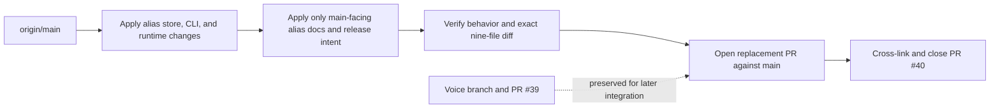

# Case-Insensitive Aliases - Plan

## Goal Capsule

- **Objective:** Make every `llm-now` alias producer and consumer use one ASCII case-insensitive namespace, then ship that behavior in a focused pull request based directly on `main`.
- **Authority:** The Product Contract owns observable alias behavior. The Planning Contract owns canonicalization, compatibility, and clean-branch isolation. Repository instructions and tests remain binding where this plan is silent.
- **Execution profile:** One implementation phase covering the alias store, application surfaces, compiled-runtime proof, main-facing documentation, release intent, and main-relative scope verification.
- **Stop conditions:** Stop if compatibility requires silently choosing between different provider/model targets, if explicit provider/model calls begin depending on alias-store health, if implementation requires fuzzy matching, or if the replacement branch would include voice-guide, cookbook, or slideshow ancestry.
- **Tail ownership:** LFG opens the replacement pull request against `main`, verifies its base and file list, cross-links and closes superseded PR #40 only after the replacement exists, and leaves the voice-dictation branch and PR #39 untouched.

---

## Product Contract

### Summary

`llm-now` treats ASCII case as insignificant for saved aliases across terminal use, scripts, agents, compiled binaries, and external callers such as macOS Shortcuts. The namespace remains exact in every other respect: `fred` and `Fred` are one alias, while `fred` and `fredd` are different aliases.

This behavior ships independently of the in-progress macOS voice guide. The replacement change is built directly from `main` so unrelated voice, cookbook, and slideshow work does not enter the alias pull request.

### Problem Frame

The alias store accepts uppercase letters but historically resolved object keys exactly, forcing callers to reproduce saved capitalization byte-for-byte. A caller-only lowercase conversion would leave terminal calls, scripts, agents, interactive setup, and future integrations with different behavior.

The completed alias work currently sits on top of an in-progress voice branch, which itself has older documentation ancestry. Retargeting that stacked pull request to `main` would expose unrelated files. The implementation must preserve the alias behavior while reconstructing its nine-file change set from `main`.

### Requirements

**Canonical namespace**

- R1. Every valid alias producer and consumer must compare aliases using ASCII case-insensitive semantics without adding phonetic, proximity, or typo matching.
- R2. New and updated aliases must persist and display under their lowercase canonical name.
- R3. Loading a legacy document with case-only variants for the same provider/model target must expose one lowercase alias without rewriting the file during the read.
- R4. Loading a legacy document with case-only variants for different targets must fail before discovery or generation. The diagnostic must identify the canonical alias, the deterministic conflicting pair's original spellings and provider/model targets, the alias-store path, and the manual edit needed to leave only one target across all variants of that canonical alias.
- R5. Saving a case variant of an existing alias must use the existing already-saved, collision, confirmation, and concurrency behavior for that one canonical alias.

**Caller parity and compatibility**

- R6. Positional aliases, `--alias`, interactive alias selection, provider setup, post-generation saves, and compiled binaries must share the same canonical namespace.
- R7. Explicit provider/model calls that do not consult aliases must remain independent of alias-store validity.
- R8. Alias-dependent failures must remain machine-observable: exit code `1`, empty stdout, actionable stderr, and no provider discovery, listing, or generation activity.
- R9. Main-facing documentation and release intent must describe lowercase persistence, case-insensitive lookup, spelling-exact behavior, and legacy-conflict repair.

**Clean delivery**

- R10. The replacement branch must start from `origin/main` and contain only the nine approved alias files listed in Scope Boundaries.
- R11. Voice-guide, cookbook, slideshow, and user-owned `dictate.sh` work must not enter the replacement branch.
- R12. The replacement pull request must exist against `main` before PR #40 is closed as superseded; the voice branch and PR #39 must remain unchanged for later integration.

### Key Decisions

- **Core-owned case normalization.** (session-settled: user-approved — chosen over lowercasing only in macOS Shortcuts because every caller should receive the same routing behavior.) Governs R1, R6, and R9.
- **One canonical alias per spelling.** (session-settled: user-approved — chosen over preserving `fred` and `Fred` as distinct aliases because caller capitalization must not change the selected target.) Governs R2 and R5.
- **Fail closed on conflicting legacy targets.** (session-settled: user-approved — chosen over selecting an exact-case or first-seen target because ambiguous configuration must never route a request silently.) Governs R3, R4, and R8.
- **Replace the stacked PR with a clean main-based PR.** (session-settled: user-approved — chosen over retargeting PR #40 because its ancestry would import unrelated voice, cookbook, and slideshow files.) Governs R10-R12.
- **Preserve the in-progress voice branch.** (session-settled: user-approved — chosen over rebasing or rewriting it during extraction because voice dictation work is still active.) Governs R11 and R12.

### Acceptance Examples

- AE1. **Covers R1, R2, and R6.** Given one saved alias `fred`, callers using `fred`, `Fred`, or `FRED` through positional or `--alias` syntax reach the same target, and the store contains only the lowercase key.
- AE2. **Covers R3 and R6.** Given a legacy document containing `fred` and `Fred` with identical records, loading aliases exposes one lowercase alias and does not rewrite the source file.
- AE3. **Covers R4, R7, and R8.** Given two or more case variants for `fred` with different records, an alias-dependent call exits with a deterministic conflicting-pair diagnostic that instructs the user to keep one target across all variants and makes no provider call, while an explicit provider/model call remains usable.
- AE4. **Covers R5.** Given canonical alias `fred`, saving `Fred` for the same target reports already saved; saving it for a different target follows normal overwrite confirmation without creating a second key.
- AE5. **Covers R9.** A user can learn from active main-facing documentation that capitalization is normalized but misspellings are not, and can repair a conflicting legacy file without guessing which target was selected.
- AE6. **Covers R10-R12.** The replacement PR targets `main`, its changed-file list matches the approved nine-file allowlist, PR #40 links to the replacement before closing, and the voice branch and PR #39 retain their original heads.

### Scope Boundaries

**In scope — exact replacement-PR allowlist**

- `.changeset/calm-aliases-match.md`
- `README.md`
- `docs/manual-testing.md`
- `docs/plans/2026-07-31-001-feat-case-insensitive-aliases-plan.md`
- `src/aliases.ts`
- `src/app.ts`
- `tests/aliases.test.ts`
- `tests/app.test.ts`
- `tests/runtime-compile-smoke.ts`

**Deferred follow-up**

- Rebase or otherwise integrate `codex/macos-voice-shortcut-guide` after the alias change lands.
- Retain voice-specific instructions that pass Dictation output unchanged and rely on core alias normalization.

**Out of scope**

- `dictate.sh`, `examples/**`, the macOS voice plan, and cookbook/slideshow artifacts.
- Fuzzy matching, phonetic matching, alias proximity, pronunciation dictionaries, alias enumeration, and new agent-only APIs.
- Alias grammar changes, provider/model discovery changes, credential storage changes, generation-output changes, and prompt-input changes.

---

## Planning Contract

### Key Technical Decisions

- KTD1. **Canonicalize at the alias-store boundary.** Validate the existing ASCII grammar, then use the lowercase name for loaded keys, resolution, and save collision checks. This single boundary serves humans, scripts, agents, interactive flows, and compiled binaries. Governs R1-R6.
- KTD2. **Canonicalize the complete loaded map.** `loadAliases` returns a deterministic lowercase map. Equal case-only records collapse; unequal records produce a dedicated store error before runtime activity. Governs R3, R4, R6, and R8.
- KTD3. **Preserve argument parsing as transport.** Positional and `--alias` syntax continue passing the caller's value to the resolver; canonicalization occurs when the store validates and resolves it. Governs R6.
- KTD4. **Reuse locked save semantics.** Successful saves rewrite the loaded canonical document while holding the existing lock, preserving expected-current checks, overwrite confirmation, atomic rename, permissions, concurrency behavior, and prototype-key protection. Governs R2, R3, and R5.
- KTD5. **Keep alias document version 1.** The provider/model record shape is unchanged, and the version marker continues representing that schema rather than the lookup semantics of a particular binary. Mixed-case version-1 keys remain readable when unambiguous, and the next successful save persists the canonical map. A downgraded pre-change binary reverts to exact-case behavior and may recreate case variants; a later upgrade handles those variants through the same collapse-or-fail-closed rules. Governs R2-R5.
- KTD6. **Reconstruct selectively from `origin/main`.** Apply the established alias code and test changes in dependency order, then transplant only the alias documentation hunks and revised plan. Do not restore complete stacked-branch files or cherry-pick the mixed voice/documentation commit wholesale. Governs R9-R11.

### High-Level Technical Design

### Assumptions

- `origin/main` is refreshed when implementation begins; its resolved commit becomes the replacement branch's merge base.
- Exact transplant/cherry-pick grouping is an implementation judgment. The final main-relative content, behavior, and allowlisted file set are authoritative.
- Read operations normalize legacy aliases in memory but do not write user configuration; the next successful locked save persists the canonical map.
- Existing test injection seams may observe original argument casing before the real store resolver runs; store-backed application and compiled-runtime tests prove observable behavior.
- Replacement PR creation must succeed before the superseded PR is closed. If creation fails, PR #40 remains open.

### Sequencing

Use one implementation phase and one replacement pull request:

1. Branch from refreshed `origin/main` and apply alias-store behavior.
2. Apply CLI and compiled-runtime parity changes.
3. Apply only main-facing alias documentation, the changeset, and this revised plan.
4. Run behavior, release, diff, and ancestry verification.
5. Let the LFG shipping tail create the replacement PR, verify it, and only then close PR #40 with a superseding link.

---

## Implementation Units

### U1. Canonical alias-store behavior

- **Goal:** Make loaded, resolved, and saved aliases use one lowercase namespace with deterministic legacy compatibility.
- **Requirements:** R1-R5; AE1-AE4; KTD1, KTD2, KTD4, and KTD5.
- **Dependencies:** None.
- **Files:** `src/aliases.ts`, `tests/aliases.test.ts`
- **Approach:**
  1. Add one alias-name canonicalization path after existing grammar validation.
  2. Build the loaded alias map by canonical key and compare records before collapsing case-only variants.
  3. Route resolution and locked save collision checks through the canonical key.
  4. Preserve prototype-key protections, file permissions, atomic rename, and concurrent-save behavior.
- **Test scenarios:**
  - Save `Fred`, verify persistence as `fred`, and resolve through `fred`, `Fred`, and `FRED`.
  - Load identical legacy variants, verify one in-memory key, and verify no read-time rewrite.
  - Load two and three conflicting variants in different JSON orders and verify deterministic, actionable failure without choosing a target; the diagnostic may name one conflicting pair but must instruct the user to keep one target across all variants.
  - Exercise same-target, collision, decline, approved-overwrite, and concurrent-save paths across casing variants.
  - Save and resolve prototype-like aliases such as `toString` and `constructor` without inherited-property access.
- **Verification:** Focused alias-store tests prove canonical persistence, deterministic collapse, fail-closed conflicts, overwrite behavior, concurrency, permissions, and prototype safety.

### U2. Application and compiled-runtime parity

- **Goal:** Make every CLI alias workflow present and exercise the canonical namespace without changing unrelated selection paths.
- **Requirements:** R4-R8; AE1, AE3, and AE4; KTD2-KTD4.
- **Dependencies:** U1.
- **Files:** `src/app.ts`, `tests/app.test.ts`, `tests/runtime-compile-smoke.ts`
- **Approach:**
  1. Use canonical names for interactive preflight lookups, overwrite prompts, save diagnostics, and suggested commands.
  2. Keep positional and `--alias` plumbing identical while the store owns normalization.
  3. Prove save/invocation case variance in the compiled smoke path.
  4. Preserve the no-alias-store path for explicit provider/model selection.
- **Test scenarios:**
  - Resolve one store-backed alias through positional and `--alias` calls using multiple case variants.
  - Verify conflicting legacy aliases return exit `1`, empty stdout, actionable stderr, and zero discovery, listing, or generation calls.
  - Run explicit provider/model selection while an unrelated alias document conflicts and verify generation remains available.
  - Enter uppercase aliases in post-generation and credential-setup flows and verify lowercase prompts, diagnostics, and command suggestions.
  - Compile the CLI after saving mixed-case input, invoke another case variant, and verify fake-provider generation succeeds.
- **Verification:** Application tests and compiled-runtime smoke prove parity across human, script, agent, and binary entry points.

### U3. Main-facing contract and clean extraction

- **Goal:** Document the behavior, record release intent, and prove the replacement branch contains no stacked ancestry.
- **Requirements:** R9-R12; AE5 and AE6; KTD6.
- **Dependencies:** U1 and U2.
- **Files:** `.changeset/calm-aliases-match.md`, `README.md`, `docs/manual-testing.md`, `docs/plans/2026-07-31-001-feat-case-insensitive-aliases-plan.md`
- **Approach:**
  1. Document case-insensitive lookup, lowercase persistence, spelling-exact behavior, and legacy-conflict repair in active main-facing docs.
  2. Record the user-visible contract change through the existing changeset workflow.
  3. Compare the branch to `origin/main` and require the exact nine-file allowlist.
  4. Scan for stale case-sensitive claims and references to excluded voice, cookbook, or slideshow artifacts.
- **Test scenarios:**
  - Follow documented terminal cases for lowercase, mixed-case, and uppercase lookup plus a true misspelling.
  - Validate changeset status and run a documentation contradiction scan.
  - Verify the merge base is the refreshed `origin/main` commit and the main-relative changed-file list exactly matches the allowlist.
- **Verification:** Active docs and release intent match U1/U2, and repository evidence proves the replacement diff is isolated from the voice branch.

---

## System-Wide Impact

- **Humans:** Alias capitalization no longer changes model selection; prompts and saved commands show lowercase canonical names.
- **Scripts and agents:** Existing positional and `--alias` syntax remains stable, failures remain non-interactive and machine-observable, and no new agent-specific surface is required.
- **Persistence:** Version-1 files remain readable unless case-only keys point to different targets; those files fail closed until repaired.
- **Concurrency:** Canonicalization occurs inside the existing locked save transaction so concurrent writes retain one namespace.
- **External callers:** Dictation and other integrations can pass exact spellings unchanged and rely on core case normalization, but their guides and implementation remain outside this pull request.
- **Git delivery:** The alias change lands independently on `main`; the voice branch remains available for later rebase or integration.

---

## Risks and Dependencies

- Existing users may intentionally have case-only aliases pointing to different targets. The contract cannot preserve both, so the error must name the conflict and never invoke a provider.
- A diagnostic names the first deterministic conflicting pair rather than enumerating an unbounded set. Its repair instruction must cover every case variant so the user can resolve the canonical alias in one edit.
- Canonicalizing only resolution would leave duplicate picker entries and save races. Loaded maps and locked saves must share canonicalization.
- Rewriting during load would introduce surprising mutation and bypass the save lock. Legacy normalization remains in memory until a successful save.
- Downgrading to a pre-change binary restores exact-case lookup and can recreate case-only variants because document version 1 is intentionally retained for the unchanged schema. Re-upgrading collapses equal targets or fails closed on unequal targets; cross-version behavioral parity is not promised.
- Restoring whole files from the stacked branch could import an inherited cookbook link or voice-guide dependencies. Apply only the approved alias deltas and verify the final file list against `main`.
- Closing PR #40 before the replacement exists would remove the active review vehicle. The close is explicitly ordered after replacement PR creation.
- No new runtime dependency is required.

---

## Verification Contract

| Gate | Applies to | Required outcome |
|---|---|---|
| `bun test tests/aliases.test.ts tests/app.test.ts` | U1, U2 | Focused canonicalization, collision, concurrency, and caller-parity scenarios pass. |
| `bun run check` | U1-U3 | Full Bun tests, TypeScript checking, and compiled-runtime smoke pass. |
| `bun run changeset:status` | U3 | Release intent is valid and reports the intended package impact. |
| `git diff --check` | U1-U3 | No whitespace or patch-integrity errors. |
| Main-relative ancestry and allowlist check | U3 | Merge base is the refreshed `origin/main` commit and exactly the nine approved files differ. |
| Documentation contradiction scan | U3 | Active replacement-PR docs contain no case-sensitive contract or excluded voice/cookbook/slideshow dependency. |
| Browser gate | U1-U3 | Not applicable: the change affects CLI TypeScript, tests, and Markdown only. |

---

## Definition of Done

- R1-R12 and AE1-AE6 are satisfied by their owning implementation units or the LFG shipping tail.
- Persisted aliases, loaded aliases, interactive displays, direct resolution, and compiled binaries agree on lowercase canonical names.
- Same-target legacy variants collapse without read-time mutation; different-target variants fail before provider activity.
- Explicit provider/model generation remains usable without loading aliases.
- README, manual testing, the alias plan, and release intent state one contract without depending on voice-guide files.
- All local verification gates pass, and the replacement PR's GitHub base and file list match the plan.
- PR #40 is cross-linked and closed only after the replacement PR exists.
- PR #39, `codex/macos-voice-shortcut-guide`, and user-owned `dictate.sh` remain unchanged.
- The diff contains no fuzzy matching, alias enumeration, adapter-specific workaround, abandoned experiment, or unrelated cleanup.
