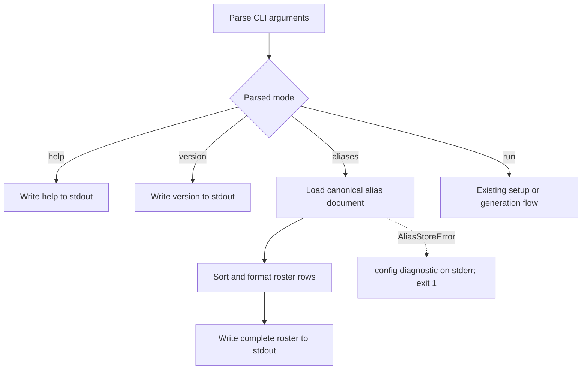

# Alias Inventory - Plan

## Goal Capsule

- **Objective:** Add a read-only `llm-now --aliases` mode that prints every configured canonical alias with its provider name and model.
- **Authority:** The Product Contract owns observable CLI behavior. The Planning Contract owns parser integration, formatting reuse, and early-return placement. Repository instructions and tests remain binding where this plan is silent.
- **Execution profile:** One implementation phase and one pull request covering the parser, application behavior, tests, documentation, packaged smoke coverage, and release intent.
- **Stop conditions:** Stop if `--aliases` cannot remain distinct from a positional alias named `aliases`, if listing would require provider or credential operations, or if valid inventory output would expose ambiguous alias-store state.
- **Tail ownership:** LFG implements the plan, applies review fixes, opens the pull request, and watches CI to a decided state.

---

## Product Contract

### Summary

`llm-now --aliases` prints the configured alias roster without reading a prompt or contacting a provider.
Each entry includes the canonical alias name, human provider name, and configured model or provider-default state.

### Problem Frame

Saved aliases are visible today only when a user enters interactive setup or reads the global alias file.
Voice dictation, shell workflows, and users diagnosing routing need a direct way to see which names LLM-Now will resolve and where those names point.

A positional `aliases` command is unsafe because every bare word is intentionally available as an alias.
The inventory must use an explicit option and preserve the current generation behavior of a saved alias whose name is `aliases`.

### Requirements

**Invocation and compatibility**

- R1. `--aliases` must be a standalone informational option that never enters prompt resolution or generation.
- R2. A positional alias named `aliases` must remain a normal case-insensitive alias invocation.
- R3. Combining `--aliases` with another option or positional value must return usage exit `2`, empty stdout, and a `usage:` diagnostic on stderr.

**Roster behavior**

- R4. A successful inventory must print every canonical alias with its human provider name and model or provider-default state.
- R5. Inventory rows must use deterministic canonical-alias ordering and contain no color or terminal-control sequences.
- R6. A missing alias store must return exit `0` as an empty inventory, while an invalid, unreadable, or case-conflicting store must return exit `1`, empty stdout, and the existing sanitized `config:` diagnostic.

**Isolation and discoverability**

- R7. Inventory must not read stdin, prompt, discover providers, list models, generate text, access credentials, or mutate aliases.
- R8. Help, README guidance, manual verification, packaged smoke coverage, and release intent must document and protect the new option.

### Key Decisions

- **Standalone inventory option.** (session-settled: user-directed — chosen over a positional `aliases` subcommand because bare words must remain available as user aliases.) Governs R1-R3.
- **Complete roster fields.** (session-settled: user-directed — chosen over alias names only because the inventory must identify each alias's provider and model.) Governs R4 and R5.

### Acceptance Examples

- AE1. **Covers R1, R4, R5, and R7.** Given configured aliases in non-canonical source order, `llm-now --aliases` prints canonical alias/provider/model rows in deterministic order, exits `0`, writes nothing to stderr, and performs no runtime or credential operation.
- AE2. **Covers R2.** Given a saved alias named `aliases`, `llm-now aliases --input "hello"` resolves that alias and generates normally rather than listing aliases.
- AE3. **Covers R3 and R7.** Given `--aliases` with `--input`, a positional alias, `--alias`, `--provider`, `--model`, `--help`, or `--version`, the application exits `2` with empty stdout and no runtime work.
- AE4. **Covers R6 and R7.** Given no alias store, `llm-now --aliases` exits `0` with an empty roster and performs no setup or runtime work.
- AE5. **Covers R6 and R7.** Given malformed or conflicting alias storage, `llm-now --aliases` emits no roster, exits `1`, reports the existing actionable `config:` diagnostic on stderr, and performs no runtime work.

### Scope Boundaries

**In scope**

- The `--aliases` parser mode, help entry, early application branch, deterministic human roster formatting, tests, active documentation, packaged-binary smoke coverage, and a release changeset.

#### Deferred to Follow-Up Work

- An explicit JSON or other stable machine-readable output contract.
- Names-only output, filtering, and singular alias inspection.

**Out of scope**

- A positional alias-management command family.
- Fuzzy, phonetic, or proximity matching.
- Alias, credential, or provider configuration changes.
- Provider availability or runtime-health checks.
- Lazy construction of executable dependencies.
- Changes to the macOS Shortcuts script or user-owned `dictate.sh`.

---

## Planning Contract

### Key Technical Decisions

- KTD1. **Add an explicit parsed mode and early application branch.** (session-settled: user-directed — chosen over a positional `aliases` subcommand because R1 and R2 require a collision-free informational path.) Extend the help/version standalone-mode pattern in `src/args.ts` and return from `runApplication` before interactivity, setup, prompt resolution, selection, or generation.
- KTD2. **List the canonical loaded namespace.** Call the injected alias loader once with the application alias path and render its returned map. Do not read the JSON file directly or resolve each alias separately. This preserves canonicalization, benign legacy-variant collapse, and fail-closed conflict behavior for R4-R7.
- KTD3. **Reuse the human target presentation boundary.** Build inventory rows from sanitized alias names plus the existing provider-label and provider-default model wording in `src/prompts.ts`. Keep inventory output uncolored and independent of terminal capability.
- KTD4. **Load and format before writing.** Complete alias loading and roster construction before the first stdout write so an alias-store failure cannot leave a partial successful payload.

### High-Level Technical Design

The new mode follows the existing informational-mode boundary and projects the same canonical alias state used by interactive selection.

The option matrix is a strict public CLI contract:

| Invocation shape | Result |
|---|---|
| `--aliases` only | Inventory mode |
| positional `aliases` with prompt input | Existing alias generation |
| `--aliases` plus any option or positional | Usage error |
| `--help` or `--version` only | Existing informational mode |

### Assumptions

- The first release provides capture-safe human text, not a stable parsing API. Each row uses `alias → Provider Label · model`, no header, no alignment padding, and the existing `provider default` phrase for a null model.
- An empty inventory writes zero stdout bytes and exits `0`.
- Inventory sorts the canonical alias keys before formatting, even though the loader already returns canonical names.
- Piped stdin is ignored because inventory returns before prompt resolution. It is not treated as a conflicting CLI argument.
- JSON remains a separate follow-up because the user selected idea 1 rather than the ideation document's two-view or manifest ideas.

### Sequencing

Use one implementation phase:

1. Protect the parser and application contract with focused failing tests.
2. Add the standalone mode, canonical roster projection, and early return.
3. Update help, active documentation, packaged smoke coverage, and release intent.
4. Run focused, full, compiled-runtime, and packaged-release verification.

---

## Implementation Units

### U1. Standalone alias inventory behavior

- **Goal:** Add the `--aliases` parser mode and canonical early-return roster without changing generation behavior.
- **Requirements:** R1-R7; AE1-AE5; KTD1-KTD4.
- **Dependencies:** None.
- **Files:** `src/args.ts`, `src/app.ts`, `src/prompts.ts`, `tests/args.test.ts`, `tests/app.test.ts`
- **Approach:**
  1. Extend the parsed-argument union and strict option parser with an aliases informational mode that follows help/version exclusivity.
  2. Expose or add a narrow human roster formatter beside the existing provider/model presentation helpers.
  3. Load the canonical document through the injected dependency, sort its entries, build the complete output, and return before any setup or generation path.
  4. Preserve the existing `UsageError` and `AliasStoreError` catch paths.
- **Execution note:** Start with failing parser and application tests for the public CLI and stream contract.
- **Patterns to follow:** Standalone help/version parsing in `src/args.ts`; early informational returns and injected alias loading in `src/app.ts`; `providerLabel`, `formatSelection`, sanitization, and deterministic sorting in `src/prompts.ts`.
- **Test scenarios:**
  - Covers AE1. Parse `--aliases`, load unsorted canonical records, and verify exact sorted uncolored lines containing alias, provider label, and model/default wording.
  - Covers AE2. Invoke a real stored positional alias named `aliases` and verify normal generation with no inventory output.
  - Covers AE3. Combine `--aliases` separately with each current option and with a positional alias, then verify exit `2`, empty stdout, `usage:` stderr, and zero runtime calls.
  - Covers AE4. Return an empty alias document and verify exit `0`, empty stdout/stderr, and zero runtime calls.
  - Covers AE5. Exercise malformed and conflicting real stores and verify exit `1`, empty stdout, actionable `config:` stderr, and zero runtime calls.
  - Load same-target legacy case variants through the real store and verify one canonical roster row.
  - Provide closed or piped stdin and unavailable runtime methods, then verify successful inventory never reads or calls them.
- **Verification:** Focused parser and application suites prove output bytes, compatibility, error codes, stream separation, canonicalization, and runtime isolation.

### U2. Public documentation and packaged verification

- **Goal:** Make the new informational mode discoverable and protect it in release artifacts.
- **Requirements:** R8; KTD1-KTD3.
- **Dependencies:** U1.
- **Files:** `README.md`, `docs/manual-testing.md`, `scripts/release-validate.ts`, `.changeset/quiet-aliases-list.md`
- **Approach:**
  1. Document the option, the three roster fields, ordering, provider-default wording, empty behavior, streams, and exit codes.
  2. Add manual checks for configured, empty, invalid-combination, corrupt, and positional-`aliases` compatibility cases.
  3. Extend native archive validation with a deterministic temporary alias store so the packaged executable proves the option.
  4. Record the user-facing CLI addition as a minor release change.
- **Execution note:** Treat packaged-binary verification as the final proof after application tests pass.
- **Patterns to follow:** Compact help copy in `src/args.ts`; usage and alias sections in `README.md`; numbered cases in `docs/manual-testing.md`; temporary-home native cases in `scripts/release-validate.ts`; current Changesets format under `.changeset/`.
- **Test scenarios:**
  - Build the packaged executable with a temporary alias store and verify exact roster stdout, empty stderr, and exit `0`.
  - Verify the packaged positional alias named `aliases` still reaches generation rather than inventory.
  - Verify active help and README examples agree with the tested output.
  - Verify the changeset describes the public `--aliases` behavior without claiming JSON support.
- **Verification:** Native release validation exercises the compiled option, documentation matches tested behavior, and Changesets accepts the release record.

---

## Verification Contract

| Gate | Command | Proves |
|---|---|---|
| Focused behavior | `bun test tests/args.test.ts tests/app.test.ts` | Parser modes, output bytes, compatibility, errors, and no-runtime behavior |
| Full project check | `bun run check` | Complete test suite, TypeScript types, and compiled runtime smoke |
| Packaged release validation | `bun run release:validate` | Native archives expose the documented option and preserve generation |
| Release metadata | `bun run changeset:status` | The public CLI addition has valid release intent |
| Diff hygiene | `git diff --check` | No whitespace or patch-format errors |

---

## Definition of Done

- `llm-now --aliases` prints the exact deterministic roster defined by R4-R6 and the Planning Contract assumptions.
- A positional alias named `aliases` still generates normally.
- Invalid option combinations, empty storage, and invalid storage produce the documented exit and stream behavior.
- Inventory performs no prompt, runtime, credential, or mutation operation.
- Help, README, manual testing, native release validation, and the changeset match the implementation.
- U1 and U2 verification passes, followed by every gate in the Verification Contract.
- The pull request contains the ideation artifact, this plan, and only files required by the alias-inventory feature; user-owned `dictate.sh` remains untracked and untouched.
- No abandoned or experimental implementation remains in the diff.
