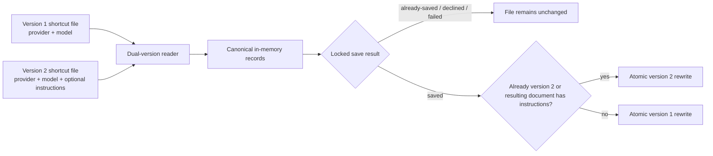
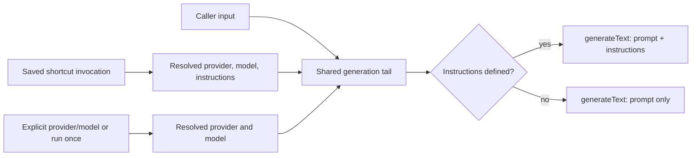

# Shortcut Instructions - Plan

## Goal Capsule

- **Objective:** Let each saved `llm-now` shortcut carry optional instructions that `llm-now` sends to `byok-runtime` separately from the user's prompt on every shortcut invocation.
- **Authority:** The Product Contract owns observable shortcut behavior. The Planning Contract owns persistence, runtime transport, compatibility, and release mechanics. Repository instructions and tests remain binding where this plan is silent.
- **Execution profile:** One implementation phase and one draft pull request on the existing `codex/alias-instructions` branch. The work covers shortcut persistence, the three save surfaces, every shortcut invocation path, runtime transport, tests, documentation, demo source, release metadata, and a documented dependency handoff. Development and local verification use `file:../cuecraft/byok-runtime`; registry restoration remains the merge and release gate after the runtime minor is published.
- **Stop conditions:** Stop if the released `byok-runtime` contract differs from the tested `instructions?: string` field, if a provider requires prompt concatenation, if migration cannot preserve unrelated aliases under the existing lock, or if implementation would re-emit submitted instructions after visible entry.
- **Tail ownership:** The implementation workflow verifies, commits, pushes, and opens a draft pull request. Runtime publication and registry dependency restoration must occur before hosted CI can become green or the pull request becomes mergeable. The user retains the existing VHS GIF rendering and review gate before the pull request becomes ready to merge.

---

## Product Contract

### Summary

A shortcut can save optional multiline instructions such as `You are a Realtime Voice Agent Architect`. Each later use of that shortcut sends the saved instructions through `byok-runtime`'s provider-native instruction channel while keeping the caller's text as the user prompt.

Users add, change, or remove instructions by recreating the shortcut and accepting the existing overwrite flow. Instruction-free shortcuts and explicit provider/model runs preserve their current behavior.

### Problem Frame

Shortcuts currently remember only a provider and model. A user who wants a stable role, voice, or operating context must repeat it in every prompt or maintain that behavior outside `llm-now`.

Prepending saved text to the prompt would blur the distinction between application instructions and user input. The new `byok-runtime` contract provides a separate optional field, so `llm-now` can preserve that distinction across supported providers.

### Actors

- A1. **Shortcut creator:** Creates or recreates a named provider/model shortcut and may save instructions with it.
- A2. **Shortcut caller:** Invokes the shortcut from an interactive launcher, terminal command, pipe, script, agent, or compiled binary.
- A3. **Direct caller:** Selects a provider/model for one run and expects no hidden shortcut instructions.

### Requirements

**Instruction capture and safety**

- R1. Every shortcut-saving flow must offer one optional, visibly editable, multiline instruction input after a valid shortcut name and before collision confirmation. The value is visible only in the active editing frame; submit, cancel, validation-error, and settled prompt frames must omit it. Blank or whitespace-only input means no instructions; accepted nonblank input retains its exact text and ordinary line breaks.
- R2. Instructions are plaintext shortcut configuration, not credential storage. Persistence blocking is source-aware: successfully validated credentials always qualify, configured API-key environment values qualify when they contain at least eight characters, and vault-stored credentials qualify only on targets where the native vault is enabled. When the native vault is disabled, instruction saves must not enumerate it and instead use qualifying environment values plus successfully validated in-process credentials. When the native vault is enabled, a vault read failure must fail the save closed. Every nonempty credential value remains eligible for output redaction even when it is too short to block persistence. A value containing a persistence-blocking credential must be rejected before serialization. After submission, the application must clear its input buffer and must not re-emit that value through application-generated output, mutate the file, or leave a persistent temporary artifact. It must show a fixed sanitized validation message and re-prompt; cancellation then follows the enclosing flow's existing durability boundary.

**Persistence and overwrite behavior**

- R3. Existing version-1 shortcut files must load as instruction-free without a read-time rewrite and remain version 1 across instruction-free saves. The first successful locked save that stores any instruction must migrate the complete document to version 2 while preserving unrelated records. Once migrated, later saves remain version 2 even if every instruction is removed.
- R4. The canonical shortcut name is the shortcut's identity for save, case-collision, and concurrency checks. Complete record equality compares provider, model, and instructions. Recreating the same canonical shortcut with added, changed, or removed instructions must enter the existing overwrite flow.
- R5. Overwrite prompts, receipts, diagnostics, inventory, and picker hints must never display raw instructions. An overwrite prompt may disclose only instruction state transitions: `none → set`, `set → none`, `set → changed`, or `unchanged`.

**Invocation parity**

- R6. Positional aliases, `--alias`, `--input`, piped input, interactive shortcut selection, compiled binaries, and a newly created shortcut's first run must pass the saved instructions separately from the user prompt. Noninteractive calls must add no prompts, discovery, shortcut mutation, or unsolicited receipts; successful output remains exact on stdout, while failures use stderr and the existing exit-code contract.
- R7. Instruction-free shortcuts must omit the runtime `instructions` property instead of sending an empty value.
- R8. Explicit provider/model generation and launcher run-once generation must remain instruction-free. An instructed shortcut must not be presented as behaviorally equivalent to an instruction-free fresh selection.

**Interface and release boundaries**

- R9. `--aliases` output and shortcut picker hints must remain provider/model-only, with no instruction text or instruction-state indicator.
- R10. The feature must ship only after a compatible minor version of `@swartzrock/byok-runtime` is published. The released `llm-now` dependency and lockfile must contain no sibling `file:` dependency or sibling-only development packages.
- R11. Active documentation, manual tests, demo source, packaged-runtime validation, and release metadata must describe and exercise saved shortcut instructions, downgrade recovery, per-invocation transmission to the selected provider, the local process-argument visibility of instructions for CLI-backed providers, and the existing credential-safety and GIF-review gates. `llm-now`-generated diagnostics and fixture failures must never echo child-process arguments.

### Key Decisions

- **Recreate and overwrite is the initial edit path.** (session-settled: user-directed — chosen over new-shortcuts-only behavior or a dedicated editor because the user selected option 1 for now.) Governs R4 and R5.
- **Every shortcut-save flow collects optional instructions.** (session-settled: user-approved — chosen over launcher-only capture because users should not receive different shortcut capabilities based on how setup began.) Governs R1, R3, and R6.
- **Instruction input is multiline.** (post-implementation correction: user-reported pasted prompts were truncated at the first line, superseding the earlier single-line decision.) Blank input submits with one Enter. Nonblank text uses a visible `[ save ]` action, focused with Tab and activated with Enter, so pasted blank lines cannot conflict with the submit gesture. Governs R1.
- **Instruction entry remains visible.** (session-settled: user-directed — chosen over masked entry because the user selected visible instruction entry during document review.) Governs R1 and R2.
- **Shortcut inventory stays provider/model-only.** (session-settled: user-approved — chosen over exposing instruction content or state in `--aliases` and picker hints.) Governs R5 and R9.

### Key Flows

- F1. **Create from an available provider.** Select provider/model, enter a valid shortcut name, enter optional instructions, resolve any overwrite, save atomically, collect the first user prompt, and generate through R6. Cancellation before save exits `130` without mutation. Cancellation of the first prompt preserves the saved shortcut and exits `0` without generation.
- F2. **Create after saving an API key.** Preserve the credential as soon as its existing durable save succeeds. Then collect model, name, and optional instructions. Cancellation after the credential boundary preserves the key and exits `0` with partial-completion copy; an operational shortcut failure preserves the key and exits `1`.
- F3. **Save after generation.** Complete the explicit instruction-free generation first. If the user opts to save a shortcut, collect its name and optional instructions for future calls. Decline or cancellation preserves the successful response and leaves shortcuts unchanged.
- F4. **Create during credential management.** Preserve the already-saved credential, collect the optional shortcut's model, name, and instructions, preflight collisions, and save under the current concurrency rules. Cancellation or drift leaves the credential intact and the shortcut unchanged.
- F5. **Invoke a saved shortcut.** Resolve the complete record and send the caller's prompt plus optional saved instructions through separate runtime fields. Noninteractive success adds no prompts, discovery, receipts, or mutation; failures retain the existing sanitized stderr diagnostic and exit-code contract.
- F6. **Edit or remove instructions.** Recreate the canonical shortcut. Supply new text to add or change instructions, or submit blank input to remove them. Confirm the state-only overwrite description before the locked save.

### Acceptance Examples

- AE1. **Covers R1, R3, R6, and R7.** Given a new shortcut `fred` with instructions `You are a Realtime Voice Agent Architect`, its first prompt and later positional invocations send the exact instruction text separately. Given blank instruction input, generation contains no `instructions` property.
- AE2. **Covers R4 and R5.** Given `fred` already targets the same provider/model with instructions set, recreating it with blank input shows `set → none`, never prints the saved text, and removes the field after confirmation.
- AE3. **Covers R4 and R5.** Given a case variant of `fred` with the same provider/model but different instructions, the save is a conflict rather than `already-saved`, and concurrent changes force the existing reconfirm-or-abort behavior.
- AE4. **Covers R3.** Given an untouched version-1 file, reading it and saving only instruction-free records leave it at version 1. The first save that stores instructions migrates it atomically to version 2. A pre-rename failure preserves version 1; a rename followed by lost acknowledgement leaves valid version 2, and retry preserves every unrelated record without duplication or loss. Removing all instructions later retains version 2.
- AE5. **Covers R2 and R5.** Given visibly entered instruction input containing a qualifying API key, the active editing frame may display it, but submission clears it and shows one fixed sanitized validation message. Retry, cancel, error, and settled frames never re-emit the value. Rejection leaves the original file bytes and mode unchanged, leaves no persistent temporary file, and prints neither that value nor unrelated vault values after submission. A one-character API-key environment value remains redaction-eligible but does not reject ordinary instruction text. On a target with the native vault disabled, nonblank instructions save without attempting vault access while still checking qualifying environment and validated in-process credentials.
- AE6. **Covers R6 and R8.** Given an instructed shortcut that targets the same provider/model as a fresh selection, every alias invocation form receives its instructions, while explicit and run-once calls omit them and do not claim the instructed shortcut is equivalent.
- AE7. **Covers R9.** Given a mix of instructed and instruction-free shortcuts, `--aliases` and picker hints have the same provider/model-only shape they have today.
- AE8. **Covers R10 and R11.** The release resolves a published compatible runtime version whose declarations and upstream checks prove provider support, passes the package and compiled-runtime gates, and contains an `llm-now` minor changeset with updated active documentation and demo source.
- AE9. **Covers R6 and R11.** CLI-backed providers receive instructions through their child-process argument contract, but application diagnostics, fake-provider failures, and packaged smoke output never print the argument values. Documentation warns that local process inspection and audit tooling may still observe those arguments and that instructions must not contain secrets.

### Scope Boundaries

**In scope**

- Optional instructions on persisted shortcuts and all existing shortcut-save flows.
- Recreate/overwrite behavior for adding, changing, and removing instructions.
- Versioned shortcut-file compatibility, instruction-aware concurrency, provider-native runtime transport, and release migration from the temporary local dependency.
- Terminal documentation, manual scenarios, downgrade recovery guidance, compiled/runtime tests, VHS source, and release metadata.

**Deferred follow-up**

- A dedicated shortcut editor or manager.
- New noninteractive shortcut-management commands.
- Noninteractive shortcut creation, editing, or instruction introspection.

**Out of scope**

- Instructions for run-once or explicit provider/model calls.
- Raw instruction text or an instruction indicator in `--aliases`, picker hints, diagnostics, or receipts.
- Per-call instruction overrides, instruction composition, templates, files, environment-variable substitution, or prompt concatenation fallbacks.
- Using saved instructions as secure secret storage.

### Dependencies and Sources

- `@swartzrock/byok-runtime` branch `codex/optional-text-instructions`, commit `f4dfa32ab27ce881cd9aa42203e42e6d8ad65396`, defines `instructions?: string` and passes it through every built-in provider's native system/developer channel. Its changeset declares a minor release.
- `src/aliases.ts` owns strict shortcut schema validation, canonical names, locked saves, atomic replacement, and record comparisons.
- `src/app.ts` owns the three shortcut-save surfaces, fresh-selection equivalence, cancellation boundaries, shared generation tail, and user-facing collision copy.
- `src/runtime.ts` owns the narrow application-to-`byok-runtime` generation gateway and the positional `AbortSignal` contract.
- `tests/aliases.test.ts`, `tests/app.test.ts`, `tests/prompts.test.ts`, `tests/runtime.test.ts`, `tests/runtime-compile-smoke.ts`, and `tests/fixtures/fake-cli.ts` contain the closest behavioral and integration patterns.
- No applicable repository learning was found under `docs/solutions/`; the directory does not currently exist.

---

## Planning Contract

### Key Technical Decisions

- KTD1. **Use a version-2 instruction schema with a dual-version reader and migration-on-need writer.** (session-settled: user-approved — chosen over migrating on the next instruction-free save: preserve version 1 until the new schema is needed.) Version 1 accepts exactly provider/model records and loads them with absent instructions. Version 2 accepts provider/model plus an omitted-or-valid `instructions` field. Each write rereads and validates the latest document after acquiring the lock and applies only the intended canonical-record mutation. A version-1 document stays version 1 when the resulting document is instruction-free; the first write whose resulting document contains instructions commits migration to version 2 at atomic rename. A version-2 document is never downgraded, including after its last instruction is removed. Pre-rename failures leave the prior file intact; interruption after rename may lose acknowledgement but leaves a valid document that an idempotent retry can reopen. Reads, cancellation, declined overwrite, and `already-saved` do not migrate the file. This makes the schema and commit boundaries explicit and preserves R3.
- KTD2. **Separate shortcut identity, complete record equality, and fresh-run equivalence.** (session-settled: user-approved — chosen over treating the provider/model/instructions tuple as identity: the canonical shortcut name is the durable handle.) The canonical name identifies a shortcut. Save, canonical case-collision, expected-current, and reconfirmation logic compares complete provider + model + instructions records for that identity. Fresh instruction-free selection recognizes only an instruction-free shortcut with the same provider/model, so it cannot suggest a command that adds hidden behavior. This enforces R4 and R8.
- KTD3. **Use a custom instruction prompt and one canonical validation path.** (session-settled: user-approved — chosen over the stock Clack renderer: it leaves submitted values in terminal frames.) Add `@clack/core` 1.4.3 as a direct dependency and implement an instruction-specific `MultiLinePrompt` renderer. It shows input only in the active editing state, uses an explicit `[ save ]` action for nonblank text, retains the resolved value, and clears the internal input before submit, retry, cancel, error, and settled frames render. Producers map whitespace-only input to absence and preserve accepted nonblank text byte-for-byte. Credential validation remains application-level so the prompt never enters a value-bearing error state. The persistence boundary enforces the same record invariant and repeats the persistence-blocking check before serialization or temporary-file creation. This enforces R1-R3.
- KTD4. **Expose state changes, not content.** Derive overwrite metadata from presence and equality only. Reuse the existing provider/model sanitization and report one of the four R5 transitions without interpolating either instruction string.
- KTD5. **Isolate external request construction in the runtime gateway.** `src/app.ts` carries the canonical optional value through selection resolution and the shared generation tail. `src/runtime.ts` alone constructs the `byok-runtime` request, adds `instructions` only when defined, and preserves the existing positional `AbortSignal`. Do not concatenate instructions into `prompt` and do not create a provider matrix in `llm-now`. This enforces R6-R8 against the published runtime contract.
- KTD6. **Treat the pinned sibling dependency as the required development state.** (session-settled: user-directed — chosen over waiting for the published runtime: the user wants integrated testing against the sibling branch now.) Before install or integration verification, require `../cuecraft/byok-runtime` at exact commit `f4dfa32ab27ce881cd9aa42203e42e6d8ad65396` with a clean tracked worktree and index; unrelated untracked files do not invalidate the preflight. Implement and verify locally against `file:../cuecraft/byok-runtime` and record the verified revision. Keep the pull request draft because hosted CI checks out only `llm-now` and cannot install that sibling path. After the runtime minor is published, pin the registry version, regenerate `bun.lock` with Bun, audit away sibling-only packages, run the full native matrix, and make the pull request mergeable. This enforces R10 without weakening the current implementation target.
- KTD7. **Redact instructions only from runtime-derived failures.** (session-settled: user-approved — chosen over registering instructions as credentials: successful model output must remain untouched.) When generation uses a saved instruction, the runtime gateway removes the exact active value and known serialized transport representations from provider or `byok-runtime` exception text before constructing an application diagnostic. It does not register the instruction as a credential and does not inspect or filter successful model output. This closes raw and encoded error-disclosure paths without changing ordinary responses.
- KTD8. **Separate persistence blocking from output redaction.** (session-settled: user-approved — chosen over using every registered value as a persistence blocker: short environment values can occur in ordinary prose.) Add a source-aware persistence-blocker abstraction separate from `SensitiveValueRegistry`. Seed configured API-key environment values of at least eight characters and register successfully validated credentials. Only when the native vault is enabled, lazily read every supported cloud-provider vault record after the user submits nonblank instructions; an enabled-vault read failure fails the instruction save closed with sanitized output and no mutation. When the native vault is disabled, do not enumerate it and permit nonblank instructions subject to the environment and validated in-process blocker values. Pass the blocker into the locked save boundary so it repeats the check before serialization or temporary-file creation. The output registry continues to redact every nonempty credential value.
- KTD9. **Use fixed state markers in compiled smoke fixtures.** (session-settled: user-approved — chosen over a smoke that ignores child-process arguments: passing would not prove instruction forwarding.) The fake CLI recognizes the expected synthetic developer-instruction argument without echoing it, emits only fixed presence or absence markers, and uses a fixed diagnostic for malformed calls. Runtime and packaged smoke require presence for an instructed alias and absence for an explicit instruction-free call.
- KTD10. **Document CLI child-process arguments as a local trust boundary.** Some `byok-runtime` CLI providers transport instructions in child-process arguments, which local process inspection or audit tooling may observe. `llm-now` must not echo those arguments in its own prompts, diagnostics, logs, fixtures, or spawn-failure copy, and documentation must warn users not to place secrets or undisclosable data in saved instructions. This disclosure is distinct from successful provider output, which remains unfiltered.

### High-Level Technical Design

The diagrams describe boundaries and state transitions. They do not prescribe helper names or exact signatures.

| Invocation surface | Selection source | Runtime instruction behavior |
|---|---|---|
| Positional alias | Saved shortcut | Forward exact saved value when present |
| `--alias` with interactive, `--input`, or piped prompt | Saved shortcut | Forward exact saved value when present |
| Interactive shortcut picker | Saved shortcut | Forward exact saved value when present |
| First run after required shortcut creation | Newly saved shortcut | Forward exact saved value when present |
| Explicit provider/model | Fresh selection | Omit instructions |
| Launcher run once | Fresh selection | Omit instructions |

Selection source is the invariant. A saved shortcut controls instruction forwarding, while a fresh provider/model or run-once selection omits instructions. Prompt source does not change the decision.

### Compatibility and Lifecycle

- A version-1 file remains byte-for-byte unchanged on reads and unsuccessful saves. Successful instruction-free mutations may rewrite it, but retain the version-1 schema.
- The write rereads under the lock. Atomic rename upgrades the latest canonical document to version 2 only when the resulting document first contains instructions, and preserves unrelated changes. Version 2 is retained thereafter.
- A pre-feature `llm-now` binary rejects version 2 for alias-dependent and bare-launcher operations. Explicit provider/model generation remains available because it does not depend on shortcut-store validity.
- There is no automatic downgrade. Recovery means reinstalling a feature-capable binary or preserving the version-2 original and manually deriving a version-1 copy that retains each canonical provider/model mapping and intentionally drops instructions.
- Manual migration testing must use an isolated absolute `XDG_CONFIG_HOME` or platform-equivalent path. It must not exercise the user's real shortcut store.
- Version 2 omits `instructions` when absent. A stored instruction must contain at least one non-whitespace character and no line break or control character. Leading and trailing whitespace in accepted nonblank input remains part of the value.

### Sequencing

Use one implementation phase and one pull request:

1. Add versioned persistence and instruction-aware record semantics.
2. Add instruction capture and safe overwrite state to every shortcut producer.
3. Add runtime transport and prove parity across every consumer.
4. Update documentation, demo source, packaged-runtime coverage, and release metadata.
5. **Post-draft merge gate, outside this implementation run:** replace the local dependency with the published runtime version and run all release gates.

---

## Implementation Units

### U1. Versioned shortcut persistence and identity

- **Goal:** Store optional instructions without breaking version-1 reads, canonical names, atomic saves, or concurrent update protection.
- **Requirements:** R2-R5; F6; AE2-AE5; KTD1-KTD4 and KTD8.
- **Dependencies:** None.
- **Files:** `src/aliases.ts`, `src/credentials.ts`, `tests/aliases.test.ts`, `tests/credentials.test.ts`
- **Approach:**
  1. Represent the in-memory alias record with optional instructions and validate legacy and new on-disk documents separately. Track the loaded schema version so instruction-free version-1 writes remain version 1 and version-2 writes never downgrade.
  2. Reuse canonicalization, exact-key checks, lock acquisition, expected-current checks, and atomic rename. Reread the latest document inside the lock before applying the target mutation.
  3. Treat atomic rename as the migration commit point only when a version-1 result first contains instructions; otherwise write the current schema version. Omit absent instruction properties from either schema.
  4. Use the canonical name as identity and make every store-level record comparison include provider, model, and instructions.
  5. Implement KTD8's persistence-blocker abstraction independently from output redaction and accept it at the locked save boundary. Reject matches before serialization while retaining every nonempty credential value for diagnostic redaction.
  6. Create new, migrated, and temporary files with the existing restrictive permission contract.
- **Patterns to follow:** Strict schema validation and deterministic errors near `validateAliasRecord`; canonical case-variant collapse near `canonicalizeDocument`; transaction and permission behavior in `saveAlias`.
- **Test scenarios:**
  - Load version 1 with one and many records, verify absent instructions, and verify no read-time rewrite.
  - Round-trip version 2 with exact nonblank text and with omitted instructions.
  - Round-trip multiline values exactly; reject blank-only, unsupported-control-bearing, malformed, and persistence-blocking credential-bearing stored values without echoing them.
  - Save instruction-free changes into version 1 and verify the document remains version 1; then store the first instruction and verify one atomic version-2 rewrite preserves unrelated aliases and permissions.
  - Remove the last instruction from version 2 and verify the document stays version 2.
  - Race two saves that preflight version 1 and commit serially; verify both unrelated mutations survive and target drift still reconfirms or aborts.
  - Verify `already-saved` does not migrate version 1 and exact three-field equality returns `already-saved` in version 2.
  - Exercise add, change, remove, and unchanged instructions across collision approval, decline, case variants, expected-current drift, and concurrent saves.
  - Inject failure immediately before rename and verify version 1 remains intact and temporary/lock files are cleaned up.
  - Commit rename, simulate lost acknowledgement, then reopen and retry; verify valid version 2, no data loss or duplication, and an `already-saved`-equivalent outcome.
  - Verify a one-character configured API-key environment value is redacted from output but does not block ordinary instruction persistence; reject a qualifying or verified credential-bearing sentinel before temporary-file creation and verify unchanged source bytes/mode, no persistent artifact, restrictive temporary-file creation, and no sentinel in output.
- **Verification:** Focused alias-store tests prove dual-version loading, migration boundaries, full equality, safe rejection, concurrency, atomicity, permissions, and unrelated-record preservation.

### U2. Instruction capture and safe shortcut editing

- **Goal:** Offer optional instructions on every shortcut-save surface while preserving each flow's existing durable and cancellation boundaries.
- **Requirements:** R1-R5; F1-F4 and F6; AE1-AE3 and AE5; KTD2-KTD4 and KTD8.
- **Dependencies:** U1.
- **Files:** `package.json`, `bun.lock`, `src/app.ts`, `src/prompts.ts`, `tests/app.test.ts`, `tests/prompts.test.ts`
- **Approach:**
  1. Collect optional instructions after a valid name in `prepareRequiredShortcut`, `offerAliasSave`, and `prepareCredentialAlias`.
  2. Add `@clack/core` 1.4.3 as a direct dependency and implement KTD3's instruction-specific `MultiLinePrompt` mode. Retain the resolved value before clearing internal input so later frames cannot render it.
  3. After nonblank submission, build KTD8's blocker from qualifying environment values and already validated credentials. Lazily read supported provider vault records only when the native vault is enabled; do not enumerate a disabled vault, blank submissions, or a launcher menu that merely opens. Fail closed with sanitized copy only when an enabled vault read fails.
  4. On credential detection, show the fixed sanitized message, re-prompt the instruction field, and preserve the existing cancellation, exit-code, and partial-completion behavior described by F1-F4.
  5. Compare complete records before deciding between `already-saved`, overwrite, reconfirmation, or abort.
  6. Add state-only overwrite copy from KTD4 and keep raw values out of every other presentation surface.
  7. Require full instruction-free equivalence when fresh selection computes an existing shortcut suggestion.
  8. Prove only collection and saved-record state in this unit; U3 owns the integration assertion that a newly saved shortcut's first generation receives instructions.
- **Patterns to follow:** Existing input validation and sensitive-registry checks in the three save flows; collision loops and diagnostic sanitization in `src/app.ts`; current queued prompter fixtures in `tests/app.test.ts`.
- **Test scenarios:**
  - Create instructed and instruction-free shortcuts through available-provider setup, add-API-key setup, post-generation save, and credential management.
  - Cover blank, exact nonblank, visibly entered credential rejection, sanitized retry, retry cancellation, and invalid prompter returns at the new input boundary.
  - Capture output from the real prompt renderer and verify the value appears only in the active editing frame, the input buffer is cleared before retry, and submit, retry, cancel, error, and settled frames omit it.
  - Submit instructions containing an unrelated provider's stored vault key and verify rejection; make one provider vault read fail and verify a sanitized closed failure with no shortcut mutation.
  - On a target with the native vault disabled, submit nonblank instructions and verify the save succeeds without any vault access while qualifying environment and validated in-process credentials still block persistence.
  - Submit blank instructions and open the launcher menu without saving; verify neither path enumerates vault credentials.
  - Verify cancellation before launcher save exits `130`; first-prompt cancellation preserves the saved shortcut and exits `0`.
  - Verify post-credential cancellation preserves the key, leaves the alias unchanged, and uses existing partial-completion output and exit behavior.
  - Verify post-generation cancellation preserves the generated response and does not save a shortcut.
  - Recreate shortcuts to add, change, remove, and retain instructions; assert only the state transition appears in confirmation and no raw text appears after submission.
  - Change a record during confirmation and prove launcher/post-generation flows reconfirm while credential-management drift aborts only the shortcut save.
  - Verify an instructed provider/model match does not suppress the correct instruction-free fresh-selection behavior.
- **Verification:** Application tests prove all producers, durable boundaries, overwrite states, redaction, equality, and cancellation behavior. Real prompt-renderer tests prove the visible-during-editing and no-post-submission-output boundary.

### U3. Runtime transport and invocation parity

- **Goal:** Deliver saved instructions through `byok-runtime`'s separate field on every shortcut consumer and nowhere else.
- **Requirements:** R6-R9 and R11; F5; AE1, AE5-AE7, and AE9; KTD2, KTD5, KTD7, KTD9, and KTD10.
- **Dependencies:** U1 and U2.
- **Files:** `src/app.ts`, `src/runtime.ts`, `tests/app.test.ts`, `tests/runtime.test.ts`, `tests/runtime-compile-smoke.ts`, `tests/fixtures/fake-cli.ts`
- **Approach:**
  1. Carry the resolved optional value through selection and the shared application generation tail without constructing external request objects in `src/app.ts`.
  2. Extend `RuntimeGateway.generate` without changing the position or behavior of its `AbortSignal`.
  3. Construct the `generateText` input in `src/runtime.ts` and add `instructions` only when defined.
  4. Leave explicit provider/model, launcher run-once, inventory, and picker presentation paths instruction-free.
  5. Sanitize the active instruction and its known serialized transport forms from runtime-derived exception text before it becomes a diagnostic, without adding it to the credential registry or filtering successful model output.
  6. Extend the compiled fake CLI to recognize the synthetic developer-instruction argument and emit only fixed state markers. Replace the argument-echoing catch-all with a fixed diagnostic. Require an instruction-present marker for instructed shortcut calls and its absence for instruction-free calls.
  7. Treat saved shortcuts as opaque behavioral handles in noninteractive paths. Preserve exact stdout, success stderr, exit codes, and the prohibition on prompts, discovery, or shortcut mutation.
- **Patterns to follow:** `generateWithTimeout` for abort ownership; `createRuntimeGateway` for provider/runtime construction and error redaction; existing real-store application tests and compiled fake-provider smoke tests for cross-surface parity.
- **Test scenarios:**
  - Assert the exact `generateText` input for instructed and instruction-free calls, including preserved `AbortSignal`, errors, and timeout behavior.
  - Make a fake runtime throw exceptions containing raw and JSON-escaped forms of an instruction with quotes and backslashes; assert the diagnostic removes every form while unrelated successful model output remains byte-for-byte unchanged.
  - Cross both alias selectors—positional and `--alias`—with representative interactive, `--input`, and stdin prompt sources; assert selection source alone determines exact separate forwarding.
  - Invoke through the interactive picker and on the first post-save run; assert exact separate forwarding.
  - Invoke an instruction-free shortcut through the same shared tail and assert the property is absent.
  - Run explicit provider/model and launcher run-once paths in the presence of an instructed matching shortcut and assert instructions are absent.
  - Compile the CLI, save/invoke an instructed shortcut against the fake provider, require its fixed instruction-present marker, and prove an explicit call lacks that marker. Never emit the synthetic instruction contents.
  - Force fake-provider catch-all, malformed-call, and spawn failures; assert fixed diagnostics contain neither raw nor serialized child-process arguments.
  - List a mixed shortcut set and assert `--aliases` and picker hints have no text or instruction-state changes.
  - Run positional alias with piped stdin, `--alias --input`, and the compiled binary in non-TTY mode. Assert exact model output on stdout, empty success stderr, stable exit codes, and zero prompt, discovery, or save calls for instructed and instruction-free records.
- **Verification:** Runtime, application, and compiled smoke tests prove transport shape, caller parity, absence semantics, timeout compatibility, and unchanged inventory presentation.

### U4. Documentation, packaged coverage, and release handoff

- **Goal:** Complete a documented and locally reproducible draft feature against the sibling runtime, with an explicit registry-restoration handoff before merge or release.
- **Requirements:** R10 and R11; AE8 and AE9; KTD6 and KTD10.
- **Dependencies:** U1-U3. Publication of the compatible `byok-runtime` minor release is a merge gate, not an implementation dependency.
- **Files:** `package.json`, `bun.lock`, `README.md`, `src/args.ts`, `docs/manual-testing.md`, `docs/demos/llm-now-demo.tape`, `scripts/release-validate.ts`, `tests/fixtures/fake-cli.ts`, `.changeset/<new-shortcut-instructions-file>.md`
- **Approach:**
  1. Update user-facing shortcut examples and storage guidance, including plaintext and downgrade boundaries. State that each instructed invocation transmits the saved text to the selected provider under that provider's data policies. Disclose that CLI-backed providers may place instructions in child-process arguments visible to local process inspection or audit tooling, and warn users not to include secrets or data they would not disclose at either boundary.
  2. Add isolated migration, add/change/remove, safety, invocation-parity, and packaged-binary cases to the manual and release suites.
  3. Update the VHS input sequence for the extra optional prompt. Do not render or modify `docs/demos/demo.gif`; keep the user-owned gate.
  4. Add an `llm-now` minor changeset.
  5. Run KTD6's sibling preflight, then confirm the pinned runtime declarations and tests cover `instructions` for every built-in provider. Record the exact verified revision and repeat the contract proof against the published package at the merge gate.
  6. Keep `file:../cuecraft/byok-runtime` for this implementation run and record that the pull request must remain draft. Do not modify hosted CI to check out the sibling repository.
  7. Exercise the current host's isolated build, archive validation, packaged smoke, and applicable secret lifecycle gate against the sibling dependency. Make packaged smoke hermetic: restrict `PATH` to the fixture executable directory and, on non-Windows targets, set `SHELL` to a nonexistent fixture path so a real Codex or other provider CLI cannot be invoked. Do not treat bare `bun run release:validate` as a runnable gate because the script requires a subcommand and arguments.
  8. Record the merge handoff: after runtime publication, replace the relative dependency with the registry version, regenerate and audit `bun.lock`, run the five-target CI matrix, and only then mark the pull request ready.
- **Patterns to follow:** Shortcut documentation in `README.md`; isolated config setup and binary-media gate in `docs/manual-testing.md`; current `docs/demos/llm-now-demo.tape`; native archive cases in `scripts/release-validate.ts`; existing Changesets format under `.changeset/`.
- **Test scenarios:**
  - Follow the documented `fred` create, first-run, later-run, change, and removal flow using an isolated config root.
  - Open a version-1 file without mutation, trigger a save, and verify the documented version-2 upgrade and downgrade limitation.
  - Rehearse downgrade recovery from a copied version-2 fixture. Preserve the restrictive original, retain every canonical provider/model mapping in version 1, intentionally drop instructions, and verify a pre-feature reader accepts the recovered copy.
  - Confirm manual and packaged tests never print saved instruction content after submission or persist a qualifying recognized API key.
  - Confirm the packaged smoke requires the fixed instruction-present marker for an instructed alias and its absence for an explicit instruction-free call, without echoing the fixture instruction.
  - Run packaged smoke with the hermetic `PATH` and nonexistent non-Windows `SHELL`; prove it cannot invoke a real Codex or other provider CLI and that failures do not echo child-process arguments.
  - Verify the updated tape reaches generation without stalling at the new input and contains no credential or machine-specific path.
  - Inspect the sibling runtime declarations and upstream branch tests for provider-wide instruction support; record the equivalent published-package check as a merge gate.
  - Inspect the draft dependency manifest and lockfile for the intended relative runtime resolution; require the published runtime version and clean production graph only at the merge gate.
  - Verify the changeset reports a minor `llm-now` release and accurately describes optional saved instructions.
  - Verify active docs disclose both local plaintext storage and per-invocation provider transmission, reference provider data policies, and warn against placing secrets or undisclosable data in instructions.
- **Verification:** Documentation, current-host packaged validation, Changesets status, the intentional relative dependency, and the unrendered VHS source complete the draft implementation contract. Registry cleanup, the five-target matrix, and the user-rendered GIF remain merge gates.

---

## System-Wide Impact

- **Human interaction:** One optional input appears in each shortcut creation path. Noninteractive invocation adds no prompts or output.
- **Invocation parity:** Agents, shell scripts, pipes, and compiled callers can invoke known shortcuts through the same stored instruction channel as interactive users. Shortcut creation, editing, and instruction introspection remain interactive and are not added as agent APIs or noninteractive commands.
- **Persistence:** The shortcut file advances from version 1 to version 2 when a successful save first stores instructions, then remains version 2. Instruction-free version-1 saves stay version 1. The existing lock, atomic rename, directory mode, and file mode remain the durability boundary.
- **Runtime API:** Application selection carries one optional value while the runtime gateway alone adapts it to the external request. Provider-native instruction translation remains owned by `byok-runtime`.
- **Sensitive data:** Saved instructions are readable plaintext config and are sent to the selected provider on every shortcut invocation. CLI-backed providers may expose them in child-process arguments to local process inspection or audit tooling. Entry remains visible only while the user edits it. The source-aware persistence policy prevents qualifying recognized credentials from being saved, every nonempty credential value remains output-redaction eligible, and runtime diagnostics remove the active instruction after submission. These controls are not a general-purpose secret scanner and do not filter successful model output.
- **Downgrade behavior:** Older binaries reject the new shortcut document for alias-dependent operations. Direct provider/model generation stays available.
- **Release workflow:** Local development uses the sibling runtime branch. Published artifacts use only the released registry dependency and the clean regenerated lockfile.

---

## Risks and Dependencies

- **Runtime publication can block shipping.** Develop and test against the sibling branch, but keep the pull request in draft until the compatible minor is published and U4 replaces the local dependency.
- **A version-2 write creates a downgrade boundary.** Document the no-automatic-downgrade policy, preserve the version-2 source during manual recovery, and prove a provider/model-only version-1 copy remains usable when rollback is required.
- **Instruction-only changes can be invisible in current collision copy.** Use KTD4's state transitions and tests that forbid raw content.
- **Prompt insertion shifts queued test fixtures.** Update fixture inputs deliberately and keep cancellation assertions at each durable boundary.
- **Incomplete equality can lose concurrent edits or suggest semantically different commands.** Apply KTD2 to store, application preflight, expected-current, and fresh-selection comparisons.
- **A local `file:` dependency expands `bun.lock` with sibling development packages.** Treat the current lockfile as temporary and require U4's clean registry regeneration before shipping.
- **Hosted CI cannot install the sibling dependency.** Keep the pull request draft and treat the resulting install failure as an expected external-publication blocker, not permission to weaken tests or change CI to fetch the sibling branch.
- **Migration tests can touch real user configuration.** Require an isolated absolute config root in automated, manual, demo, and release scenarios.
- **Rename can commit before the caller receives acknowledgement.** Treat the renamed file as authoritative and make retry idempotent against a valid committed version-2 document.
- **A stale preflight document can lose unrelated concurrent changes.** Reread inside the lock and race two version-1 saves in a deterministic test.
- **Temporary files briefly contain private plaintext.** Reject persistence-blocking credential-bearing values before serialization and use restrictive permissions from temporary-file creation through rename.
- **Saved instructions can contain private prose even when they contain no recognized key.** Never re-emit them in output or logs after submission, and document the plaintext storage model.
- **Provider transmission may surprise users who treat shortcuts as local configuration.** Document that every instructed invocation sends the value to the selected provider under its data policies and warn against including secrets or undisclosable data.
- **Over-broad credential matching can reject ordinary prose.** Keep output redaction broad, but apply R2's source-aware qualification rule to persistence blocking and test both a one-character environment value and a qualifying credential.
- **Provider failures can reflect request fields.** Remove the exact active instruction from runtime-derived diagnostics without registering it as a credential or changing successful model output.
- **CLI-backed providers expose a wider local trust boundary.** Their child-process arguments can be visible to local process inspection and audit tooling. Document that boundary, never include child arguments in application-generated diagnostics, and keep all smoke-fixture failures fixed and argument-free.
- **The new prompt can stall the terminal demo.** Update the VHS source in the feature branch, but leave binary rendering and visual review to the user.

---

## Verification Contract

| Gate | Applies to | Required outcome |
|---|---|---|
| Sibling runtime preflight | U1-U4 | Before install or integration verification, `../cuecraft/byok-runtime` resolves to `f4dfa32ab27ce881cd9aa42203e42e6d8ad65396`, and its tracked worktree and index are clean. Record the revision with the verification evidence. |
| `bun test tests/aliases.test.ts tests/app.test.ts tests/runtime.test.ts tests/prompts.test.ts` | U1-U3 | Focused schema, save-flow, runtime, presentation, concurrency, redaction, and cancellation scenarios pass. |
| `bun run typecheck` | U1-U4 | The extended alias and runtime contracts typecheck with the sibling runtime declarations. |
| `bun run runtime:smoke` | U3-U4 | The compiled CLI forwards instructed aliases separately and keeps explicit calls instruction-free. |
| `bun test` | U1-U4 | The full Bun suite passes with no regressions. |
| `bun run check` | U1-U4 | The repository's combined test, typecheck, and smoke gate passes after registry dependency restoration. |
| `bun run changeset:status` | U4 | A valid minor `llm-now` release intent is present. |
| Host-native build | U4 | On the matching runner, `bun scripts/build.ts --target <host-target> --outdir <isolated-dist>` creates only that target's archive. |
| Archive validation | U4 | `bun scripts/release-validate.ts archives <isolated-dist>` accepts the isolated host archive set. |
| Packaged smoke | U4 | `bun scripts/release-validate.ts smoke <isolated-dist>/<archive>` requires the fixed instruction marker for an instructed alias and its absence for an instruction-free call, uses a fixture-only `PATH` plus a nonexistent non-Windows `SHELL`, and cannot invoke a real LLM, provider CLI, or network. |
| Native credential lifecycle | U4 | `bun scripts/release-validate.ts secrets <host-target>` passes on targets where the gate is enabled, with the existing Linux keyring setup. |
| Five-target CI matrix | Merge gate after U4 | After runtime publication and registry restoration, matching-host build, applicable secrets gate, archive validation, and packaged smoke pass for macOS x64/arm64, Linux x64/arm64, and Windows x64. |
| Published runtime contract check | U4 | Registry declarations and upstream release checks prove optional instructions for every built-in provider before the local dependency is removed. |
| Dependency and lockfile audit | U4 | `package.json` and `bun.lock` resolve the published runtime version and contain no sibling `file:` reference or sibling-only development graph. |
| `git diff --check` | U1-U4 | No whitespace or patch-integrity errors exist. |
| Isolated manual PTY scenarios | U2-U4 | All save, edit, remove, cancellation, migration, safety, and invocation paths match F1-F6 without touching the user's config. |
| VHS source and user-owned GIF gate | U4 | The tape includes the new prompt; the user later renders and reviews `docs/demos/demo.gif` before merge or release. |

The current planning branch has already passed `bun test` and direct TypeScript checking against the local sibling build. The combined and compiled smoke gates must be rerun after implementation and after the dependency returns to a published registry version; the current temporary file dependency is not release evidence.

---

## Definition of Done

### Per-unit completion

- **U1:** Version-1 reads and instruction-free writes, migration-on-first-instruction, permanent version-2 retention, locked rereads, rename commit semantics, idempotent retry, full record equality, source-aware pre-serialization rejection, restrictive temporary files, canonical case behavior, concurrency, and atomic failure tests pass.
- **U2:** Every shortcut producer collects optional instructions visibly in the agreed order and preserves its sanitized retry, cancellation, overwrite, and partial-completion contract. Real prompt-renderer tests prove submitted content disappears from all subsequent frames.
- **U3:** Every shortcut consumer forwards exact instructions separately, every instruction-free path omits them, runtime errors redact the active instruction without filtering successful output, and runtime/compiled tests preserve abort behavior and prove forwarding with fixed markers.
- **U4:** Active docs, downgrade recovery, manual cases, VHS source, current-host packaged validation, upstream runtime proof, and a minor changeset are complete. The draft manifest and lockfile intentionally use the sibling runtime, and the registry-restoration handoff is explicit.

### Global completion

- R1-R9, R11, and AE1-AE7 are proven by automated or named manual gates. R10 and AE8 remain the explicit publication, registry-restoration, and release-matrix merge gate.
- `bun test`, direct typechecking, current-host packaged validation where the sibling build permits it, `bun run changeset:status`, and `git diff --check` pass on the relative dependency state. Any local gate blocked specifically by Bun's sibling `file:` resolution is recorded with its narrower passing component evidence.
- No stored instruction value is re-emitted after submission by application-generated prompts, inventory, hints, receipts, diagnostics, logs, or fixture failures. Successful provider output remains unfiltered. Tests and demos use only synthetic instruction fixtures and must not expose real user configuration.
- Version-1 migration and pre-feature downgrade behavior are documented and tested with isolated configuration.
- The draft diff intentionally contains `file:../cuecraft/byok-runtime` and its temporary lockfile graph, but no generated temporary files, dead-end experiments, or abandoned helper code.
- The branch is committed, pushed, and opened as one focused draft pull request. Registry restoration, the five-target matrix, and user-rendered GIF review are required before it becomes ready to merge.
