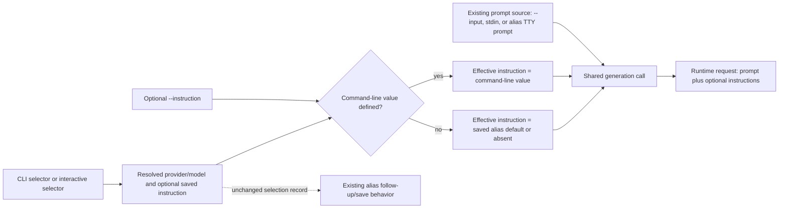

# Universal Command-Line Instruction - Plan

## Goal Capsule

- **Objective:** Add a universal, request-scoped `--instruction <text>` option that sends one behavioral instruction separately from the user's prompt for alias and explicit provider/model runs.
- **Authority:** The Product Contract owns observable CLI behavior, precedence, validation, streams, and non-persistence. The Planning Contract owns parser integration, the request overlay seam, runtime reuse, tests, packaging proof, documentation, and release mechanics. Repository instructions and tests remain binding where this plan is silent.
- **Execution profile:** One implementation phase and one pull request based on current `origin/main`. The pull request includes the originating ideation artifact, this plan, parser and application changes, focused and packaged tests, active documentation, and a minor changeset.
- **Stop conditions:** Stop if the installed `@swartzrock/byok-runtime` no longer supports a separate optional instruction field, if a provider would require prompt concatenation, if the CLI value cannot remain isolated from alias persistence, or if validation/runtime failures would need to echo the submitted instruction.
- **Tail ownership:** LFG implements and verifies the plan, simplifies and reviews the diff, applies review fixes, opens the pull request, and watches CI to a decided state.

---

## Product Contract

### Summary

`llm-now --instruction <text>` supplies one behavioral instruction for the current generation request. It works with a positional alias, `--alias`, an explicit `--provider`/`--model` selection, and the existing selector picker reached when other arguments bypass the launcher.

The instruction is not prompt text and is not persisted automatically. When an alias has saved instructions, the command-line value replaces that default for the current request only; omitting the option preserves existing alias behavior.

### Problem Frame

Aliases can already carry saved instructions, and the runtime can already send those instructions through provider-native system/developer channels. A caller who needs one different role or operating rule must currently edit the alias, create another alias, or mix behavioral context into the user prompt.

A request-scoped option closes that gap without adding a second prompt source, modifying alias storage, or duplicating provider translation inside `llm-now`.

### Actors

- A1. **Alias caller:** Uses a saved shortcut and may replace its saved instruction for one request.
- A2. **Direct caller:** Selects a provider/model for one run and may supply an instruction without creating an alias.
- A3. **Interactive caller:** Uses an argument-driven selector or alias-only prompt path while keeping the instruction attached to the eventual request.
- A4. **Automation caller:** Uses the deterministic CLI in a script or agent pipeline and depends on exact stdout, fixed diagnostics, and no configuration mutation.

### Requirements

**Invocation and precedence**

- R1. The singular `--instruction <text>` option must work with a positional alias, `--alias`, explicit `--provider` plus `--model`, and the existing selectorless interactive selection reached when arguments bypass the launcher.
- R2. A command-line instruction must be the complete effective instruction for that request. It replaces, rather than appends to, a saved alias instruction. Without the option, saved alias instructions retain their current behavior.
- R3. The option must be request-scoped. It must not mutate the resolved alias record, alias storage, fresh-selection state, or a later post-generation alias-save prompt. A later save may persist only instructions independently entered in that save flow.

**Prompt separation and textual contract**

- R4. `--instruction` is a behavioral modifier, never a prompt source. The user prompt continues to come from exactly one existing source: `--input`, stdin, or the alias-only interactive prompt. The option must not satisfy, bypass, or change existing prompt-source and deterministic-selection rules.
- R5. Validation must reject values that are blank after trimming or contain the existing prohibited instruction characters: tab, carriage return, other C0/C1 control characters, or Unicode line/paragraph separators. Ordinary line feed is allowed. Accepted values preserve the exact JavaScript string received from argv, including leading/trailing whitespace and line feeds.
- R6. Validation errors must be parser-level usage failures: exit `2`, empty stdout, a fixed `usage:` diagnostic on stderr, and no echo of the submitted value. Rejected input must cause no prompt read, alias load, provider access, generation, or mutation.
- R7. Repeated `--instruction` options retain the parser's current string-option behavior: the last value wins. Values beginning with `-` use the parser's standard `--instruction=<value>` form. No application-level maximum is introduced.

**Runtime, output, and observability**

- R8. The application must resolve one effective instruction immediately before generation, pass it unchanged through the existing runtime gateway field, and keep provider-native translation in `@swartzrock/byok-runtime`. Prompt concatenation and provider-specific branching are prohibited.
- R9. Successful stdout remains the exact model response, routine success adds no stderr output in noninteractive calls, and existing generation exit-code behavior remains unchanged. Runtime-derived failures must continue redacting the active command-line instruction in raw and serialized forms; successful model output remains unfiltered.
- R10. The option must perform no instruction-specific credential or vault lookup. It is not persisted by `llm-now`, but it is not a secret-input mechanism: shell history, process inspection, CLI-provider child arguments, provider handling/retention, or successful model output may expose it.

**Compatibility and release surfaces**

- R11. `--help`, `--version`, and `--aliases` remain exclusive standalone modes and reject combination with `--instruction` using their existing usage-error contract. Every invocation that omits the new option remains behaviorally unchanged.
- R12. Help, README guidance, manual verification, compiled-runtime smoke coverage, packaged release validation, and a minor Changeset must document and prove the option, replacement precedence, prompt separation, non-persistence, and visibility boundary.

### Key Decisions

- **Universal selector support.** (session-settled: user-directed — chosen over an explicit-selector-only first release because the user selected Idea 1, “Universal request-scoped `--instruction`.”) Governs R1 and R4.
- **Separate behavioral channel.** (session-settled: user-approved — chosen over prompt concatenation because the selected idea preserves the existing prompt-input contract.) Governs R4 and R8.
- **Command-line replacement precedence.** The command-line value replaces an alias's saved default for one request. This follows the selected ideation artifact's “Core now” recommendation and the runtime's single instruction field; append and conflict semantics would require different public vocabulary. Governs R2 and R3.
- **Request scope means no automatic persistence.** The override never becomes alias state. Existing save flows remain available but collect and persist their own separately entered value. Governs R3 and R10.
- **Preserve existing parser semantics.** Repetition remains last-wins and dash-prefixed values use `--instruction=<value>` rather than introducing special-case parsing. Governs R5-R7 and R11.

### Key Flows

- F1. **Alias default.** Resolve a positional alias or `--alias`; if no command-line value exists, generate with the exact saved instruction as today.
- F2. **Alias replacement.** Resolve an instructed or instruction-free alias, collect the prompt through `--input`, stdin, or the existing alias-only TTY prompt, and generate with the exact command-line value. Leave the resolved record and alias store unchanged.
- F3. **Explicit run.** Resolve `--provider` and `--model`, collect the prompt through `--input` or stdin, and generate with the command-line value. Any later interactive alias-save offer starts without inheriting that value.
- F4. **Argument-driven interactive selection.** When `--instruction` accompanies an otherwise selectorless interactive run, keep the existing argument-bypasses-launcher selector flow and apply the value to whichever alias or fresh provider/model target is selected. A fresh target must not be presented as equivalent to an instruction-free alias while the override is active; retain the independent legacy save offer instead. Do not add instruction state to the zero-argument adaptive launcher.
- F5. **Invalid option.** Reject blank or unsafe text during argument parsing, before prompt or selection work, with a sanitized usage diagnostic.
- F6. **Runtime failure.** Forward the value through the existing runtime request. If the runtime fails, redact the active instruction from the diagnostic while retaining the existing exit and stream contract.

### Acceptance Examples

- AE1. **Covers R1, R2, R3, R5, and R8.** Given alias `fred` has saved instructions `saved`, `llm-now fred --instruction "  temporary\nrule  " --input "hello"` sends the exact JavaScript string `  temporary\nrule  ` as the runtime instruction, sends `hello` as the prompt, and leaves `fred` unchanged with `saved`.
- AE2. **Covers R2 and R11.** The same alias invocation without `--instruction` sends `saved`, proving the new option is additive and omission-compatible.
- AE3. **Covers R1, R4, R8, and R9.** `llm-now --provider openai --model gpt-5 --instruction "temporary" --input "hello"` sends separate prompt and instruction fields, emits only the exact model response on stdout, and does not create or change an alias.
- AE4. **Covers R1, R3, and R4.** A positional alias, `--alias`, explicit selection, and argument-driven interactive selection all carry the override across their existing prompt paths. If a fresh interactive run later offers alias saving, the CLI value is neither prefilled nor persisted; separately entered save instructions still work.
- AE5. **Covers R5, R6, and R11.** Blank, tab-bearing, carriage-return-bearing, other prohibited-control-bearing, and Unicode-separator-bearing values exit `2` with fixed `usage:` stderr, empty stdout, no submitted text, and zero application/runtime work. LF-only multiline structure remains accepted when the value is otherwise nonblank.
- AE6. **Covers R7 and R11.** Repeating the option sends only the last parsed value; combining it with `--help`, `--version`, or `--aliases` is a usage error; `--instruction=-brief` supplies `-brief`.
- AE7. **Covers R4.** `--instruction` does not resolve missing prompt input, does not make simultaneous `--input` and stdin valid, and does not make a selectorless noninteractive invocation deterministic.
- AE8. **Covers R9 and R10.** A runtime failure containing raw or serialized forms of a command-line instruction emits neither form; successful model output remains byte-faithful. Documentation warns that the flag is visible outside `llm-now`'s diagnostic boundary.
- AE9. **Covers R12.** Compiled and packaged checks distinguish a saved alias default from a different command-line replacement and prove the explicit provider/model form through a fixed presence marker without echoing instruction text.

### Scope Boundaries

**In scope**

- One request-scoped `--instruction <text>` string option.
- Positional alias, `--alias`, explicit provider/model, and existing argument-driven interactive selection.
- Replacement precedence over saved alias instructions, parser validation, exact forwarding, failure redaction, tests, documentation, packaging proof, and minor release intent.
- Inclusion of `docs/ideation/2026-08-05-command-line-instruction-ideation.html` and this plan in the implementation pull request.

**Deferred follow-up**

- `--no-instruction` for temporarily suppressing an alias default.
- `--instruction-file` for file-backed text.
- `--append-instruction` or another explicit composition vocabulary.
- A dedicated inspection surface for the effective instruction.

**Out of scope**

- Prompt concatenation, provider-specific implementation in `llm-now`, or a runtime contract change.
- Alias schema, saved-instruction capture, credential screening, vault reads, alias inventory, or instruction persistence changes.
- Environment interpolation, templates, multiple composed values, a new instruction-only launcher mode, or an application-level length limit.
- A parallel API, MCP tool, or agent-only interface; the CLI is already the automation surface.

---

## Planning Contract

### Key Technical Decisions

- KTD1. **Parse one optional request modifier in `src/args.ts`.** Add `instruction?: string` only to the `run` variant and to the strict `node:util.parseArgs` string options. Keep the public singular/internal runtime plural naming: `--instruction`, `parsed.instruction`, and runtime `instructions`. Return the optional property only when defined, following the existing optional `input` shape.
- KTD2. **Reuse the saved-instruction textual predicate without persistence policy.** Validate prohibited characters with the existing exported `hasInvalidInstructionCharacters` contract and blankness with `trim()`, returning the original value unchanged. Check prohibited characters before blankness so the command-line rule matches saved-instruction capture. Throw fixed `UsageError` messages that never interpolate the value. Do not invoke credential or vault persistence guards.
- KTD3. **Overlay only at the shared generation boundary.** After prompt and selection resolution converge in `runApplication`, compute the effective value as `parsed.instruction ?? selection.selection.instructions` and pass it as the existing fifth `generateWithTimeout` argument. Do not mutate `selection.selection` or copy the overlay into `ResolvedSelection`; those objects feed shortcut equivalence and post-generation save behavior. When a request-scoped value accompanies a fresh interactive selection, treat a provider/model-only existing-alias match as behaviorally incomplete: suppress the existing-alias reuse receipt and retain the independent legacy save offer without prefilling the command-line value.
- KTD4. **Keep prompt resolution and selection ownership unchanged.** `--instruction` participates in neither the exactly-one-prompt-source contract nor deterministic-selection checks. Options continue to bypass the zero-argument adaptive launcher, so a selectorless interactive call uses the existing selector flow; a selectorless noninteractive call retains its current usage failure.
- KTD5. **Keep runtime ownership unchanged.** `src/runtime.ts` already conditionally adds the optional instruction to `generateText`, preserves accepted text, omits absence, and redacts raw/serialized forms from failures. Do not change the gateway signature, construct a provider matrix, or concatenate text. Add runtime-unit coverage only if implementation reveals a changed gateway contract.
- KTD6. **Protect public and packaged contracts with value-distinguishing fixtures.** Parser tests own syntax, validation, help, and exclusivity. Application tests own precedence, prompt-path parity, isolation from alias saving, streams, and redaction integration. Compiled and package checks use fixed presence/state markers and distinct saved/override sentinels without printing instruction values.
- KTD7. **Document a visible but nonpersistent argument.** Help and README call the value a request-scoped behavioral instruction, state replacement precedence and prompt separation, and avoid “secret” or universal “system prompt” promises. README and manual checks name the shell/process/child-argument/provider/success-output visibility boundary.

### High-Level Technical Design

The new option is a request overlay after selection resolution and before the existing provider-neutral runtime boundary.

| Selection surface | Saved instruction | `--instruction` | Effective request value | Persistence effect |
|---|---:|---:|---|---|
| Positional alias or `--alias` | absent | absent | omitted | none |
| Positional alias or `--alias` | present | absent | saved value | none |
| Positional alias or `--alias` | absent/present | present | command-line value | none |
| Explicit provider/model | n/a | absent | omitted | none |
| Explicit provider/model | n/a | present | command-line value | none |
| Argument-driven interactive selection | absent/present | present | command-line value | later save flow remains independent |

### Assumptions

- “Universal across selectors” includes the existing selectorless interactive picker reached when arguments bypass the adaptive launcher. It does not add instruction state to the zero-argument launcher.
- Command-line replacement precedence is part of the selected ideation artifact's minimal core even though it was presented as a companion idea to the syntax concept.
- `node:util.parseArgs` continues to use last-value-wins for repeated string options; this plan does not introduce option-specific repeat detection.
- Exact preservation begins with the JavaScript string received from argv. Shell quoting, expansion, command substitution, and OS argument decoding happen before `llm-now` can observe the value.
- The existing saved-instruction character predicate remains the canonical safety rule; ordinary LF is valid, while tab and CR are invalid.
- Request-scoped instructions may be large up to platform/runtime limits. Existing process or provider errors remain the failure mechanism.
- The installed `@swartzrock/byok-runtime` 2.2.0 remains the provider-native translation owner and needs no dependency update for this feature.
- The unrelated untracked `examples/` directory, if present during execution, is user-owned and must remain untouched and unstaged.

### Agent-Native Planning Assessment

The CLI itself provides full agent parity: an agent can select the same alias or provider/model, supply the same request-scoped instruction, and consume the same stdout/stderr/exit contract as a person or shell script. No additional agent API is needed.

Determinism depends on explicit precedence and isolation. Tests therefore prove a command-line value overrides hidden alias defaults for one request, no alias state changes, successful stdout remains byte-exact, failures redact the active value, and all deterministic selector/prompt forms behave consistently.

### Sequencing

Use one implementation phase and one pull request:

1. Add parser shape, validation, help, and focused argument tests.
2. Add the generation-boundary overlay and application behavior tests without mutating resolved selection state.
3. Extend compiled and packaged verification with distinct saved/default/override markers.
4. Update active documentation and add minor release metadata.
5. Run focused, full, compiled, packaged, release-metadata, and diff-hygiene gates.

---

## Implementation Units

### U1. Public argument and validation contract

- **Goal:** Parse and validate the universal request-scoped modifier without changing prompt or selection semantics.
- **Requirements:** R1, R4-R7, R11; F4-F5; AE4-AE7; KTD1-KTD2 and KTD4.
- **Dependencies:** None.
- **Files:** `src/args.ts`, `tests/args.test.ts`
- **Approach:**
  1. Extend the help usage, rules, and options text with `--instruction <text>`, request scope, prompt separation, and replacement precedence in the existing compact style.
  2. Add the strict string option and optional run-result property using existing parser conventions.
  3. Validate the exact received string against the saved-instruction control-character predicate and then nonblankness; retain the original accepted string.
  4. Let the existing `supplied` and standalone-mode logic reject combinations with `--aliases`, `--help`, and `--version`.
  5. Preserve existing last-wins repeated-string behavior and the parser's standard equals syntax for dash-prefixed values.
- **Patterns to follow:** `nonBlankArgument`, optional `input` return construction, standalone informational-mode exclusivity, and the exact help snapshot in `tests/args.test.ts`.
- **Test scenarios:**
  - Parse exact leading/trailing whitespace and LF-bearing values for positional alias, `--alias`, explicit provider/model, and selectorless interactive selection.
  - Reject blank, tab, CR, remaining prohibited C0/C1 characters, and U+2028/U+2029 with fixed value-free usage errors.
  - Prove repeated values are last-wins and `--instruction=-brief` is accepted.
  - Combine the option with each standalone informational mode and verify existing exclusivity.
  - Prove prompt and deterministic-selection errors remain unchanged when the modifier is present.
  - Update the exact help snapshot and option landmarks.
- **Verification:** `bun test tests/args.test.ts` proves the complete parser, diagnostics, and help contract.

### U2. Request overlay and non-persistence

- **Goal:** Resolve the effective instruction at generation time for every supported selection/prompt path while leaving alias state untouched.
- **Requirements:** R1-R4, R8-R11; F1-F6; AE1-AE8; KTD3-KTD5.
- **Dependencies:** U1.
- **Files:** `src/app.ts`, `tests/app.test.ts`
- **Approach:**
  1. At the existing shared generation tail, choose the parsed command-line value when defined and otherwise use the resolved selection's saved value.
  2. Pass that local value into the unchanged runtime gateway call; never assign it to the selected alias/fresh-selection record.
  3. Keep alias-only TTY prompt collection, stdin, `--input`, interactive target selection, and noninteractive selection enforcement unchanged.
  4. Make fresh-selection shortcut follow-up aware that a request-scoped instruction prevents provider/model-only alias equivalence. Keep the overlay out of saved state, suppress the incomplete reuse receipt, and let the existing independent save flow collect its own value.
  5. Preserve existing response fidelity, success streams, diagnostic redaction, and all unaffected post-generation shortcut follow-up behavior.
- **Patterns to follow:** The current `resolveSelection` branches and single `generateWithTimeout` call in `runApplication`; existing frozen selection fixtures, output assertions, and saved-instruction tests in `tests/app.test.ts`.
- **Test scenarios:**
  - Table-test positional alias, `--alias`, explicit selection, and selectorless interactive selection with exact command-line forwarding.
  - Cover `--input`, piped stdin, and alias-only interactive prompt input without treating the instruction as prompt text.
  - Preserve a saved alias value when the option is absent; replace a different saved value for one request when present; add a value to an instruction-free alias without mutation.
  - Freeze or snapshot resolved alias state and reload the real store to prove no command-line value is persisted.
  - Complete a fresh interactive run and accept the legacy alias-save offer; prove the command-line value is not prefilled or persisted, while separately entered saved instructions still work.
  - Match a fresh interactive provider/model target to an instruction-free alias while the option is active; prove the application does not claim that alias reproduces the request and instead keeps the independent save offer.
  - Reject invalid input before alias, prompt, provider, or generation dependencies are touched.
  - Exercise a runtime error containing raw and serialized CLI instruction forms and verify redaction; preserve successful response bytes and noninteractive stderr silence.
- **Verification:** `bun test tests/app.test.ts` proves precedence, selector/prompt parity, non-persistence, output, and failure behavior.

### U3. Compiled, packaged, documentation, and release proof

- **Goal:** Make the new public option discoverable and prove it survives compilation and release packaging.
- **Requirements:** R9-R12; AE8-AE9; KTD6-KTD7.
- **Dependencies:** U1 and U2.
- **Files:** `tests/runtime-compile-smoke.ts`, `scripts/release-validate.ts`, `README.md`, `docs/manual-testing.md`, `.changeset/<generated-command-line-instruction-name>.md`, `docs/ideation/2026-08-05-command-line-instruction-ideation.html`
- **Approach:**
  1. Extend compiled smoke coverage with an explicit request-scoped instruction and an alias replacement whose saved and command-line sentinels differ; assert only fixed presence/state markers.
  2. Mirror the explicit or replacement case in native packaged validation using temporary configuration and the maintained fake CLI contract.
  3. Document invocation examples for positional alias, `--alias`, explicit provider/model, precedence, prompt separation, non-persistence, dash-prefixed syntax, and observability limits.
  4. Add manual cases for exact multiline preservation, invalid usage, prompt-source invariants, alias replacement/no mutation, independent post-run saving, redaction, and packaged transport.
  5. Add a minor Changeset; do not edit `CHANGELOG.md` directly.
  6. Preserve and include the originating ideation artifact without regenerating unrelated documents.
- **Patterns to follow:** Fixed `fake:instruction-present`-style markers in runtime fixtures, temporary-home package validation, current README instruction warnings, numbered manual checks, and existing Changesets format.
- **Test scenarios:**
  - Compile the CLI and prove explicit selection forwards the option.
  - Use distinct saved and command-line synthetic values to prove packaged alias replacement, not merely instruction presence.
  - Verify compiled help includes the new option and matches active documentation.
  - Verify diagnostics and fixture failures never echo synthetic values.
  - Verify Changesets accepts the minor release record.
- **Verification:** Compiled smoke, native release validation, documentation review, and Changesets prove the shipped surface.

---

## System-Wide Impact

- **CLI boundary:** One new strict string option and one optional field on the parsed run result. Informational modes remain exclusive.
- **Application state:** One local effective-value overlay at the shared generation call. Resolved selection and alias persistence objects remain unchanged.
- **Runtime boundary:** No signature or provider change. The existing optional `instructions` request field remains the only transport primitive.
- **Persistence and credentials:** No alias schema/write change, no instruction-specific credential screening, and no vault access. Real-store tests prove no mutation.
- **Output and security:** Existing exact stdout and runtime-failure redaction continue. Documentation expands the local/provider visibility warning for argv-supplied values.
- **Packaging and release:** Compiled smoke, native validation, help landmarks, and a minor Changeset move with the public option.
- **Agent parity:** Deterministic CLI callers gain the same request control as interactive users without a separate automation surface.

## Verification Contract

| Gate | Command | Proves |
|---|---|---|
| Focused parser behavior | `bun test tests/args.test.ts` | Syntax, exact accepted strings, invalid values, repetition, standalone conflicts, and help |
| Focused application behavior | `bun test tests/app.test.ts` | Selection/prompt parity, replacement precedence, non-persistence, streams, and redaction |
| Static contract | `bun run typecheck` | Parsed result and application integration remain type-safe |
| Compiled runtime smoke | `bun run runtime:smoke` | The compiled CLI forwards the option and exposes updated help |
| Full project check | `bun run check` | Complete tests, typecheck, and compiled smoke remain green |
| Native package build | `bun run build:native --target macos-arm64 --outdir dist` | Produces the current-host archive used by the packaged smoke gate |
| Packaged release validation | `bun scripts/release-validate.ts smoke dist/llm-now-v2.2.0-macos-arm64.zip` | The native release artifact preserves the documented behavior |
| Release metadata | `bun run changeset:status` | The user-facing feature has valid minor release intent |
| Diff hygiene | `git diff --check` | No patch-format or whitespace defects |

## Definition of Done

- Every requirement and acceptance example is implemented or proven by tests at its owning unit.
- `--instruction` works across the defined alias, explicit, and argument-driven interactive selection surfaces while prompt-source rules remain unchanged.
- A command-line value replaces a saved alias instruction for one request, never mutates resolved/persisted alias state, and never leaks into a later save flow.
- Accepted values reach the runtime unchanged from argv; invalid values fail early with value-free usage diagnostics.
- The runtime remains provider-neutral, successful output remains exact, and failure redaction covers the active command-line value.
- Help, README, manual tests, compiled/package validation, and the minor Changeset match the implementation and visibility boundary.
- Every gate in the Verification Contract passes.
- The pull request contains the ideation artifact, this plan, and only files required by this feature; unrelated user-owned files remain unstaged and untouched.
- No abandoned or experimental implementation remains in the diff.

## Sources

- `docs/ideation/2026-08-05-command-line-instruction-ideation.html` — selected product direction, minimal core, alternatives, and observability framing.
- `docs/plans/2026-08-02-001-feat-shortcut-instructions-plan.md` — saved-instruction schema, runtime, redaction, and documentation contracts this feature extends without reopening.
- `src/args.ts` and `tests/args.test.ts` — strict parser, selector normalization, prompt modifiers, standalone modes, and exact help contract.
- `src/app.ts` and `tests/app.test.ts` — selection resolution, prompt convergence, generation boundary, alias follow-up, streams, and integration fixtures.
- `src/aliases.ts` — canonical saved-instruction validation predicate and alias persistence boundary.
- `src/runtime.ts`, `tests/runtime.test.ts`, and `tests/runtime-compile-smoke.ts` — provider-neutral instruction forwarding, exact omission/preservation, failure redaction, and compiled proof.
- `scripts/release-validate.ts`, `README.md`, `docs/manual-testing.md`, and `.changeset/` — packaged behavior, public contract, manual verification, and release intent.
- No applicable repository learning was found under `docs/solutions/`; that directory does not exist.
