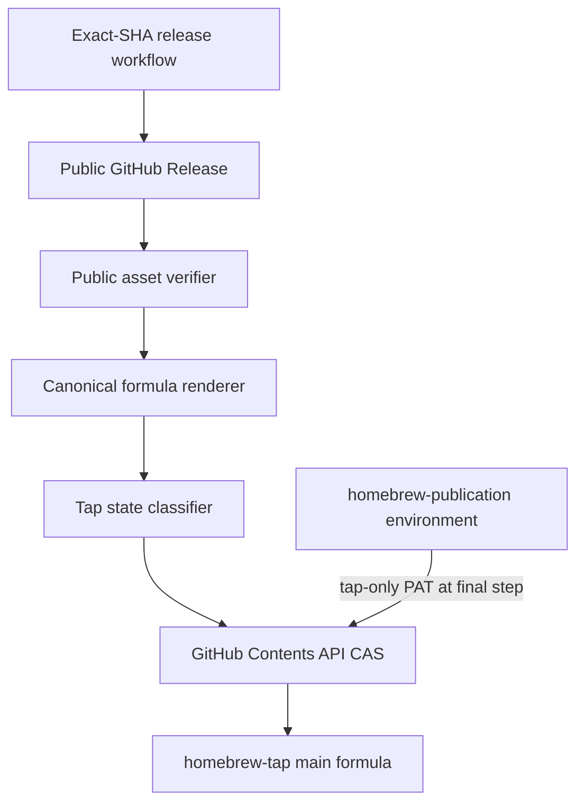
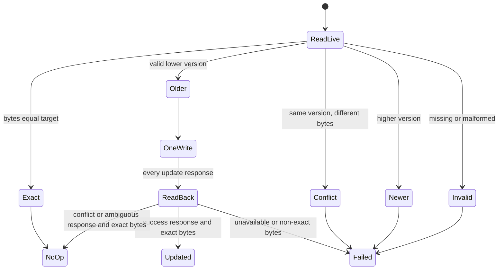

# Homebrew Release Reconciliation - Plan

## Goal Capsule

- **Objective:** Reconcile every exact, verified `llm-now` GitHub Release into the four-platform formula on `swartzrock/homebrew-tap/main` without weakening release immutability or overwriting unexpected tap state.
- **Authority:** The Product Contract owns observable publication and recovery outcomes. The Planning Contract owns formula generation, release-job gating, GitHub API concurrency, and credential isolation. The existing exact-release verifier remains authoritative where this plan is silent.
- **Repository scope:** The implementation lands in `swartzrock/llm-now`. `swartzrock/homebrew-tap` is the external projection target; its current public formula is the compatibility baseline and requires no bootstrap commit.
- **Execution profile:** One implementation phase and one pull request covering the canonical formula, reconciler, release workflow, policy tests, and operational documentation.
- **Stop conditions:** Stop before mutation if the public Release cannot be reverified, the tap formula is missing or malformed, the same version has different bytes, the tap is newer, branch policy rejects the automation identity, or the tap token is missing or under-scoped.
- **Tail ownership:** LFG implements the plan, applies review fixes, opens the pull request, and watches CI to a decided state. PAT provisioning and the first release-workflow commissioning run remain human-owned operations.

---

## Product Contract

### Summary

The existing exact-release workflow gains a post-publication Homebrew projection that runs after a fresh publication and after verification of an already-complete exact Release.
It derives the tap formula only from reverified public assets and changes one tap file only when the live formula is a safe older version.

### Problem Frame

`llm-now` already publishes signed, attested, exact-SHA releases with an authoritative checksum manifest and fail-closed rerun semantics.
The Homebrew formula is maintained separately, so a valid Release can exist while the tap remains stale.
This feature is a deliberate release-reliability commitment: every future `llm-now` Release should become installable from Homebrew without a separate maintainer update.

The source repository already renders four native Homebrew bindings, but its formula template differs from the live tap outside the release coordinates.
A blind third-party “latest release” updater would create a second checksum authority, lose the exact-SHA recovery model, and broaden cross-repository credentials.

### Requirements

**Release handoff and recovery**

- R1. A successful fresh exact Release and a verified-existing exact Release must enter the same Homebrew reconciliation path; failed or cancelled validation, failed or cancelled publication, non-publication dispatch, and unrelated dependency skips must not enter it.
- R2. Reconciliation must download the public tagged Release and reverify the exact five-archive plus `SHA256SUMS` asset set, manifest checksums, and archive attestations against the validated release SHA before formula rendering.
- R3. A Homebrew failure must leave the tag, GitHub Release, release assets, checksum manifest, and attestations unchanged.
- R4. Exact-SHA manual dispatch with publication enabled must remain the recovery path after the normal workflow-rerun window expires.

**Canonical formula projection**

- R5. One canonical source template must deterministically render the complete tap formula with immutable URLs and SHA-256 values for macOS and Linux on ARM64 and AMD64.
- R6. Rendering the 2.2.0 public manifest must match the current public tap formula byte-for-byte so the static compatibility baseline is an exact no-op.
- R7. The rendered formula must contain one stable version, exactly four release URLs, exactly four authoritative checksums, no unresolved placeholders, and the tap’s current formula metadata, Homebrew DSL, install block, and version test.

**Tap state and mutation**

- R8. The reconciler must treat the live formula as untrusted bounded UTF-8 text, validate its managed four-platform formula fingerprint without evaluating or echoing it, and classify it as exact, safely older, same-version divergent, newer, or invalid before mutation.
- R9. Exact bytes must succeed without a commit; an older formula may advance once only when its fixed structure, repository URLs, target filenames, stable version, and checksum shapes match the managed fingerprint; same-version divergence, newer state, missing content, or invalid content must fail without mutation.
- R10. An allowed update must target only `swartzrock/homebrew-tap`, branch `main`, path `Formula/llm-now.rb`, and must use the observed file SHA as an optimistic concurrency precondition.
- R11. Every attempted update must make exactly one bounded read-back attempt; only exact desired bytes may report success, and a conflict, ambiguous response, unavailable read-back, or non-exact read-back must never trigger a second write in that run.
- R12. Every terminal result must emit a structured updated, already-current, failed-before-write, or write-outcome-unconfirmed disposition plus a trusted failure phase and reason, validated tag, release SHA, constant tap identity, and nullable HTTP status and request ID; raw formulas, manifests, API bodies, headers, and credentials must never enter diagnostics or job summaries. When failure occurs before the reconciler runs, the workflow summary must synthesize failed-before-write from trusted step outcomes and preserve the originating job failure.

**Credential and operational boundary**

- R13. The cross-repository credential must be a fine-grained PAT restricted to `swartzrock/homebrew-tap` with repository Contents write permission and no Workflow, Administration, Actions, organization, or source-repository permission; its residual authority over every non-workflow file in that tap must be documented.
- R14. The tap credential must be stored as `HOMEBREW_TAP_TOKEN` in a dedicated `homebrew-publication` environment whose deployment policy admits only protected `main` and trusted stable release tags matching `v*`; the job is environment-gated, while only its final mutation step may interpolate the secret.
- R15. Missing, expired, denied, rate-limited, or under-scoped credentials must fail only Homebrew reconciliation and preserve the exact public Release for recovery.

### Key Flows

- F1. **Fresh release projection**
  - **Trigger:** The release workflow publishes and verifies the exact tag and assets.
  - **Steps:** Reverify public state, render the formula, classify the tap, and perform at most one SHA-guarded update.
  - **Outcome:** The tap advances exactly once or is already exact; failures preserve Release state and distinguish pre-write refusal from an unconfirmed write outcome.
  - **Covered by:** R1-R3, R5-R15.
- F2. **Verified-existing recovery**
  - **Trigger:** Exact-SHA dispatch finds the complete expected Release and skips build and publish.
  - **Steps:** Enter the same public-state verification and tap reconciliation path without using private build artifacts.
  - **Outcome:** A stale tap advances or an exact tap no-ops without any Release mutation.
  - **Covered by:** R1-R4, R8-R15.
- F3. **Concurrent or divergent tap state**
  - **Trigger:** The tap changes after the initial read or already contains unexpected bytes.
  - **Steps:** Refuse unsafe initial states; after an update conflict or ambiguous response, read once and reclassify.
  - **Outcome:** Exact target bytes succeed as already current; every other state fails without another write.
  - **Covered by:** R8-R12, R15.

### Acceptance Examples

- AE1. **Covers F1 and R1-R3.** Given a freshly published exact Release and an older valid tap formula, reconciliation verifies public evidence and creates one formula update without changing Release state.
- AE2. **Covers F2 and R1-R4.** Given an already-complete exact Release and an older valid tap formula, exact-SHA dispatch skips build and publish but still updates the tap from public assets.
- AE3. **Covers R6 and R9.** Given Release 2.2.0 and the current public 2.2.0 tap formula, reconciliation produces identical bytes and performs no write.
- AE4. **Covers F3 and R8-R11.** Given the same formula version with a changed URL, checksum, or structure, reconciliation fails and preserves the divergent file.
- AE5. **Covers F3 and R8-R11.** Given a newer formula, an older release run refuses downgrade and performs no write.
- AE6. **Covers R10 and R11.** Given a stale file SHA during update and an exact desired read-back, reconciliation succeeds as already current without a second write.
- AE7. **Covers R10-R12.** Given a stale file SHA, ambiguous response, or nominally successful update followed by a non-exact read-back, reconciliation reports write-outcome-unconfirmed and fails without a second write.
- AE8. **Covers R3 and R13-R15.** Given a missing or denied tap token, Homebrew reconciliation fails after public verification and leaves the valid Release untouched for exact-SHA recovery.

### Scope Boundaries

**In scope**

- Canonical whole-file formula convergence and byte-level compatibility coverage.
- A source-side deterministic tap state classifier and one-write GitHub Contents API client.
- A post-publication release-workflow job for fresh and verified-existing Releases.
- Release-policy tests, release-operator documentation, and manual commissioning scenarios.
- The existing ideation artifact and this plan in the implementation pull request.

#### Deferred to Follow-Up Work

- A GitHub App installation token if the automation grows beyond one personal tap or PAT lifecycle policy becomes burdensome.
- A tap-side pull reconciler or generated pull-request promotion lane if repository policy later prohibits direct formula commits.
- A stronger functional Homebrew formula test beyond the current version assertion.
- A standalone operator or agent reconciliation API outside GitHub Actions.

**Out of scope**

- A tap-side workflow, tap CI system, or bootstrap edit to the current public tap formula.
- Changes to the GitHub Release asset set, tag model, signing, notarization, attestation production, or immutable-release settings.
- Homebrew Releaser, Bump Homebrew Formula, latest-release discovery, or a separate `release: published` workflow.
- Automatic PAT creation, rotation, environment approval, or branch-policy changes.
- New end-user CLI flags, MCP tools, plugins, or provider behavior.

---

## Planning Contract

### Key Technical Decisions

- KTD1. **Reconcile inside the exact release workflow.** (session-settled: user-directed — chosen over Homebrew Releaser, a tap puller, or a `release: published` workflow because the existing workflow owns exact-SHA verification and recoverable reruns.) Add a dedicated post-publication job that admits fresh publish success and the verified-existing publish-skip path for R1-R4.
- KTD2. **Compile the entire formula from one canonical template.** (session-settled: user-directed — chosen over a tap-owned skeleton or generated binding island because deterministic whole-file output removes competing authorities and makes exact no-op verification possible.) Converge the source template to the public 2.2.0 tap file before enabling mutation for R5-R7.
- KTD3. **Use a direct compare-and-swap file update.** (session-settled: user-directed — chosen over a generated pull-request lane because one deterministic file does not justify branch and merge lifecycle machinery.) Implement the R8-R12 state contract in a narrow Bun script and use the current Contents API file SHA for one write.
- KTD4. **Use a tap-only fine-grained PAT.** (session-settled: user-directed — chosen over a broad classic PAT or GitHub App because one personal tap needs the smallest practical cross-repository identity.) Keep the credential in a dedicated job-level environment and interpolate it only in the mutation step for R13-R15. Accept and document that Contents write is repository-wide for non-workflow files, not path-scoped.
- KTD5. **Use public Release state for release coordinates and the exact-SHA template for formula structure.** Reverify the remote tag SHA, published non-prerelease state, asset allowlist, checksums, and attestations in the Homebrew job. Do not render from private build artifacts.
- KTD6. **Do not retry writes within one reconciliation run.** One read-back resolves an update conflict or ambiguous response. Exact bytes are success; all other states fail for operator rerun. This preserves R11 and simplifies reasoning about concurrent versions.
- KTD7. **Keep the established release verifier intact.** Add focused public re-verification and policy assertions at the new boundary instead of extracting the inline release state machine into a broad refactor.
- KTD8. **Parse every external body as hostile data.** Bound and validate Contents responses, Base64, UTF-8, formula structure, release metadata, and summary fields. Never execute the live Ruby formula or include raw external text in logs.

### High-Level Technical Design

The release repository remains the controller, the public Release remains the evidence boundary, and the tap remains a one-file materialized view.



Fresh publication and recovery join before public re-verification.

```mermaid
sequenceDiagram
  participant R as Release workflow
  participant G as Public GitHub Release
  participant H as Homebrew sync job
  participant T as Tap main
  alt Fresh exact release
    R->>G: Publish and verify exact assets
  else Verified existing exact release
    R->>G: Verify complete state; skip build and publish
  end
  R->>H: Admit reconciliation path
  H->>G: Download manifest and archives
  H->>H: Verify checksums and attestations; render
  H->>T: Read bounded formula and blob SHA
  alt Exact bytes
    H-->>R: Already current
  else Older valid formula
    H->>T: One SHA-guarded update
    H->>T: Read back exact bytes after every response
    H-->>R: Updated or write outcome unconfirmed
  else Divergent, newer, or invalid
    H-->>R: Fail without mutation
  end
```

The semantic state machine prevents downgrade and same-version overwrite independently of workflow concurrency.



### Assumptions

- The public tap’s 2.2.0 formula is the canonical compatibility baseline. Its public `main` has no ruleset, and static public comparison can prove source-template convergence without changing installation behavior.
- Classic branch protection is not anonymously inspectable. Commissioning verifies that `homebrew-tap/main` permits this fine-grained identity; a denial stops the direct-write rollout rather than broadening permissions.
- The `homebrew-publication` environment has no required reviewer by default so release-to-tap projection stays automatic. Its deployment branch and tag policy admits only protected `main` and trusted stable release tags matching `v*`; maintainers may add approval later as a stricter operational policy.
- The reconciler pins GitHub REST API version `2026-03-10`, which supports fine-grained PATs and SHA-guarded Contents updates.
- A `404` response is invalid or unauthorized state, not permission to create the formula.
- A timeout, rate limit, server failure, or non-exact read-back after an attempted write is a write-outcome-unconfirmed result. Exact-SHA rerun performs recovery without a second write in the original run.
- Release 2.2.0 cannot live-commission the new workflow because its tag predates the Homebrew job. The first post-merge release commissions the write path; its exact SHA remains the recovery target.
- Release-infrastructure changes in this repository do not require a Changeset because they do not alter the shipped CLI contract.

### Sequencing

Use one implementation phase and one pull request:

1. Converge the canonical formula and establish a public 2.2.0 byte-level golden baseline.
2. Implement the pure state classifier and narrow Contents API transaction with exhaustive failure coverage.
3. Add the independently gated Homebrew job and update release-policy assertions.
4. Document credential commissioning, dispositions, and exact-SHA recovery; then run the full verification contract.

### System-Wide Impact

- **Release lifecycle:** “Release complete, tap stale” becomes a supported partial-completion state with an exact-SHA recovery route.
- **Concurrency:** Release runs remain grouped by release SHA, so semantic version refusal plus blob-SHA concurrency guards prevent an older run from overwriting a newer formula.
- **Security:** Build, signing, notarization, and public verification do not interpolate the tap token. The Homebrew job is environment-gated, and only its one-file mutation step receives the secret.
- **Repository ownership:** Formula semantics move to the source template; tap history remains the audit log of generated release projections.
- **Operations:** PAT provisioning, expiration, rotation, environment configuration, and branch-policy verification become documented release prerequisites.

### Risks and Dependencies

- **Branch policy denial:** A required-PR or restricted-push rule may reject direct Contents updates. Mitigation: complete authenticated token, environment-ref, and branch-policy preflight before the next release; the first post-merge release remains the write-path commissioning event. Stop for the separately planned PR lane if policy cannot permit the narrow identity.
- **Tagged recovery lifetime:** An old exact-SHA workflow can eventually outlive its pinned runner, action, or API support. Mitigation: document that recovery is guaranteed only while the tagged workflow dependencies remain supported, monitor deprecations, and require a separately reviewed current-code recovery enhancement before retiring a dependency that would break still-relevant release tags.
- **Credential lifecycle:** Fine-grained PATs are user-bound and expiring. Mitigation: document expiry, rotation, and an exact-SHA recovery drill.
- **Credential blast radius:** Contents write can modify any non-workflow file in the tap. Mitigation: restrict the token to the tap, protect the environment for `main`, prohibit job-wide or checkout exposure, and monitor the returned commit identity.
- **Ambiguous API completion:** A timeout or server error may follow a successful write, and later divergence cannot prove whether a transient commit occurred. Mitigation: require one exact read-back, report write-outcome-unconfirmed when it is not exact, and never issue a second write.
- **Formula drift:** Manual same-version edits would block reconciliation. Mitigation: byte-level golden coverage, full-file generation, clear source ownership, and a diagnostic that distinguishes drift from downgrade.
- **Workflow policy regression:** Existing tests currently prohibit Homebrew integration and broadly scan secret-bearing steps. Mitigation: replace those assertions with precise job gating, public verification, checkout identity, and secret-confinement contracts.

### Sources and Research

- `docs/ideation/2026-08-05-homebrew-release-sync-ideation.html` — selected direction, alternatives, state table, and repository impact.
- `.github/workflows/release.yml` — exact-release validation, build, signing, publish, and verified-existing no-op paths.
- `scripts/package-render.ts` and `packaging/homebrew/llm-now.rb` — strict manifest parsing and current formula template.
- `scripts/release-plan.ts` — stable semantic-version comparison pattern.
- `tests/packaging.test.ts` and `tests/release-policy.test.ts` — existing renderer and workflow policy contracts.
- `docs/RELEASING.md` and `docs/manual-testing.md` — current release ownership and operator checks.
- `https://docs.github.com/en/rest/repos/contents?apiVersion=2026-03-10` — Contents API permissions, SHA precondition, responses, and fine-grained token support.
- `https://docs.github.com/en/actions/concepts/security/github_token` — repository token scope and event-suppression behavior.
- `https://docs.github.com/en/actions/reference/workflows-and-actions/deployments-and-environments` — environment secret and protection boundary.
- `https://docs.brew.sh/Formula-Cookbook#handling-different-system-configurations` — supported nested OS and architecture formula DSL.

---

## Implementation Units

### U1. Canonical four-platform formula

- **Goal:** Make the source template compile to the exact current public tap formula and lock the whole-file contract with a golden fixture.
- **Requirements:** R5-R7; AE3; KTD2.
- **Dependencies:** None.
- **Files:** `packaging/homebrew/llm-now.rb`, `tests/packaging.test.ts`, `tests/fixtures/homebrew/llm-now-2.2.0.rb`
- **Approach:**
  1. Converge the template’s headers, description, nested OS and architecture blocks, install stanza, and version test to the public tap baseline.
  2. Preserve strict version, URL, checksum, duplicate-entry, and unresolved-token validation in the existing renderer.
  3. Render the authoritative 2.2.0 manifest and assert exact fixture equality in addition to the existing per-target substitutions.
- **Execution note:** Begin with a failing golden comparison against the public 2.2.0 formula, then make the template converge without changing rendered installation behavior.
- **Patterns to follow:** Strict manifest and token handling in `scripts/package-render.ts`; current public `swartzrock/homebrew-tap/main/Formula/llm-now.rb`.
- **Test scenarios:**
  - Covers AE3. Render the real 2.2.0 version and checksums and verify byte equality with the golden public formula.
  - Render a future stable version and verify exactly four immutable release URLs and four matching checksums across the OS and architecture blocks.
  - Provide missing, duplicate, or malformed required Homebrew target entries and verify strict failure before output while allowing the authoritative Windows manifest entry owned by release verification.
  - Verify no unresolved token remains and the rendered stable version appears exactly once.
- **Verification:** Focused packaging tests prove deterministic output, current-tap convergence, and strict four-platform binding.

### U2. Fail-closed tap reconciler

- **Goal:** Classify live tap state and perform at most one optimistic formula update through a narrow GitHub Contents API client.
- **Requirements:** R8-R13, R15; AE3-AE8; KTD3, KTD4, and KTD6.
- **Dependencies:** U1.
- **Files:** `scripts/homebrew-reconcile.ts`, `tests/homebrew-reconcile.test.ts`
- **Approach:**
  1. Export pure bounded formula parsing and state-classification helpers that reuse the stable-version comparator and never evaluate Ruby.
  2. Keep repository owner, repository name, branch, and formula path as internal constants rather than a general publishing API.
  3. Validate Contents response type, path, encoding, blob SHA, Base64, UTF-8, size, managed formula fingerprint, and target version before authorizing exact no-op or an older-version advance.
  4. Submit one file update with the observed blob SHA and explicit `main` branch, then make one bounded read-back attempt after every response.
  5. Emit only the structured R12 receipt, using nullable HTTP status and request ID when no response exists; on conflict, ambiguity, unavailable read-back, or non-exact read-back, fail without a second write.
- **Execution note:** Protect the state table and API contract with failing tests before allowing the first mutation path.
- **Patterns to follow:** Pure exports and CLI boundary in `scripts/package-render.ts`; `compareStableVersions` in `scripts/release-plan.ts`; Bun test fetch injection used by nearby script tests.
- **Test scenarios:**
  - Covers AE3. Exact bytes return already-current and make no write request.
  - Covers AE1. An older valid formula makes one update with the expected repository path, branch, blob SHA, full content, and versioned commit message.
  - Covers AE4 and AE5. Same-version divergence and newer state fail without a write.
  - An older formula with changed fixed structure, unexpected repository URLs or filenames, invalid checksums, control characters, or target-version mismatch fails before mutation.
  - Missing formula, non-file Contents responses, unexpected encoding or path, missing blob SHA, oversized content, malformed Base64 or UTF-8, and schema-invalid API bodies fail before mutation.
  - Covers AE6. A stale-SHA conflict followed by exact bytes returns already-current with no second update.
  - Covers AE7. A stale-SHA conflict followed by older, divergent, newer, missing, or malformed state fails with no second update.
  - An ambiguous server or transport response followed by exact bytes succeeds; an unavailable or non-exact read-back reports write-outcome-unconfirmed with nullable response metadata.
  - A nominal success followed by divergent or newer read-back reports write-outcome-unconfirmed and makes no second write.
  - Unauthorized, rate-limited, validation-error, malformed-response, terminal-control, Markdown-injection, token-like-body, and missing-token cases fail without leaking raw external text or the token.
  - A simulated older release racing a newer tap formula cannot downgrade it.
- **Verification:** The isolated reconciler suite proves all semantic states, API response classes, one-write limit, read-back behavior, and credential redaction.

### U3. Exact-release workflow integration

- **Goal:** Invoke the reconciler after fresh publication and verified-existing release validation while preserving the current release security model.
- **Requirements:** R1-R4, R12-R15; AE1, AE2, and AE8; KTD1, KTD4, KTD5, and KTD7.
- **Dependencies:** U1 and U2.
- **Files:** `.github/workflows/release.yml`, `tests/release-policy.test.ts`
- **Approach:**
  1. Add one `homebrew-publication` environment-gated Homebrew job with an always-evaluated truth table that requires successful validation and admits only fresh publish success or the verified-existing publish skip.
  2. Check out the validated release SHA and re-download the public exact-tag assets with the source repository token.
  3. Reassert the remote tag SHA, published non-prerelease Release state, six-asset allowlist, manifest checksums, and attestations against the validated SHA before rendering.
  4. Keep the source `GITHUB_TOKEN` read-only, keep checkout credentials disabled, pin action invocations newly introduced by the Homebrew job to full commit SHAs, and interpolate `HOMEBREW_TAP_TOKEN` only in the final process step.
  5. Give verification, rendering, and mutation steps stable IDs. In an always-evaluated summary, prefer the reconciler receipt when it exists; otherwise synthesize failed-before-write from trusted inputs and the first failed stage, emit only validated R12 fields and exact-SHA recovery guidance, and preserve the original step failure.
  6. Keep the Homebrew verifier’s remote tag, published/prerelease, asset-name, checksum-coverage, and attestation rules in policy-test parity with the established release verifier without extracting shared workflow code.
  6. Replace obsolete “no Homebrew integration” and overly broad secret-step assertions with precise gating, verification, checkout, action-pinning, and secret-confinement policy tests.
- **Execution note:** Start with failing workflow-policy assertions for both fresh and verified-existing paths, then add the job without refactoring the existing verifier.
- **Patterns to follow:** Exact checkout, asset allowlist, checksum, attestation, and environment boundaries in `.github/workflows/release.yml`; structural workflow assertions in `tests/release-policy.test.ts`.
- **Test scenarios:**
  - Covers AE1. Policy structure admits Homebrew only after successful fresh publish and exact public verification.
  - Covers AE2. Policy structure admits Homebrew when the existing exact Release is verified and publish is skipped, without build or publish work.
  - Failed, cancelled, or dependency-skipped validation; failed or cancelled publish; non-publication dispatch; and pull-request CI cannot reach reconciliation.
  - The job checks out the validated release SHA and verifies the remote tag, published non-prerelease Release, exact public asset set, checksums, and attestations before rendering.
  - Only the mutation process step references `HOMEBREW_TAP_TOKEN`; checkout, job environment variables, action inputs, download, verification, rendering, and debug output do not receive it.
  - Action invocations newly introduced by the Homebrew job are pinned to full commit SHAs, checkout credentials remain disabled, and the source token has read-only Contents permission.
  - The Homebrew and established release verifiers have policy-test parity for the tag-to-SHA check, published/prerelease state, asset-name set, checksum coverage, and attestation constraints.
  - An early tag, metadata, download, checksum, attestation, or rendering failure still produces a sanitized failed-before-write summary and leaves the job failed.
  - The job holds only source-repository read permission and never changes or deletes release state during Homebrew failure handling.
- **Verification:** Release-policy tests prove the job’s entry conditions, exact evidence chain, token boundary, and non-mutation of the release path.

### U4. Commissioning and recovery documentation

- **Goal:** Make token setup, branch-policy preflight, state outcomes, and exact-SHA recovery executable by a maintainer.
- **Requirements:** R3, R4, and R12-R15; AE8; KTD1, KTD3, and KTD4.
- **Dependencies:** U3.
- **Files:** `docs/RELEASING.md`, `docs/manual-testing.md`, `docs/ideation/2026-08-05-homebrew-release-sync-ideation.html`, `docs/plans/2026-08-05-001-feat-homebrew-release-reconciliation-plan.md`
- **Approach:**
  1. Replace the current “Homebrew maintained separately” statement with the source-owned post-publication projection contract.
  2. Document the exact fine-grained PAT repository and permission scope, `homebrew-publication` environment, protected `main` plus trusted `v*` deployment-ref policy, secret name, expiration, rotation, and branch-policy preflight.
  3. Document updated, already-current, drift, downgrade, invalid-state, credential-failure, and exact-SHA recovery outcomes.
  4. Add static 2.2.0 baseline verification plus first-post-merge-release write commissioning and recovery coverage without renumbering unrelated cases.
- **Patterns to follow:** Exact-SHA release and recovery language in `docs/RELEASING.md`; stable supplemental case numbering in `docs/manual-testing.md`.
- **Test scenarios:**
  - Render public 2.2.0 locally and verify exact-byte equality with the live tap; do not claim that its historical tag can execute the new workflow.
  - Monitor the first post-merge release and verify one tap formula commit references the expected tag and checksums; use that release’s exact SHA for recovery if needed.
  - Document the U2 automated evidence that same-version drift and newer-version fixtures both refuse mutation; fixture ownership remains in U2.
  - Remove or deny the secret and verify the workflow leaves the existing GitHub Release intact with an exact-SHA recovery instruction.
  - Review the environment and PAT settings and verify the token has only tap Contents write authority.
  - Attempt environment deployment from a feature or pull-request ref and verify the deployment policy denies access to the token; verify protected `main` and a trusted stable `v*` tag are the only admitted ref classes.
- **Verification:** Documentation matches tested state names, secret boundaries, workflow entry conditions, and the manual commissioning procedure.

---

## Verification Contract

| Gate | Command or check | Proves |
|---|---|---|
| Development focus | Run the relevant one of `bun test tests/packaging.test.ts`, `bun test tests/homebrew-reconcile.test.ts`, or `bun test tests/release-policy.test.ts` while implementing | Fast feedback for the unit being changed; these are alternatives, not cumulative final gates |
| Full project check | `bun run check` | Complete test suite, types, and compiled runtime smoke remain green |
| Patch hygiene | `git diff --check` | No whitespace or patch-format errors |
| Public baseline | Render 2.2.0 and compare with a freshly read `swartzrock/homebrew-tap/main/Formula/llm-now.rb` | Commissioning starts as exact no-op against public truth |
| GitHub commissioning | Monitor the first post-merge release after environment, token, and authenticated branch-policy setup | Write authority, exact projection, and same-SHA recovery work under live repository policy |

GitHub Actions cannot be executed locally. Structural policy tests protect the workflow before the pull request runs its normal CI. Static 2.2.0 comparison proves byte convergence; live write commissioning waits for the first release whose exact tag contains the new workflow.

---

## Definition of Done

- Fresh and verified-existing exact Releases both reach the same public-state Homebrew reconciliation path.
- Public asset count, names, manifest checksums, and attestations are reverified before formula rendering.
- The source template renders all four platform bindings and matches the current public 2.2.0 tap formula byte-for-byte.
- Exact tap state no-ops; a fingerprint-valid older state advances once; same-version divergence, newer state, missing state, malformed state, and unsafe read-back fail without another write.
- The tap token is fine-grained, tap-only, environment-scoped, and referenced only by the final mutation step.
- A failed tap projection never mutates, recreates, deletes, or moves the GitHub Release or tag; attempted writes without exact read-back are reported as write-outcome-unconfirmed rather than falsely claiming no tap mutation.
- U1-U4 verification passes, followed by every local gate in the Verification Contract.
- Releasing and manual-testing documentation covers commissioning, token rotation, dispositions, and exact-SHA recovery.
- The pull request contains the selected ideation artifact, this plan, and only files required by this feature; the public tap repository remains unchanged because its current formula is the compatibility baseline.
- No abandoned, experimental, or duplicate implementation remains in the diff.
