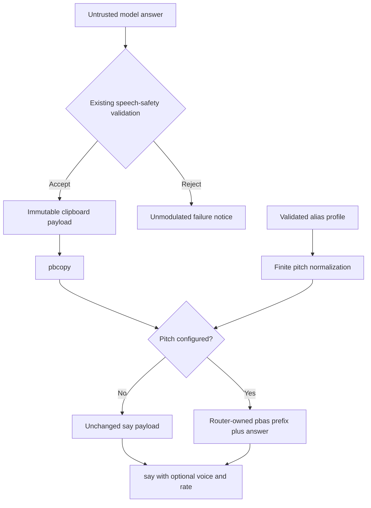

# Per-Alias Speech Pitch Configuration - Plan

> **Superseded behavior (2026-08-09):** The clipboard requirements in this
> historical plan no longer apply. Pitch remains a trusted prefix applied only
> to `/usr/bin/say`; the router does not invoke `pbcopy` or otherwise read or
> modify the clipboard.

## Goal Capsule

- **Objective:** Let a macOS user assign a validated baseline pitch to each `llm-now` alias in the existing voice-router configuration while keeping copied model output unchanged.
- **Product authority:** This Product Contract governs the pitch extension and supersedes the prior voice-router plan only where that plan requires byte-identical clipboard and speech inputs.
- **Authority hierarchy:** This Product Contract and its session-settled decisions govern behavior. The Planning Contract governs implementation. Repository instructions govern delivery and verification.
- **Execution profile:** Standard plan delivered as one phase on the existing macOS voice-router branch because configuration, speech payload construction, tests, and guide updates form one user-testable change.
- **Stop conditions:** Do not accept arbitrary embedded speech commands, weaken model-output validation, change the core alias store, move preferences into `pyproject.toml`, add Shortcut logic, or introduce a cross-platform speech backend.
- **Tail ownership:** Automated tests own parsing, trusted payload construction, side-effect order, and injection rejection. A human macOS check owns audible pitch comparison across installed voices.
- **Open blockers:** None.

---

## Product Contract

### Summary

Extend each flat alias profile in `voice-router.toml` with an optional numeric `pitch` value.
The router converts that validated value into a macOS baseline-pitch command for speech only and continues copying the original model answer unchanged.

### Problem Frame

Per-alias `voice` and `rate` settings already let agents sound different, but they cannot change baseline pitch.
Embedding raw `say` directives in configuration would be flexible but would also expand the trusted input surface and make malformed or unsafe controls easy to introduce.
The model response is untrusted because macOS speech synthesizers interpret `[[...]]` sequences as commands.

### Key Decisions

- **Keep speech preferences in the router's user configuration.** (session-settled: user-directed — chosen over `pyproject.toml` and script variables because voice choices are user- and machine-specific.) Governs R1-R3.
- **Keep one flat profile per canonical alias.** (session-settled: user-directed — chosen over a separate voice registry because each alias should require one small editable section.) Governs R2-R3.
- **Expose typed pitch instead of raw speech markup.** (session-settled: user-approved — chosen over an arbitrary speech-prefix field because the router must keep a narrow, validated trust boundary.) Governs R3-R6.
- **Apply pitch only to speech.** (session-settled: user-approved — chosen over decorating the shared answer payload because the clipboard must remain useful plain text.) Governs R7-R10.

### Requirements

**Configuration**

- R1. The router must continue resolving `$XDG_CONFIG_HOME/llm-now/voice-router.toml` when XDG configuration is absolute and otherwise use `~/.config/llm-now/voice-router.toml`.
- R2. Each canonical alias table may independently configure `spoken_names`, `voice`, `rate`, and optional `pitch`; a missing profile or pitch must preserve current behavior.
- R3. `pitch` must accept finite TOML integers and floats from 1 through 127 inclusive and reject booleans, strings, non-finite values, relative syntax, and values outside that range.
- R4. Unknown profile fields, including raw speech-prefix or embedded-command fields, must remain configuration errors.

**Speech trust boundary**

- R5. The router must serialize a valid pitch only as one unsigned absolute `pbas` command constructed from the parsed numeric value.
- R6. Configuration errors must fail before generation, clipboard mutation, or answer speech and must use the existing unmodulated configuration notice.
- R7. The router must validate the undecorated model response with the existing control, terminal-escape, and `[[` rejection before constructing a speech payload.
- R8. A successful request must send the exact model stdout bytes to `pbcopy` before speech begins.
- R9. When pitch is configured, the `say` input must contain the router-authored pitch command followed by the unchanged answer; when pitch is absent, `say` must receive the unchanged answer bytes.
- R10. Retry, provider-failure, copy-failure, and configuration notices must use system speech defaults without the selected alias's pitch.

**Documentation and verification**

- R11. Automated tests must cover parsing boundaries and types, absent and configured pitch, independent alias settings, clipboard isolation, model-authored command rejection, and existing voice/rate behavior without invoking real macOS tools.
- R12. User documentation must describe the legacy 1–127 baseline-pitch scale, show a per-alias example, explain that pitch affects speech only, and require audible A/B verification on installed voices.
- R13. Release and manual-test documentation must describe the expanded per-alias speech settings without adding a second Changeset for the still-unmerged voice-router feature.

### Acceptance Examples

- AE1. **Covers R2-R3 and R5-R9.** Given alias `slug` has a valid voice, rate, and `pitch = 50`, a successful answer is copied without markup and spoken with exactly one router-authored `pbas 50` command using the configured voice and rate.
- AE2. **Covers R2 and R8-R9.** Given an alias omits `pitch`, the clipboard and speech inputs remain byte-identical to the model answer as before.
- AE3. **Covers R3-R6.** Given pitch is `0`, `128`, non-finite, boolean, string, or raw markup, configuration fails before generation and no clipboard change occurs.
- AE4. **Covers R7-R10.** Given a valid configured pitch and a model answer containing `[[pbas 90]]`, the router rejects the answer, preserves the clipboard, and speaks only the unmodulated provider-failure notice.
- AE5. **Covers R8-R10.** Given copying succeeds and modulated answer speech fails, the original answer remains on the clipboard and the router returns the existing speech failure outcome.
- AE6. **Covers R12.** Given two installed voices and two legal pitch values, the guide directs the user to compare them audibly and does not claim that process success proves a perceptible pitch change.

### Scope Boundaries

- The feature adds baseline pitch only; pitch modulation range, volume, pauses, emphasis, and arbitrary embedded commands remain out of scope.
- The implementation remains macOS-only and continues using `/usr/bin/say` rather than AVFoundation or a cross-platform TTS library.
- Users edit TOML manually; no config-editing CLI, Shortcut action, or agent tool is added.
- The core `llm-now` alias schema, provider selection, and model behavior remain unchanged.
- Acoustic analysis and guarantees that every installed voice honors pitch are outside scope.

### Sources and Research

- `examples/macos-voice-router/src/llm_now_voice/cli.py` — current closed profile schema, response validator, and copy-before-speak orchestration.
- `examples/macos-voice-router/tests/test_cli.py` — existing parser and fake-process coverage.
- `examples/macos-voice-shortcut.md` — authoritative setup, profile, and manual verification guide.
- `docs/plans/2026-07-30-001-feat-macos-voice-shortcut-plan.md` — prior voice-router contract and payload-equality rules superseded only by configured pitch.
- [Apple Speech Synthesis Programming Guide: Fine-Tuning Synthesized Speech](https://developer.apple.com/library/archive/documentation/UserExperience/Conceptual/SpeechSynthesisProgrammingGuide/FineTuning/FineTuning.html) — `pbas` syntax, command delimiters, and the inclusive 1–127 real-value range.
- [Apple `NSSpeechSynthesizer` documentation](https://developer.apple.com/documentation/appkit/nsspeechsynthesizer) — legacy API status and current pitch property context.
- [Python `tomllib` documentation](https://docs.python.org/3/library/tomllib.html) — TOML integer, float, and boolean parsing behavior.

---

## Planning Contract

### Key Technical Decisions

- KTD1. **Extend the existing closed alias profile.** Add one optional numeric pitch member to the current immutable profile value and allowlist. Preserve global structural validation, including for stale alias profiles. Governs R1-R4.
- KTD2. **Normalize pitch to a finite absolute value.** Accept Python integers and floats except booleans, require `math.isfinite`, enforce 1–127 inclusive, and serialize a stable unsigned decimal without accepting relative prefixes or caller-supplied markup. Governs R3-R6.
- KTD3. **Keep raw and spoken payloads separate after validation.** Retain model stdout as the sole clipboard payload. After the existing untrusted-output check succeeds, derive a second speech payload by prefixing the fixed command only when pitch is present. Governs R5 and R7-R10.
- KTD4. **Preserve the current process and failure lifecycle.** Voice inventory remains conditional on configured voice, voice/rate stay in `say` arguments, pitch stays in speech stdin, copy still completes before speech, and stable notices bypass alias-specific settings. Governs R6 and R8-R10.
- KTD5. **Treat audible pitch as a manual compatibility gate.** Unit tests prove parsing and exact payload construction, while manual A/B listening verifies representative installed voices because Apple's documented embedded-command contract is archived and voice behavior can vary. Governs R11-R13.

### High-Level Technical Design

### Assumptions

- The supported macOS versions continue accepting embedded commands through `/usr/bin/say`; the installed `say(1)` manual documents embedded-command usage, but Apple no longer updates the detailed synthesis guide.
- A legal pitch can be ignored or sound unchanged for a particular installed voice, so a successful process exit is not evidence of audible modulation.
- Manual A/B listening is sufficient for this example; automated acoustic measurement would add disproportionate scope.

### Implementation Constraints

- Do not weaken `_unsafe_for_speech` to permit router-generated markup; construct the speech payload only after validating the raw answer.
- Do not add a dependency, lockfile change, or new configuration abstraction for one numeric field.
- Preserve the existing unstaged user edit in `examples/macos-voice-shortcut.md` and exclude that unrelated hunk from task commits.

### Sequencing

Implement the parser and payload behavior under tests first, then update user and release documentation against the verified behavior.
Both units belong to one implementation phase and one pull request.

---

## Implementation Units

### U1. Add typed pitch parsing and trusted speech payloads

- **Goal:** Extend the alias profile and speech path without widening the model-output or configuration trust boundary.
- **Requirements:** R1-R11; AE1-AE5; KTD1-KTD4.
- **Dependencies:** Existing macOS voice-router implementation on the current branch.
- **Files:**
  - Modify `examples/macos-voice-router/src/llm_now_voice/cli.py`
  - Modify `examples/macos-voice-router/tests/test_cli.py`
- **Approach:**
  1. Extend the profile parser with KTD1-KTD2 while preserving the closed schema and stale-profile validation.
  2. Retain the validated model answer as immutable clipboard input.
  3. Derive the optional pitch-prefixed speech bytes at the final speech boundary from KTD3.
  4. Preserve voice/rate arguments, notices, copy-first ordering, and failure outcomes from KTD4.
- **Execution note:** Start with failing configuration and orchestration tests so the changed payload relationship is explicit before production code changes.
- **Patterns to follow:** Mirror the current `rate` type checks, immutable `AliasProfile`, fake `ProcessRunner`, and exact call-order assertions in `examples/macos-voice-router/tests/test_cli.py`.
- **Test scenarios:**
  - Parse integer and fractional pitch values at representative value 50 and inclusive boundaries 1 and 127.
  - Reject booleans, strings, TOML non-finite floats, zero, negative values, and values above 127 with a field-specific configuration error.
  - Validate invalid pitch inside a stale alias profile rather than silently ignoring malformed configuration.
  - Covers AE1. Confirm `pbcopy` receives the exact answer while `say` receives one canonical pitch prefix plus that answer, with existing voice/rate arguments unchanged.
  - Covers AE2. Confirm omitted pitch sends the exact answer to both channels with no embedded command.
  - Configure different pitches for two aliases that share a model and confirm each selected alias owns its speech payload.
  - Covers AE4. Reject model-authored `[[...]]` before clipboard or answer speech even when a valid pitch is configured.
  - Confirm retry, provider-failure, copy-failure, and configuration notices contain no pitch prefix.
  - Covers AE5. Confirm speech failure after a successful copy leaves the raw answer on the clipboard.
- **Verification:** The Python suite proves accepted types and bounds, exact process arguments and bytes, side-effect order, notice isolation, and unchanged behavior when pitch is absent.

### U2. Document per-alias pitch and compatibility limits

- **Goal:** Make manual configuration and honest macOS verification clear without changing the two-action Shortcut.
- **Requirements:** R12-R13; AE6; KTD5.
- **Dependencies:** U1 behavior verified.
- **Files:**
  - Modify `examples/macos-voice-shortcut.md`
  - Modify `examples/README.md`
  - Modify `docs/manual-testing.md`
  - Modify `.changeset/quick-voices-answer.md`
- **Approach:**
  1. Add a `slug` profile example that combines voice, rate, and pitch in the existing flat TOML format.
  2. Define pitch as Apple's legacy absolute 1–127 baseline-pitch scale and state that fractional values are accepted.
  3. Explain that the clipboard remains the original answer and that raw embedded commands are not configurable.
  4. Add an audible A/B check using installed voices and legal pitch values, with no promise that exit success proves modulation.
  5. Broaden the existing unreleased Changeset and cookbook references rather than creating a second release entry.
- **Patterns to follow:** Keep `examples/macos-voice-shortcut.md` authoritative and let `docs/manual-testing.md` link to its detailed matrix.
- **Test scenarios:**
  - Test expectation: none — this unit documents U1 behavior and adds manual verification rather than new executable behavior.
- **Verification:** Documentation examples match the parser's field names and bounds, the manual matrix distinguishes clipboard and speech payloads, and the existing unrelated guide edit remains uncommitted.

---

## Verification Contract

| Gate | Scope | Expected result |
|---|---|---|
| `uv run --project examples/macos-voice-router --locked python -m unittest discover -s examples/macos-voice-router/tests` | U1 | All parser, orchestration, and lifecycle tests pass without contacting a provider or real macOS side effect. |
| `bun run check` | U1-U2 | Repository TypeScript, policy, documentation, and source CI checks remain green. |
| Diff hygiene | U1-U2 | No dependency or lockfile changes, arbitrary speech-control surface, or unrelated user hunk enters the task commits. |
| Manual macOS A/B | U2 | A configured alias audibly differs from its no-pitch control on at least one installed voice, while pasted clipboard text contains no speech command. |

---

## Definition of Done

### Global

- `voice-router.toml` accepts optional per-alias finite numeric pitch values from 1 through 127 and rejects every unsupported type or value before generation.
- Only router-generated absolute `pbas` markup reaches answer speech; model output and raw config never become embedded commands.
- The clipboard retains exact model stdout, pitch-free profiles retain the prior byte-identical path, and all stable notices remain unmodulated.
- Existing voice, rate, routing, cancellation, and failure behavior remains covered and green.
- The guide, manual-test matrix, cookbook reference, and existing Changeset describe one consistent configuration contract.
- Abandoned implementation attempts, temporary caches, and generated environments are absent from the final diff.

### Per Unit

- **U1:** Parser and orchestration tests prove the type/range contract, trusted prefix, clipboard isolation, unsafe-output rejection, and absent-pitch compatibility.
- **U2:** A macOS user can configure `slug`, compare pitch audibly, and confirm a clean clipboard from the documented steps.

---

## System-Wide Impact

- **Trust boundary:** The model answer remains untrusted until current speech-safety checks pass. The only new trusted markup is generated from a bounded number by the router.
- **Persistent configuration:** Existing profile files remain compatible because `pitch` is optional and the profile schema stays flat.
- **Side effects:** Clipboard state continues committing before speech. Pitch changes only the speech process's stdin and cannot alter recovery semantics.
- **Agent parity:** The shared TOML file remains the durable user/agent-visible preference surface; no separate hidden Shortcut state is introduced.

---

## Risks and Dependencies

- Apple's detailed embedded-command documentation is archived, and legacy speech APIs are deprecated even though `/usr/bin/say` remains installed and documents embedded commands. Manual verification protects the example from overstating compatibility.
- Some installed voices may ignore a legal pitch or produce little audible difference. Documentation must frame pitch as voice-dependent rather than guaranteed.
- Separating clipboard and speech bytes weakens the old raw-payload-equality invariant. Tests must instead enforce exact clipboard bytes and a single trusted speech prefix followed by the unchanged answer.
- TOML supports non-finite floats. Validation must reject them before formatting so `nan` or `inf` never reaches speech markup.
