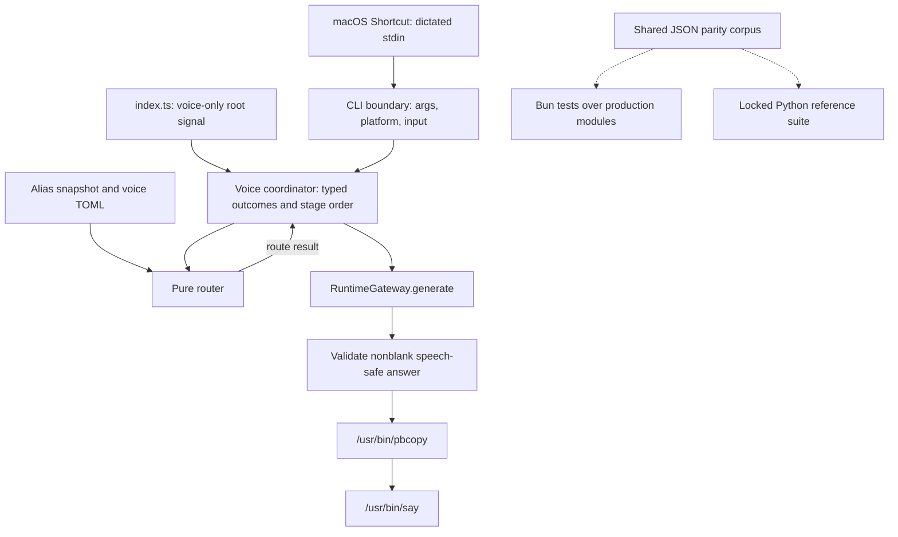

# Native macOS Voice Routing - Plan

Move the proven macOS voice-routing behavior into the installed `llm-now` binary, while preserving the Python example as an independent parity oracle. Users get one native command; contributors keep the reference implementation for differential testing.

**Plan navigation**

- [Goal Capsule](#goal-capsule)
- [Product Contract](#product-contract)
- [Planning Contract](#planning-contract)
- [System-Wide Impact](#system-wide-impact)
- [Implementation Units](#implementation-units)
- [Verification Contract](#verification-contract)
- [Definition of Done](#definition-of-done)
- [Appendix](#appendix)

## Goal Capsule

**Objective.** Ship a first-class macOS voice mode in the Bun/TypeScript `llm-now` executable. It must preserve the Python router's documented routing, safety, clipboard, and speech behavior without requiring Python, uv, or a repository checkout for normal use.

### Authority hierarchy

1.  The user's settled decisions in this plan govern packaging, dependency choice, reference preservation, output format, and branch base.
2.  The Product Contract governs user-visible behavior.
3.  The Planning Contract governs implementation mechanism.
4.  The retained Python example supplies test evidence for the shared parity corpus. It is not a runtime authority for native-only integration details.
5.  Existing ordinary CLI, alias-store, credential, diagnostic, and release contracts remain unchanged unless an R-ID below says otherwise.

### Execution profile

One branch · one pull request

Create `codex/native-macos-voice` from the latest `origin/main`. Transfer only the allowlisted voice artifacts from `codex/macos-voice-shortcut-guide`. Implement, test, commit, push, and open one focused PR from that branch.

**Tail ownership.** The executor owns the branch transplant, implementation, automated gates, documentation, release-size evidence, and PR. Manual macOS listening remains a recorded release/manual-test gate; it must not delay committing verified automated work.

### Stop conditions

- Stop if native user setup still requires Python, uv, or the repository checkout.
- Stop if `ratio()` changes a documented route decision at the 65-point threshold or 15-point runner-up margin.
- Stop if the embedded WASM cannot compile and start on any existing release target.
- Stop if the clean branch requires merging or broadly cherry-picking the current mixed feature branch.
- Stop for review if executable or archive growth is materially larger than the embedded dependency evidence predicts; record measurements instead of inventing a CI size limit.

---

## Product Contract

### Summary

Add `llm-now --voice` for macOS. The mode accepts a dictated transcript, chooses a saved alias with conservative deterministic routing, generates one concise answer through the existing runtime, copies that answer, and speaks it. The installed binary performs the work directly. The existing Python router remains in the repository for independent parity testing and possible future removal.

### Problem Frame

The Python example proves the interaction, but it asks end users to install uv, resolve three paths, keep a checkout, and launch a second application layer. That setup undermines the value of a keyboard-driven voice shortcut. The core executable already owns aliases, credentials, generation, diagnostics, and native packaging, so it is the correct user-facing boundary.

### Actors

| ID | Actor | Need |
|----|----|----|
| A1. | macOS user | Invoke an installed command from Shortcuts and receive a copied and spoken answer without a Python toolchain. |
| A2. | Contributor | Compare native behavior against the retained reference without making Python part of the product runtime. |
| A3. | Release maintainer | Prove the embedded WASM and unchanged CLI surface work across every release target. |

### Requirements

#### Invocation and portability

| ID | Requirement | Covered by |
|----|----|----|
| R1. | `llm-now --voice` must accept a transcript from exactly one of `--input` or stdin and must reject positionals, `--alias`, `--provider`, `--model`, `--instruction`, and other standalone modes. | U1, AE1, AE9 |
| R2. | On non-macOS targets, voice mode must fail before reading configuration, loading aliases, initializing the scorer, generating, or starting an OS side effect; the positional word `voice` must remain usable as an alias. | U1, U4, AE9 |
| R3. | Native voice mode must load one alias-store snapshot and use the selected `AliasRecord` from that snapshot; it must not parse `--aliases` output or spawn `llm-now`. | U3, AE1 |
| R4. | The supported Shortcut must remain `Dictate Text → Run Shell Script`, pass the transcript through stdin, and use installed `llm-now --voice` as its only shell command after Dictation. Native mode removes the Python/uv layer; the selected alias keeps its ordinary provider-runtime, network, credential, and local-service prerequisites. | U5, AE10 |

#### Configuration and routing

| ID | Requirement | Covered by |
|----|----|----|
| R5. | Voice configuration must remain at absolute `$XDG_CONFIG_HOME/llm-now/voice-router.toml` or `~/.config/llm-now/voice-router.toml`, with default `wake_words = ["hey"]` and the closed per-alias fields `spoken_names`, `voice`, `rate`, and `pitch`. | U2, AE3, AE4 |
| R6. | Routing must use NFKC plus Unicode Default Case Folding and Unicode token boundaries, then preserve the leading-token flow: optional wake phrase, longest normalized canonical alias, longest configured spoken name, then fuzzy canonical-alias fallback; every accepted route must preserve the original question substring. | U2, AE1-AE3 |
| R7. | Fuzzy routing must require a compact key of at least 4 Unicode scalar values, a candidate length difference no greater than `ceil(aliasLength × 0.2)` using scalar-value counts, identical digit sequences when either side has digits, a score of at least 65, and a runner-up margin of at least 15; score ties use the shorter span and deterministic alias order. | U2, U4, AE2 |
| R8. | The 0–100 ratio score must come only from exactly pinned `@3leaps/string-metrics-wasm@0.3.11`; documentation and diagnostics must call it similarity, never probability, and no package normalization, extraction, or ranking helper may change R6-R7. | U1, U2, U4 |
| R9. | Blank, invalid-UTF-8, alias-only, wake-only, punctuation-only, valid-empty-roster, weak, digit-mismatched, and ambiguous requests must not generate or mutate the clipboard; malformed or unreadable alias storage is a configuration failure, and normal typed CLI alias selection remains exact. | U1-U3, AE6, AE9 |

#### Generation, clipboard, and speech

| ID | Requirement | Covered by |
|----|----|----|
| R10. | Before generation, native voice mode must verify executable access to `/usr/bin/pbcopy` and `/usr/bin/say`, parse the complete configuration, and validate any configured voice against `say -v ?`. | U3, AE4 |
| R11. | An accepted route must call `RuntimeGateway.generate` exactly once with the selected provider/model, the saved alias instructions unchanged, an abort signal, and the established concise plain-text speech prompt followed by the unchanged question. | U3, AE1, AE5 |
| R12. | A response must be nonblank and must reject `[[`, terminal escapes, and unsafe control characters before either output side effect. | U2, U3, AE6 |
| R13. | A successful request must send all answer/speech bytes to `pbcopy` and `say` through stdin, finish copying the exact UTF-8 answer before speech starts, and add only one trusted router-authored `[[pbas …]]` prefix for configured pitch. | U3, AE5, AE7 |
| R14. | Per-alias voice, integer rate from 80 through 500, and finite numeric pitch from 1 through 127 must preserve the reference behavior; stable notices must always use unconfigured system speech defaults. | U2, U3, AE4, AE5 |
| R15. | Voice mode must keep stdout empty, emit stable error categories without transcript/prompt/answer/speech payloads, pass remaining detail through request-value redaction and the shared sanitizer, and follow the terminal outcome table below. | U3, AE6-AE9 |
| R16. | SIGINT/SIGTERM must abort one root request and suppress later notices; each generation/child stage has its own deadline, reports cancellation versus timeout distinctly, and terminates/reaps the sole active operation before the next R15 action. | U3, AE7, AE8 |

#### Verification, preservation, and documentation

| ID | Requirement | Covered by |
|----|----|----|
| R17. | The Python router, package metadata, lockfile, tests, and historical plans must remain in place as an independent source-CI parity oracle; native runtime and release archives must never depend on them. | U1, U4, AE10 |
| R18. | Bun and Python tests must independently consume a shared routing/score corpus and must assert exact normalization, Unicode-scalar question offsets, route decisions, and tolerance-based raw score parity at the threshold, margin, length, digit, tie, and Unicode case-fold boundaries. TypeScript may use UTF-16 positions only when slicing the original transcript. | U2, U4, AE2, AE11 |
| R19. | Both macOS architectures, both Linux architectures, and Windows x64 must compile and launch with the dependency embedded; macOS CI must execute first and repeated compiled fuzzy scores, and the PR must record executable and archive size deltas plus the updated native-primary manual matrix. | U4, U5, AE9-AE11 |

### R15 terminal outcome contract

| Terminal state | Exit | Clipboard / speech | Diagnostics |
|----|----|----|----|
| Answer copied and spoken | `0` | Exact answer copied, then answer spoken | None required; stdout remains empty |
| Transcript or route rejected | `0` if retry notice succeeds; otherwise `1` | Clipboard unchanged; unconfigured retry notice only | Stable local rejection category on stderr |
| Generation failed, timed out, returned blank, or returned unsafe text | `0` if request-failed notice succeeds; otherwise `1` | Clipboard unchanged; unconfigured request-failed notice only | Sanitized local detail on stderr |
| Platform, valid empty alias roster, alias store, voice TOML/path, executable-access, or selected-voice failure | `1` | No answer side effect; a dedicated create-an-alias notice for an empty roster, otherwise configuration notice when `say` is available | Actionable sanitized local detail without request payloads |
| Clipboard failure | `1` | No answer speech; unconfigured copy-failed notice | Sanitized copy detail |
| Answer speech failure after copy | `1` | Copied answer remains; no replacement notice | Sanitized speech detail |
| SIGINT or SIGTERM | `130` | No later side effect or notice; a completed earlier copy is not rolled back | `voice request cancelled` |
| Invalid CLI option combination | `2` | No side effect | Existing sanitized usage boundary |

### Flows

| ID | Entry and decisions | Terminal state |
|----|----|----|
| F1. Native success | Shortcut passes transcript → CLI validates macOS and input → one alias snapshot and config load → exact/configured/fuzzy route → preflight/profile validation → one generation → validate → copy → speak. | R15 success |
| F2. Handled rejection | Input or route does not produce a unique alias/question. | R15 retry outcome; no generation or clipboard mutation |
| F3. Setup failure | Platform, alias store, path, TOML, schema, command, or voice validation fails before generation. | R15 configuration outcome |
| F4. Response failure | Runtime fails or the returned string is blank or unsafe. | R15 request-failed outcome |
| F5. Partial side effect | Copy finishes, then answer speech fails. | R15 speech-failure outcome; clipboard remains useful |
| F6. Cancellation or deadline | A root signal or per-stage timeout reaches generation or a child operation. | Active work is reaped; R16 distinguishes exit 130 from the stage's R15 failure path |
| F7. Contributor parity | Shared fixtures run independently in Bun and locked Python; compiled smoke runs in the native matrix. | Exact decisions, tolerant scores, and all target gates pass |

### Acceptance Examples

| ID | Example |
|----|----|
| AE1. | **Covers R1, R3, R6, R11.** Given alias `deepseek32`, `Deep seek 32, explain mixture of experts` selects that record from one loaded snapshot and passes `explain mixture of experts` to the existing runtime without spawning `llm-now`. |
| AE2. | **Covers R7-R8, R18.** `Tara, write a haiku` selects `terra` only when the raw ratio is at least 65 and leads the runner-up by at least 15; Bun and Python agree on the decision without rounding the score first. |
| AE3. | **Covers R5-R6.** With configured spoken name `op 47` and wake words `hey`/`computer`, requests with either wake word and requests without one preserve the same alias/question boundary. |
| AE4. | **Covers R5, R10, R14.** An unknown profile field, invalid pitch/rate, relative XDG path, or unavailable configured voice fails before generation and leaves the clipboard unchanged. |
| AE5. | **Covers R11, R13-R14.** A valid answer for an alias with voice, rate, and `pitch = 50` is copied without markup, then spoken with the configured arguments and exactly one router-authored `[[pbas 50]]` prefix. |
| AE6. | **Covers R9, R12, R15.** Ambiguous input or model output containing `[[pbas 90]]` preserves a clipboard sentinel and speaks only the appropriate stable unconfigured notice. |
| AE7. | **Covers R13, R15-R16.** If `pbcopy` succeeds and `say` fails or is cancelled, the original answer remains on the clipboard and no notice replaces it. |
| AE8. | **Covers R15-R16.** Cancellation during generation, copy, or speech terminates and reaps the active operation, exits 130, and starts no later operation. |
| AE9. | **Covers R1-R2, R15, R19.** Linux and Windows compiled binaries still run help/version, while `--voice` returns the stable macOS-only failure before config or WASM initialization. |
| AE10. | **Covers R4, R17.** A release user reaches the Shortcut through the installed binary only; a contributor can separately run the locked Python suite from the retained example. |
| AE11. | **Covers R18-R19.** Both implementations consume the shared boundary corpus, the compiled macOS fixture performs first and repeated fuzzy scores, all five release targets build, and the PR records before/after executable and archive sizes. |

### Scope Boundaries

In scope

Native macOS voice mode, preserved routing behavior, per-alias speech settings, shared parity fixtures, compiled-WASM validation, and native-primary documentation.

Preserved reference

The complete Python example and its locked source-CI suite remain. It may be removed in a future change only after native behavior has proven stable.

Deferred

Non-macOS speech backends, concurrent Shortcut serialization, and automatic clipboard clearing.

Outside

Fuzzy matching for ordinary typed CLI calls, a new alias schema, model-generated speech controls, a generic subprocess framework, or removal of the Python example.

Implementation mechanism

---

## Planning Contract

### Key Technical Decisions

**Decision index**

- [KTD1. CLI mode](#ktd1-add-a-parsed-voice-mode)
- [KTD2. Ratio dependency](#ktd2-pin-and-isolate-the-ratio-dependency)
- [KTD3. Python oracle](#ktd3-preserve-python-as-an-independent-oracle)
- [KTD4. Clean branch](#ktd4-start-from-clean-main)
- [KTD5. Module boundary](#ktd5-keep-routing-pure-and-orchestration-narrow)
- [KTD6. Alias/runtime snapshot](#ktd6-reuse-one-alias-and-runtime-snapshot)
- [KTD7. TOML](#ktd7-parse-toml-with-bun-and-validate-at-runtime)
- [KTD8. Unicode case fold](#ktd8-use-library-owned-unicode-case-folding)
- [KTD9. Side effects](#ktd9-make-side-effects-ordered-and-cancellable)
- [KTD10. Diagnostics](#ktd10-keep-diagnostics-and-stdout-on-existing-boundaries)
- [KTD11. Compiled WASM](#ktd11-test-lazy-wasm-where-it-executes)

### KTD1. Add a parsed `voice` mode

`src/args.ts` returns `{ kind: "voice"; input?: string }` for `--voice`. The branch occurs before ordinary selection. The bare positional `voice` stays an alias. Governs R1-R2. **(session-settled: user-approved — chosen over a positional `voice` subcommand: alias names must remain unambiguous.)**

### KTD2. Pin and isolate the ratio dependency

Add production dependency `"@3leaps/string-metrics-wasm": "0.3.11"`, commit `bun.lock`, and import only `ratio` from the package root. llm-now owns only R7's routing policy. Do not add Rust, `wasm-pack`, a loose `.wasm` asset, dynamic import machinery, or a local edit-distance implementation. Governs R7-R8 and R19. **(session-settled: user-directed — chosen over a local RapidFuzz-compatible implementation and pure-JavaScript search scorers: library-owned ratio semantics outweigh the contained embedded-WASM verification cost.)**

### KTD3. Preserve Python as an independent oracle

Keep `examples/macos-voice-router/**`, its 42 existing tests, RapidFuzz lock, and source-CI lane. Add shared JSON fixtures that both suites read independently. Do not launch Python from Bun tests or production. Governs R17-R18. **(session-settled: user-directed — chosen over deleting the Python example: the reference is still needed to test native parity.)**

### KTD4. Start from clean `main`

Create one new branch from latest `origin/main` and transfer voice artifacts path-by-path. Preserve the old voice plans unchanged. Do not merge or broadly cherry-pick `codex/macos-voice-shortcut-guide`. Governs R17-R19. **(session-settled: user-directed — chosen over continuing the mixed feature branch: the implementation must carry cleanly from `main`.)**

### KTD5. Keep routing pure and orchestration narrow

Use `src/voice-routing.ts` for pure config, normalization, routing, voice-inventory parsing, unsafe-response validation, and discriminated results. Use `src/voice.ts` as the sole coordinator that invokes those helpers, resolves the selected record, calls the runtime, maps typed voice outcomes, and orders macOS side effects. Keep `src/app.ts` as dispatch/sanitized output and `index.ts` as dependency/signal composition. Expected voice failures return typed outcomes instead of escaping into the ordinary app catch. Governs R5-R16.

### KTD6. Reuse one alias and runtime snapshot

Load aliases once, route over the keys, then call `RuntimeGateway.generate` with the selected record's provider, model, and saved instructions unchanged plus a per-stage signal composed from the root request and 45-second deadline while preserving cancellation provenance. This removes the Python inventory parser and self-subprocess without changing the alias store. Governs R3, R9, R11, and R16.

### KTD7. Parse TOML with Bun and validate at runtime

Use `Bun.TOML.parse` and the existing XDG/home conventions. Enforce the reference's closed schema, collision rules, stale-profile validation, finite numeric bounds, and reserved `wake_words` root key. Do not add a TOML dependency or change `aliases.json`. Governs R5, R10, and R14.

### KTD8. Use library-owned Unicode case folding

Use NFKC, exactly pinned `unicode-case-folding@1.1.1`, Unicode letter/number/mark token boundaries, and alphanumeric compact keys. Import only `caseFold` from the package root. Cover `ß`, Greek sigma, Turkish dotted I, full-width digits, combining marks, and astral input. Do not hand-maintain Unicode case-fold tables. Governs R6, R9, and R18.

### KTD9. Make side effects ordered and cancellable

Use an injectable voice-local Bun process adapter with fixed router-authored argv and payload bytes only on stdin. Remove every known provider API-key variable from the environment inherited by `pbcopy` and `say`. One root signal represents SIGINT/SIGTERM; one composed deadline signal belongs to each stage. Track exactly one active operation, classify completed/failed/timed-out/cancelled, terminate then force-kill if required, and await settlement before mapping R15. Governs R10-R16.

### KTD10. Keep diagnostics and stdout on existing boundaries

`src/voice.ts` maps every expected stage result to a typed terminal outcome before the generic app catch. It redacts request-scoped transcript, prompt, answer, and speech payload values, then passes stable categories and permitted detail through `src/app.ts`'s existing sanitizer. Voice stdout stays empty; notices never contain request or child detail. Governs R12-R16.

### KTD11. Test lazy WASM where it executes

A compiled production-routing fixture must invoke fuzzy scoring twice on each matching macOS runner. Release binaries compile and pass ordinary smoke on all five targets, with the non-macOS voice guard tested separately. Static package evaluation is accepted, but help/version and non-macOS voice must not call `ratio` or initialize WASM. Record size deltas and audit both exact-pinned package manifests on every upgrade. Governs R18-R19.

### High-Level Technical Design

The production path stays inside one executable until it reaches macOS-owned side effects. The Python path touches only shared fixtures and source CI; no production arrow reaches it.

### Branch and artifact transfer

The implementation branch begins at the then-current `origin/main`. Recover files and reapply small hunks explicitly. Do not inherit the current branch ancestry.

| Carry to the clean branch | Do not carry wholesale |
|----|----|
| This Markdown execution plan, its HTML review artifact, and the unchanged 2026-07-30 and 2026-08-05 voice plans | `docs/plans/2026-07-26-001-docs-cookbook-campaign-plan.html` |
| `examples/macos-voice-router/**` and `examples/macos-voice-shortcut.md` | The 769-line `examples/README.md` cookbook merely to obtain its voice links |
| Voice-specific hunks in `.gitignore`, CI, release-policy tests, README, and manual testing | Unrelated README/cookbook hunks or a broad commit cherry-pick |
| `docs/residual-review-findings/c4602c5.md` with the Python reference | A native dependency on Python's `parse_inventory` behavior |
| A broadened `.changeset/quick-voices-answer.md` that describes native mode and the retained reference | The old changeset wording that presents uv as the user-facing product |

Reconcile with current main

If `examples/README.md` or equivalent cookbook work has merged by execution time, edit that main-based file in place. Do not import the old branch version. Keep every changed line traceable to native voice routing or reference parity.

### Sequencing

1.  U1 establishes the clean branch, transfers the oracle and plans, pins the dependency, proves compiled host-native `ratio()` initialization, and fixes the public CLI boundary.
2.  U2 ports pure config/routing behavior and makes the shared corpus authoritative for the supported parity surface.
3.  U3 connects the chosen alias to the existing runtime and implements ordered macOS side effects.
4.  U4 hardens independent parity, compiled lazy-WASM coverage, CI, and release-size evidence.
5.  U5 makes native mode the primary documented setup and preserves a contributor-only Python reference path.

### Voice request precedence and timeouts

1.  Parse arguments and reject illegal combinations.
2.  Reject non-macOS before any read, ratio call, WASM initialization, or side effect; static package evaluation remains accepted per KTD11.
3.  Resolve exactly one input source and classify invalid transcript bytes/content as a handled retry.
4.  Check executable access for `/usr/bin/say` and `/usr/bin/pbcopy`.
5.  Resolve and read voice-config bytes, including absolute-XDG enforcement.
6.  Load and validate one alias snapshot. Treat a valid empty roster as the R15 create-an-alias configuration outcome and malformed/unreadable storage as the general R15 configuration outcome.
7.  Parse TOML, route, and validate the selected voice/profile before generation.

Native voice mode uses the existing 45,000 ms generation deadline. It retains 5,000 ms for voice inventory, 5,000 ms for clipboard, and 120,000 ms for notice/answer speech. The Python router's 50-second generation-process timeout was an outer containment guard around the core 45-second deadline and does not become a second native timer.

### Implementation Constraints

- Use Bun commands and Bun tests. Do not introduce Node-only launch steps, npm scripts, Vite, or a dev server.
- Keep ordinary typed CLI output byte-for-byte compatible. Voice behavior branches before the normal selection/generation output path.
- Do not expand `src/app.ts` into the routing implementation. Keep pure behavior independently testable.
- Do not make Bun tests invoke Python. The same fixtures must prove two independent implementations.
- Use the case-fold package for Unicode mappings. Do not duplicate its generated tables or silently fall back to `toLowerCase()`.
- Do not add test-only behavior to the shipping `llm-now` CLI merely to initialize WASM. Use a compiled fixture that imports production routing code.
- Do not add a second summarization request, JSON response markers, shell interpolation, or model-authored speech commands.

---

## System-Wide Impact

KTD5 assigns one owner to each boundary. `index.ts` supplies a lazy voice-cancellation installer through `ApplicationDependencies`. `src/app.ts` invokes it only after parsing voice mode and passing the macOS guard, then disposes its returned root-signal session in `finally`. `src/app.ts` otherwise owns parsing, platform dispatch, and sanitized terminal output. `src/voice-routing.ts` is pure. `src/voice.ts` owns the voice session and R15 outcome. The process adapter owns only one active child lifecycle.

### Interface impact matrix

| Surface | Change | Invariant / evidence |
|----|----|----|
| CLI parser and help | Add standalone `--voice` with optional `--input`. | R1-R2; every ordinary mode and positional alias remains compatible. |
| Input and privacy | Shortcut uses stdin. `--input` remains a manual convenience whose content can appear in argv/process history. | R1, R4; documentation prefers stdin and warns about local argv exposure. |
| Alias/config storage | Read one alias snapshot and one separate voice TOML file; write neither. | R3, R5, R9; valid-empty and malformed/unreadable storage have distinct R15 outcomes. |
| Runtime and credentials | Reuse the selected `AliasRecord`, including saved instructions, credential resolution, and `RuntimeGateway.generate` abort signal. | R11, R16; runtime tests cover instruction forwarding plus pre-aborted and post-setup abort checks without changing ordinary calls. |
| Output channels | Voice stdout is empty. Stable categories go to sanitized stderr; validated answer goes to clipboard then speech. | R12-R15; request-scoped values never appear in diagnostics or notices. |
| macOS processes | Start absolute `pbcopy`/`say` commands through an injectable adapter with provider API-key variables removed from the child environment. | R10, R13, R16; fixed argv, filtered environment, stdin payloads, one active operation, deadline/reap tests. |
| Persistent local state | The answer remains on the global clipboard after success or post-copy speech failure. | R13, R15; no confidentiality or automatic-clear promise. |
| Native packaging | Statically bundle two exact-pinned ESM packages and embedded WASM into all five executables. | R8, R19; frozen lock, manifest audit, compile/start matrix, lazy-WASM smoke, size report. |
| Python parity | Retain a source-only reference with shared fixture ownership. | R17-R18; no Python in native jobs or release archives. |
| Concurrent Shortcuts | One active invocation at a time is the supported workflow; no cross-process mutex or queue is added. | Deferred; the guide explains that overlapping invocations can interleave global clipboard or speech effects and tells users to let one request finish before starting another. |

### Failure propagation and cleanup

| Stage | Owner | Cleanup obligation | Permitted next action | Terminal mapping |
|----|----|----|----|----|
| Arguments / platform | `src/app.ts` | None; no voice session exists. | None on failure. | R15 usage or platform result. |
| Input / config / aliases / route | `src/voice.ts` with pure routing | Remove signal handlers if installed; no child exists. | Only the R15 notice allowed for that typed outcome. | R15 retry or configuration result. |
| Generation | `src/voice.ts` + `RuntimeGateway` | Abort and await settlement; re-check the root signal after async setup. | Request-failed notice after a stage timeout/failure; none after root cancellation. | R15 request failure or exit 130. |
| Clipboard | Voice process adapter | Terminate/reap the sole child and clear active state after settlement. | Copy-failed notice after timeout/failure; none after root cancellation; never answer speech. | R15 copy failure or exit 130. |
| Answer speech | Voice process adapter | Terminate/reap and clear active state. | No later operation or replacement notice. | R15 speech failure or exit 130; copied answer persists. |

---

## Implementation Units

### U1. Establish the clean branch and CLI boundary

**Goal:**
Create the main-based execution surface without mixed-branch ancestry.

**Requirements:**
R1-R2, R8, R17, R19

**Dependencies:**
None

**Files:**
`src/args.ts`, `src/voice-routing.ts`, `package.json`, `bun.lock`, `tests/fixtures/voice-routing-compile-entry.ts`, `tests/runtime-compile-smoke.ts`, plans and parity artifacts

**Execution note:**

Start from latest `origin/main`. Transfer the plan and reference allowlist before editing production code. Verify the branch diff does not contain cookbook campaign ancestry.

**Approach:**

1.  Create `codex/native-macos-voice` at latest `origin/main`.
2.  Transfer the new plan, historical voice plans, Python example, guide, and voice-only supporting hunks from KTD4.
3.  Add `@3leaps/string-metrics-wasm` at exact version `0.3.11` and `unicode-case-folding` at exact version `1.1.1` with Bun, then commit the lockfile change.
4.  Create the minimal production ratio wrapper in `src/voice-routing.ts`, then compile a host-native fixture that imports that boundary and calls `ratio()` twice. Stop if compilation, first-call initialization, or the repeated call fails; U2 extends the same module with routing behavior.
5.  Add the parsed `voice` mode, standalone option rules, help text, and fail-before-read platform guard from KTD1.
6.  Expose strict UTF-8 reading below `resolvePrompt` so ordinary blank-input semantics stay unchanged while voice mode can classify retryable dictated input.

**Test scenarios:**

- `--voice` accepts stdin or `--input`, but never both.
- `--voice` rejects selection flags and positionals; positional `voice` still parses as an alias.
- Non-macOS voice mode does not read stdin/config/aliases or initialize injected voice dependencies.
- The metric and case-fold dependencies resolve exactly `0.3.11` and `1.1.1`.
- The host-native compiled fixture returns expected scores on its first and repeated `ratio()` calls before the routing port proceeds.

**Verification:**

`bun test tests/args.test.ts tests/app.test.ts`, `bun run runtime:smoke`, `bun run typecheck`, and a reviewed `git diff --name-status origin/main...HEAD`.

### U2. Port pure configuration and routing

**Goal:**
Make the supported Python routing contract deterministic and testable in TypeScript.

**Requirements:**
R5-R9, R12, R14, R18

**Dependencies:**
U1

**Files:**
`src/voice-routing.ts`, `tests/voice-routing.test.ts`, shared JSON fixtures, Python tests

**Execution note:**

Write the shared score/route fixtures first. Make the existing Python suite consume them before porting the TypeScript router, so every native decision has a reference result.

**Approach:**

1.  Define typed immutable `VoiceConfig`, `AliasProfile`, token, and route-result values.
2.  Use `Bun.TOML.parse` behind exact runtime validation from KTD7.
3.  Port compact keys, Unicode-scalar token offsets and character counts, wake views, longest exact/configured stages, and fuzzy candidate generation. Track separate UTF-16 indices only where TypeScript slices the original transcript.
4.  Call only `ratio(candidateKey, aliasKey)`. Apply R7 without pre-rounding.
5.  Port voice-inventory parsing and unsafe-response validation as pure functions.
6.  Add shared corpus loaders to Bun and Python. Keep orchestration-specific tests separate.

**Test scenarios:**

- Canonical, configured, wake-word, longest-span, missing-question, and original-question preservation.
- Score and margin immediately below, at, and above R7 boundaries.
- Shortest-span tie behavior, deterministic alias ordering, length guard, and digit guard.
- NFKC compatibility forms, composed/decomposed marks, `ß`, Greek sigma, Turkish dotted I, full-width digits, and astral input match Python normalization and question offsets.
- Closed TOML schema, duplicate/colliding phrases, stale profiles, reserved root name, finite rate/pitch, and installed voice parsing.
- Unsafe answer controls and trusted pitch formatting remain distinct.

**Verification:**

`bun test tests/voice-routing.test.ts` and `uv run --project examples/macos-voice-router --locked python -m unittest discover -s examples/macos-voice-router/tests`.

### U3. Connect runtime, clipboard, and speech

**Goal:**
Execute one accepted native request with exact safety and side-effect ordering.

**Requirements:**
R3, R9-R16

**Dependencies:**
U2

**Files:**
`src/voice.ts`, `src/app.ts`, `src/runtime.ts`, `index.ts`, voice/app/runtime tests

**Execution note:**

Begin with fake-runner tests for the R15 matrix. No unit test may invoke a real provider, `pbcopy`, or `say`.

**Approach:**

1.  Add an injectable voice process interface and a Bun implementation that uses fixed argv, stdin payloads, per-stage deadlines, root cancellation, and reaping.
2.  Load one alias snapshot, config bytes, and optional voice inventory before generation.
3.  Resolve the selected record from the same snapshot and call the runtime directly with combined cancellation/timeout state.
4.  Add a lazy voice-cancellation installer to `ApplicationDependencies`. `index.ts` supplies it; `src/app.ts` invokes it only after voice parsing and the macOS guard, passes the returned root signal into the session, and calls its idempotent disposer in `finally`. Prove ordinary and non-macOS paths never invoke it.
5.  Pass saved alias instructions unchanged. Have `RuntimeGateway.generate` honor a pre-aborted signal and re-check after asynchronous provider/credential setup.
6.  Classify every expected voice result before the generic app catch and redact request-scoped values before the shared sanitizer.
7.  Encode one answer payload, copy it, then derive the optional pitch-prefixed speech payload.
8.  Implement every R15 terminal state, including the dedicated valid-empty-roster setup notice, and leave stdout empty.

**Test scenarios:**

- Exact call order for preflight, optional voice inventory, generation, copy, and speech.
- One loaded alias snapshot and one runtime call with saved instructions forwarded unchanged; no self-subprocess.
- Fake errors echo transcript, prompt, answer, speech, API-key, path, ANSI, and control sentinels; none reach stderr or notices.
- Answers beginning with `-v`, `--`, quotes, newlines, and shell metacharacters remain stdin bytes and never alter argv/environment; known provider API-key sentinels are absent from child environments.
- Provider, blank response, unsafe response, copy, and speech failures match R15.
- Root cancellation before start and during generation/copy/speech suppresses notices, prevents every later step, and exits 130.
- Each stage timeout reaps only that operation and maps to its R15 notice/failure unless the root signal has also aborted.
- Speech failure after copy preserves the answer without speaking a replacement notice.

**Verification:**

`bun test tests/voice.test.ts tests/app.test.ts tests/runtime.test.ts`, `bun run typecheck`, and `bun run check`.

### U4. Enforce parity and native packaging

**Goal:**
Prove the reference, embedded scorer, and release matrix remain healthy.

**Requirements:**
R17-R19

**Dependencies:**
U2, U3

**Files:**
CI, release validation, compile fixtures, `tests/release-policy.test.ts`, `scripts/build.ts`

**Execution note:**

Exercise `ratio()` in a compiled production-routing fixture. Help/version alone cannot prove the lazily initialized WASM works.

**Approach:**

1.  Keep Python 3.11 and pinned uv in source CI only, after `bun run check`.
2.  Add a compiled fixture that imports production routing code and performs first plus repeated fuzzy scores on host-native macOS targets without provider or OS side effects.
3.  Build all existing release targets. Run ordinary smoke and the macOS-only guard on non-macOS runners.
4.  Assert that no sibling `.wasm` file or runtime asset is required.
5.  Record the published tarball/file list, license, lifecycle scripts, runtime dependencies, lock integrity, JavaScript entrypoints, and WASM imports for both new exact-pinned packages. Confirm evaluation performs no network, filesystem, process, or environment access outside metric/case-fold initialization and computation; repeat the review for every upgrade.
6.  Measure and record before/after executable and archive bytes for every target in the PR.
7.  Update release-policy assertions so Python never leaks into native/release jobs.

**Test scenarios:**

- First and second compiled `ratio()` calls return expected 0–100 scores.
- Help/version and non-macOS voice never call `ratio` or initialize WASM even though static ESM modules are bundled.
- Both macOS targets compile the embedded WASM; Linux and Windows still start and reject voice before initialization.
- Source CI runs both independent suites; native jobs install only Bun/project dependencies.
- Archive manifest, signature repair, native credential gate, and release assembly remain unchanged.

**Verification:**

`bun run check`, the locked Python command, `bun run build:native`, `bun run release:validate`, and the full five-target GitHub Actions matrix. Host/target-specific checks remain CI-authoritative.

### U5. Publish native setup and retain the reference path

**Goal:**
Make the installed binary the obvious user path without erasing the Python oracle.

**Requirements:**
R4, R8, R14, R17-R19

**Dependencies:**
U3, U4

**Files:**
`examples/macos-voice-shortcut.md`, `README.md`, `docs/manual-testing.md`, Changeset

**Execution note:**

Rewrite the guide around `llm-now --voice`. Keep a contributor-only section for running the Python reference and parity tests. Do not delete or hide it.

**Approach:**

1.  Reduce voice-specific Shortcut prerequisites to macOS Dictation, installed `llm-now`, and one working alias; retain and name the selected alias's ordinary provider-runtime, network, credential, and local-service prerequisites.
2.  Replace the uv launcher with an absolute installed `llm-now --voice` invocation and retain credential privacy guidance.
3.  Use stdin in every Shortcut example; describe `--input` as a manual option that can expose text through process arguments.
4.  Preserve matching, TOML, voice/rate/pitch, clipboard, cancellation, and recovery documentation. Define the Shortcuts stop control as the supported cancellation affordance and include its signal/exit-130 behavior in MT-39.
5.  Warn that Dictation may use Apple services, hosted aliases send the transcript to their provider, speech is audible, and the global clipboard persists until replaced.
6.  Explain that only one active invocation is supported; overlapping invocations can interleave global clipboard and speech effects. Add a clearly separate contributor section for the retained uv/Python oracle.
7.  Update README and cookbook links only where those files exist on the main-based branch.
8.  Broaden the existing unreleased Changeset to describe native mode and the retained reference.

**Test scenarios:**

- A clean timed walkthrough reaches a spoken answer without uv or a checkout.
- The guide distinguishes local and hosted aliases, advises against sensitive dictation in an unsuitable setting, and makes no clipboard-clearing promise.
- Exact, configured, unique fuzzy, poor, and ambiguous routes follow the guide.
- Clipboard sentinel, pitch A/B, local/hosted provider, cancellation, permissions, and recovery checks remain present.
- The contributor command still runs the locked Python suite.

**Verification:**

Run documentation link checks already covered by `bun test`, perform the native macOS manual matrix, and confirm the guide never presents Python or uv as a release-user prerequisite.

Evidence required to ship

---

## Verification Contract

| Gate | Scope | Expected result |
|----|----|----|
| `bun test tests/args.test.ts tests/voice-routing.test.ts tests/voice.test.ts tests/app.test.ts tests/runtime.test.ts tests/release-policy.test.ts tests/build.test.ts` | U1-U4 | CLI, pure routing, orchestration, cancellation-aware runtime, app integration, CI policy, and build contracts pass without real side effects. |
| `bun run typecheck` | U1-U4 | Package declarations and all new boundaries typecheck under TypeScript 5.9.3. |
| `bun run runtime:smoke` | U1, U4 | The compiled CLI keeps existing output contracts and the compiled production-routing fixture executes first and repeated ratio calls. |
| `bun run check` | All code units | Full Bun suite, typecheck, and compile smoke pass. |
| `uv run --project examples/macos-voice-router --locked python -m unittest discover -s examples/macos-voice-router/tests` | U2, U4 | All retained tests plus shared-corpus assertions pass independently. |
| `bun scripts/build.ts --target <target> --outdir dist` and `bun scripts/release-validate.ts archives dist` | U4 | Each matching CI runner builds one valid single-executable archive with no sibling WASM asset. |
| `bun scripts/release-validate.ts smoke dist/*.zip` | U4 | All five archives start; normal commands remain compatible; non-macOS voice rejects at the platform gate. |
| Before/after size report | U4 | PR records uncompressed executable and compressed archive byte deltas for all five targets, with any surprising growth explained. |
| MT-39 native macOS matrix | U5 | Two-action Shortcut, routes, notices, clipboard, per-alias speech, pitch A/B, cancellation, permissions, privacy, and recovery behave as documented. |
| `git diff --name-status origin/main...HEAD` | All units | Every file is voice-specific; no cookbook campaign or unrelated branch ancestry appears. |

### CI authority

The full architecture matrix is verified on its matching GitHub Actions runners. Local macOS work should run the matching target and all source checks, but it must not claim host-incompatible release targets were executed locally.

---

## Definition of Done

### Global

- A release user can run the documented two-action Shortcut through the installed `llm-now --voice` without Python, uv, or a checkout.
- R1-R19 and AE1-AE11 are verified, and ordinary CLI behavior remains unchanged.
- `@3leaps/string-metrics-wasm` is exactly pinned at `0.3.11`, and `unicode-case-folding` is exactly pinned at `1.1.1`; no local metric or Unicode-table implementation, loose WASM asset, or extra Rust toolchain exists.
- The entire Python example, tests, and lockfile remain available and enforced in source CI only.
- Every release target builds and launches, compiled macOS fuzzy scoring initializes successfully, and the PR contains size-delta evidence.
- Root cancellation and stage timeouts remain distinct; all request sentinels stay out of diagnostics, argv, environment, and temporary files.
- The guide documents Dictation/provider/audio/clipboard privacy boundaries and uses stdin for the supported Shortcut.
- The branch is based directly on current `main`, includes this plan and relevant historical artifacts, and contains no unrelated cookbook ancestry.
- Automated work is committed, pushed, and opened as one focused pull request with manual-test instructions.
- Abandoned experiments, duplicate helpers, test-only production switches, and unused imports are removed before completion.

### Per Unit

| Unit | Done when |
|----|----|
| [U1.](#u1-establish-the-clean-branch-and-cli-boundary) | The clean branch contains only the selective voice transplant, exact dependency pin, documented CLI mode, and platform/input tests. |
| [U2.](#u2-port-pure-configuration-and-routing) | Pure TypeScript routing matches the shared supported corpus and preserves all closed config and speech-safety rules. |
| [U3.](#u3-connect-runtime-clipboard-and-speech) | Every R15 outcome and R16 cancellation path passes with fake dependencies, one runtime call, empty stdout, and exact side-effect order. |
| [U4.](#u4-enforce-parity-and-native-packaging) | Independent Bun/Python parity, compiled lazy-WASM smoke, all release targets, CI policy, and size reporting pass. |
| [U5.](#u5-publish-native-setup-and-retain-the-reference-path) | Native setup is primary, Python remains discoverable for contributors, manual checks are current, and the Changeset describes the combined result. |

Research, risks, and references

---

## Appendix

### Risks and Dependencies

**Risk index**

- [Metric package](#risk-metric)
- [Unicode package](#risk-unicode)
- [Binary size](#risk-size)
- [Voice privacy](#risk-privacy)
- [Partial state](#risk-partial)
- [Python inventory](#risk-inventory)
- [Pitch behavior](#risk-pitch)

Risk · mitigated

### Major-zero metric package

Version `0.3.11` is pre-1.0, and older releases had standalone packaging defects. Exact pinning, frozen-lock/file-list review, shared parity, and all-target compile smoke make updates deliberate.

Risk · pinned and tested

### Unicode fold dependency

JavaScript lacks Python-equivalent full case folding. A 29,496-byte unpacked MIT package supplies mappings from the Unicode database; the exact pin and shared corpus guard its small but load-bearing surface.

Risk · measured

### Binary size growth

The package embeds one WASM module for all metrics. The npm artifact is about 530 KB unpacked and a prior ratio-only Bun bundle added about 325 KB. Actual executable and archive deltas are recorded per target.

Risk · disclosed and bounded

### Voice and clipboard privacy

Dictation, a hosted selected provider, audible speech, argv-based manual input, and the global persistent clipboard are separate exposure points. The guide names each boundary; production diagnostics never echo request payloads.

Risk · explicit partial state

### Speech can fail after copy

Copy commits before speech. If speech fails, the useful answer remains on the clipboard and the tool exits 1 without speaking a replacement notice.

Risk · isolated

### Python inventory presentation defect

The known Python `parse_inventory` issue does not enter native code because native mode loads aliases directly. Shared parity focuses on config/routing outcomes; reference-specific inventory tests remain independent.

Risk · manual gate

### Voice-dependent pitch behavior

Tests prove the trusted payload. The guide still requires audible A/B checks because a successful `say` process does not prove every installed voice renders pitch distinctly.

### Research Findings That Shape the Plan

- `@3leaps/string-metrics-wasm@0.3.11` exposes synchronous `ratio(a, b): number`. Its Rust binding calls RapidFuzz-rs normalized ratio and multiplies by 100, which aligns with Python RapidFuzz's normalized Indel definition.
- The package embeds base64 WASM and lazily initializes on the first metric call. Import does not require a filesystem asset. This fixes a Bun standalone startup problem present before 0.3.9.
- The package has TypeScript declarations, MIT licensing, no runtime dependencies, a 183,969-byte tarball, and a 529,996-byte unpacked artifact at 0.3.11.
- Algorithm and scale equivalence do not guarantee bit-identical floats between Python RapidFuzz and RapidFuzz-rs. Route decisions are exact; raw score comparisons use a tight tolerance.
- `unicode-case-folding@1.1.1` is an ESM MIT package with declarations, no runtime dependencies, and a 29,496-byte unpacked artifact. It supplies full Unicode case folding so the port does not recreate Unicode tables.
- The current repository already provides the right seams: `loadAliases`, `RuntimeGateway.generate(signal)`, strict UTF-8 input, sanitized diagnostics, exact-pinned dependencies, and a five-target native matrix.
- No institutional `docs/solutions/` corpus exists, so current code, tests, historical voice plans, and the retained example are the authoritative repository evidence.

### Sources and References

| Source | Planning use |
|----|----|
| [Python voice router](https://github.com/swartzrock/llm-now/blob/main/examples/macos-voice-router/src/llm_now_voice/cli.py) | Behavioral reference for routing, config, notices, side-effect order, and cancellation. |
| [Python voice tests](https://github.com/swartzrock/llm-now/blob/main/examples/macos-voice-router/tests/test_cli.py) | Existing reference coverage and shared-corpus consumer. |
| [Historical macOS voice plan](https://github.com/swartzrock/llm-now/blob/main/docs/plans/2026-07-30-001-feat-macos-voice-shortcut-plan.md) | Behavioral contract retained; Python-as-user-runtime and no-core-command decisions are superseded. |
| [Historical pitch plan](https://github.com/swartzrock/llm-now/blob/main/docs/plans/2026-08-05-001-feat-per-alias-speech-pitch-plan.md) | Trusted pitch and clipboard/speech separation remain authoritative. |
| [Application boundary](https://github.com/swartzrock/llm-now/blob/main/src/app.ts) | Dependency injection, diagnostic redaction, generation timeout, and output contracts. |
| [Argument parser](https://github.com/swartzrock/llm-now/blob/main/src/args.ts) | Standalone-mode and positional-alias patterns. |
| [Alias store](https://github.com/swartzrock/llm-now/blob/main/src/aliases.ts) | Direct canonical alias snapshot and XDG conventions. |
| [Native build matrix](https://github.com/swartzrock/llm-now/blob/main/scripts/build.ts) | Five current release targets and single-executable packaging. |
| [string-metrics-wasm v0.3.11](https://github.com/3leaps/string-metrics-wasm/tree/v0.3.11) | Exact API, Bun standalone support, embedded WASM, license, and version policy. |
| [v0.3.11 ratio binding](https://github.com/3leaps/string-metrics-wasm/blob/v0.3.11/src/lib.rs) | RapidFuzz-rs ratio implementation and 0–100 scale. |
| [v0.3.11 WASM loader](https://github.com/3leaps/string-metrics-wasm/blob/v0.3.11/src/wasm.ts) | Embedded bytes and lazy synchronous initialization. |
| [v0.3.9 release note](https://github.com/3leaps/string-metrics-wasm/blob/v0.3.11/docs/releases/v0.3.9.md) | Why older versions are not acceptable for Bun standalone executables. |
| [RapidFuzz ratio documentation](https://rapidfuzz.github.io/RapidFuzz/Usage/fuzz.html#rapidfuzz.fuzz.ratio) | Normalized Indel definition, processor behavior, and score scale. |
| [Bun standalone executables](https://bun.com/docs/bundler/executables) | Compile and cross-target packaging validation. |
| [Semantic Versioning 2.0.0 §4](https://semver.org/spec/v2.0.0.html#spec-item-4) | Manual review policy for a 0.y.z dependency. |
| [unicode-case-folding 1.1.1](https://www.npmjs.com/package/unicode-case-folding/v/1.1.1) | Unicode Default Case Folding API, declarations, license, and generated mapping ownership. |

### Supersession Notes

This plan preserves the historical plans as records. It supersedes only these earlier implementation choices: Python/uv as the required user path, subprocess parsing of `llm-now --aliases`, subprocess generation through `llm-now`, and the decision to avoid a core voice command. The routing gates, closed TOML profile, stable notices, copy-before-speak order, response safety, per-alias speech settings, and pitch trust boundary remain in force.
