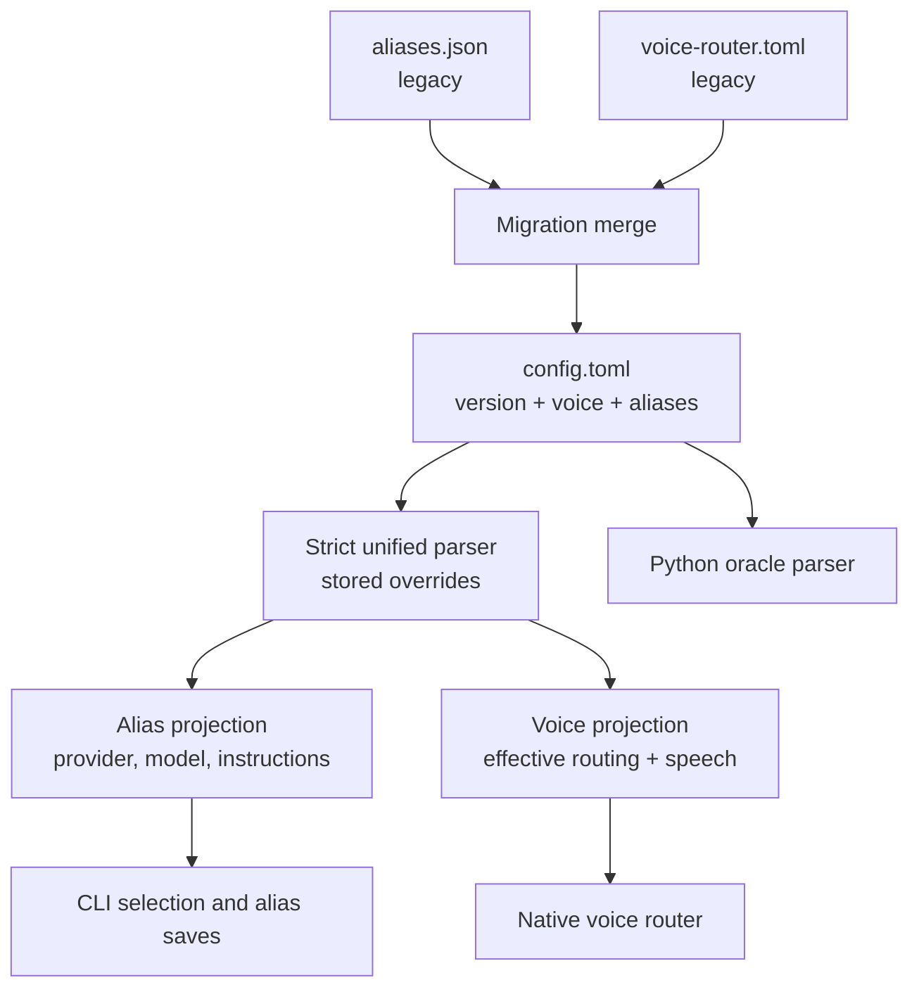
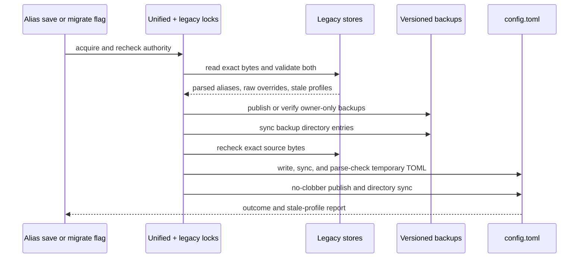
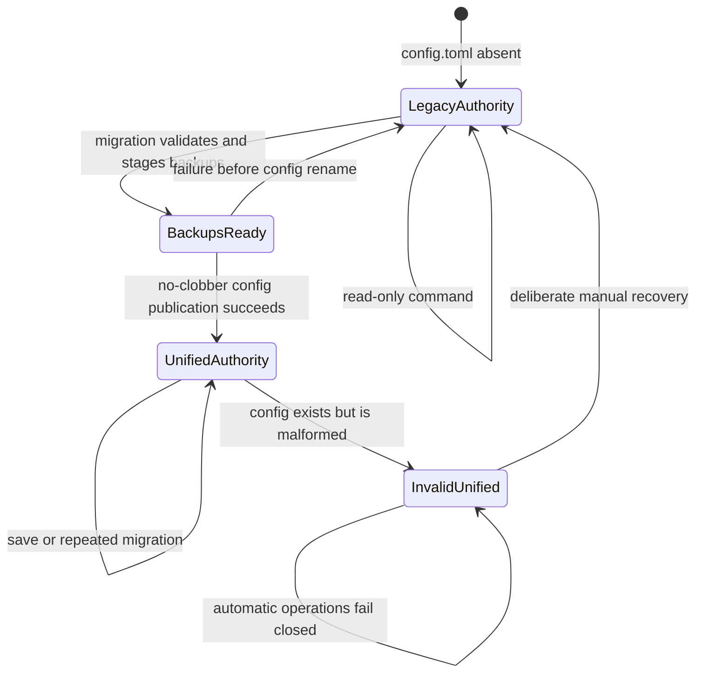

# Unified Alias and Voice Configuration - Plan

## Goal Capsule

- **Objective:** Give llm-now users one editable configuration file for aliases and voice behavior, with a recoverable path from the current split stores.
- **Product authority:** This Product Contract governs unified configuration ownership, migration, omission behavior, and portability. It supersedes `docs/plans/2026-08-06-001-feat-native-macos-voice-routing-plan.md` only where that plan requires separate alias and voice files or forbids changes to alias storage.
- **Execution profile:** Implement the full contract in one dependency-ordered delivery phase. Land it as one pull request stacked on the native macOS voice branch because the unified store consumes that branch's legacy voice implementation.
- **Stop conditions:** Stop if implementation would publish a unified file before recoverable backups exist, fall back to legacy data after a unified file is malformed, write configuration from `--voice`, weaken the existing routing safety gates, or require Python at runtime.
- **Tail ownership:** The implementation branch owns automated verification, the changeset, documentation, push, pull request, and CI follow-through.

---

## Product Contract

### Summary

One alias-centric TOML document becomes llm-now's editable source of truth for aliases, optional per-alias voice settings, and global voice-routing controls. Legacy stores remain readable until an explicit migration or the next successful alias mutation creates the unified document.

**Product Contract preservation:** Product Contract unchanged. The planning details below resolve the deferred document grammar, serializer, persistence, backup, and CLI choices without changing R1-R18.

### Problem Frame

Aliases currently live in a CLI-managed, versioned JSON document while voice routing uses a separate handwritten TOML file. A user who wants to adjust an alias's provider behavior and speech behavior must understand two formats, two paths, and two ownership models.

The split also hides omission semantics. Wake words and fuzzy-routing thresholds have compiled fallbacks, while per-alias speech settings inherit macOS defaults. Materializing those values would make them visible but would also pin today's behavior, so discoverability belongs in documentation rather than generated configuration.

### Key Decisions

- **Alias-centric TOML is the source of truth.** One alias entry owns its provider, model, instructions, and optional routing or speech customization. Governs R1-R4. (session-settled: user-directed — chosen over concern-separated TOML and expanded JSON: editing everything about an alias should require looking in one place.)
- **Configuration is canonically rewritten.** Alias mutations need not preserve comments or user formatting, and generated files omit default values. Governs R5-R7, R15. (session-settled: user-directed — chosen over comment-preserving writes and generated examples: documentation will teach customization without adding a comment-aware editing dependency.)
- **Migration happens through an intentional save boundary.** The next successful alias mutation migrates legacy state, and an explicit migration action provides an earlier path. Governs R7-R11. (session-settled: user-directed — chosen over explicit-only migration and new-install-only adoption: existing users should naturally converge on one file.)
- **The unified document is cross-platform.** Non-macOS systems accept and retain optional voice fields without enabling voice execution. Governs R4, R12, R14. (session-settled: user-approved — chosen over platform-specific removal or rejection: one portable configuration should survive movement between machines.)
- **Voice execution remains read-only with respect to configuration.** Running `--voice` never creates or migrates the unified document. Governs R7, R13. (session-settled: user-approved — chosen over first-voice-use materialization: invoking one prompt should not create or pin configuration.)
- **The Python example remains an independent oracle.** Shared behavioral evidence expands while production and release execution stay native. Governs R16-R17. (session-settled: user-directed — chosen over deleting the Python example: it remains useful for testing native parity.)

<!-- ce-section: work-relationships -->
### How This Work Fits Together

- **Depends on:** The native voice router and existing alias store as the two legacy inputs.
- **Supersedes:** Only the separate-file and unchanged-alias-store decisions in `docs/plans/2026-08-06-001-feat-native-macos-voice-routing-plan.md`.
- **Shares:** The current TypeScript/Python routing-parity boundary. Configuration migration remains a native product responsibility.
- **Can proceed independently of:** Future explain/replay diagnostics and non-macOS voice execution.

### Requirements

#### Unified document and omission behavior

- R1. llm-now must use one versioned TOML document as the authoritative store for aliases and voice configuration after migration.
- R2. Each alias entry must contain its provider and model selection together with any optional instructions, spoken names, voice, rate, or pitch customization for that alias.
- R3. The document must provide one global voice-routing area for wake words, minimum fuzzy phrase length, minimum similarity, and minimum runner-up margin.
- R4. Omitted voice fields must use compiled per-field fallbacks, including `hey`, `4`, `65`, and `15` for the current routing defaults and system speech behavior for omitted per-alias speech settings.

#### Editing and CLI ownership

- R5. Existing alias listing, lookup, save, collision, and overwrite-confirmation behavior must operate on the unified document without changing the user's alias semantics.
- R6. An alias mutation may canonically normalize the TOML document and remove comments or formatting, but it must preserve every valid unrelated configuration value.
- R7. Generated or migrated documents must not materialize wake-word, fuzzy-routing, voice, rate, pitch, or example-alias defaults that the user did not explicitly configure.
- R8. Malformed or unsupported unified configuration must fail before alias mutation, generation, clipboard changes, speech, or replacement of any valid on-disk document.

#### Migration and authority

- R9. When the unified document is absent, llm-now must continue reading the current legacy alias and voice stores without mutating them.
- R10. The next successful alias mutation must validate and merge both legacy stores, apply the requested alias change, create recoverable legacy backups, and make the unified document authoritative as one transaction.
- R11. An explicit migration action must perform the same merge without requiring an alias change and must be safe to retry after an interrupted or failed attempt.
- R12. A successful migration must preserve valid settings for active aliases, report any inert legacy voice profile it cannot attach, and retain the original profile in the backup.
- R13. Once a valid unified document exists, it must be the sole automatic read/write authority. Legacy sources and backups are used only through explicit recovery.

#### Portability, documentation, and parity

- R14. Windows and non-macOS Unix systems must accept, retain, and rewrite valid optional voice settings while continuing to reject voice execution where it is unsupported.
- R15. User documentation must identify the unified path, migration and downgrade recovery behavior, canonical-rewrite policy, every supported optional voice setting, and the effective defaults omitted from the file.
- R16. Native TypeScript and the retained Python example must independently prove equivalent routing and fallback outcomes for representative unified configuration cases.
- R17. Installed and packaged llm-now execution must remain free of Python, uv, repository-checkout, or Python-config-parser requirements.
- R18. Credentials and provider authentication material must remain outside the unified configuration document.

### Key Flows

- F1. Legacy read before migration
  - **Trigger:** A user invokes alias selection, alias inventory, or voice mode before a unified document exists.
  - **Outcome:** llm-now reads the legacy stores without creating or changing either one. Covers R9, R17.
- F2. Migration through alias save
  - **Trigger:** A user confirms an alias mutation while only legacy stores exist.
  - **Outcome:** llm-now validates both stores, merges them with the requested change, preserves recoverable originals, and publishes one authoritative document. Failure leaves legacy authority intact. Covers R5, R8, R10, R12-R13.
- F3. Explicit migration
  - **Trigger:** A user asks to migrate before the next alias mutation.
  - **Outcome:** The same validation, merge, backup, and authority transition occurs without changing alias content. Covers R11-R13.
- F4. Unified edit and save
  - **Trigger:** A user manually edits valid TOML or later saves an alias through llm-now.
  - **Outcome:** Reads honor the manual values. A later alias save may normalize formatting while preserving all valid unrelated settings. Covers R1-R8.
- F5. Portable configuration
  - **Trigger:** A unified document containing voice fields is used on Windows or Linux.
  - **Outcome:** Alias behavior remains available and subsequent saves retain voice settings. Unsupported voice execution still fails at the established platform boundary. Covers R14.

### Acceptance Examples

- AE1. **Fresh alias save.** Covers R1-R7. With no legacy or unified files, saving alias `slug` creates a TOML document containing that alias's configured provider, model selection, and instructions but no voice defaults, example aliases, or generated comments.
- AE2. **Automatic two-file migration.** Covers R9-R13. Given valid aliases plus wake words and speech settings for active aliases, the next confirmed alias save produces one equivalent unified document and recoverable copies of both originals before switching authority.
- AE3. **Explicit migration without alias change.** Covers R11-R13. A user can migrate two valid legacy stores without adding, removing, or overwriting an alias. Repeating the action after success does not duplicate or discard data.
- AE4. **Invalid migration input.** Covers R8-R11. If either legacy store is malformed or unsupported, migration reports an actionable configuration failure and leaves both legacy files and alias behavior unchanged.
- AE5. **Stale voice profile.** Covers R10-R12. If the voice TOML contains a structurally valid profile for a removed alias, migration reports that it was not attached, preserves it in the backup, and does not invent an incomplete alias.
- AE6. **Default inheritance.** Covers R4, R7, R15. Removing one global or per-alias voice field restores that field's compiled or system fallback without changing other explicitly configured values. The documentation identifies the effective value.
- AE7. **Canonical rewrite.** Covers R5-R8. After a user adds comments and custom spacing to valid TOML, a later alias save may remove those comments and normalize formatting but retains every configured alias, routing, and speech value.
- AE8. **Cross-platform retention.** Covers R14, R17. A Windows or Linux alias update retains configured spoken names and speech values while the existing non-macOS voice invocation still exits before routing or generation.
- AE9. **Native and oracle parity.** Covers R16-R17. Native and Python suites independently reach the same route, score boundary, ambiguity decision, and omission fallback for shared cases, while packaged runtime checks execute without Python.
- AE10. **Explicit downgrade recovery.** Covers R13, R15. Documentation warns that an older binary may not understand the unified document and explains how a user can deliberately restore the preserved legacy files before downgrading.

### Scope Boundaries

#### In scope

- One alias-centric TOML authority.
- Legacy read compatibility and recoverable migration.
- Compiled omission defaults and complete documentation.
- Cross-platform storage with macOS-only execution.
- Native/Python behavioral parity coverage.

#### Outside this product's identity

- Credentials or provider authentication in TOML.
- Comment preservation, generated examples, or materialized defaults.
- Silent configuration creation during voice invocation.
- Non-macOS speech or voice routing.
- A graphical editor, interactive calibration, or route replay tool.
- Removal of the Python example.

#### Deferred to Follow-Up Work

- A machine-readable JSON mode for configuration maintenance commands.
- A first-class recovery command. This plan documents deliberate manual restoration and keeps recovery data intact.
- Full noninteractive alias CRUD beyond the existing save flows.

### Dependencies / Assumptions

- The native macOS voice branch remains the implementation base because this work consumes its router, voice process boundary, release checks, and Python parity corpus.
- Legacy inputs remain parseable through their current strict validators. Missing legacy files represent empty legacy state.
- `config.toml` is the unified filename under the existing platform config directory. `--config-path` is the read-only discovery action, and `--migrate-config` is the explicit migration action.
- Manual downgrade recovery is sufficient for this scope. The documentation must require deliberate restoration; no automatic recovery path reads backups.
- Configuration maintenance actions are deterministic and noninteractive. They must not invoke providers, credentials, generation, clipboard, speech, or stdin.

---

## Planning Contract

### Key Technical Decisions

- KTD1. **Use a closed version-1 alias-centric schema at `config.toml`.** The root contains `version = 1`, an optional `[voice]` table, and `[aliases.<canonical-name>]` tables. The voice table accepts `wake_words`, `min_fuzzy_phrase_length`, `min_similarity`, and `min_margin`. Each alias table accepts `provider`, `model`, `instructions`, `spoken_names`, `voice`, `rate`, and `pitch`. The string `default` maps to the existing internal `model: null` selection only for providers that support a default model. Unix path resolution uses an absolute `XDG_CONFIG_HOME` or the home-based `.config` fallback; Windows uses an absolute `APPDATA` or the home-based roaming fallback. Relative environment values use the platform fallback. Unknown roots, fields, versions, or invalid combinations fail closed. Governs R1-R4, R6-R8, R14, R18. (session-settled: user-directed — chosen over concern-separated TOML and expanded JSON: editing everything about an alias should require looking in one place.)
- KTD2. **Use Bun for parsing and exact-pinned `smol-toml@1.7.1` for serialization.** A typed canonical projection fixes root, field, and sorted-alias order before stringification. It excludes omitted optional values and stays within the TOML 1.0 subset accepted by Bun and Python `tomllib`. The schema boundary translates parser and validation failures into sanitized diagnostics that may identify the path, field, and source location but never reproduce raw TOML lines or values. This avoids reimplementing TOML, adds no transitive runtime dependencies or external assets, keeps compiled executables self-contained, and prevents instructions or accidentally embedded credentials from reaching diagnostics. Governs R1, R6-R8, R14, R16-R18.
- KTD3. **Separate stored overrides from effective routing values.** Parsing retains omission information in the stored document. Projection helpers apply `hey`, `4`, `65`, `15`, empty spoken names, and system speech behavior only at read time. Configurable minimum length is an integer from 1 through 64. Similarity and margin are integers from 0 through 100. Digit equality, the candidate-length guard, stage order, and fail-closed ambiguity behavior remain invariant. Governs R3-R4, R7, R16. (session-settled: user-directed — chosen over materialized defaults: removing an override must resume the compiled behavior documented for the installed release.)
- KTD4. **Make unified-file existence the authority commit marker.** All unified mutations use one config lock, reread under lock, owner-only same-directory temporary files, file sync, and atomic publication. First creation uses a no-clobber publication primitive so two absent-file writers cannot replace one another; later mutations use atomic replacement. Migration also holds the legacy alias lock while it takes one exact byte snapshot of both legacy sources, validates and builds backups from those bytes, then rechecks their bytes before commit. For each legacy source that exists, it publishes the deterministic `aliases.json.pre-unified-v1.bak` or `voice-router.toml.pre-unified-v1.bak` copy; absent sources represent empty state and produce no backup. It syncs the backup parent directory and only then publishes and directory-syncs `config.toml`. An existing backup is reusable only when its bytes match the snapshot. Legacy source files remain untouched and are ignored automatically after commit. Governs R8-R13. (session-settled: user-directed — chosen over destructive replacement and explicit-only migration: legacy state must remain recoverable while normal alias saves converge users onto one file.)
- KTD5. **Use the same maintenance primitive for automatic and explicit migration.** `--migrate-config` performs a no-change merge and exits successfully for migrated and already-unified states with distinct diagnostics. When both legacy inputs are missing, the explicit action publishes a minimal version-1 document with an empty alias table; automatic reads remain non-writing. `--config-path` only prints the resolved unified path. Both flags are standalone and mutually exclusive with all prompt and selection options. The alias-save path invokes migration only after overwrite approval and preserves the existing reconfirm-after-concurrent-change behavior. Valid stale profiles produce one sorted stderr warning and exit zero. Governs R5, R8-R13.
- KTD6. **Validate one immutable configuration snapshot before any side effect named by R8.** Each read-only or generation execution loads authority exactly once, then passes the resulting aliases and voice projections through selection and routing. A mutation may use an initial snapshot for collision detection and confirmation, but it must reread under the unified lock, use that lock-time snapshot consistently for preparation and commit, and reconfirm if the target changed. Explicit provider/model runs still perform a read-only unified preflight before generation, even when they do not consume aliases. Voice mode validates before clipboard or speech and never speaks a configuration-error notice for malformed unified content. `--config-path` and the early non-macOS `--voice` rejection are exempt because neither reads application configuration nor performs an R8 side effect; `--migrate-config` validates any existing unified document before reporting it already migrated. Missing unified content retains the legacy read path and does not trigger migration. Governs R8-R9, R13-R14. (session-settled: user-approved — chosen over first-voice-use materialization: voice execution can validate configuration but cannot write it.)
- KTD7. **Keep Python as an independent reader and router.** The example uses `tomllib` to parse the unified schema and its own compiled fallbacks. Native and Python tests share inputs and expected outcomes, not implementation code or a defaults manifest. Native packaging and release jobs never invoke Python. Governs R16-R17. (session-settled: user-directed — chosen over deleting or embedding the Python example: independent parity is valuable while installed execution stays native.)
- KTD8. **Treat the CLI as the automation surface.** Config discovery and migration are stable noninteractive primitives over the same file and locks used by interactive saves. Do not add a separate MCP/API layer, agent-only state, or JSON output in this plan. Governs R5, R8, R11, R13-R14.
- KTD9. **Keep configuration dependencies one-way and locks ownership-aware.** `src/config-schema.ts` owns only pure stored types, validation, canonical projection, and serialization. `src/config.ts` owns paths, authority, snapshots, locks, backups, migration, and filesystem effects; aliases, application, and voice modules consume those APIs and never import persistence back into the schema. Lock files carry a unique owner token and process identity. A contender may break a stale lock only after both age and owner-liveness checks, and a releaser removes only the token it acquired, preventing an old owner from deleting a replacement lock. Governs R5-R14.

### High-Level Technical Design

#### Configuration ownership and projections

#### Migration publication sequence

#### Authority and retry state machine

### System-Wide Impact

- **Configuration lifecycle:** `src/config-schema.ts` owns the pure versioned grammar, validation, canonical projection, and serialization. `src/config.ts` owns path resolution, authority selection, snapshots, persistence, locks, backups, and migration. Alias and voice modules consume typed views and never choose files independently.
- **Path precedence:** All consumers use KTD1's platform rule instead of retaining separate alias and voice resolvers.
- **Generation boundary:** Every generation path gains a read-only unified preflight when `config.toml` exists so malformed state cannot be bypassed by explicit selection.
- **Concurrency:** Interactive saves, credential-backed shortcut creation, automatic migration, and explicit migration share the unified token-owned lock. Migration additionally coordinates with the legacy alias lock used by pre-unification writers, snapshots exact source bytes, and rechecks them before authority publication.
- **Portability:** The schema and serializer stay platform-neutral. POSIX permission assertions apply on macOS/Linux; Windows tests cover path and preservation behavior without assuming POSIX mode semantics.
- **Release packaging:** `smol-toml` is pure JavaScript with no runtime assets. Runtime smoke must execute its stringify path outside `node_modules` so a compiled-only packaging defect cannot hide.
- **Automation parity:** Human and automated callers use the same `--config-path` and `--migrate-config` outcomes. The commands disclose paths and stale alias names, never alias instructions or credential values.
- **Diagnostic boundary:** Parser-specific exceptions stay behind the schema module. Application-facing errors contain only sanitized path, field, location, and category metadata; raw configuration lines and values never reach stdout, stderr, or provider-facing messages.

### Risks and Mitigations

- **Partial multi-file migration:** Backups can be created before a later failure. Deterministic byte-verified backups and unified-file existence as the sole commit marker make that state safely retryable.
- **Concurrent first publication:** An ordinary rename can overwrite a config another process created while both observed absence. Use a filesystem no-clobber publication primitive, then reload and retry the operation against the winning unified document.
- **Lock ABA and long transactions:** Age-only stale breaking can remove a live lock, and an old owner can delete a successor's lock. Record unique ownership and process identity, combine age with owner-liveness checks, and verify the token before release.
- **Crash durability ordering:** File sync alone does not guarantee that backup directory entries survive before the authority entry. Sync the parent directory after backup publication and again after unified publication on platforms that support directory sync.
- **Unlocked manual voice edits:** The legacy voice file has no writer lock. Migration must validate, back up, and project one exact byte snapshot, then recheck the file before commit; any change aborts safely.
- **Malformed unified authority:** Falling back to valid legacy data would hide corruption and split ownership. Any existing invalid unified document fails closed until the user repairs it or performs documented recovery.
- **Concurrent alias changes:** The save confirmation can become stale. Preserve the current confirmation-outside-lock loop, reread under the unified lock, and reconfirm when the selected alias changes.
- **Loss of explicit omission:** Applying defaults during parsing would cause later writes to pin them. Stored overrides and effective routing projections remain separate types.
- **Sensitive diagnostic leakage:** TOML parsers may embed an offending source line in their exceptions. Catch and replace parser errors at the schema boundary, and assert with sentinel instructions and credential-like values that every command surface remains redacted.
- **Serializer output drift:** Exact-pin `smol-toml`, build a sorted projection, assert byte-stable rewrites, and run generated documents through both Bun and Python parsers.
- **Downgrade confusion:** Old binaries ignore `config.toml` and may mutate legacy files. Documentation must require a deliberate backup restoration step and explain that post-migration unified changes are not mirrored back.
- **Scope expansion through recovery:** A recovery command adds destructive overwrite policy and more CLI states. Keep recovery manual and documented in this delivery.

### Sources and Research

- Existing alias safety and concurrency patterns: `src/aliases.ts` and `tests/aliases.test.ts`.
- Existing voice schema, defaults, and routing gates: `src/voice-routing.ts`, `src/voice.ts`, `tests/voice-routing.test.ts`, and `tests/voice.test.ts`.
- Native/Python parity boundary: `examples/macos-voice-router/src/llm_now_voice/cli.py`, `examples/macos-voice-router/tests/test_cli.py`, and `examples/macos-voice-router/tests/fixtures/routing-parity.json`.
- Release boundary: `scripts/build.ts`, `scripts/release-validate.ts`, `tests/runtime-compile-smoke.ts`, and `tests/release-policy.test.ts`.
- [`smol-toml` 1.7.1 README and serializer](https://github.com/squirrelchat/smol-toml/tree/v1.7.1) establish the maintained parse/stringify API, zero-dependency package shape, omission behavior, and insertion-order serialization.
- [Bun standalone executable documentation](https://bun.sh/docs/bundler/executables) establishes that imported JavaScript packages are bundled into the executable without sidecar assets.
- [POSIX `rename`](https://pubs.opengroup.org/onlinepubs/9799919799/functions/rename.html) and [Node file-system documentation](https://nodejs.org/api/fs.html) ground same-directory atomic publication, sync, mode, and backup-copy constraints.

---

## Implementation Units

### U1. Unified schema, paths, and canonical serialization

- **Goal:** Establish one strict stored configuration model and its alias and effective-voice projections without changing application entry points yet.
- **Requirements:** R1-R4, R6-R8, R14, R18; AE1, AE6-AE8; KTD1-KTD3, KTD9.
- **Dependencies:** None.
- **Files:** `src/config-schema.ts`, `src/config.ts`, `src/aliases.ts`, `src/voice-routing.ts`, `package.json`, `bun.lock`, `tests/config.test.ts`, `tests/aliases.test.ts`, `tests/voice-routing.test.ts`.
- **Approach:**
  1. Put the pure stored types, strict validation, canonical projection, and serialization in `src/config-schema.ts`; it performs no filesystem or environment access.
  2. Centralize unified and legacy path resolution and all I/O authority in `src/config.ts`, with no reverse dependency from the schema module.
  3. Define stored override types separately from the existing alias projection and effective `VoiceConfig`.
  4. Parse the closed version-1 grammar with Bun and validate provider/model combinations, alias normalization collisions, spoken names, speech values, and routing ranges.
  5. Build a fixed-order canonical projection and serialize it through exact-pinned `smol-toml@1.7.1`.
  6. Keep current alias helper APIs available while moving persistence ownership toward the unified module.
- **Patterns to follow:** Strict exact-key validation and casing diagnostics in `src/aliases.ts`; current phrase, rate, pitch, and collision checks in `src/voice-routing.ts`.
- **Test scenarios:**
  - Covers AE1. Parse and rewrite a fresh `slug` alias with provider, model, and multiline instructions while omitting every unconfigured voice field and comment.
  - Covers AE6. Omit each global and per-alias voice setting independently and assert the effective fallback changes only for that field.
  - Parse explicit empty wake words and empty spoken names without replacing them with omission defaults.
  - Accept valid Unicode instructions and quoted TOML alias keys while canonicalizing legal alias names to lowercase.
  - Reject unsupported versions, unknown roots/fields, invalid default-model providers, invalid ranges, control characters, and case-insensitive alias or spoken-name collisions.
  - Reject malformed TOML through a sanitized error that identifies useful location/category metadata without reproducing raw source lines, instruction contents, or credential-like values.
  - Rewrite the same semantic document twice and assert byte-identical output with sorted aliases and fixed field order.
  - Parse generated output with Bun and Python `tomllib` and assert the same semantic document.
- **Verification:** The unified schema round-trips without losing omission state, and current alias/voice validation behaviors remain represented by typed projections.

### U2. Unified read authority and configurable routing

- **Goal:** Make all alias, generation, and native voice reads obey unified-versus-legacy authority while applying configured fuzzy thresholds.
- **Requirements:** R3-R9, R13-R14, R17; F1, F4-F5; AE6-AE8; KTD3, KTD6, KTD9.
- **Dependencies:** U1.
- **Files:** `src/config.ts`, `src/app.ts`, `src/voice.ts`, `src/voice-routing.ts`, `index.ts`, `tests/app.test.ts`, `tests/voice.test.ts`, `tests/voice-routing.test.ts`.
- **Approach:**
  1. Load one immutable validated snapshot per operation containing authority, aliases, stored overrides, and effective voice settings; pass it through downstream selection and routing instead of rereading.
  2. Use unified authority when `config.toml` exists and the two legacy reads only when it does not.
  3. Thread effective minimum length, similarity, and margin into fuzzy routing while retaining the existing invariant safety gates and scorer.
  4. Add a read-only existing-unified preflight to explicit generation paths, while exempting only `--config-path` and the early unsupported-platform voice rejection.
  5. Move voice configuration validation before any clipboard or speech call and keep unsupported-platform rejection ahead of voice execution.
- **Execution note:** Start with authority and side-effect-ordering tests because R8 intentionally tightens the current voice failure boundary.
- **Patterns to follow:** Early dispatch in `runApplication`, injected application/voice dependencies, `RouteResult` parity assertions, and current non-macOS guard ordering.
- **Test scenarios:**
  - Covers F1. With no unified file, alias inventory, deterministic alias selection, and voice routing read the two legacy stores without creating files.
  - With a valid unified file and conflicting legacy values, every automatic read uses the unified values only.
  - With an invalid unified file and valid legacy files, alias, explicit provider/model, and voice generation paths fail before runtime generation, clipboard, or speech and do not fall back.
  - Covers AE6. Custom thresholds alter only the expected fuzzy boundary; removing each override restores `4`, `65`, or `15` independently.
  - Preserve exact/configured/fuzzy stage priority, digit equality, candidate-length compatibility, ambiguity rejection, score reporting, and `string-metrics-wasm` use.
  - Covers AE8. Linux and Windows reads retain voice values, while `--voice` still rejects before routing and generation outside macOS.
  - Confirm `--voice` performs no config, legacy, backup, lock, or temporary-file write.
- **Verification:** All generation surfaces share fail-closed unified preflight behavior, and legacy fallback occurs only when `config.toml` is absent.

### U3. Atomic alias writes and retry-safe migration CLI

- **Goal:** Route alias mutations and explicit migration through one owner-safe transaction that publishes backups before unified authority.
- **Requirements:** R5-R13; F2-F4; AE1-AE5, AE7, AE10; KTD4-KTD5, KTD8-KTD9.
- **Dependencies:** U1, U2.
- **Files:** `src/config-schema.ts`, `src/config.ts`, `src/aliases.ts`, `src/args.ts`, `src/app.ts`, `index.ts`, `tests/config.test.ts`, `tests/aliases.test.ts`, `tests/args.test.ts`, `tests/app.test.ts`, `tests/fixtures/alias-save-worker.ts`.
- **Approach:**
  1. Refactor the current lock, permission, temporary-file, and reconfirmation behavior into the unified writer, adding token-verified ownership and process-aware stale-lock recovery.
  2. On a fresh save, publish `config.toml` with a no-clobber primitive and reload on collision. On legacy migration, acquire both locks, capture one exact byte snapshot, validate and project from it, publish or verify byte-identical backups, sync the directory, recheck legacy bytes, then no-clobber-publish and directory-sync the unified file last.
  3. Preserve unrelated stored voice fields during alias updates and classify stale profiles after applying the requested alias mutation.
  4. Add standalone `--config-path` and `--migrate-config` parse kinds and dispatch them before interactive, provider, credential, stdin, or runtime work.
  5. Return typed maintenance outcomes so the app can distinguish migrated, already unified, empty unified config created, stale profiles, and failures without exposing configuration content.
- **Execution note:** Build fault-injection and concurrent-process tests around the migration commit point before completing the happy-path CLI wiring.
- **Patterns to follow:** `saveAlias` lock acquisition, stale-lock handling, reread-under-lock, external confirmation, credential persistence guard, owner-only writes, and injected rename failures.
- **Test scenarios:**
  - Covers AE1. A first alias save with no legacy inputs creates owner-only canonical `config.toml` and no backups.
  - Covers AE2. A confirmed alias update merges active legacy voice settings, preserves unrelated aliases, creates both deterministic backups, and publishes unified authority last.
  - A legacy profile matching the alias created by the migration-triggering save attaches to that new alias rather than being reported stale.
  - Covers AE3. `--migrate-config` changes no alias data and returns successful distinct outcomes for migrated, already unified, and no legacy state.
  - With both legacy inputs absent, explicit migration creates a minimal version-1 document; with one input absent, it backs up only the file that exists.
  - Covers AE4. Invalid alias JSON, invalid voice TOML, backup mismatch, temporary-write failure, sync failure, and final-rename failure preserve legacy authority and do not create `config.toml`.
  - Retry after failure before backups, after the first backup, during unified temporary write, and after final publication reuses identical backups and never duplicates or overwrites them.
  - A rename that commits `config.toml` and then reports failure is recognized on retry as already-unified success rather than replaying migration.
  - Covers AE5. Valid stale profile names produce one sorted stderr warning with exit zero without creating incomplete aliases, while invalid stale profiles fail migration and exact legacy bytes remain in the voice backup.
  - Covers AE7. Saving one alias after a manual valid TOML edit preserves every unrelated alias and voice override while allowing canonical formatting and comment removal.
  - Concurrent saves and explicit migration serialize on the unified lock and preserve both successful changes; changed targets still require reconfirmation.
  - Two processes racing to create the first unified file cannot overwrite one another; the loser reloads the winner and retries its semantic change.
  - A stale-lock contender cannot break a live long-running owner, and an old owner cannot remove a replacement lock after an ABA sequence.
  - If either legacy source changes after snapshot or backup publication, migration aborts before authority publication and succeeds safely on retry from a new coherent snapshot.
  - Declining or cancelling an overwrite causes no migration, backup, or unified write.
  - POSIX directories are `0700`; lock, backup, temporary, and unified files are `0600`. Windows path and transaction tests avoid POSIX-mode assumptions.
  - Maintenance flags reject every other option or positional, use closed stdin, and perform zero prompt, provider, credential, generation, clipboard, or speech calls.
  - Automatic migration, explicit migration, generation preflight, and voice failure tests use secret sentinels and assert they never appear in returned errors, stdout, or stderr.
- **Verification:** Successful no-clobber publication of the first unified file is the only authority transition, all pre-commit failures are retryable, and existing alias save results and confirmation semantics remain intact.

### U4. Python parity and compiled-runtime proof

- **Goal:** Extend the independent oracle and native packaging evidence to the unified schema without introducing Python or serializer assets into installed execution.
- **Requirements:** R4, R14, R16-R17; AE6, AE8-AE9; KTD2-KTD3, KTD7.
- **Dependencies:** U1-U3.
- **Files:** `examples/macos-voice-router/src/llm_now_voice/cli.py`, `examples/macos-voice-router/tests/test_cli.py`, `examples/macos-voice-router/tests/fixtures/routing-parity.json`, `tests/voice-routing.test.ts`, `tests/runtime-compile-smoke.ts`, `tests/fixtures/runtime-smoke-entry.ts`, `tests/fixtures/voice-routing-compile-entry.ts`, `scripts/release-validate.ts`, `tests/release-policy.test.ts`.
- **Approach:**
  1. Point the Python example at `config.toml` and independently parse version, voice overrides, and alias voice fields with `tomllib`.
  2. Add effective threshold fields to both routers and expand the shared corpus with omitted and explicit configuration states.
  3. Keep the corpus limited to inputs and expected semantic outcomes so parser and fallback implementation stay independent.
  4. Exercise canonical stringify, parse, write, reload, migration, and routing in a compiled executable outside the repository dependency tree.
  5. Preserve source-CI Python checks and native-job Python exclusions.
- **Patterns to follow:** Existing shared JSON corpus consumers, `tests/runtime-compile-smoke.ts` executable isolation, audited dependency pins, and release-policy assertions.
- **Test scenarios:**
  - Covers AE9. Native and Python independently produce the same effective fallbacks, configured thresholds, routes, reasons, scores, runner-up scores, and question offsets for shared cases.
  - Generated TOML from the native writer parses under Python `tomllib` without TOML 1.1-only syntax.
  - The Python example rejects the same unsupported versions, invalid routing ranges, alias/profile collisions, and malformed field shapes without importing native code.
  - Compiled runtime smoke performs a unified write/reload and migration with `node_modules`, Python, uv, and the repository checkout unavailable.
  - Release source jobs retain Python parity, while native build and archive jobs contain no Python setup or execution.
  - The new pure-JavaScript serializer contributes no external asset, native addon, WASM payload, install script, or transitive runtime dependency.
- **Verification:** Shared parity cases pass in both languages, and the built executable proves the serializer and migration paths are self-contained.

### U5. User guidance, recovery contract, and release note

- **Goal:** Teach users how to find, edit, migrate, recover, and downgrade the unified configuration without materializing defaults or examples.
- **Requirements:** R4, R7, R12-R13, R15, R17-R18; AE5-AE6, AE10.
- **Dependencies:** U1-U4.
- **Files:** `README.md`, `examples/macos-voice-shortcut.md`, `docs/manual-testing.md`, `.changeset/unified-alias-voice-config.md`, `docs/ideation/2026-08-07-editable-voice-router-defaults-ideation.html`, `docs/plans/2026-08-08-001-feat-unified-alias-voice-config-plan.html`, `docs/plans/2026-08-08-001-feat-unified-alias-voice-config-plan.md`.
- **Approach:**
  1. Document the platform paths and `--config-path` instead of requiring users to infer them.
  2. Show the alias-centric grammar and every optional field in documentation while keeping generated files sparse and comment-free.
  3. State the omission defaults `hey`, `4`, `65`, `15`, macOS voice/rate/pitch inheritance, threshold ranges, and invariant routing gates.
  4. Explain automatic versus explicit migration, stale-profile reports, plaintext instruction/backups, canonical rewrites, and the no-write `--voice` rule.
  5. Provide deliberate downgrade recovery steps that first move `config.toml` out of the authority path, then restore versioned backups to legacy paths, preserve the moved unified file, and warn that post-migration changes are not mirrored to legacy files.
  6. Record the user-visible feature in a package changeset and retain the planning/ideation artifacts that informed implementation.
- **Test scenarios:**
  - Test expectation: none -- this unit changes documentation and release metadata only; the preceding units prove behavior.
- **Verification:** A user can discover the path, understand every field and omission default, migrate safely, and recover for a downgrade without consulting source code or the Python example.

---

## Verification Contract

| Gate | Applies to | Done signal |
|---|---|---|
| `bun test tests/config.test.ts tests/aliases.test.ts` | U1, U3 | Schema, canonical persistence, migration faults, permissions, and concurrency pass. |
| `bun test tests/args.test.ts tests/app.test.ts tests/voice-routing.test.ts tests/voice.test.ts` | U2-U4 | CLI isolation, unified authority, R8 ordering, routing thresholds, and voice behavior pass. |
| `uv run --project examples/macos-voice-router --locked python -m unittest discover -s examples/macos-voice-router/tests` | U4 | The retained Python oracle passes unified-schema and routing parity cases. |
| `bun test tests/release-policy.test.ts` | U4 | Native jobs remain Python-free and the source parity job remains present. |
| `bun run typecheck` | U1-U4 | TypeScript validates with no suppression added for this feature. |
| `bun run runtime:smoke` | U2-U4 | Compiled execution proves config serialization, migration, routing, and normal CLI behavior outside the dependency tree. |
| `bun run check` | U1-U5 | Full tests, typecheck, and runtime smoke pass together. |
| `bun scripts/release-validate.ts packages` | U4-U5 | Exact dependency and package integrity checks pass. |
| `bun run changeset:status` | U5 | The feature changeset is valid and release metadata is complete. |

Manual verification follows `docs/manual-testing.md` on the final implementation branch. It covers a fresh save, both migration triggers, stale-profile reporting, canonical rewrite, malformed unified fail-closed behavior, `--voice` no-write behavior, and downgrade recovery. GitHub Actions remains the authority for target-platform archive builds that cannot be reproduced locally.

---

## Definition of Done

- U1 is done when one strict versioned TOML schema round-trips canonically, retains omission state, and projects the existing alias and effective voice types across supported paths.
- U2 is done when every generation and voice path obeys unified-versus-legacy authority, configurable thresholds work, malformed unified data fails before R8 side effects, and `--voice` never writes.
- U3 is done when fresh saves, automatic migration, explicit migration, retries, backup mismatches, injected failures, and concurrent writes preserve the documented authority and alias confirmation contracts.
- U4 is done when native and Python parity covers unified configuration, compiled runtime executes serializer and migration behavior without sidecars, and native release jobs remain Python-free.
- U5 is done when user documentation and the changeset explain the path, schema, defaults, migration, canonical rewrite, security posture, and downgrade recovery.
- All verification gates pass, including the full `bun run check`, Python oracle suite, release-policy checks, package validation, and changeset validation.
- The implementation preserves all valid unrelated aliases and voice overrides during mutation and does not add credentials to configuration or diagnostics.
- All configuration parse and validation errors are sanitized at the schema boundary; automated tests prove raw instructions and credential-like sentinel values do not reach diagnostics on any configuration-backed command path.
- Abandoned experimental code, temporary fixtures, debug output, and obsolete split-store documentation introduced by this implementation are removed. The retained Python example and legacy-read compatibility remain in place.
