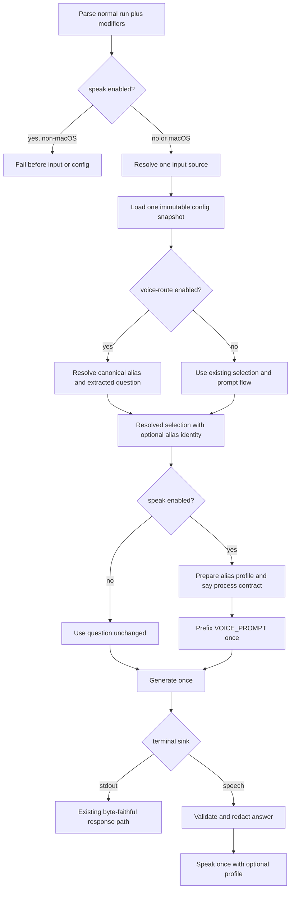

# Composable Voice Routing and Speech Flags - Plan

## Goal Capsule

- **Objective:** Replace the unreleased monolithic `--voice` mode with independent `--voice-route` and `--speak` modifiers so routing and audible output compose with the existing selection and input surfaces.
- **Authority:** The Product Contract in this plan owns the new CLI behavior. `docs/plans/2026-08-06-001-feat-native-macos-voice-routing-plan.md` remains authoritative for routing, response safety, notices, subprocess isolation, and cancellation except where this plan supersedes its single-flag boundary.
- **Execution profile:** Deliver the work in one implementation phase and one stacked pull request based on `codex/unified-alias-voice-config`, which contains the unreleased native voice and unified configuration prerequisites.
- **Stop conditions:** Stop if either flag requires a second generation request, reintroduces clipboard access, makes route-only execution macOS-specific, weakens response safety, or makes the installed executable depend on Python.
- **Completion signal:** All flag combinations have explicit parser, application, speech, compiled-runtime, documentation, and macOS manual-test coverage while the retained Python oracle stays green.

---

## Product Contract

### Summary

Replace `llm-now --voice` with two run modifiers.
`--voice-route` converts a dictated transcript into a saved alias selection and question.
`--speak` applies the existing speech-oriented prompt and sends the safe answer to macOS speech instead of stdout.

### Problem Frame

The current `--voice` mode bundles input routing, alias selection, generation, and speech behind a special application branch.
That design prevents a user from selecting an alias or provider explicitly and asking `llm-now` to speak the answer.
It also prevents voice routing from being used as a cross-platform input adapter whose result follows the normal stdout contract.

The two concerns already have different boundaries.
Routing is pure configuration and string matching.
Speech depends on macOS, speech profiles, answer validation, and `/usr/bin/say`.
The CLI should expose that separation without duplicating input reads, configuration loads, generation, or output side effects.

### Requirements

#### CLI composition

- R1. Remove `--voice` from parsing and help, and expose boolean `--voice-route` and `--speak` modifiers on normal run invocations.
- R2. `--voice-route` must accept exactly one transcript source from `--input` or stdin, select an alias from that transcript, and reject positional aliases, `--alias`, and explicit provider/model selection.
- R3. `--voice-route` may combine with `--instruction` and `--speak`; the request-scoped instruction must retain its existing precedence over the routed alias's saved instructions.
- R4. `--speak` must combine with routed, positional-alias, `--alias`, explicit provider/model, and existing interactive selection flows without creating a new selection grammar.
- R5. `--aliases`, `--config-path`, `--migrate-config`, `--help`, and `--version` must remain exclusive and reject either new modifier, while the bare positional names `voice`, `voice-route`, and `speak` remain valid aliases.
- R6. A retired `--voice` invocation must return the ordinary unknown-option usage failure with exit `2`; no compatibility alias or deprecation path is required because the feature is not released from its prerequisite branch.

#### Routing, generation, and output

- R7. Each lifecycle step may occur at most once. An invocation that reaches generation must have resolved exactly one input source, immutable configuration snapshot, selection, and prompt; required platform, routing, configuration, and speech-preflight failures may stop before later steps.
- R8. `--voice-route` without `--speak` must work on every supported platform, apply no speech prompt or speech-only answer validation, invoke no speech process, and write the successful model response through the ordinary stdout path.
- R9. Every `--speak` invocation must retain the existing `VOICE_PROMPT` bytes exactly once before the user question while passing saved or request-scoped instructions through the existing separate runtime instruction parameter.
- R10. `--speak` must suppress model-answer stdout and speak one validated answer with the selected alias's configured voice, rate, and pitch; an explicit provider/model selection has no alias profile and inherits macOS system speech defaults.
- R11. `--speak` must reject non-macOS platforms before reading stdin, configuration, credentials, or routing dependencies; `--voice-route` alone must not enter that platform guard.
- R12. Speech executable and configured-voice availability must be checked before generation so a known speech setup failure does not spend a provider request.

#### Safety, failures, and compatibility

- R13. The combined `--voice-route --speak` path must preserve the current stable retry, empty-alias, request-failure, configuration, answer-speech, timeout, cancellation, and exit-code behavior of the native `--voice` coordinator.
- R14. Route-only rejection must leave stdout empty, write a bounded and value-redacted diagnostic to stderr, return `1`, and perform no generation or speech.
- R15. A speak-only generation or speech-validation failure must use the existing stable spoken request-failure notice and exit behavior; an answer-speech failure must return `1` without starting a replacement notice.
- R16. Every `--speak` path must retain the existing control-character, terminal-sequence, macOS speech-command, invalid UTF-8, and registered-credential protections before invoking `/usr/bin/say`.
- R17. Every invocation containing `--speak` must retain one root cancellation lifecycle across generation, notices, and answer speech, return `130` on cancellation, reap active child work, and start no later notice or output.
- R18. Neither flag may read, write, clear, restore, or otherwise depend on the clipboard.
- R19. Routed and direct-alias speech must use the same unified-or-legacy configuration authority and remain read-only; explicit provider/model speech must still perform the existing unified configuration preflight.
- R20. The Python example, lockfile, tests, and source-CI lane must remain as an independent integrated oracle for the behavior equivalent to `--voice-route --speak`; installed and release execution must remain Python-free.
- R21. Help, release validation, compiled smoke coverage, README guidance, the macOS Shortcut guide, manual testing, historical supersession notes, and the existing unreleased Changeset must describe the two new flags and no longer present `--voice` as supported.

### Key Product Decisions

- **Separate routing from speech.** `--voice-route` and `--speak` replace the monolithic `--voice` flag. Governs R1-R5. (session-settled: user-directed — chosen over keeping one `--voice` mode: users need to select an alias and input explicitly while still speaking the result.)
- **Keep the speech-oriented prompt on the speech modifier.** `--speak` retains the current concise plain-text speech prompt, while route-only generation does not add it. Governs R8-R10. (session-settled: user-directed — chosen over removing or globally applying the prompt: concise plain text is useful when and only when the result is intended for speech.)
- **Keep the clipboard outside the tool.** Voice routing and speech have no clipboard behavior. Governs R18. (session-settled: user-directed — chosen over copying generated answers: `llm-now` should not mutate global clipboard state.)

### Acceptance Examples

- AE1. **Covers R2-R3, R7, R9-R10.** Given a saved `haiku` alias, `llm-now --voice-route --speak --input "hey haiku, explain this"` selects `haiku`, sends the speech prompt plus `explain this` once, applies the alias speech profile, leaves stdout empty, and speaks the answer once.
- AE2. **Covers R4, R7, R9-R10.** `llm-now haiku --speak --input "explain this"` skips transcript routing, preserves saved instructions unless `--instruction` overrides them, applies the `haiku` speech profile, and speaks one answer.
- AE3. **Covers R4, R9-R12.** `llm-now --provider ollama --model qwen --speak --input "explain this"` performs the normal unified preflight, uses system speech defaults, applies the speech prompt once, and never loads an alias profile.
- AE4. **Covers R2, R7-R8, R11, R14.** On Linux, `llm-now --voice-route --input "hey haiku, explain this"` routes and writes a successful answer to stdout without checking `/usr/bin/say`; an ambiguous route returns `1` with empty stdout and no provider call.
- AE5. **Covers R5-R6.** `llm-now --voice` and `llm-now --voice-route --alias haiku` return usage exit `2`, while `llm-now voice --input "hello"` still resolves the positional alias named `voice`.
- AE6. **Covers R13, R15-R18.** A combined request that fails generation speaks only the stable request-failure notice, a cancelled request returns `130` with no later speech, and a successful request leaves a pre-existing clipboard sentinel unchanged.
- AE7. **Covers R4, R7, R19.** `llm-now --speak` in an interactive terminal uses the existing launcher and alias picker, applies an alias profile only when the selected result has a canonical alias, and retains the ordinary post-run shortcut follow-up behavior.

### Scope Boundaries

#### Included

- Replace the unreleased CLI boundary and refactor native orchestration only as far as needed to share one request pipeline.
- Preserve the existing routing algorithm, configuration schema, speech profile semantics, answer safety gates, notices, and Python parity corpus.
- Update the user-facing Shortcut to invoke `--voice-route --speak` in its existing two-action workflow.

#### Deferred to Follow-Up Work

- Additional speech engines, Linux or Windows text-to-speech, streaming speech, concurrent speech serialization, and speech interruption UX.
- A route-explain command, fuzzy matching for ordinary typed commands, or configuration changes unrelated to the flag split.
- Removal of the Python oracle after native behavior has accumulated enough independent confidence.

#### Outside This Change

- Clipboard output, a compatibility shim for unreleased `--voice`, a generic subprocess framework, or changes to provider/runtime selection semantics.

---

## Planning Contract

### Key Technical Decisions

- KTD1. **Represent both capabilities as run modifiers.** Replace the special `ParsedArguments` voice variant with `voiceRoute` and `speak` state on the normal run variant, then enforce R2-R6 before ordinary selection resolution.
- KTD2. **Use one application-owned request pipeline.** Convert an accepted route into a canonical alias selection plus the extracted question before the existing generation tail, then choose stdout or speech as the single terminal sink. This prevents duplicate reads, configuration loads, and generation under R7.
- KTD3. **Decompose the voice coordinator at behavior boundaries.** Keep transcript routing and speech preparation/execution as narrow operations in `src/voice.ts`, while retaining `src/voice-routing.ts` as the pure parser, scorer, configuration projection, and speech-answer validator owner.
- KTD4. **Carry canonical alias identity through selection.** Extend resolved and interactive alias selections with the canonical alias name so speech profile lookup is exact; explicit provider/model selections carry no alias identity and therefore use system defaults per R10.
- KTD5. **Prepare speech before generation and execute it after validation.** A speech preparation step owns platform-compatible `/usr/bin/say` access, installed-voice resolution, alias profile arguments, filtered child environment, and cancellation signal. A terminal speech step owns validated bytes, pitch prefixing, timeouts, diagnostics, and exit mapping.
- KTD6. **Compose the speech prompt in the shared generation seam.** The application adds the exported `VOICE_PROMPT` exactly once only when `speak` is true; instructions retain the existing separate precedence and runtime parameter per R3 and R9.
- KTD7. **Keep failure presentation sink-aware.** Route-only failures use sanitized stderr and exit `1`; speech-enabled routing, generation, and validation failures retain the existing stable notices and exit mappings. Configuration parsing remains fail-closed before either sink.
- KTD8. **Retain the Python example as a combined oracle.** Do not add native flag parsing to the Python package. Document and test its existing integrated route-generate-speak workflow as the independent reference for `--voice-route --speak`, while native parser and output-composition coverage stays in Bun.

### Assumptions

- `--speak` is a terminal output destination rather than an additive side effect: successful model-answer stdout remains empty, matching the current combined voice behavior.
- A TTY invocation containing only `--speak` opens the existing adaptive launcher; noninteractive calls retain the existing deterministic selection requirement.
- Route-only failures use stable sanitized diagnostics and exit `1`; they do not synthesize text output or invoke a speech notice.
- The Python command-line interface stays integrated and unchanged because its value is behavioral independence, not native CLI grammar parity.

### High-Level Technical Design

The flag matrix separates selection from output while keeping a single generation seam.

| Selection/input modifier | Terminal modifier | Selection owner | Prompt decoration | Success sink | Platform |
|---|---|---|---|---|---|
| none | none | Existing alias/provider/launcher flow | None | stdout | All supported |
| `--voice-route` | none | Transcript router | None | stdout | All supported |
| none | `--speak` | Existing alias/provider/launcher flow | `VOICE_PROMPT` once | `/usr/bin/say` | macOS |
| `--voice-route` | `--speak` | Transcript router | `VOICE_PROMPT` once | `/usr/bin/say` | macOS |

### Sequencing and Delivery

1. Establish parser and help behavior with failing flag-matrix tests.
2. Characterize the current combined voice outcomes before separating routing and speech operations.
3. Integrate the operations into the ordinary application request pipeline and prove every matrix row.
4. Update compiled/release assertions and user documentation after the executable behavior is stable.

This plan has one delivery phase.
Create `codex/composable-voice-flags` from `codex/unified-alias-voice-config` and open one stacked pull request whose base is the prerequisite branch.
Do not release the prerequisite branch independently: this stacked pull request must be ready and merged before any release that contains the prerequisite. If `--voice` reaches a published build first, stop and reconsider the no-compatibility decision before merging this change.

### Risks and Dependencies

- **Prerequisite branch:** The work depends on the native router and unified configuration currently carried by `codex/unified-alias-voice-config`; branching from `main` would omit the implementation being refactored.
- **Alias identity loss:** Existing interactive helpers sometimes return only the alias record. Losing the canonical name would silently apply system speech defaults instead of the selected profile.
- **Double work:** Treating route and speech as nested commands could read stdin or generate twice. KTD2 makes the shared pipeline the hard boundary.
- **Cancellation regression:** Ordinary generation and current voice generation have different cancellation wiring. Speech-enabled calls must retain the voice coordinator's root signal and child cleanup.
- **Public output change:** `--speak` suppresses stdout by assumption. Help, examples, and tests must make that terminal-sink behavior visible.
- **Exact help and release smokes:** Parser help and release validation contain byte-exact `--voice` strings. Missing one can pass focused tests but fail packaging gates.

### System-Wide Impact

- **CLI contract:** `src/args.ts` and exact help snapshots change from a standalone mode to composable modifiers.
- **Application orchestration:** `src/app.ts` becomes the single owner of selection, prompt composition, generation, and terminal sink choice.
- **Voice boundary:** `src/voice.ts` retains the hardened process adapter but exposes routing and speech operations rather than owning the full request.
- **Interactive selection:** Canonical alias identity must survive alias pickers so per-alias speech profiles remain correct.
- **Packaging and release:** Compiled smoke and non-macOS guards must use the new flags without eagerly initializing the WASM scorer on speech-only failures.
- **Contributor parity:** The Python oracle stays source-only and integrated; the Bun suite owns the new native CLI matrix.

### Sources and Research

| Source | Planning use |
|---|---|
| `src/args.ts`, `tests/args.test.ts` | Current standalone voice grammar, exact help contract, and exclusivity rules |
| `src/app.ts`, `tests/app.test.ts` | Separate voice and ordinary run pipelines, configuration authority, generation, stdout, and cancellation integration |
| `src/voice.ts`, `tests/voice.test.ts` | Existing prompt, notices, response safety, speech profiles, subprocess isolation, timeouts, and cancellation |
| `src/voice-routing.ts`, `tests/voice-routing.test.ts` | Pure routing and speech-validation authority that should remain unchanged |
| `src/prompts.ts`, `tests/prompts.test.ts` | Interactive alias selection and the canonical-name propagation gap |
| `docs/plans/2026-08-06-001-feat-native-macos-voice-routing-plan.md` | Behavior retained while its monolithic CLI decision is superseded |
| `docs/plans/2026-08-08-001-feat-unified-alias-voice-config-plan.md` | Unified/legacy snapshot authority and read-only voice configuration behavior |

No `CONCEPTS.md` or `docs/solutions/` corpus exists, so there were no institutional learnings to apply.
External research was not load-bearing because the repository already contains the complete implementation and test patterns for this split.

---

## Implementation Units

### U1. Replace the CLI grammar with composable modifiers

- **Goal:** Parse, validate, and document the new flag combinations before changing orchestration.
- **Requirements:** R1-R6, AE5.
- **Dependencies:** None.
- **Files:** `src/args.ts`, `tests/args.test.ts`.
- **Approach:**
  1. Remove the special voice parse result and add route/speech modifiers to normal run results.
  2. Preserve ordinary selection and input validation while enforcing the route-selection conflicts and standalone-mode exclusivity.
  3. Update exact plain and ANSI help coverage with separate descriptions and representative invocations.
- **Execution note:** Start with failing parser and help tests for the full modifier matrix, including the retired option.
- **Patterns to follow:** Existing standalone-mode guards, `UsageError`, `requireDeterministicSelection`, and exact `APPROVED_HELP_TEXT` assertions.
- **Test scenarios:**
  - Parse each modifier alone and together with `--input`, stdin-capable omission, and `--instruction` without trimming exact input bytes.
  - Parse `--speak` with positional alias, `--alias`, and explicit provider/model selections.
  - Reject every route-selection conflict and every standalone-mode combination.
  - Reject `--voice` as unknown while preserving positional aliases named `voice`, `voice-route`, and `speak`.
  - Render both new options with correct semantic color roles and no `--voice` option.
- **Verification:** Parsed results expose one normal run contract, invalid combinations exit through usage handling, and help communicates the independent roles.

### U2. Separate routing and speech operations without weakening safety

- **Goal:** Turn the monolithic voice coordinator into reusable route and speech boundaries while preserving its hardened behavior.
- **Requirements:** R7-R10, R12-R18, R20, AE1-AE4, AE6.
- **Dependencies:** U1.
- **Files:** `src/voice.ts`, `tests/voice.test.ts`, `src/voice-routing.ts`, `tests/voice-routing.test.ts`.
- **Approach:**
  1. Extract route resolution over a provided immutable snapshot and return canonical alias identity plus the exact question or a typed rejection.
  2. Extract speech preparation and terminal execution around the existing runner, profile validation, filtered environment, notices, deadlines, and cancellation.
  3. Keep scorer, normalization, trusted pitch formatting, voice inventory parsing, and answer validation in `src/voice-routing.ts` unless a narrow exported seam is required.
  4. Remove generation ownership from `src/voice.ts` after characterization proves the combined outcomes can be recreated by composition.
- **Execution note:** Add characterization coverage for current combined success, rejection, failures, and cancellation before moving generation into the shared application pipeline.
- **Patterns to follow:** Injected `VoiceProcessRunner`, immutable `ConfigSnapshot`, `VoiceProcessOutcome`, request-value redaction, stable notice constants, and existing forced child cleanup.
- **Test scenarios:**
  - Route exact, spoken-name, unique fuzzy, poor, ambiguous, missing-question, invalid UTF-8, and empty-roster transcripts without invoking generation or speech.
  - Prepare system-default speech, configured voice/rate/pitch speech, and unavailable executable/voice failures before generation.
  - Validate safe answers and reject empty, control-bearing, speech-command, terminal-sequence, and credential-bearing answers before `say`.
  - Preserve notice failures, answer-speech failures, timeouts, external cancellation, force-kill, and sensitive diagnostic redaction.
  - Assert no request or executable path references `pbcopy` or another clipboard command.
- **Verification:** Routing and speech can be called independently, the combined behaviors remain byte- and exit-compatible, and the process adapter still reaps every child.

### U3. Integrate routing and speech into the normal request pipeline

- **Goal:** Execute every flag matrix row through one selection, generation, and terminal-sink path.
- **Requirements:** R2-R5, R7-R19, AE1-AE7.
- **Dependencies:** U1, U2.
- **Files:** `src/app.ts`, `src/prompts.ts`, `index.ts`, `tests/app.test.ts`, `tests/prompts.test.ts`.
- **Approach:**
  1. Preserve canonical alias names through deterministic and interactive selection results.
  2. Load one snapshot with legacy voice compatibility when routing or alias speech needs it, while retaining explicit provider/model unified preflight behavior.
  3. Route before ordinary selection resolution when requested, then compose `VOICE_PROMPT` only for speech-enabled generation.
  4. Replace or extend the ordinary generation seam with a signal-aware operation that composes the root speech cancellation signal with the generation timeout, distinguishes completed, failed, timed-out, and cancelled outcomes, preserves the current provider cleanup behavior, and prevents every sink and follow-up after cancellation.
  5. Preserve existing interactive boundaries and shortcut follow-up behavior for `--speak`; routed requests remain deterministic and non-prompting.
- **Execution note:** Prove single input read, single snapshot, and single generation with integration fakes before adding happy-path cases.
- **Patterns to follow:** `resolveSelection`, `generateWithTimeout`, `diagnosticWriter`, `writeResponse`, `installVoiceCancellation`, and current unified preflight ordering.
- **Test scenarios:**
  - Covers AE1. Combined routing and speech reads one transcript, loads one snapshot, generates once with exact prompt/instructions, leaves stdout empty, and invokes `say` once.
  - Covers AE2. Positional and long-form aliases skip routing, retain canonical profile identity, and honor request instruction precedence.
  - Covers AE3. Explicit provider/model speech uses system defaults and performs no alias lookup.
  - Covers AE4. Route-only succeeds on non-macOS through stdout and never probes speech dependencies.
  - Covers AE7. `--speak` alone preserves launcher, alias picker, cancellation, and post-success follow-up behavior.
  - Fail non-macOS speech before stdin, config, scorer, credentials, runtime, or child work.
  - Preserve route-only and speech-enabled failure, notice, stdout, diagnostic-redaction, timeout, and cancellation contracts.
  - Prove malformed unified configuration fails before generation or speech and legacy voice profiles remain available when unified authority is absent.
- **Verification:** The four-row flag matrix uses one application pipeline, alias profiles follow canonical selections, and no route or speech path duplicates generation.

### U4. Update parity, packaging, and user guidance

- **Goal:** Make the new CLI contract authoritative across compiled checks, source parity, release notes, and setup documentation.
- **Requirements:** R1, R6, R11, R18, R20-R21, AE5-AE6.
- **Dependencies:** U1-U3.
- **Files:** `scripts/release-validate.ts`, `tests/build.test.ts`, `tests/runtime-compile-smoke.ts`, `tests/release-policy.test.ts`, `README.md`, `examples/macos-voice-shortcut.md`, `docs/manual-testing.md`, `.changeset/quick-voices-answer.md`, `docs/plans/2026-08-06-001-feat-native-macos-voice-routing-plan.md`, `docs/plans/2026-08-08-001-feat-unified-alias-voice-config-plan.md`, `examples/macos-voice-router/tests/test_cli.py`.
- **Approach:**
  1. Replace byte-exact help and non-macOS compiled smoke expectations with the two-flag grammar and early speech guard.
  2. Rewrite the two-action Shortcut, direct alias speech, route-only, failure, cancellation, and clipboard-negative documentation examples.
  3. Update the existing unreleased Changeset instead of adding a second release entry for the same native feature.
  4. Mark the older monolithic-flag plan decision as superseded while preserving its remaining behavior and Python-oracle requirements.
  5. Keep the Python source interface integrated, add only oracle assertions needed to describe combined equivalence, and run it independently from Bun.
- **Patterns to follow:** Existing release validation fixtures, compiled lazy-WASM smoke policy, contributor-only Python section, and historical-plan supersession callouts.
- **Test scenarios:**
  - Compiled help contains both modifiers, excludes `--voice`, and keeps every existing platform target buildable.
  - Non-macOS `--speak` fails before scorer initialization, while route-only compiled execution can initialize routing lazily when used.
  - The locked Python suite still proves the combined routing, generation, validation, and speech oracle independently.
  - Documentation commands use `--voice-route --speak` for the Shortcut and `--alias ... --speak` for direct speech.
  - Repository searches find no supported command example using `--voice` and no implementation reference to clipboard executables.
- **Verification:** Release validation, compiled smoke, source CI parity, and the manual matrix all name and prove the same two-flag contract.

---

## Verification Contract

| Gate | Scope | Done signal |
|---|---|---|
| `bun test tests/args.test.ts tests/voice.test.ts tests/app.test.ts tests/prompts.test.ts tests/build.test.ts` | U1-U4 focused behavior | All parser, orchestration, speech, help, and release assertions pass |
| `bun test` | Full TypeScript regression suite | All repository tests pass without weakening unrelated assertions |
| `bun run typecheck` | Type and interface changes | TypeScript reports no errors |
| `bun run runtime:smoke` | Compiled/runtime boundary | Native smoke proves configuration, lazy scorer, and new CLI entry behavior |
| `bun run release:validate` | Native archive policy | All supported targets build and the exact help/platform smokes pass |
| Locked `uv` Python unit-test command from `examples/macos-voice-shortcut.md` | Independent oracle | Python routing and integrated speech tests pass without Bun invoking Python |
| macOS Shortcut and direct CLI matrix from `docs/manual-testing.md` | Host-specific behavior | Combined, route-only, direct-speak, profile, failure, cancellation, and clipboard-negative checks match the Product Contract |
| GitHub Actions | Target-specific authority | Source CI and the native target matrix are green |

---

## Definition of Done

### Global

- `--voice-route`, `--speak`, their combination, and their conflicts match R1-R21 and AE1-AE7.
- `--voice` is absent from the supported parser, help, compiled validation, current documentation, and unreleased Changeset.
- Every accepted invocation reads input and configuration once, generates at most once, and chooses exactly one success sink.
- Route-only calls are cross-platform and speech-enabled calls retain the macOS guard, speech prompt, profiles, validation, notices, and cancellation.
- No implementation or documented workflow reads or mutates the clipboard.
- The Python example remains complete, independently tested in source CI, and absent from installed/release execution.
- Focused, full, typecheck, runtime smoke, release validation, Python, and required CI gates pass.
- The final diff contains no abandoned compatibility shim, duplicate coordinator, unused voice-mode branch, or experimental helper.
- One stacked pull request is open against `codex/unified-alias-voice-config` with this plan included.

### Per Unit

| Unit | Done signal |
|---|---|
| U1 | The parser and help expose two composable modifiers, reject every conflict, and retire `--voice`. |
| U2 | Routing and speech operations are independently callable without weakening validation, notices, timeouts, redaction, or child cleanup. |
| U3 | All selection modes use one request pipeline and the correct stdout or speech terminal sink. |
| U4 | Compiled checks, Python parity, release text, guides, manual tests, and historical supersession notes agree on the new contract. |
