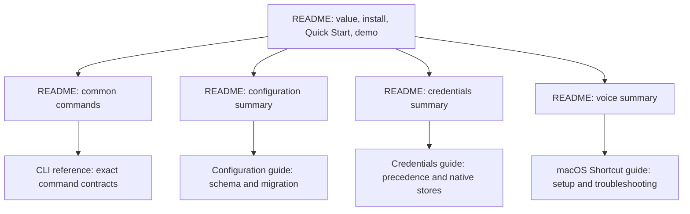

# README Information Architecture - Plan

## Goal Capsule

- **Objective:** Turn `README.md` into a fast onboarding page while preserving detailed CLI, configuration, migration, credential, and platform guidance in focused linked documents.
- **Authority:** The Product Contract in this plan owns the documentation structure and terminology. The implemented CLI and its tests remain authoritative for behavior and exact command syntax.
- **Execution profile:** Deliver one documentation phase in one pull request stacked on `codex/composable-voice-flags`, which contains the current help, voice, and unified configuration behavior being documented.
- **Stop conditions:** Stop if the refactor requires CLI behavior changes, removes a useful existing contract without a destination, changes tested install or archive text, or removes the contributor-only Python voice example.
- **Completion signal:** A new reader can reach a successful prompt from the README, a returning reader can find a common command quickly, and detailed contracts remain reachable through valid links.

---

## Product Contract

### Summary

Make the README the entry point for evaluation, installation, first success, and common commands.
Move deep reference material into three focused user guides, with the README retaining concise summaries and links.

### Problem Frame

The current README is accurate but difficult to scan.
It opens with a local-model-only description even though the CLI supports local servers, authenticated CLI providers, and cloud APIs.
The demo appears before a first-use path, the Usage section mixes common commands with edge-case contracts, and long configuration and credential sections make the page read like a complete specification.

Recent CLI help simplification increased the mismatch.
The README still says `--help` contains platform-specific storage requirements, but current help contains command syntax, option summaries, recognized API-key environment variables, and only a generic secure-storage note.

### Requirements

#### Orientation and first success

- R1. The opening must describe `llm-now` as a CLI for models users already use across local servers, authenticated CLI providers, and cloud APIs without claiming that it installs or starts providers.
- R2. The README must provide a compact contents list for its major onboarding destinations rather than mirroring every subsection.
- R3. A five-minute Quick Start must appear before the demo and use the launcher’s Create a new shortcut path to save before its first successful prompt, then demonstrate reuse.
- R4. Installation must retain the Homebrew-first order, latest-release link, supported archive names, platform qualifications, checksum note, and current demo.

#### Progressive disclosure

- R5. The README must replace its long Usage narrative with a common-commands table and link exact invocation, selection, input, output, diagnostic, and exit-code contracts to `docs/cli-reference.md`.
- R6. `docs/configuration.md` must own shortcut persistence, configuration paths and schema, field behavior, canonical rewrites, migration, backups, authority rules, and downgrade recovery.
- R7. `docs/credentials.md` must own credential precedence, interactive management, native record behavior, platform capability policy, platform prerequisites, and recovery guidance.
- R8. The README must keep concise contextual summaries for voice, configuration, and credentials, linking to the focused guides and the existing macOS Shortcut guide.
- R9. Existing useful README details must be relocated to one authoritative destination rather than deleted or duplicated across guides.

#### Terminology and accuracy

- R10. User-facing prose must use **saved shortcut** for the reusable provider/model setup and reserve **alias** for literal CLI, configuration, diagnostic, inventory, and positional-alias surfaces.
- R11. The README must stop claiming that `--help` contains platform-specific storage requirements and direct users to the credentials guide for that information.
- R12. This refactor must not change CLI behavior, help output, source code, release policy, manual-test contracts, the native executable, or the retained Python voice oracle.

### Key Product Decisions

- **Preserve the public install contract in the README.** The first-use page continues to name every supported download and platform limitation because users need that information before execution and `tests/build.test.ts` protects the exact release contract. Governs R4.
- **Keep focused maintainer and platform guides separate.** `docs/RELEASING.md`, `docs/manual-testing.md`, and `examples/macos-voice-shortcut.md` retain their established roles. Governs R8 and R12.

### Acceptance Examples

- AE1. **Covers R1-R4.** A new user lands on the README, understands the supported provider types, installs `llm-now`, sees the prerequisite for one usable provider, creates a saved shortcut and receives its first successful response, then reuses that shortcut before encountering the demo.
- AE2. **Covers R5 and R8.** A returning user scans the common-commands table, finds the correct launcher, shortcut, piped-input, explicit-provider, inventory, migration, routing, or speech form, and follows the CLI-reference link only when exact edge-case behavior matters.
- AE3. **Covers R6-R7, R9, and R11.** A user looking for configuration migration or downgrade recovery reaches `docs/configuration.md`; a user looking for Linux Secret Service or target-specific credential support reaches `docs/credentials.md` without being told that `--help` contains those requirements.
- AE4. **Covers R10.** Documentation calls the reusable concept a saved shortcut while preserving literal forms such as `llm-now <alias>`, `--alias`, `--aliases`, and `[aliases.<name>]` exactly.
- AE5. **Covers R9 and R12.** Distinctive contracts such as backup filenames, the native credential target matrix, prompt-source rules, and exit codes each remain present in one user-facing destination, while runtime and test source files remain unchanged.

### Scope Boundaries

#### Included

- Refactor `README.md`, create three focused user guides under `docs/`, and make a narrow prose-terminology pass in the existing macOS Shortcut guide.
- Preserve current command examples and behavioral contracts while assigning each deep topic one authoritative document.
- Validate navigation, terminology, content retention, and the existing release-documentation tests.

#### Deferred to Follow-Up Work

- Add a repository-wide Markdown link checker or documentation linter.
- Capture the progressive-disclosure pattern as an institutional learning if a `docs/solutions/` corpus is introduced later.

#### Outside This Change

- CLI code, help output, generated binaries, release workflow, configuration behavior, voice behavior, demo media, manual-test content, and removal of `examples/macos-voice-router/`.

---

## Planning Contract

### Key Technical Decisions

- KTD1. **Use a provider-neutral opening.** Align the README value proposition with the current help language, “models you already use,” then name local servers, authenticated CLIs, and cloud APIs in the supporting prose. (session-settled: user-approved — chosen over retaining the local-model-only opening: the existing phrase understates the supported provider surface.)
- KTD2. **Add a compact onboarding contents list.** Link only Install, Quick Start, Common commands, Voice, Configuration, Credentials, and CLI reference in that reader-flow order rather than every nested heading. (session-settled: user-approved — chosen over leaving navigation implicit: readers need a short map through the long page.)
- KTD3. **Put first success before demonstration.** The Quick Start will state the provider prerequisite, then follow the bare launcher through Create a new shortcut, Use an available provider, provider and model selection, naming, optional instructions, the first prompt after saving, and exact saved-shortcut reuse before the demo. (session-settled: user-approved — chosen over leading with the demo: readers should reach a working result before exploring the full product.)
- KTD4. **Use a common-commands table as the README command surface.** Keep stable everyday forms in the table and move parser rules, output contracts, and failure semantics to the CLI reference. (session-settled: user-approved — chosen over the long narrative Usage section: a table is faster to scan while a linked reference preserves precision.)
- KTD5. **Extract three topic-owned guides without deleting detail.** Configuration and migration, credentials and native storage, and CLI behavior each receive one lower-kebab-case Markdown document under `docs/`. (session-settled: user-approved — chosen over deleting detail or keeping it all in the README: progressive disclosure preserves rigor without overwhelming onboarding.)
- KTD6. **Separate concept prose from literal interface terms.** Use saved shortcut for the user concept and alias only when the word is part of exact syntax, schema, output, or positional behavior; apply the same boundary narrowly in the linked voice guide. (session-settled: user-approved — chosen over alternating the terms as synonyms: the boundary makes the product vocabulary predictable without falsifying exact interfaces.)
- KTD7. **Treat current help as the authority for the help claim.** Leave `src/args.ts` and help snapshots unchanged; link the credentials guide for platform storage requirements. (session-settled: user-approved — chosen over retaining the stale README sentence: the simplified help no longer carries platform-specific storage details.)

### Assumptions

- The focused guide names are `docs/cli-reference.md`, `docs/configuration.md`, and `docs/credentials.md`; no existing public link constrains different names.
- The terminology pass in `examples/macos-voice-shortcut.md` changes ordinary prose only and preserves its title, path, Apple Shortcut terminology, commands, configuration keys, and contributor-only Python section.
- README install and release details remain in place because they are part of first-use onboarding and are asserted by `tests/build.test.ts`.
- The repository has no Markdown link checker, so relative-link and anchor verification remains a documented manual gate for this change.

### High-Level Technical Design

The README becomes a hub whose summaries lead to one authoritative owner for each deep topic.

### Sequencing and Delivery

This plan has one delivery phase and one pull request.
Create `codex/readme-information-architecture` from `codex/composable-voice-flags` so the documentation describes the current stacked implementation.
Complete U1 before U2 so the README can link to finished destinations as it is shortened.

### Risks and Dependencies

- **Content loss:** The README has accumulated exact contracts across several recent changes. Build a before/after content crosswalk and search distinctive terms before accepting deletion from the README.
- **Documentation drift:** Duplicating deep rules between README and guides would recreate the problem. Keep only summaries in README and one full owner per contract.
- **Terminology damage:** A global alias-to-shortcut replacement would corrupt literal commands and schema names. Review every change in context under KTD6.
- **Broken navigation:** New guide links and anchors have no automated checker. Verify every README and cross-guide link manually from its containing file.
- **Tested release text:** `tests/build.test.ts` asserts archive names, the release link, the Homebrew command, and ordering. Preserve these exact strings and run the focused test.

### Sources and Research

| Source | Planning use |
|---|---|
| `README.md` | Current onboarding, install, usage, voice, configuration, credentials, discovery, and diagnostic content to preserve or relocate |
| `src/args.ts`, `tests/args.test.ts` | Current help authority, option vocabulary, and evidence that platform-specific credential requirements are absent from help |
| `src/runtime.ts` | Supported local, authenticated CLI, and cloud-provider categories for the opening value proposition |
| `src/app.ts` | Current launcher, Run once, saved-shortcut creation, and first-prompt flows for Quick Start |
| `tests/build.test.ts` | Exact README release strings and install ordering that the refactor must preserve |
| `examples/macos-voice-shortcut.md` | Existing focused voice guide and the cross-document terminology seam |
| `docs/RELEASING.md`, `docs/manual-testing.md` | Existing separation between public onboarding and maintainer verification detail |
| `docs/plans/2026-07-28-002-feat-shortcut-creation-launcher-plan.md` | Established saved-shortcut product vocabulary |

No `CONCEPTS.md` or `docs/solutions/` corpus exists, so there were no institutional learnings to apply.
External research was skipped because the current repository contains the authoritative behavior, documentation, and test patterns for this refactor.

---

## Implementation Units

### U1. Create focused user reference guides

- **Goal:** Move the README's deep behavioral contracts into three clear, topic-owned guides without losing information.
- **Requirements:** R5-R12, AE2-AE5; KTD5-KTD7.
- **Dependencies:** None.
- **Files:** `docs/cli-reference.md`, `docs/configuration.md`, `docs/credentials.md`, `README.md` as the extraction source.
- **Approach:**
  1. Build a content crosswalk from the current Usage, voice, configuration, migration, credential, discovery, diagnostic, and exit-code sections; map every behavioral claim to its authoritative implementation or test before relocation.
  2. Move each full contract to the guide named by KTD5 and leave cross-guide links only where ownership changes.
  3. Give every guide a short purpose statement and a link back to the README; link to the existing macOS voice guide where it owns setup detail.
  4. Preserve exact literal commands, configuration keys, defaults, ranges, backup filenames, platform policy rows, security warnings, output contracts, and exit codes.
  5. Apply KTD6 to ordinary guide prose while preserving every literal alias command, schema, output, diagnostic, inventory, and positional surface.
- **Execution note:** Treat content relocation as the first proof. Do not shorten the README until every removed contract has a destination.
- **Patterns to follow:** Focused purpose-led introductions in `docs/RELEASING.md` and task-oriented headings in `examples/macos-voice-shortcut.md`.
- **Test scenarios:**
  - A user following the CLI reference can determine selection, prompt source, instruction precedence, routing/speech composition, stdout/stderr, diagnostics, and exit codes without returning to an old README paragraph.
  - A user following the configuration guide can locate the file, understand every supported field and fallback, migrate legacy files, identify backups, and recover from a deliberate downgrade.
  - A user following the credentials guide can determine environment precedence, manage a stored key, identify target support, and recover when a native store is unavailable.
  - The new guides call the reusable concept a saved shortcut while retaining alias wherever it is part of an exact interface.
  - Every relocated behavioral claim agrees with its implementation or test authority; any discrepancy is corrected before the old README text is removed.
  - Distinctive existing contracts appear in exactly one full-detail destination and remain byte-accurate where they name literal values.
- **Verification:** The content crosswalk has no orphaned contract, each guide has one clear topic, and no CLI/runtime source file changes.

### U2. Rebuild the README as the onboarding hub

- **Goal:** Make evaluation, first success, common-command discovery, and navigation fast while keeping detailed guidance one click away.
- **Requirements:** R1-R5, R8-R12, AE1-AE5; KTD1-KTD7.
- **Dependencies:** U1.
- **Files:** `README.md`, `examples/macos-voice-shortcut.md`, `tests/build.test.ts` for existing assertions.
- **Approach:**
  1. Replace the local-only tagline and supporting paragraph per KTD1, then add the compact contents list from KTD2.
  2. Order the onboarding body as value proposition, contents, Install, Quick Start, and the unchanged demo; implement KTD3’s available-provider launcher path and end with an executable `llm-now <name> --input "..."` reuse command.
  3. Replace the Usage narrative with the KTD4 common-commands table, concise behavior notes, and a clear CLI-reference link.
  4. Reduce voice, configuration, and credentials to short purpose-led summaries with links to their authoritative guides.
  5. Correct the `--help` claim and apply KTD6 to README and ordinary prose in the existing voice guide without changing literal alias interfaces.
- **Patterns to follow:** Current exact command examples, the provider-neutral help tagline in `src/args.ts`, and the compact Markdown navigation pattern in `docs/plans/2026-08-06-001-feat-native-macos-voice-routing-plan.md`.
- **Test scenarios:**
  - Covers AE1. A reader follows Create a new shortcut, Use an available provider, provider/model selection, naming, optional-instruction handling, the first prompt, and the exact saved-shortcut reuse command without an undocumented launcher decision.
  - Covers AE2. A reader finds every stable everyday invocation in the commands table and reaches the exact contract through `docs/cli-reference.md`.
  - Covers AE3. Configuration, migration, credential, platform-storage, and macOS voice questions each have an obvious linked destination.
  - Covers AE4. Shortcut prose is consistent while all literal alias commands and schema keys remain unchanged.
  - Covers AE5. The five archive names, latest-release link, Homebrew command and ordering, demo, voice-guide path, and Python-example path remain intact.
- **Verification:** The README is scannable from opening through common commands, all links resolve, `bun test tests/build.test.ts` and `bun test tests/args.test.ts` pass, and repository search finds no stale platform-storage help claim.

---

## Verification Contract

| Gate | Scope | Done signal |
|---|---|---|
| `bun test tests/build.test.ts` | README install and release contract | Exact archive names, release link, and Homebrew-first ordering remain intact |
| `bun test tests/args.test.ts` | Current help authority | Help wording and option vocabulary remain unchanged and agree with the new CLI reference |
| `bun run check` | Full repository regression | Source tests, typecheck, and compiled runtime smoke pass with documentation-only production changes |
| `git diff --check` | Markdown hygiene | No whitespace errors are introduced |
| Manual content and authority crosswalk | Relocation completeness and accuracy | Every useful removed README contract has one full-detail destination and every behavioral claim agrees with its implementation or test authority |
| Manual link and anchor walk | README and new guides | Every TOC, guide, return, cross-guide, release, and voice link resolves from its containing document |
| Timed independent-reader walk | Quick Start and command retrieval | A reader unfamiliar with the rewrite completes the Quick Start within five minutes after the provider prerequisite is satisfied and locates saved-shortcut, piped-input, explicit-provider, and voice forms within 30 seconds each |
| Terminology and stale-claim search | Documentation accuracy | Shortcut prose follows KTD6 and no text claims that `--help` contains platform-specific storage requirements |
| GitHub Actions | Target authority | Required CI checks are green |

---

## Definition of Done

### Global

- README opening, contents, Quick Start, demo placement, install section, command table, and contextual summaries satisfy R1-R5, R8, R10-R11, and the README-facing portions of AE1-AE5.
- `docs/cli-reference.md`, `docs/configuration.md`, and `docs/credentials.md` each own one clear topic and retain every applicable exact contract moved from README.
- User-facing prose uses saved shortcut consistently while literal alias interfaces remain exact.
- README no longer promises platform-specific storage details in `--help` and links the credentials guide instead.
- Existing release strings, demo, macOS voice guide, maintainer docs, manual-test guide, and Python voice example remain intact.
- Focused tests, `bun run check`, diff hygiene, content-and-authority crosswalk, link, terminology, timed reader, and CI gates pass.
- The final diff contains no production-code change, generated-media change, duplicated deep reference section, or abandoned documentation fragment.
- One pull request is open from `codex/readme-information-architecture` to `codex/composable-voice-flags` with this plan included.

### Per Unit

| Unit | Done signal |
|---|---|
| U1 | Three focused guides contain the relocated CLI, configuration/migration, and credential/platform contracts with no orphaned content. |
| U2 | README provides a fast first-success path and common-command scan, links every deeper topic, preserves tested release text, and uses the terminology boundary consistently. |
