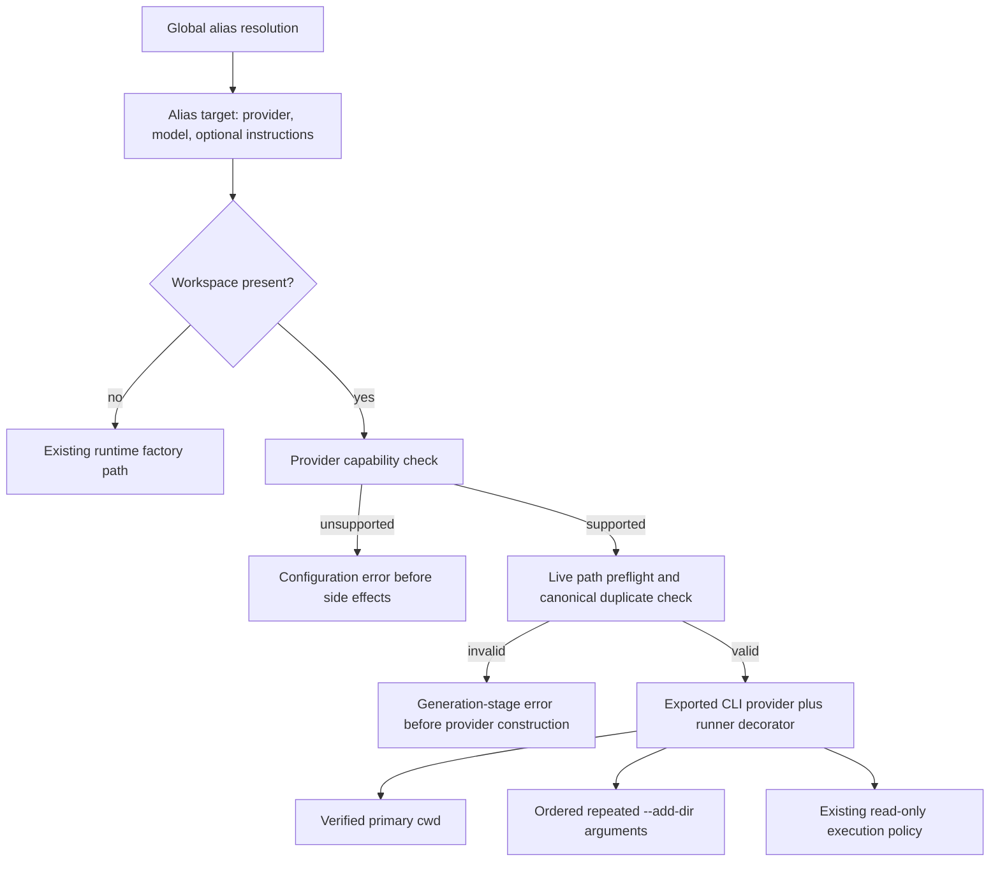

# Capability-Checked Multi-Directory Workspace - Plan

## Goal Capsule

- **Objective:** Let a saved alias carry one optional execution workspace with a primary directory and zero or more additional directories, then run capable Codex and Claude CLI providers against that workspace.
- **Authority:** The Product Contract owns alias identity, global callability, workspace behavior, failure semantics, privacy, and compatibility. The Planning Contract owns schema v3, path handling, provider capabilities, the runtime adapter bridge, tests, documentation, and release mechanics. Repository instructions and tests remain binding where this plan is silent.
- **Execution profile:** One implementation phase and one pull request based on current `origin/main`. The pull request includes the originating ideation artifact, this plan, implementation, focused and packaged tests, active documentation, and a minor changeset.
- **Stop conditions:** Stop if the exported `@swartzrock/byok-runtime` CLI providers cannot be composed without copying provider output/auth logic, if a supported CLI lacks a current multi-directory launch contract, if workspace validation would require credential or provider access, or if implementation would need alias availability or invocation-cwd matching.
- **Implementation reconciliation:** `main` adopted unified `config.toml` while this feature branch was in progress. Unified configuration remains version 1 and stores workspace as one required, nonempty `directories` list in a nested alias table; its first entry is the primary working directory and later entries are ordered additional roots. The strict sticky v3 rules in this plan apply to the legacy `aliases.json` format, which remains readable and migrates workspaces into unified TOML without loss.
- **Tail ownership:** LFG implements and verifies the plan, simplifies and reviews the diff, applies review fixes, opens the pull request, and watches CI to a decided state.

---

## Product Contract

### Summary

A saved alias may contain one optional `workspace` with an absolute `primaryDirectory` and an ordered `additionalDirectories` list. The workspace changes the local execution context of a capable CLI provider. It does not change the alias's provider/model target or where the alias can be called.

Codex CLI and Claude CLI support the complete workspace in this release. Ollama, LM Studio server, and cloud API providers reject workspace configuration before credentials, network calls, or provider creation. No provider may silently discard a configured directory.

### Problem Frame

Aliases are global and deterministic today, but CLI-backed generation loses project context because `llm-now` cannot pass a working directory through the installed runtime factory. The concrete CLI classes accept a cwd, while the factory drops it and falls back to an operating-system temporary directory.

Users also need simultaneous context from more than one directory. A process has only one cwd, so the product must distinguish the primary project directory from additional accessible roots and verify that the selected adapter can honor both.

### Actors

- A1. **Shortcut creator:** Saves a Codex or Claude shortcut with no workspace, a primary-only workspace, or a multi-directory workspace.
- A2. **Alias caller:** Invokes the alias from any directory and expects the stored workspace, not the caller cwd, to control CLI execution.
- A3. **Automation caller:** Uses the same global alias and stdout/stderr/exit contract from a script or agent pipeline.
- A4. **Configuration editor:** May move, remove, or manually edit stored paths and needs fail-closed diagnostics before model execution.

### Requirements

**Alias identity and global callability**

- R1. An alias must remain exactly one provider/model target with optional instructions. Workspace must never select, replace, fall back from, or remap that target.
- R2. Every alias must remain selectable and executable from every caller directory. Alias resolution, launcher visibility, and `--aliases` inventory must not depend on invocation cwd.
- R3. A stored workspace must always override ambient cwd for that alias. A workspace-free alias and every explicit provider/model run must preserve existing behavior.

**Workspace configuration and persistence**

- R4. A workspace must contain exactly one absolute primary directory and an ordered zero-or-more list of absolute additional directories. The primary directory is the CLI process cwd; additional directories are explicit accessible roots.
- R5. Interactive Codex and Claude shortcut-save flows must allow the user to skip workspace, enter a primary directory, then enter zero or more additional directories. Relative creation input resolves once against the creation-time cwd before persistence.
- R6. Workspace paths must be machine-local plaintext configuration. Saving must reject blank paths, malformed fields, duplicate normalized paths, and the primary directory repeated as an additional directory. Paths containing spaces must remain individual process arguments.
- R7. Alias document v3 must permit optional instructions and optional workspace while retaining exact-key validation. V1 and V2 documents load without eager rewriting. The first workspace save upgrades the document to v3, and a v3 document never downgrades automatically.
- R8. Workspace must participate in complete-record equality, case-conflict detection, overwrite confirmation, atomic persistence, and same-invocation first-run state. Adding, changing, or removing instructions must preserve the workspace unless the save flow explicitly replaces it.

**Capability and execution safety**

- R9. Codex CLI and Claude CLI must advertise support for a primary directory and additional directories. Ollama, LM Studio, and every cloud API provider must advertise no workspace support.
- R10. Unsupported workspace configuration must fail with a provider-specific configuration diagnostic before credential resolution, provider construction, network access, or generation.
- R11. Every configured directory must exist, be accessible, and be a directory before interactive prompt collection and again immediately before provider construction. Canonically duplicate live paths must fail. Missing, moved, or invalid roots must never fall back to ambient cwd or the runtime temporary directory.
- R12. Workspace-bearing Codex runs must retain the current read-only sandbox. Workspace-bearing Claude runs must expose only read-only file discovery tools (`Read`, `Glob`, and `Grep`) under the current noninteractive permission policy. Existing workspace-free provider behavior must remain unchanged.
- R13. Additional directories must be forwarded in stored order through each CLI's documented `--add-dir` arguments. Failure from an installed CLI version that does not support the required flags must remain a clear generation error.

**Observability, privacy, and release compatibility**

- R14. Picker hints, alias inventory, save receipts, overwrite confirmation, and workspace-derived failures must make workspace state or the failing root role visible without printing full saved paths or saved instruction text.
- R15. `--instruction` must continue to override only instructions for one request and must leave the saved workspace active and unchanged.
- R16. Help, README guidance, manual testing, compiled/native smoke coverage, the maintained demo source, and a minor changeset must document and prove global callability, fixed stored execution context, multi-root support, unsupported-provider rejection, machine-local plaintext paths, and read-only access.

### Key Decisions

- **One target plus optional workspace.** (session-settled: user-directed — chosen over separating aliases from provider/model tuples because the user confirmed aliases stay tied to one provider/model target.) Governs R1, R3-R4, and R8.
- **Multiple stored directories.** (session-settled: user-directed — chosen over a single-directory workspace because the user explicitly required support for multiple directories.) Governs R4-R7 and R9-R13.
- **No availability policy.** (session-settled: user-directed — chosen over cwd-filtered alias visibility because the user asked to remove availability from option 1.) Governs R2-R3 and R14.
- **Capability-checked failure.** (session-settled: user-approved — chosen over silently ignoring workspace on HTTP providers because provider execution boundaries were surfaced before the user selected option 1.) Governs R9-R13.

### Key Flows

- F1. **Create a CLI workspace shortcut.** Select Codex or Claude, select a model, name the shortcut, enter optional instructions, optionally enter the primary directory, add directories until blank input, save the complete record, then run the first prompt with that saved workspace.
- F2. **Invoke globally.** Resolve the alias through the unchanged global store from any caller directory, preflight the stored paths before collecting an interactive prompt, re-check them at the runtime boundary, construct the capable CLI adapter, and generate from the stored primary plus additional roots.
- F3. **Keep old behavior.** Resolve a workspace-free alias or explicit provider/model selection and use the existing runtime-factory path without adding cwd, file tools, or additional-root arguments.
- F4. **Reject unsupported configuration.** Detect a manually configured HTTP-provider workspace while loading or before generation, report the provider/capability mismatch, and perform no credential or provider work.
- F5. **Reject stale workspace.** Resolve a globally visible alias whose stored path moved or disappeared, report a configuration/generation-stage error, and launch no child process.
- F6. **Overwrite workspace state.** Recreate the same alias target, capture instructions and workspace independently, show state-only instruction/workspace transitions, and require the existing default-No overwrite confirmation for any record change.

### Acceptance Examples

- AE1. **Covers R1-R5 and R13.** Given a Codex alias saved with primary `./api` and additions `../web` and `../shared lib`, creation stores absolute paths. Invoking it from an unrelated directory launches Codex with the stored primary as cwd and two separate `--add-dir` values in stored order.
- AE2. **Covers R2-R3 and R14.** A workspace alias appears in launcher selection and `--aliases` from every cwd with a path-free workspace badge. Caller cwd never replaces or filters the saved workspace.
- AE3. **Covers R7-R8.** Existing v1 and v2 files load unchanged. Saving the first workspace produces v3; later removing the last workspace leaves the file at v3. Workspace differences trigger collision and overwrite behavior.
- AE4. **Covers R6 and R11.** Blank, relative persisted, malformed, duplicate, missing, inaccessible, non-directory, or canonically duplicate roots fail before interactive prompt collection and provider construction. A directory path containing spaces remains one argv value.
- AE5. **Covers R9-R10.** A v3 Ollama, LM Studio, or cloud alias with workspace fails with a provider-specific unsupported-workspace diagnostic and performs zero credential reads, network calls, or generation.
- AE6. **Covers R9, R12-R13.** A workspace-bearing Claude alias receives the stored cwd, repeated `--add-dir` values, and only `Read`, `Glob`, and `Grep`; a Codex alias retains `--sandbox read-only`. Neither provider gains write access.
- AE7. **Covers R3 and R12.** Workspace-free Codex and Claude aliases still use the existing factory behavior, and explicit provider/model calls receive no workspace or newly enabled tools.
- AE8. **Covers R8 and R15.** `--instruction temporary` replaces a saved instruction for one invocation while the stored workspace remains active. The alias record is not mutated.
- AE9. **Covers R14 and R16.** Inventory, selection, save, overwrite, diagnostics, docs, and fixtures reveal workspace state and root count where useful but never print a full personal path during routine success.

### Success Criteria

- Both supported CLI adapters can observe the configured primary and additional directories in focused fixtures and packaged smoke tests.
- No unsupported provider or stale workspace reaches credentials, network, provider construction, or child-process launch.
- Existing aliases, explicit runs, prompt sources, output fidelity, and workspace-free CLI hardening remain green under the full project check.

### Scope Boundaries

**In scope**

- Optional absolute machine-local workspace on global aliases.
- Codex and Claude primary cwd plus ordered additional roots.
- Capability declarations, fail-closed path preflight, read-only access, schema v3, interactive capture, state-only UI cues, tests, documentation, and release metadata.
- Inclusion of `docs/ideation/2026-08-11-directory-scoped-aliases-ideation.html` and this plan in the pull request.

**Deferred follow-up**

- Noninteractive alias creation/edit commands and structured JSON inventory.
- Named or reusable workspace profiles and team-portable project overlays.
- Runtime-library-native workspace configuration after a compatible `@swartzrock/byok-runtime` release.
- Explicit installed-CLI version negotiation before launch.

**Out of scope for option 1**

- `availability`, directory eligibility, invocation-cwd matching, alias filtering, local alias shadowing, or project-owned alias catalogs.
- Ambient caller cwd as an implicit workspace or a replacement for stored primary context.
- Workspace on Ollama, LM Studio server, or cloud API providers.
- Provider/model fallback, one alias targeting multiple tuples, HTTP file ingestion, or writable CLI tools.

### Sources

- `docs/ideation/2026-08-11-directory-scoped-aliases-ideation.html` defines the selected option and rejected availability direction.
- `src/aliases.ts` supplies the global store, strict schemas, canonical alias identity, atomic writes, and current v1/v2 migration pattern.
- `src/runtime.ts` supplies the provider-neutral generation boundary and current cwd-free factory path.
- `node_modules/@swartzrock/byok-runtime/dist/node.d.ts` and `node_modules/@swartzrock/byok-runtime/dist/node.js` show exported cwd-capable CLI providers, runner composition, the factory gap, and current hardening.
- [OpenAI Codex TypeScript SDK `exec.ts`](https://github.com/openai/codex/blob/main/sdk/typescript/src/exec.ts) documents `workingDirectory` as `--cd` and each additional directory as `--add-dir`.
- [Claude Code CLI reference](https://code.claude.com/docs/en/cli-reference) documents `--add-dir` and tool restriction semantics.
- [Claude Code permissions](https://code.claude.com/docs/en/permissions) distinguishes additional-directory file access from configuration discovery.
- [Ollama API introduction](https://docs.ollama.com/api/introduction) and [LM Studio server documentation](https://lmstudio.ai/docs/developer/core/server) confirm their HTTP request boundaries.

---

## Planning Contract

### Key Technical Decisions

- KTD1. **Add a shared workspace domain in `src/workspace.ts`.** Define the stored shape, provider capability matrix, creation-time absolute normalization, structural checks, state comparison helpers, and asynchronous live-path preflight in one module used by persistence, application, and runtime. Keep alias lookup and provider discovery out of this module.
- KTD2. **Use strict sticky alias schema v3.** V3 alias records accept provider/model plus optional instructions and optional workspace. A present workspace always serializes both `primaryDirectory` and `additionalDirectories`. Copy nested state when persisting, compare ordered roots in `sameAliasRecord`, preserve v1/v2 no-eager-migration behavior, and choose the highest document version already present or required by the record.
- KTD3. **Store syntactically normalized absolute paths; verify canonical live identity at invocation.** Resolve relative capture input once against `ApplicationDependencies.cwd`, normalize it, and validate it exists before saving. Before generation, `realpath` and inspect every root, reject canonical duplicates, and pass the verified canonical paths to the child process. Do not reinterpret stored paths against a later caller cwd.
- KTD4. **Keep capabilities independent of alias availability.** Codex and Claude are `{ primaryDirectory: true, additionalDirectories: true }`; all HTTP-backed providers are false/false. Consume this one matrix during capture eligibility, persisted-record validation, and runtime defense-in-depth. Never branch alias resolution or inventory membership on capabilities or cwd.
- KTD5. **Bridge the pinned runtime through composition, not copied provider logic.** Workspace-free calls continue through `createByokNodeProvider`. Workspace-bearing CLI calls instantiate the exported `CodexCliProvider` or `ClaudeCliProvider` with the verified cwd and a narrow `LocalCommandRunner` decorator that injects ordered `--add-dir` arguments into generation argv. The decorator may replace Claude's empty tool list with `Read,Glob,Grep` only for workspace-bearing calls. Output parsing, auth diagnostics, model selection, timeouts, and command execution remain owned by the runtime package.
- KTD6. **Validate in side-effect order at two boundaries.** Reject provider capability before filesystem work. The application preflights resolved alias workspaces before any interactive prompt collection, while the runtime repeats live validation immediately before credentials or provider creation for race resistance and direct callers. Keep inventory and model discovery workspace-free. Return fixed role-based failures such as `primary directory` or `additional directory 2`, and redact raw plus serialized workspace paths from downstream CLI diagnostics without registering ordinary paths as credentials.
- KTD7. **Append workspace to the shared generation seam.** Add the optional workspace as the final `RuntimeGateway.generate` and `generateWithTimeout` argument, then pass `selection.selection.workspace` once where all launcher, positional alias, `--alias`, stdin, and same-invocation first-run paths converge. Keep `--instruction` as an independent request overlay.
- KTD8. **Capture and disclose state consistently.** Add `cwd` to `ApplicationDependencies`. Reuse one workspace-capture/composition helper in the required shortcut and legacy post-run save flows. Cloud credential shortcut flow never offers workspace. Routine UI uses `workspace` or `workspace +N` state, not paths; overwrite confirmation adds `Workspace: none → set`, `set → none`, `set → changed`, or `unchanged`.
- KTD9. **Preserve unscoped equivalence semantics.** A fresh provider/model selection may match an existing alias only when that alias has neither instructions nor workspace. Otherwise the stored alias would not reproduce the fresh run.

### High-Level Technical Design

The design keeps two paths intentionally. Existing aliases and explicit calls stay on the proven runtime factory. Only an explicitly stored, capability-checked workspace enters the adapter bridge and the broader read-only local context boundary.

### Assumptions

- “Work from multiple directories” means one primary project directory plus simultaneous additional accessible roots. It does not mean an OR-list of caller locations.
- Absolute paths are acceptable in the user-global, per-machine alias store and are not intended to be committed or portable.
- A blank primary-directory prompt means no workspace and therefore no additional-directory prompts.
- Additional directories preserve user order. Nested roots are allowed; only duplicate canonical identities are rejected.
- Canonical preflight may resolve symlinks for child execution. The persisted path remains the normalized path entered at creation so the store remains understandable and moved symlinks fail predictably.
- Current Codex CLI supports `--cd` and repeated `--add-dir`; current Claude CLI supports process cwd and repeated `--add-dir`. Older installed versions may fail through their normal stderr path.
- Claude additional roots grant file access, not automatic loading of all project configuration. This feature promises bounded read-only access to configured roots, not merged project settings.
- The current `@swartzrock/byok-runtime` 2.2.0 exported provider classes and runner types remain public for this release. A future runtime-native contract can replace the decorator without changing alias schema.

### Sequencing

Use one implementation phase and one pull request:

1. Add workspace domain rules, capability metadata, and focused tests.
2. Add strict alias v3 persistence and migration behavior.
3. Add runtime preflight and CLI adapter composition.
4. Add interactive capture, shared generation forwarding, and state-only UI cues.
5. Extend compiled/native fixtures, documentation, demo source, and release metadata.
6. Run focused, full, packaged, release-metadata, and diff-hygiene gates.

---

## Implementation Units

### U1. Workspace domain and alias schema v3

- **Goal:** Establish one validated workspace representation and persist it without weakening existing alias-store guarantees.
- **Requirements:** R1-R11 and R14-R15; F4-F6; AE3-AE5 and AE8-AE9; KTD1-KTD4 and KTD9.
- **Dependencies:** None.
- **Files:** `src/workspace.ts`, `src/aliases.ts`, `src/prompts.ts`, `tests/aliases.test.ts`, `tests/prompts.test.ts`
- **Approach:**
  1. Define workspace/capability types and helpers for structural validation, absolute normalization, provider support, state summaries, ordered equality, and live preflight.
  2. Add `AliasDocumentV3` and exact v3 record/workspace validation while preserving v1/v2 acceptance and missing-store behavior.
  3. Extend stored-copy, equality, conflict formatting, save-version selection, and sticky-version behavior with nested workspace state.
  4. Reject provider-incompatible records with a specific bounded alias/provider diagnostic.
  5. Add a path-free workspace badge to selection and inventory formatting while preserving instruction privacy.
- **Patterns to follow:** Existing exact-key validators, `canonicalizeDocument`, version 1→2 upgrade logic, lock/re-read/temporary-file/rename persistence, bounded diagnostic values, and provider/model formatting.
- **Test scenarios:**
  - Load valid v1, v2, and v3 documents with every optional-field combination and no eager rewrite.
  - Reject workspace in v1/v2, unknown record/workspace keys, relative or blank persisted paths, malformed extras, duplicates, primary duplication, and every unsupported provider.
  - Save the first workspace into v1/v2 and prove v3 upgrade; remove the final workspace and prove v3 remains.
  - Prove nested state is copied, ordered roots participate in equality, and workspace changes affect collisions, overwrite races, and case-conflict collapse.
  - Format no workspace, primary-only, and multi-root aliases with state-only badges and no full paths or instructions.
- **Verification:** `bun test tests/aliases.test.ts tests/prompts.test.ts` proves schema, persistence, equality, capability, and formatting contracts.

### U2. Capability-checked CLI workspace execution

- **Goal:** Execute workspace aliases through the stored primary and additional roots without changing workspace-free or HTTP behavior.
- **Requirements:** R3-R4 and R9-R13; F2-F5; AE1 and AE4-AE8; KTD3-KTD7.
- **Dependencies:** U1.
- **Files:** `src/runtime.ts`, `tests/runtime.test.ts`, `tests/fixtures/fake-cli.ts`, `tests/runtime-compile-smoke.ts`
- **Approach:**
  1. Append optional workspace context to `RuntimeGateway.generate` and keep provider discovery/model listing workspace-free.
  2. Check capability, then preflight live roots, before resolving credentials or constructing any provider. Redact raw and serialized workspace path variants from provider-derived errors.
  3. Keep no-workspace calls on `createByokNodeProvider`.
  4. For workspace CLI calls, instantiate the exported runtime provider with the canonical primary cwd and a runner decorator that preserves argv elements while adding one `--add-dir` pair per additional root.
  5. Retain Codex read-only sandbox args. Replace Claude's empty tool restriction with only `Read,Glob,Grep` for workspace calls while retaining safe mode, `dontAsk`, no persistence, and all other runtime-owned args.
  6. Preserve timeout, abort, instruction redaction, output extraction, and provider error translation.
- **Patterns to follow:** `providerConfig`, `runtimeStageError`, the runtime package's exported provider constructors and `LocalCommandRunner`, and fake CLI fixture argv/cwd assertions.
- **Test scenarios:**
  - Assert the complete provider capability matrix and unsupported rejection before credential resolver, factory, runner, or network activity.
  - Pass a primary-only and multi-root workspace to each CLI; assert exact canonical cwd, ordered argv, paths with spaces, model/instruction args, and abort behavior.
  - Assert Codex remains read-only and Claude receives exactly the three read-only file tools only for workspace calls.
  - Reject missing, inaccessible, non-directory, and canonical duplicate roots before provider construction with no temp-cwd fallback.
  - Prove workspace-free CLI, HTTP, cloud, credential validation, discovery, and model listing behavior is unchanged.
  - Compile the CLI and prove cwd plus additional-root transport survives the production boundary.
- **Verification:** `bun test tests/runtime.test.ts && bun run runtime:smoke` proves the runtime seam and compiled behavior.

### U3. Interactive capture and global invocation parity

- **Goal:** Let users save, overwrite, and immediately run workspace aliases through every existing alias path while keeping alias visibility global.
- **Requirements:** R1-R6, R8, R14-R15; F1-F3 and F6; AE1-AE2 and AE7-AE9; KTD7-KTD9.
- **Dependencies:** U1 and U2.
- **Files:** `src/app.ts`, `index.ts`, `tests/app.test.ts`
- **Approach:**
  1. Add the process cwd to application dependencies only as the base for creation-time relative input.
  2. Capture workspace after instructions in required CLI shortcut creation and legacy post-run alias saving. Skip the entire prompt sequence for HTTP providers.
  3. Validate primary input before collecting extras, allow blank to mean no workspace, loop extras until blank, and preserve existing cancellation/durable-save semantics.
  4. Compose instructions and workspace without dropping either field, then pass the complete saved selection into the same-invocation first prompt and shared generation tail.
  5. Preflight the resolved workspace before prompt collection in launcher, alias-only TTY, and same-invocation first-run flows. Resolve deterministic selection before reading noninteractive prompt input so a stale alias also fails early; retain the defensive runtime check.
  6. Add state-only workspace transitions to overwrite copy and make unscoped fresh-selection alias equivalence exclude workspace-bearing records.
  7. Leave `resolveSelection`, launcher inventory membership, positional aliases, `--alias`, and `--aliases` cwd-independent.
- **Patterns to follow:** `captureShortcutInstructions`, `prepareRequiredShortcut`, `offerAliasSave`, `instructionTransition`, `finishCreatedShortcut`, and the single `generateWithTimeout` call in `runApplication`.
- **Test scenarios:**
  - Create Codex and Claude aliases with skipped, primary-only, and multiple-directory workspaces; resolve relative input from injected cwd.
  - Reject invalid creation paths without saving and preserve cancellation before save versus cancellation after a durable shortcut save.
  - Run the freshly saved shortcut once and assert its complete workspace reaches generation.
  - Invoke one saved workspace alias through launcher selection, positional form, `--alias`, `--input`, stdin, and alias-only TTY prompt from unrelated caller directories.
  - Remove a configured root and prove launcher, alias-only TTY, and deterministic calls fail before prompt reads while the runtime still rejects a direct injected call before provider work.
  - Prove HTTP/cloud creation does not offer workspace and injected incompatible records fail before credentials.
  - Overwrite set/changed/removed workspaces with default-No confirmation and path-free transition text.
  - Prove `--instruction` replacement leaves workspace active and persistent state unchanged.
  - Prove an unscoped fresh run is not described as reproducible by a workspace alias.
- **Verification:** `bun test tests/app.test.ts` proves creation, overwrite, cancellation, global parity, privacy, and shared-tail forwarding.

### U4. Public documentation, packaging, and release proof

- **Goal:** Make the workspace contract discoverable and prove it works in the native packaged CLI.
- **Requirements:** R14-R16; AE2 and AE9; KTD8.
- **Dependencies:** U1-U3.
- **Files:** `src/args.ts`, `tests/args.test.ts`, `scripts/release-validate.ts`, `tests/build.test.ts`, `README.md`, `docs/manual-testing.md`, `docs/demos/llm-now-demo.tape`, `.changeset/<generated-workspace-name>.md`, `docs/ideation/2026-08-11-directory-scoped-aliases-ideation.html`, `docs/plans/2026-08-11-001-feat-multi-directory-workspace-plan.md`
- **Approach:**
  1. Update help and README with the interactive capture flow, global-alias versus stored-workspace distinction, provider capability matrix, machine-local plaintext warning, read-only access, and v3 downgrade recovery.
  2. Add manual cases for zero/one/many roots, invocation from another cwd, spaces, stale/moved roots, unsupported manual config, instruction independence, path privacy, and real Codex/Claude observation.
  3. Extend fake CLI and native archive validation with a v3 workspace alias whose primary and additions emit fixed presence/count markers rather than personal paths.
  4. Update the maintained VHS tape input for the new optional CLI prompts. Do not render or edit `docs/demos/demo.gif`.
  5. Add a minor changeset and include the ideation/plan artifacts without regenerating unrelated documents.
- **Patterns to follow:** Existing help snapshot, temporary-home release validation, fixed non-secret fixture markers, numbered manual checks, VHS source ownership, and changeset format.
- **Test scenarios:**
  - Verify help names workspace as optional alias execution context and does not describe availability scoping.
  - Build and smoke the current-host archive with a workspace alias invoked outside its primary root.
  - Assert packaged Codex/Claude fixtures observe the stored primary and all additions while normal output remains exact.
  - Assert help, README, manual steps, demo input, and changeset agree with the implemented prompt order and provider matrix.
- **Verification:** Focused help tests, current-host native build/smoke, changeset status, and document review prove the shipped surface.

---

## System-Wide Impact

- **Alias storage:** A strict v3 record adds optional machine-local paths while reusing existing global location, locking, permissions, atomic replacement, and conflict behavior.
- **Selection:** Alias identity and visibility stay global. Workspace becomes part of record equality and reproducibility, not lookup precedence.
- **Runtime:** One optional final gateway argument and one workspace-only CLI composition path are added. HTTP configs and discovery remain unchanged.
- **Local data boundary:** A workspace-bearing alias grants the selected CLI read-only access to the configured roots. Routine UI hides full paths, but the alias file and child-process arguments contain them as plaintext.
- **Credentials and network:** Capability and live-path failures happen before credential resolution or provider work. Existing redaction still owns downstream runtime diagnostics.
- **Packaging:** Native fixtures must carry a temporary v3 alias and directories so compiled behavior, not only TypeScript mocks, proves cwd and additional-root transport.
- **Agent parity:** Human and automated callers use the same globally callable alias, path preflight, read-only context, output, and failure contract. Noninteractive alias administration remains deferred.

### Risks and Mitigations

- **Pinned runtime factory cannot accept workspace.** Compose its exported providers and runner instead of editing `node_modules` or duplicating provider implementation. Focused contract tests make a future runtime upgrade failure obvious.
- **Configured roots expose more local data.** Require an explicit saved workspace, retain Codex read-only sandboxing, enable only Claude read tools, show workspace presence, and document plaintext paths and child-process visibility.
- **Moved or symlinked roots can drift.** Store absolute normalized paths, canonicalize immediately before launch, reject duplicates and missing roots, and never fall back.
- **CLI flags can change across installed versions.** Assert current official contracts and exact argv in fixtures. Preserve child stderr as a clear generation error for older versions; version negotiation is deferred.
- **New prompt steps can desynchronize demos and tests.** Centralize capture, update all interactive fixtures and the VHS source, and keep the rendered GIF as a user-owned manual gate.

---

## Verification Contract

| Gate | Command | Proves |
|---|---|---|
| Focused persistence and formatting | `bun test tests/aliases.test.ts tests/prompts.test.ts` | V3 schema, migration, equality, capability validation, and path-free badges |
| Focused runtime behavior | `bun test tests/runtime.test.ts` | Failure order, live preflight, CLI cwd/argv/tools, and no-workspace compatibility |
| Focused application behavior | `bun test tests/app.test.ts` | Capture, cancellation, overwrite, first run, global invocation parity, and instruction independence |
| Help contract | `bun test tests/args.test.ts` | Public help wording and unchanged argument behavior |
| Static contract | `bun run typecheck` | Cross-module workspace and runtime types remain sound |
| Compiled runtime smoke | `bun run runtime:smoke` | Compiled CLI preserves workspace transport |
| Full project check | `bun run check` | Complete tests, typecheck, and compiled smoke remain green |
| Native package build | `bun run build:native --target macos-arm64 --outdir dist` | Produces the current-host archive for packaged proof |
| Packaged release validation | `bun scripts/release-validate.ts smoke dist/llm-now-v2.3.0-macos-arm64.zip` | Native alias invocation uses stored workspace outside caller cwd |
| Release metadata | `bun run changeset:status` | The user-facing feature has valid minor release intent |
| Diff hygiene | `git diff --check` | No patch-format or whitespace defects |

## Definition of Done

- Every requirement and acceptance example is implemented or proven by tests at its owning unit.
- A saved Codex or Claude alias can use one primary and multiple additional directories from any invocation cwd.
- Workspace never affects provider/model identity, alias visibility, or selection precedence.
- Unsupported providers and invalid live roots fail before credentials, providers, networks, or child processes and never fall back to temp or caller cwd.
- V1/V2 compatibility, strict sticky v3 persistence, workspace equality, overwrite behavior, and instruction independence are proven.
- Codex remains read-only. Claude workspace calls expose only `Read`, `Glob`, and `Grep`; workspace-free calls retain their existing tool contract.
- Routine inventory, prompts, receipts, and overwrite text reveal workspace state without printing full paths or instructions.
- Help, README, manual tests, demo source, compiled/package validation, and the minor changeset match the implementation.
- Every gate in the Verification Contract passes.
- The pull request contains the ideation artifact, this plan, and only files required by this feature. `docs/demos/demo.gif` and unrelated user-owned files remain untouched.
- No abandoned or experimental implementation remains in the diff.
