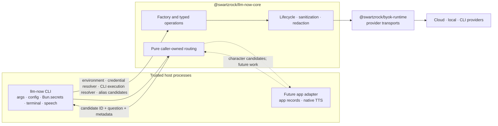
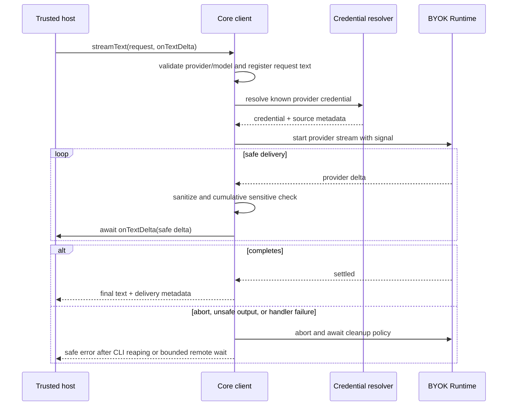
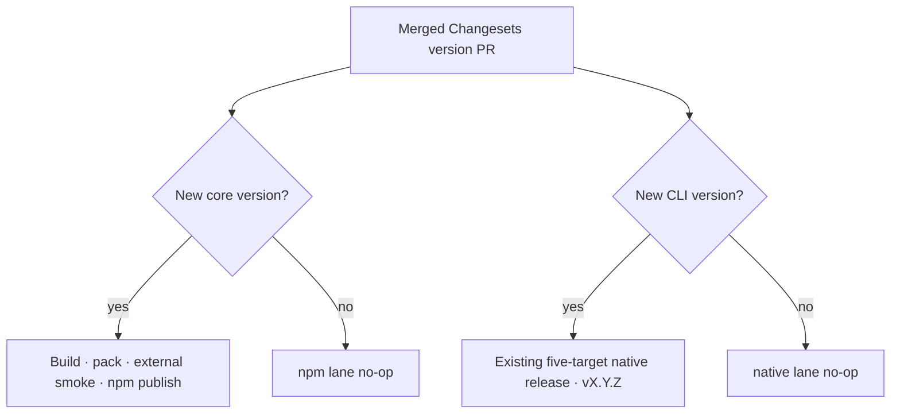

# Headless Core Package - Plan

## Goal Capsule

- **Objective:** Extract llm-now's reusable provider, generation, streaming, cancellation, safety, and caller-owned routing behavior into a side-effect-free TypeScript core, then publish it as the independently versioned `@swartzrock/llm-now-core` package without changing the CLI contract or native release train.
- **Authority:** The Product Contract owns host-visible behavior, security boundaries, compatibility, package identity, and scope. The Planning Contract owns workspace layout, API shape, extraction seams, build output, versioning, publication, and verification. Repository instructions, current CLI tests, and native release checks remain binding where this plan is silent.
- **Execution profile:** Two phases and two stacked pull requests. Phase 1 extracts a private core workspace and migrates the CLI without publishing. Phase 2 makes the core package public, adds independent release plumbing, and publishes the initial package only after its pack and consumer gates pass.
- **Stop conditions:** Stop if the core cannot preserve CLI output and exit behavior through a thin adapter, if `@swartzrock/byok-runtime` is not import-safe in Node 20, if a credential can reach a caller-controlled transport, if the provider-family cleanup matrix cannot be enforced, if the npm scope is unavailable to the publisher, or if a core-only version change can trigger a native CLI release.
- **Tail ownership:** Each implementation phase is tested, committed, pushed, and opened as its own pull request before the next phase begins. The first branch includes this plan. Phase 2 is based on Phase 1. Its merge creates the ordinary Changesets version pull request; first publication waits for that release-shaped transition and the package-name, npm-scope, artifact-integrity, and authority gates.

---

## Product Contract

### Summary

llm-now gains a reusable headless core for trusted Node 20+ and Bun hosts. The core exposes provider discovery, model listing, connection validation, buffered text generation, callback-based streaming, cancellation, stable safe failures, and pure transcript routing. Every operation receives explicit caller data and dependencies.

The CLI becomes a host adapter. It continues to own arguments, prompts, persisted configuration, `Bun.secrets`, terminal output, process exits, speech, platform defaults, and native packaging. A separately versioned public package exposes only the reviewed core API.

### Problem Frame

The reusable behavior currently spans `src/runtime.ts`, `src/app.ts`, `src/credentials.ts`, `src/voice-routing.ts`, and `src/voice.ts`. The only executable entrypoint also constructs global process, terminal, path, and credential-store dependencies during import. Consumers cannot reuse the provider and routing behavior without inheriting CLI side effects and configuration identity.

Extracting `src/runtime.ts` alone would also weaken the contract. Cancellation settlement, streamed-output safety, terminal-control sanitization, and timeout coordination are split between the runtime gateway and the CLI application. Packaging must establish one ownership boundary before it creates a public semver surface.

### Requirements

#### Core lifecycle and provider operations

- R1. Importing `@swartzrock/llm-now-core` and constructing a client performs no provider discovery, network request, process launch, filesystem access, environment read, config-path resolution, credential lookup, signal registration, terminal output, or global mutation.
- R2. Client construction requires explicit host inputs, including an environment snapshot and credential resolver; it never falls back to `process.env`, HOME/XDG paths, a credential-store identity, or a caller-supplied credential-bearing transport.
- R3. The core returns typed provider availability records in the existing discovery order. Discovery preserves already usable providers when a credential is absent or unavailable, or when later credential resolution fails; a resolver failure becomes a safe terminal error only when no provider is usable.
- R4. The core lists models and validates a provider connection as explicit operations; generation does not implicitly list models or validate the requested model first.
- R5. Buffered generation requires explicit provider ID, model ID, prompt, and optional instructions, workspace, and `AbortSignal`; it obtains any provider credential only through the injected resolver and returns a stable result containing the final safe text and resolved provider/model identity.
- R6. Streaming generation uses the same request contract, reports native versus buffered delivery, awaits each caller delta handler for backpressure, emits safe deltas before completion when native streaming is available, and returns the same final text contract as buffered generation. Each handler await races the request signal so cancellation can proceed even when the handler never settles.
- R7. The core treats prompt and instructions as separate values through its public boundary and forwards them without CLI-specific composition or persistence behavior.
- R8. Every non-success path aborts one request-owned linked controller, finalizes the stream iterator, removes request listeners/timers, reaps owned CLI-provider children before return, and bounds cloud/local transport settlement while draining late rejections.
- R9. Client-local caches do not cross core instances, and resolver-returned or validation-candidate credentials, redaction variants, callbacks, provider references, and cumulative stream state are released from core-owned state in `finally` without claiming JavaScript string zeroization.

#### Safety and error contract

- R10. The core separates response-sensitive values from diagnostic-sensitive values: resolver-returned credentials, validation candidates, and caller-designated response secrets can withhold model output, while those values plus prompt, instructions, workspace, and request metadata are redacted from diagnostics using a finite documented raw/JSON/transport-escaped variant set. The CLI adapter designates every recognized credential in an approved CLI child environment before provider work.
- R11. A streamed response never emits the delta that completes a registered sensitive value; the operation stops with a stable unsafe-response failure while already emitted safe prefixes remain irrevocable.
- R12. Public failures use one core-owned error class and documented code taxonomy built only from safe allowlisted primitives; raw causes, abort reasons, response bodies, endpoints, workspace paths, and arbitrary object properties or serializers are never attached or inspected.
- R13. Cloud credentials can reach only the fixed transports supplied by exactly pinned `@swartzrock/byok-runtime@2.4.1`; the first core API exposes no caller URL, cloud `baseURL`, fetch implementation, arbitrary header, or local endpoint override.
- R14. Each validation candidate credential, resolver-returned credential, and caller-designated response secret, including recognized credentials from an approved CLI child environment, is registered in a non-enumerable request-local overlay as soon as it is available and before provider work; core never mutates caller-owned baseline redaction policy.

#### Caller-owned routing

- R15. The core exposes a pure routing operation that accepts the transcript, stable candidate IDs, canonical names, alternate spoken names, caller-supplied wake words, caller-supplied matching thresholds, and an optional caller-supplied default candidate.
- R16. Routing returns a typed match or no-match result; a match contains the selected candidate ID, extracted question, stable match-reason code, and relevant score, threshold, matched-name, and wake-word metadata.
- R30. Routing rejects blank or duplicate candidate IDs, an unknown default ID, out-of-range thresholds, duplicate normalized names within one candidate, and normalized canonical/alternate-name collisions across candidates; candidate permutation cannot change an accepted or rejected result.
- R17. Routing does not read aliases, characters, TOML, configuration files, filesystem paths, voice inventories, or speech settings, and does not invoke speech.
- R18. The CLI adapts persisted aliases to generic candidates and preserves current Unicode normalization, fuzzy matching, wake-word, default-alias, route-rejection, question extraction, and selection-before-generation behavior.
- R19. Talk Show characters remain app-owned records that may be adapted to the same candidate contract; neither package edits, synchronizes, or treats those characters as llm-now aliases, and speech settings remain owned by each host.

#### CLI compatibility and package boundary

- R20. The llm-now CLI preserves argument/help behavior, prompts, provider/model selection, config and alias persistence, HOME/XDG defaults, `Bun.secrets` identity and precedence, stdout/stderr bytes, exit codes, speech, timeouts, and native artifact behavior.
- R21. Exactly pinned `@swartzrock/byok-runtime@2.4.1` remains the provider implementation layer; the core wraps only documented root and `/node` exports and does not copy, bundle, or deep-import runtime internals, and every dependency update requires endpoint/auth/import-safety review.
- R22. The repository has real `llm-now` and `@swartzrock/llm-now-core` workspaces under a private orchestration root, with a one-way CLI-to-core dependency and no core import from CLI modules.
- R23. The core is ESM-only with one explicit root export, Node `>=20` support, Bun support at the repository baseline, generated JavaScript and declarations, `sideEffects: false`, and no public deep imports, CommonJS build, browser claim, or `bin` entry.
- R24. The packed package contains only package metadata, package documentation/license, and intended `dist` JavaScript/declarations; it contains no source, tests, fixtures, CLI code, config, credentials, native artifacts, or lifecycle build scripts.
- R25. The core starts at `0.1.0`, follows a documented pre-1.0 semver policy, and is versioned independently from the private CLI; core-only, CLI-only, and shared behavior changes produce only their required package bumps.
- R26. Changesets remains the version-authority for both packages, while package-specific npm publication cannot publish the private CLI or create the CLI's native `vX.Y.Z` GitHub release.
- R27. Core-only releases do not run the native binary release path; CLI version changes preserve the existing five-target build, archive names, signing, attestations, checksums, `vX.Y.Z` tags, and Homebrew synchronization.
- R28. Public documentation defines the API, trusted-host, credential-source, secret-storage ownership, and CLI-execution authority models; streaming/backpressure/cancellation behavior; response-safety limit; routing candidate model; Node/Bun support; API/version policy; and relationship among core, CLI, BYOK Runtime, and downstream hosts.
- R29. Phase 1 and Phase 2 each ship as a focused stacked pull request with the phase's tests and release checks green before the next phase begins.
- R31. The first publish uses one digest-addressed tarball from a protected commit under a non-default dist-tag, promotes that exact version only after cold-cache registry smokes, and contains failure by removing the tag, deprecating the version, and fixing forward with a new patch. An unprivileged job builds and verifies the tarball; a separate minimal protected publish job receives only that artifact, re-verifies its digest, performs no dependency installation or build, and alone receives the bootstrap token or later OIDC authority.
- R32. CLI-provider operations require an optional host-supplied execution resolver that receives only a known CLI-provider ID and returns an approved launch descriptor. The descriptor contains an absolute executable path, an immutable argument prefix, and the exact child environment. Direct launches use an argument vector with shell execution disabled. On Windows, the descriptor may instead approve a canonical command processor and canonical `.cmd` shim; core applies one fixed escaped command-shim launch mode. Core never selects an executable or interpreter from ambient `SHELL`, `PATH`, `COMSPEC`, or other process state, never merges process environment into the child environment, and rejects invalid descriptors. When the resolver is absent, CLI providers are unavailable while cloud and local providers remain usable.
- R33. Credential sourcing is operation-specific: discovery, model listing, buffered generation, and streaming use only the injected credential resolver; validation uses a supplied candidate credential without calling the resolver, or uses the resolver when no candidate is supplied. A blank candidate is invalid with no fallback, local and CLI providers reject candidate API credentials, and core never caches credential values. Resolver failure never switches credential sources; discovery may still return already usable providers under R3, while every other resolver failure and discovery with no usable provider returns a safe typed error.
- R34. When request cancellation wins a race with a pending text-delta handler, core stops awaiting the handler, drains any later rejection, aborts and settles provider work under the provider-family cleanup policy, and returns `ABORTED` without emitting another delta.

### Key Decisions

- **Routing identities and configuration belong to the caller.** (session-settled: user-directed — chosen over exporting alias-config routing because future hosts must adapt their own domain records without configuration coupling.) Governs R15-R19, R28, and R30.
- **Talk Show remains a read-only downstream design constraint.** (session-settled: user-directed — chosen over editing or synchronizing Talk Show because this work must establish a reusable package before any app integration.) Governs R19 and the scope boundaries.
- **The work ships in exactly two phases.** (session-settled: user-directed — chosen over one large release or per-unit pull requests because extraction must prove parity before publication begins.) Governs R25-R29.
- **Use `@swartzrock/llm-now-core` as the package identity.** The scoped name returned no registry package on 2026-08-15 and matches the llm-now-owned policy layer above BYOK Runtime. Governs R23-R26.

### Actors

- A1. **CLI user:** expects existing commands, output, cancellation, aliases, speech, and native installation to remain stable.
- A2. **Trusted host developer:** supplies credentials, environment, routing candidates, and lifecycle signals to the core from a Node or Bun process.
- A3. **llm-now CLI adapter:** translates persisted aliases and host defaults into core requests, then maps core results and safe errors to terminal behavior.
- A4. **BYOK Runtime:** owns provider transports, provider-specific authentication formatting, discovery adapters, and native or buffered model delivery.
- A5. **Release maintainer:** reviews independent Changesets, exact pack contents, initial npm bootstrap, subsequent provenance, and the separate native release path.

### Key Flows

- F1. **Buffered generation:** A trusted host constructs a client from explicit dependencies, chooses a provider/model, passes prompt and instructions separately, and receives safe final text or a stable safe error. Covers R1-R5, R7-R14, and R32-R33.
- F2. **Streaming generation:** A trusted host supplies a delta handler and signal, receives awaited safe deltas, and receives the same final text or a cancellation/safety failure after provider cleanup. Covers R6-R12 and R34.
- F3. **Caller-owned routing:** A host maps its records to generic candidates, supplies its routing policy and transcript, receives a candidate ID plus question/reason/metadata, then resolves host-owned speech or generation settings. Covers R15-R19 and R30.
- F4. **Independent release:** A Changesets version pull request bumps only affected package identities; an unpublished core version follows the npm lane, while a CLI version follows the existing native lane. Covers R22-R29 and R31.

### Acceptance Examples

- AE1. **Covers R1-R2 and R23.** In an empty temporary home with credentials unset and global fetch replaced by a throwing sentinel, Node 20 and Bun can import the package and construct a client with no output, file creation, credential call, network call, subprocess, or hanging handle.
- AE2. **Covers R3-R5 and R9.** Two clients with different injected environment snapshots discover independently; explicit generation uses the requested provider/model without an implicit model-list or validation call.
- AE3. **Covers R5-R7 and R10.** Buffered and streamed requests receive prompt and instructions as distinct inputs and produce identical safe final text for the same buffered provider response.
- AE4. **Covers R6, R8, and R11.** Native streaming delivers an early safe delta before provider completion, awaits a slow handler, and aborts/reaps provider work when a later delta completes a registered credential.
- AE5. **Covers R8 and R12.** Abort during credential resolution, workspace preflight, provider streaming, and handler failure reaps an owned CLI child, bounds remote settlement, drains late rejection, removes request timers/listeners, and exposes only the safe core error contract.
- AE6. **Covers R13-R14.** Cloud and local operations accept only known provider IDs and runtime-owned endpoints; rejected URL/header/transport input is not representable, a local provider receives no cloud credential, and invalid provider input never invokes the resolver.
- AE7. **Covers R15-R18 and R30.** Given app-owned candidates with canonical and alternate spoken names, custom wake words/thresholds, and a default ID, routing returns the selected ID, exact question, reason, and score metadata without reading config or speech dependencies; candidate permutations agree and normalized cross-candidate collisions fail closed.
- AE8. **Covers R18-R20.** The same transcript corpus routed through CLI alias adaptation selects the same alias and preserves stdout, stderr, exit code, generation order, and CLI-owned speech settings.
- AE9. **Covers R23-R24.** A real packed tarball installs outside the workspace in Node, Bun, and TypeScript NodeNext fixtures; root imports, construction, routing, and pre-aborted generation work, declared types resolve, and `dist/*` deep imports fail.
- AE10. **Covers R25-R27.** Core `0.0.0 → 0.1.0`, `0.1.0 → 0.1.1`, and `0.1.x → 0.2.0` plans do not bump CLI through its build-time workspace edge; CLI-only and shared behavior changes still name the intended package identities.
- AE11. **Covers R27 and R29.** The Phase 1 head still builds the five existing native targets and passes compile/release-policy checks before Phase 2 begins.
- AE12. **Covers R19 and R28.** Documentation shows separate alias and character adapters with no shared persistence and assigns voice application to the owning CLI or app.
- AE13. **Covers R24-R26 and R31.** The protected bootstrap job publishes the recorded tarball under `next`, the cold-cache registry artifact matches its digest and passes external smokes, and only then does the maintainer promote it to `latest`; a failed smoke removes the tag and deprecates the immutable version.
- AE14. **Covers R1-R2, R20, and R32.** With no execution resolver, CLI providers report unavailable while cloud and local operations still work; with the CLI adapter's resolver, core uses only the approved launch descriptor and exact child environment. Direct mode does not invoke a shell; Windows command-shim mode invokes only the descriptor's canonical command processor and `.cmd` shim through the fixed escaping path. `SHELL`, `PATH`, `COMSPEC`, prompt, transcript, instructions, and workspace values cannot select or replace any launch authority.
- AE15. **Covers R9, R14, and R33.** Discovery, listing, generation, and streaming invoke only the injected resolver; validation with a nonblank cloud candidate does not invoke it, validation without a candidate does, a blank candidate and any local/CLI candidate fail without fallback, resolver failures remain safe, and two request-scoped resolvers or short-lived clients do not share credential state.
- AE16. **Covers R6, R8, and R34.** A delta handler that never settles does not trap cancellation: the signal wins, no later delta is emitted, provider work is cleaned up, a later handler rejection is drained, and the operation returns `ABORTED`.
- AE17. **Covers R1-R2, R6, R23-R24, and R32.** Node and Bun consumers installed from the tarball use only root exports plus a controlled fake CLI executable to prove buffered generation, early native streaming, awaited backpressure, cancellation, cleanup, and buffered/streamed final-text parity.
- AE18. **Covers R10, R14, and R32.** When an approved CLI child environment contains a recognized credential that the current provider did not resolve, the CLI adapter registers it as a response secret; buffered and streamed echoes are withheld and diagnostic echoes are redacted.
- AE19. **Covers R24-R26 and R31.** The artifact job has no npm authority; the minimal publish job installs no dependencies, runs no build, re-verifies the preserved tarball digest, and exposes the bootstrap token or OIDC permission only for publication and registry verification.

### Success Criteria

- A downstream trusted process can install the tarball and exercise public generation, streaming, cancellation, and routing without importing repository source or CLI modules.
- Existing CLI contract fixtures remain byte-for-byte and exit-for-exit stable except for deliberate internal import paths and package metadata.
- Core-only versioning and npm publication are mechanically unable to create a native CLI release.
- Every public runtime export and packed file is allowlisted and tested.

### Scope Boundaries

- No HTTP daemon, local service, IPC protocol, Tauri command, renderer integration, or Talk Show implementation.
- No Talk Show character model, persistence, UI, TTS implementation, or synchronization with llm-now configuration.
- No generic configuration manager, alias editor, character editor, or speech API in core.
- No provider rewrite, new provider, new endpoint customization, browser runtime, renderer secret access, CommonJS output, or provider-agnostic arbitrary authorization header.
- No unrelated cleanup, CLI redesign, config migration, terminal UX change, or native release redesign.
- Pure alias normalization may move only when it serves generic routing or request value types. Alias persistence, TOML parsing, path discovery, mutation locks, and speech remain CLI-owned.

---

## Planning Contract

### Assumptions

- The npm `swartzrock` scope owner can authorize publication. Phase 2 verifies that authority immediately before the first publish and stops if it is absent.
- The registry's 2026-08-15 not-found response for `@swartzrock/llm-now-core` is a freshness check, not a reservation. Phase 2 repeats it before the package identity becomes irreversible.
- `@swartzrock/byok-runtime@2.4.1` is the exact initial core dependency because its public streaming contract reports native versus buffered delivery. The lockfile and registry artifact are authoritative; stale installed copies must not shape the extraction.
- Node built-ins may be used during explicit operations for workspace preflight, launching a host-approved canonical CLI executable, and process cleanup. CLI command discovery remains host-owned; merely importing or constructing the client must not perform I/O.
- The CLI keeps its 45-second request timeout and 10-second model-list timeout. It supplies abort signals; core owns provider settlement and cleanup after those signals fire.
- Stream safety preserves the current irrevocability boundary in R11. It does not claim that already emitted prefixes cannot resemble part of a sensitive value.
- The initial public package cannot use npm trusted publishing until the package exists. A protected bootstrap job is the one token-backed exception; it publishes the already verified artifact with provenance, then its narrowly scoped credential is revoked.

### Key Technical Decisions

- KTD1. **Use two package workspaces under an orchestration root.** (session-settled: user-approved — chosen over a metadata-only CLI workspace because package identity, dependencies, and source need one owner despite the mechanical path churn.) Move the private `llm-now` identity and source into `packages/cli`, create `packages/core`, and make the root package private orchestration only. The installed Changesets package discovery excludes the root once workspaces exist, so a root CLI plus child core would silently stop versioning the CLI. This implements R22, R25-R27.
- KTD2. **Keep one-way ownership and a stable native composition entry.** The private native-only CLI references core as a build-time `workspace:^` development dependency; core never imports CLI. This prevents Changesets dependent bumps while Bun still bundles core into the executable. Root `index.ts` remains the Bun/native wrapper around the CLI composition entry. This implements R20-R22 and R25-R27.
- KTD3. **Expose one reviewed factory/client surface.** Export `createLlmNowCore`, the client and operation request/result types, `LlmNowError` and the closed code type in the Public Error Contract, the credential-resolver and optional CLI-execution-resolver contracts, routing types, and `routeTranscript`. The client operations are `discoverProviders`, `listModels`, `validateConnection`, `generateText`, and `streamText`. Accept additional sensitive values as data and keep registries, variant generation, provider factories, and BYOK Runtime barrels internal. This implements R2-R7, R12, R14-R16, R23, and R32-R34.
- KTD4. **Use request objects and callback-owned stream delivery.** Both generation methods accept the same explicit request object. `streamText` consumes provider delivery internally, awaits `onTextDelta` for backpressure, and races that await with request cancellation. If cancellation wins, core stops delivery, drains any later handler rejection, and continues provider cleanup without waiting for the handler. This keeps backpressure, safety, and cleanup inside core instead of exposing an iterator a caller can abandon without finalization. This implements R5-R8, R34, and F1-F2.
- KTD5. **Move lifecycle and response safety with provider orchestration.** Extract `src/runtime.ts` plus the settlement, sanitization, buffered withholding, cumulative-stream gate, and diagnostic redaction now split through `src/app.ts`. A request-local linked controller aborts every non-success path. CLI subprocesses must close before return; cloud/local work gets bounded settlement with late rejection drainage. The CLI retains timeout creation and terminal/exit mapping. This implements R8-R12 and R20.
- KTD6. **Inject credential resolution and keep secret storage out of core.** Core owns only the resolver contract, safe typed results/errors, and request-local non-enumerable sensitive overlay. It never imports or calls `Bun.secrets`, names the `llm-now` vault service, chooses environment-versus-vault precedence, caches credential values, or mutates a caller registry. Response screening uses resolver-returned or validation-candidate credentials plus caller-designated response secrets; diagnostics add request data and the documented encoded variants. The CLI owns `Bun.secrets`, service identities, source precedence, native policy, HOME/XDG resolution, locks, mutation, and recognition of credential environment variables. Before CLI-provider work, the adapter passes every recognized credential value from the approved child environment as a caller-designated response secret. A future Talk Show adapter supplies its own resolver from its trusted native process, never its webview; no separate Bun adapter package is added in this scope. This implements R1-R2, R9-R10, R12-R14, R20, R32, and R33.
- KTD7. **Constrain endpoint and transport trust by omission.** The public core accepts provider IDs and no URLs, fetch implementation, arbitrary headers, or transport factory. Exactly pinned BYOK Runtime owns canonical cloud origins, authentication, and default local endpoints. Test fakes stay package-private. Audit its root and `/node` entrypoints before top-level import and repeat that audit on every upgrade. This implements R2, R13-R14, and R21.
- KTD8. **Make routing generic and order-independent.** Define candidates with unique stable IDs, canonical names, and alternate spoken names; define a caller policy with wake words, bounded thresholds, and an optional valid default ID. Reject normalized cross-candidate name collisions instead of using input order as a tiebreaker. The CLI joins the returned ID back to its alias snapshot before applying workspace or speech settings. This implements R15-R19 and R30.
- KTD9. **Build one Node-targeted ESM artifact and declarations in Phase 1.** Bundle JavaScript with Bun using Node target, ESM format, and external packages. Emit declarations with a package-local NodeNext configuration and `.js` relative specifiers. The CLI imports only the built package root, and core builds before CLI typecheck, runtime smoke, or native compilation. This implements R21, R23-R24.
- KTD10. **Treat the export map and tarball as the semver boundary.** Publish only `.` with `types` before `import`, set `sideEffects: false` only after import-safety tests pass, use a `files` allowlist, and reject source or deep-path consumption. External fixtures install the real tarball with scripts disabled. This implements R1, R23-R24.
- KTD11. **Start core at `0.1.0` through an independent Changeset.** Phase 1 uses private version `0.0.0`. Phase 2 removes the private flag and adds a minor Changeset. Empty `fixed` and `linked` groups remain the independent-version policy. The CLI build-time edge does not induce a CLI bump; shared observable changes name both packages. This implements R25-R26.
- KTD12. **Separate versioning, artifact construction, npm authority, and native publication.** Keep Changesets version pull requests for both workspaces. Phase 2 proves the pack pipeline with a non-publish test artifact. After the version pull request, an unprivileged artifact job accepts only a release-shaped first-parent transition with a consumed Changeset, updated core changelog, unchanged CLI version for core-only work, and `private: false`; it builds, verifies, records, and uploads one digest-addressed final-version tarball. A separate protected publish job downloads only that artifact, re-verifies the recorded digest, performs no checkout, dependency installation, or build, and publishes it. An existing version is a no-op only when integrity, metadata, and tags match. Native identity reads only `packages/cli/package.json`. This implements R25-R27 and R31.
- KTD13. **Bootstrap with a minimal protected publisher, then use trusted publishing.** Because a new package cannot configure a trusted publisher, the first minimal publish job exposes one narrowly scoped token only to the publish step and publishes the preserved `0.1.0` artifact under `next` with provenance. It uses SHA-pinned actions and only the permissions required to download the artifact, verify its digest, publish, and verify registry state. The credential is revoked after the exact workflow is registered as trusted publisher. Cold-cache smokes precede `latest`; failures follow R31. Subsequent minimal publish jobs use `id-token: write` and no npm token. This implements R24-R26 and R31.
- KTD14. **Use two stacked implementation pull requests.** (session-settled: user-directed — chosen over a single publication-sized change because Phase 1 must prove the private boundary and native parity before Phase 2 can make it irreversible.) PR 1 uses `codex/extract-headless-core` from `main`; PR 2 uses `codex/publish-headless-core` from PR 1. The automated Changesets version pull request after PR 2 is release plumbing, not a third implementation phase. This implements R29.
- KTD15. **Inject CLI execution authority as an optional host capability.** (session-settled: user-approved — chosen over letting core resolve commands from `SHELL`, `PATH`, or other general environment input because executable trust belongs to the host.) The resolver receives only a known CLI-provider ID and returns an approved launch descriptor with a canonical absolute executable path, immutable argument prefix, and exact child environment. Core validates the descriptor, passes the environment without merging process state, and never searches for an executable or interpreter. Direct mode disables shell execution. Windows command-shim mode permits only a host-approved canonical command processor plus canonical `.cmd` path and uses one core-owned escaping algorithm for the fixed processor flags, shim, and request arguments. The llm-now CLI adapter retains its current login-shell and Windows-shim discovery and owns any cache inside that adapter so separate hosts cannot share it. This implements R1-R2, R20, and R32.
- KTD16. **Use one explicit credential source per operation.** (session-settled: user-approved — chosen over a dual implicit precedence rule because silent fallback makes validation and secret provenance ambiguous.) Discovery, model listing, buffered generation, and streaming use the injected resolver only. Validation accepts an optional candidate only for credentialed cloud providers: a nonblank candidate wins and suppresses resolver invocation, absence uses the resolver, blank input is invalid, and local or CLI providers reject candidates. Resolver failures never trigger another credential source. Discovery preserves already usable providers and reports the safe resolver failure only when none is usable; every other resolver failure is terminal. Core holds no credential cache; callers that need per-request credentials provide a request-scoped resolver or a short-lived client. This implements R3-R6, R9, R14, and R33.

### Public Error Contract

`LlmNowError` exposes only `code`, `operation`, and an optional allowlisted provider ID. Its `operation` is the closed union `"discovery" | "model-list" | "validation" | "generation" | "streaming"`. Its message is fixed by `code`; it has no public `cause`, model, endpoint, path, response body, abort reason, callback value, or arbitrary metadata. The initial closed `LlmNowErrorCode` union is:

| Code | Meaning |
|---|---|
| `INVALID_REQUEST` | Unknown provider or invalid provider/model/prompt/candidate combination |
| `PROVIDER_UNAVAILABLE` | A known provider cannot be used in the supplied host capabilities |
| `CREDENTIAL_UNAVAILABLE` | A required credential is absent or the caller reports its source unavailable |
| `CREDENTIAL_RESOLUTION_FAILED` | The injected resolver rejects or fails internally |
| `EXECUTION_UNAVAILABLE` | A CLI execution resolver fails or returns an invalid launch descriptor |
| `WORKSPACE_UNAVAILABLE` | Workspace capability or preflight rejects the requested workspace |
| `DISCOVERY_FAILED` | Non-credential provider discovery fails and no valid discovery result can be returned |
| `MODEL_LIST_FAILED` | Provider model listing fails after inputs and dependencies are accepted |
| `VALIDATION_FAILED` | A provider rejects an otherwise valid validation attempt |
| `GENERATION_FAILED` | Buffered or streamed provider generation fails |
| `ABORTED` | The request signal wins; host-owned timeout policy also maps here |
| `UNSAFE_RESPONSE` | Buffered or streamed output contains a registered response-sensitive value |
| `DELTA_HANDLER_FAILED` | The caller's text-delta handler rejects before cancellation wins |
| `INTERNAL_ERROR` | A core invariant or cleanup step fails and no more specific safe code applies |

Operation mapping is normative:

| Operation | Failure mapping |
|---|---|
| `discoverProviders` | Invalid input → `INVALID_REQUEST`; execution capability absent → an unavailable record; credential absent/unavailable → an unavailable record; resolver failure with another usable provider → degraded success; resolver failure with none usable → `CREDENTIAL_RESOLUTION_FAILED`; other discovery failure → `DISCOVERY_FAILED`; signal → `ABORTED` |
| `listModels` | Invalid input → `INVALID_REQUEST`; provider/capability absent → `PROVIDER_UNAVAILABLE`; credential absent/unavailable → `CREDENTIAL_UNAVAILABLE`; resolver failure → `CREDENTIAL_RESOLUTION_FAILED`; invalid execution descriptor → `EXECUTION_UNAVAILABLE`; provider failure → `MODEL_LIST_FAILED`; signal → `ABORTED` |
| `validateConnection` | Invalid, blank, or disallowed candidate → `INVALID_REQUEST`; provider/capability absent → `PROVIDER_UNAVAILABLE`; credential absent/unavailable → `CREDENTIAL_UNAVAILABLE`; resolver failure → `CREDENTIAL_RESOLUTION_FAILED`; invalid execution descriptor → `EXECUTION_UNAVAILABLE`; provider rejection → `VALIDATION_FAILED`; signal → `ABORTED` |
| `generateText` | Invalid input → `INVALID_REQUEST`; provider/capability absent → `PROVIDER_UNAVAILABLE`; credential absent/unavailable → `CREDENTIAL_UNAVAILABLE`; resolver failure → `CREDENTIAL_RESOLUTION_FAILED`; invalid execution descriptor → `EXECUTION_UNAVAILABLE`; workspace rejection → `WORKSPACE_UNAVAILABLE`; unsafe output → `UNSAFE_RESPONSE`; provider failure → `GENERATION_FAILED`; signal → `ABORTED` |
| `streamText` | Same as `generateText`; handler rejection before cancellation → `DELTA_HANDLER_FAILED`; cancellation before handler settlement → `ABORTED` |

If cleanup fails after an operation already has a primary error, the primary code remains and cleanup details are drained. If cleanup or an invariant fails without a primary error, core returns `INTERNAL_ERROR`. Core never emits a separate timeout code because only the host knows whether its signal represents a timeout; the CLI maps its own timeout controller to existing terminal behavior.

### High-Level Technical Design

These sketches show ownership and sequencing. They do not prescribe internal class layout.







### Target Structure

```text
.
├── index.ts                         # stable native wrapper
├── package.json                     # private workspace orchestration and scripts
├── packages/
│   ├── cli/
│   │   ├── package.json             # private llm-now version identity
│   │   ├── CHANGELOG.md
│   │   └── src/                     # CLI composition, config, prompts, IO, speech
│   └── core/
│       ├── package.json             # public package metadata in Phase 2
│       ├── README.md
│       ├── LICENSE
│       ├── CHANGELOG.md
│       ├── tsconfig.build.json
│       ├── src/                     # reviewed root API and internal modules
│       └── tests/                   # core, import, and package fixtures
├── tests/                            # CLI/native/release characterization
├── scripts/                          # repo orchestration and release validation
└── docs/                             # CLI, API, security, and release documentation
```

### System-Wide Impact and Risks

- **CLI source relocation:** Workspace conversion moves the complete CLI package identity, manifest, changelog, dependencies, and source, so it changes import paths and package-version ownership across most CLI modules. Keep this move mechanical and isolated in U2, preserve root test fixtures, and separate extraction assertions from unrelated formatting.
- **Changesets discovery:** The installed `@manypkg/get-packages` omits the root from `packages` when a workspace manifest exists. Tests must assert that both `llm-now` and core are discovered after moving CLI identity.
- **Safety migration:** Removing safety from `src/app.ts` before core equivalents are green can create a transient leak. Add core characterization first, switch the CLI adapter second, and remove the old path last.
- **Sensitive lifetime:** A shared mutable registry can retain request credentials and contaminate later work. Keep baseline policy caller-owned, copy only needed checks into a request-local overlay, release core references in `finally`, and make no memory-zeroization claim.
- **Provider cleanup:** Existing coverage does not fully prove CLI-provider settlement versus bounded cloud/local settlement after every failure path. Add an explicit provider-family matrix and observable child, iterator, late-rejection, timer, and listener gates before claiming parity.
- **Hostile failure objects:** Resolver, provider, callback, and abort failures can contain cyclic objects, throwing getters, or custom serializers. Build public errors from safe primitives without traversing or retaining those values.
- **Multi-host state:** The current login-shell PATH cache is module-global. Relocate discovery and any cache to the CLI-owned execution resolver; core receives only an approved launch descriptor and exact child environment, so one host cannot select another host's executable or command processor.
- **Windows launch parity:** Direct spawn cannot execute npm-style `.cmd` shims on Windows, while ambient shell selection would weaken host authority. Keep shim discovery CLI-owned, require the resolver to approve canonical processor and shim paths, and test one fixed escaping algorithm against the existing Codex and Claude fixtures.
- **Blocked delta handlers:** Awaited backpressure can trap cancellation when a caller handler never settles. Race every handler await with the request signal, stop delivery when cancellation wins, drain any later handler rejection, and prove provider cleanup and listener release.
- **Child-environment secrets:** A CLI child can echo a recognized credential that was present in its approved environment but was not selected by the current provider. The CLI adapter must designate every recognized credential value from that exact environment for response screening before provider work.
- **Credential ambiguity:** A candidate credential plus an implicit resolver fallback can validate a different secret than the caller supplied. Enforce the R33 operation matrix and invocation-count tests so every operation has exactly one credential source.
- **Dependency ownership:** Routing dependencies move to core, while TOML remains CLI-owned. Native dependency audits must read the owning manifests and reject accidental duplicate ownership.
- **Artifact mismatch:** Workspace tests can pass through symlinks while the tarball fails. Phase 2 gates only on external consumers of the real packed artifact.
- **First-release irreversibility:** npm versions cannot be reused. The exact `0.1.0` tarball must pass all gates before the one-time publish, and the scope/name check must be repeated immediately before publication.
- **Bootstrap containment:** The first token-backed publish is a controlled exception because OIDC trust cannot precede package creation. Build and verify in an unprivileged job, pass only the preserved artifact and digest into a minimal protected publisher with no checkout/install/build authority, limit publication to `next`, revoke the credential, verify provenance/digest, and promote only after cold-cache smokes.
- **Release cross-talk:** The native classifier currently reads root version/changelog paths. Its migration to the CLI workspace must prove core-only and orchestration-root changes remain native no-ops.
- **Downstream security:** Trusted hosts may pass secrets, but renderer processes must not. Documentation must place any future Talk Show adapter in the Tauri/native side, never the webview.

### First-Release Go/No-Go

- **Scope owner:** Confirms the package name is still absent, the npm scope grants publish authority, 2FA is active, and no unexpected owner or dist-tag exists. Any mismatch is a no-go.
- **Release owner:** Selects one protected-main commit and preserved tarball, records its manifest and digest, and confirms the release-shaped core transition and native no-op. A rebuild or digest change is a no-go.
- **Independent verifier:** Reviews the allowlist and runs the external Node, Bun, and TypeScript smokes against the preserved tarball before bootstrap and the cold-cache registry artifact after `next`. Any byte or behavior difference is a no-go.
- **Repository/npm administrator:** Protects the bootstrap environment, limits the temporary credential and job permissions, then configures the exact repository, workflow, branch/environment, and trusted-publisher identity before revoking the credential.
- **Promotion:** `latest` is assigned only when registry integrity equals the candidate, provenance names the protected workflow/commit, external smokes pass, and no native release artifact exists for the core-only transition.
- **Containment:** A failed registry smoke removes the quarantine tag and deprecates the immutable version. The fix uses a new patch; the workflow does not unpublish or reuse a version.
- **Follow-up:** The release owner repeats integrity, provenance, exact-install, dist-tag, and native-no-op checks after promotion and at 24 hours, then closes the release record or escalates containment.

### Implementation Sequencing

Phase 1 ships PR 1 and contains U1-U6. U1 freezes behavior before boundaries move. U2 atomically establishes both workspace identities, all CLI release-metadata readers, and the private built core seam. U3-U5 extract the core and switch the CLI through the built package root. U6 proves native parity and completes PR 1.

Phase 2 ships PR 2 and contains U7-U9. U7 creates the publishable artifact and external consumer gates. U8 establishes independent version and release mechanics. U9 closes documentation, bootstrap, registry, and end-to-end release validation.

---

## Implementation Units

### Phase 1 — Extract and adopt a private core

### U1. Freeze CLI, routing, lifecycle, and safety behavior

- **Goal:** Turn the existing observable behavior into a boundary contract before moving ownership.
- **Requirements:** R3-R12, R18, R20-R21; F1-F3; AE2-AE5 and AE8.
- **Files:** `tests/app.test.ts`, `tests/runtime.test.ts`, `tests/voice-routing.test.ts`, `tests/credentials.test.ts`, `tests/runtime-compile-smoke.ts`, `tests/fixtures/`.
- **Dependencies:** None.
- **Approach:** Add focused characterization only where current tests leave gaps: buffered/stream final-text parity, delivery mode, early delta timing, abort settlement by provider family, early termination, handler failure, exact export-free CLI bytes, routing metadata, and dependency entrypoint import safety. Preserve existing fixtures as the CLI authority.
- **Test scenarios:** Pre-abort; abort during async credential and workspace setup; abort during provider output; native and buffered delivery; slow delta handler; handler rejection; unsafe value split across chunks; whole-response withholding; control characters; CLI child full settlement; cloud/local bounded settlement; two independent environment snapshots; and current alias routing corpus.
- **Verification:** Focused characterization passes against the pre-extraction implementation and fails if any asserted CLI byte, exit, order, safety, or cleanup contract is removed.

### U2. Establish the two-workspace repository boundary

- **Goal:** Make CLI and core independently versionable packages before public API extraction.
- **Requirements:** R20, R22, R25-R27, R29; AE10-AE11.
- **Files:** `package.json`, `bun.lock`, `index.ts`, `packages/cli/package.json`, `packages/cli/CHANGELOG.md`, `packages/cli/src/**`, `packages/core/package.json`, `packages/core/tsconfig.build.json`, `scripts/build-core.ts`, `scripts/build.ts`, `scripts/release-plan.ts`, `scripts/release-validate.ts`, `scripts/package-render.ts`, `.github/workflows/release.yml`, `tsconfig.json`, `tests/changesets.test.ts`, `tests/release-plan.test.ts`.
- **Dependencies:** U1.
- **Approach:** Convert root to a versionless private orchestrator; move the complete CLI manifest, version, changelog, dependencies, and source into `packages/cli`; and create a private built `packages/core@0.0.0` with root-only exports. Treat the relocation as one mechanical unit rather than a metadata-only workspace or deferred alternative. Move every native version/changelog reader in the same unit. Declare core as a CLI build-time development dependency so Changesets does not couple releases. Assert both workspaces are discovered and no native path reads root version metadata.
- **Test scenarios:** `bun index.ts` composition parity through fixtures, CLI workspace direct entry, root orchestration, built root-export resolution, no source alias/deep import, both identities discovered, root identity excluded, all native metadata from CLI workspace, and unchanged root wrapper behavior.
- **Verification:** Characterization remains green, the private core builds before CLI checks, Changesets sees both versionable workspaces, and native release code has one CLI version/changelog authority.

### U3. Define the core contract, safety primitives, and generic routing

- **Goal:** Establish the reviewed public-root symbols and pure host-owned domain behavior.
- **Requirements:** R1-R2, R7, R9-R19, R21-R23, R30, R32-R34; F3; AE1, AE5-AE7, and AE14-AE16.
- **Files:** `packages/core/src/index.ts`, `packages/core/src/types.ts`, `packages/core/src/errors.ts`, `packages/core/src/credentials.ts`, `packages/core/src/cli-execution.ts`, `packages/core/src/safety.ts`, `packages/core/src/routing.ts`, `packages/core/tests/routing.test.ts`, `packages/core/tests/safety.test.ts`, `packages/cli/src/credentials.ts`, `packages/cli/src/voice-routing.ts`, `packages/cli/src/voice.ts`, `tests/voice-routing.test.ts`.
- **Dependencies:** U2.
- **Approach:** Define the flat exports from KTD3, split the credential and CLI-execution resolver contracts plus internal request-local safety primitives from Bun storage and command discovery, and implement KTD8 against generic candidates. Retain config loading, alias persistence, inventory, speech, login-shell discovery, and host record lookup in CLI. Keep core import modules declarative and registries unexported.
- **Test scenarios:** Canonical and alternate spoken names; custom wake words and bounded thresholds; default and no-default candidates; blank/duplicate IDs; unknown default; normalized collisions; candidate permutations; Unicode/fuzzy parity; reason/score metadata; blank question; no-match; response-versus-diagnostic values; every Public Error Contract code and operation mapping; fixed safe messages; String/JSON/spread/inspection with no cause or arbitrary metadata; hostile cyclic/throwing objects; and independent requests/clients.
- **Verification:** Core tests use only caller values, CLI routing corpus passes through alias adaptation, and static inspection finds no config, TOML, speech, `Bun`/`Bun.secrets`, HOME/XDG, command discovery, or CLI import in the core public graph.

### U4. Extract discovery, models, validation, and buffered generation

- **Goal:** Move provider orchestration behind the core client without changing provider semantics.
- **Requirements:** R1-R5, R7, R9-R10, R12-R14, R20-R21, R32-R33; F1; AE1-AE3, AE6, AE14-AE15, and AE18.
- **Files:** `packages/core/src/client.ts`, `packages/core/src/providers.ts`, `packages/core/src/workspace.ts`, `packages/core/tests/client.test.ts`, `packages/core/tests/providers.test.ts`, `packages/cli/src/app.ts`, `packages/cli/src/runtime.ts`, `tests/runtime.test.ts`, `tests/app.test.ts`.
- **Dependencies:** U3.
- **Approach:** Move the existing runtime gateway behind request objects and explicit dependencies. Implement the KTD16 credential matrix without caching raw credentials in core. Replace core-side command discovery with KTD15's optional host execution resolver; the CLI adapter preserves current login-shell and Windows-shim discovery, failure behavior, and an adapter-local cache. Register recognized credentials from the approved child environment before CLI-provider work. Preserve discovery order, provider-specific workspaces, exact child-environment use, and explicit validation. Adapt the CLI dependency interface before deleting duplicate runtime behavior.
- **Test scenarios:** All provider families; credential absent/unavailable discovery records; resolver failure after a usable local provider returns degraded ordered success; resolver failure with no usable provider returns `CREDENTIAL_RESOLUTION_FAILED`; resolver-only discovery/listing/buffered generation; validation candidate wins with zero resolver calls; absent candidate uses the resolver; blank candidate and local/CLI candidate rejection with no fallback; safe resolver failure; request-scoped resolver isolation; no public URL/fetch/header input; model listing failure; explicit generation without model listing; prompt/instruction separation; workspace preflight and path redaction; execution resolver present/absent; non-absolute descriptor rejection; direct argument-vector launch with shell disabled; exact child environment with no process-state merge; ambient `SHELL`/`PATH`/`COMSPEC` ignored for command selection; Windows `codex.cmd` and `claude.cmd` parity through an approved command-processor descriptor and fixed escaping; request text unable to affect executable or immutable prefix selection; two CLI adapters with different login-shell discoveries; recognized non-selected child-environment credentials registered before provider work; fixed runtime endpoints; credential-free local provider; exact runtime pin/import audit; and hostile provider failures.
- **Verification:** Core provider tests and existing CLI runtime/app suites agree on discovery, model, validation, generation, workspace, and redaction outcomes.

### U5. Move streaming, cancellation, cleanup, and response safety into core

- **Goal:** Make core the single owner of generation lifecycle and safe model output.
- **Requirements:** R5-R14, R20-R21, R33-R34; F1-F2; AE3-AE5, AE15-AE16, and AE18.
- **Files:** `packages/core/src/client.ts`, `packages/core/src/streaming.ts`, `packages/core/src/safety.ts`, `packages/core/tests/streaming.test.ts`, `packages/core/tests/cancellation.test.ts`, `packages/cli/src/app.ts`, `tests/app.test.ts`, `tests/runtime.test.ts`.
- **Dependencies:** U4.
- **Approach:** Implement KTD4-KTD5, preserve CLI-created timeout signals, and move provider settlement into core `finally` paths. Race each awaited delta handler with cancellation; if cancellation wins, drain later handler rejection while cleanup proceeds. The CLI maps core delta callbacks and stable errors to existing output/exit behavior. Remove old app safety only after parity assertions pass.
- **Test scenarios:** Native first delta before completion; buffered fallback delivery; resolver-only streaming; safe streaming resolver failure; request-local credential overlay and release; awaited backpressure; sanitize-before-check order; every credential split position; recognized non-selected child-environment credential echoed through buffered and split streaming output; control insertion and encoded variants; completing delta withheld; whole-response withholding; prompt text allowed in output but redacted in errors; abort at every phase; repeated abort; never-settling remote provider; never-settling handler followed by cancellation; later handler rejection drainage; child ignoring graceful termination; callback failure before cancellation returns `DELTA_HANDLER_FAILED`; cancellation first returns `ABORTED`; iterator finalization; late provider rejection drainage; and listener/timer cleanup.
- **Verification:** Core lifecycle suites pass, the CLI's streamed and buffered bytes/exits remain unchanged, and no CLI module performs output sanitization or credential-response screening after the switch.

### U6. Preserve native build and release behavior at the Phase 1 head

- **Goal:** Prove the workspace and core import do not change the executable release train.
- **Requirements:** R20-R22, R27, R29; AE8, AE10-AE11.
- **Files:** `scripts/build.ts`, `scripts/release-plan.ts`, `scripts/release-validate.ts`, `.github/workflows/ci.yml`, `.github/workflows/release.yml`, `tests/build.test.ts`, `tests/packaging.test.ts`, `tests/release-policy.test.ts`, `tests/release-plan.test.ts`, `tests/runtime-compile-smoke.ts`.
- **Dependencies:** U2, U4, U5.
- **Approach:** Validate the atomic metadata migration from U2, build core before the stable root entrypoint, and assign routing dependency audits to the owning package. Preserve target matrix, filenames, signing, checksums, attestations, tags, and Homebrew rules. Add real release-shaped core-only/native-no-op classification.
- **Test scenarios:** Five target descriptors; root wrapper compile; local workspace core bundled into executable; runtime dependencies present once; core-only version diff; CLI-only version diff; shared diff; exact ZIP/checksum policy; tag derived only from CLI version; and existing release validation fixtures.
- **Verification:** Phase 1 passes source checks, compiled runtime smoke, all native build/policy tests, and the CI five-target native matrix before PR 2 begins.

### Phase 2 — Publish and version core independently

### U7. Produce and verify the public package artifact

- **Goal:** Turn the private boundary into a minimal installable Node/Bun package.
- **Requirements:** R1-R2, R6, R21, R23-R24, R29, R32-R34; AE1, AE9, and AE14-AE17.
- **Files:** `packages/core/package.json`, `packages/core/tsconfig.build.json`, `packages/core/README.md`, `packages/core/LICENSE`, `packages/core/CHANGELOG.md`, `packages/core/src/index.ts`, `scripts/build-core.ts`, `scripts/verify-core-package.ts`, `tests/fixtures/core-consumer-node/`, `tests/fixtures/core-consumer-bun/`, `tests/fixtures/core-consumer-typescript/`, `package.json`, `bun.lock`.
- **Dependencies:** U6.
- **Approach:** Harden the Phase 1 build/export seam for publication. Validate the exact pack allowlist, metadata, dependency externalization, and declarations with a non-publish test tarball. Install that artifact outside the workspace with scripts disabled; never use workspace links for consumer proof. Use only public root exports and a controlled fake CLI executable behind an approved launch descriptor to prove successful generation and streaming. U8 repeats these gates after the final version exists and preserves that one final artifact through publication.
- **Test scenarios:** Exact export keys, including the credential and CLI-execution resolver types; root import; deep-import rejection; Node 20 and Bun import/construct; no side effects; TypeScript NodeNext declaration resolution; pure routing; pre-aborted generation without I/O; no-resolver CLI-provider unavailability; controlled fake CLI buffered generation; early native delta; awaited backpressure; cancellation and child cleanup; buffered/streamed final-text parity; packed manifest fields; exact runtime pin; artifact digest; forbidden file/static-string scans including `Bun.secrets` and vault service identities; and absence of lifecycle scripts.
- **Verification:** Build, pack inspection, external Node/Bun runtime smokes, and external TypeScript compile pass against the Phase 2 test tarball; the same pipeline is ready to gate the final-version artifact in U8.

### U8. Add independent Changesets and npm publication mechanics

- **Goal:** Make core releases repeatable without coupling them to native CLI releases.
- **Requirements:** R24-R27, R29, R31; F4; AE10-AE11, AE13, and AE19.
- **Files:** `.changeset/config.json`, `.changeset/<generated-core-release>.md`, `.github/workflows/changesets.yml`, `.github/workflows/publish-core.yml`, `package.json`, `packages/core/package.json`, `scripts/release-plan.ts`, `scripts/verify-core-package.ts`, `tests/changesets.test.ts`, `tests/release-policy.test.ts`, `tests/release-plan.test.ts`.
- **Dependencies:** U7.
- **Approach:** Retain empty fixed/linked groups, make public access package-specific, and encode actual Changesets plans for core-only, CLI-only, shared, orchestration-only, and dependency-edge cases. Keep the Changesets action version-only. Add an unprivileged artifact job that enforces KTD12 and uploads one verified final-version tarball plus digest record. Add a separate environment-protected KTD13 publish job with no checkout, install, or build; it uses SHA-pinned actions, downloads only the preserved artifact, re-verifies the digest, receives npm authority only for publication and registry verification, and never creates a CLI-style GitHub release.
- **Test scenarios:** `0.0.0 → 0.1.0`, `0.1.0 → 0.1.1`, and `0.1.x → 0.2.0` without induced CLI bumps; CLI-only; shared explicit bumps; orchestration/docs-only no-op; unconsumed Changeset; wrong first-parent transition; wrong digest; private CLI skipped; artifact job has no npm token or OIDC permission; publish job has no checkout/install/build step; publish job re-verifies the recorded digest before credentials; actions are SHA-pinned; token is step-scoped for bootstrap; later OIDC is publish-job-only; existing-version exact-integrity no-op; existing-version mismatch stop; absent provenance/auth stop; and every native job skipped for core-only work.
- **Verification:** Actual Changesets status/plans identify the correct package set, the npm job accepts only core's verified artifact, and native build/sign/tag/Homebrew jobs derive identity only from the CLI workspace.

### U9. Document, bootstrap, and validate the two-product release model

- **Goal:** Make the API and release/security boundaries usable without repository knowledge.
- **Requirements:** R12, R19, R23-R34; AE9-AE19.
- **Files:** `README.md`, `packages/core/README.md`, `docs/core-api.md`, `docs/core-security.md`, `docs/RELEASING.md`, `docs/manual-testing.md`, `.github/workflows/publish-core.yml`, `tests/documentation.test.ts`, `tests/release-policy.test.ts`.
- **Dependencies:** U7-U8.
- **Approach:** Document the public symbols, normative Public Error Contract, operation and cleanup matrix, R33 credential-source matrix, two safety scopes, safe-error taxonomy, trusted-host rule, credential resolver and CLI-execution resolver examples, CLI-only `Bun.secrets` ownership, generic routing adapters, pre-1.0 semver, shared-change Changesets, split artifact/publish authority, protected bootstrap, `next` quarantine, trusted-publisher transition, containment, and post-publish evidence. Keep Talk Show examples conceptual, native-side only, and explicit that Talk Show supplies its own resolver without reading llm-now's vault identity or exposing secrets to a webview.
- **Test scenarios:** Active links/symbols; every documented error code and operation mapping matches declarations; host timeout examples map core `ABORTED` to host behavior; no alias-only generic claim; no core `Bun.secrets` guidance; no renderer credential or endpoint input; execution examples use only host-approved descriptors and exact child environments; Windows shim example names canonical command-processor and shim paths without ambient discovery; credential examples match R33 without fallback; recognized child-environment credentials are designated for screening; exact Node/Bun/runtime floor; response-versus-diagnostic warning; first-release owner/checklist; minimal publish job authority; expected workflow/repository/provenance subject; core-versus-CLI examples; cold-cache exact registry install; `next` promotion/containment; follow-up checks; and unchanged native manual test.
- **Verification:** Documentation assertions pass, named owners can publish the preserved artifact and revoke the bootstrap credential, and fresh Node/Bun installs of the registry bytes repeat the tarball smoke suite before `latest` promotion.

---

## Verification Contract

| Gate | Command | Done signal |
|---|---|---|
| Core focused behavior | `bun test packages/core/tests` | Provider, routing, exact public-error taxonomy, launch-descriptor validation, credential-source/screening matrix, streaming, blocked-handler cancellation, and cleanup contracts pass |
| CLI compatibility | `bun test tests/app.test.ts tests/runtime.test.ts tests/voice-routing.test.ts tests/credentials.test.ts` | Existing bytes, exits, selection, workspace, redaction, and route behavior remain green |
| Static and compiled project contract | `bun run check` | Full tests, workspace typecheck, and compiled runtime smoke pass after core build |
| Core artifact build | `bun run core:build` | Node-targeted ESM and declarations are produced with no declaration or static-boundary errors |
| Pack and external consumers | `bun run core:pack:verify` | Exact `.tgz` allowlist plus external Node 20/Bun buffered generation, streaming, cancellation/cleanup, and TypeScript NodeNext fixtures pass outside the workspace |
| Native build contract | `bun run build:native` | All five configured native targets compile from the stable root entrypoint |
| Native/release policy | `bun test tests/build.test.ts tests/packaging.test.ts tests/release-policy.test.ts tests/release-plan.test.ts` | Asset, tag, version-source, core-no-op, split artifact/publisher authority, and publication-separation cases pass |
| Release validation | `bun run release:validate` | Package policy and native release metadata remain internally consistent |
| Changeset intent | `bun run changeset:status` | The current phase names only the packages and semver bump types it changes |
| Diff hygiene | `git diff --check` | No patch-format or whitespace defects remain |

The core-focused and artifact gates include static checks that the core public graph contains no `Bun` global, `Bun.secrets`, llm-now vault service identity, HOME/XDG lookup, `process.env` read, login-shell discovery, or command search. They also include the R32 execution-authority cases and the R33 credential invocation matrix.

Phase 1 must pass every applicable gate except public pack, registry, provenance, and post-publish checks. Phase 2 must pass every gate against one preserved publish candidate. The release owner records the protected commit, workflow run, name/version, pack manifest, tarball digest/integrity, external-smoke results, dist-tag state, registry integrity, provenance subject, trusted-publisher state, and native-lane classification. Registry metadata, exact-version installation, provenance, and absence of native artifacts are rechecked immediately after `latest` promotion and after 24 hours.

---

## Definition of Done

- Every R-ID and AE-ID is implemented or proven by its traced unit.
- Core import and client construction are side-effect-free under Node 20 and Bun, and every operation uses explicit host inputs.
- Provider discovery, model listing, validation, buffered generation, native/buffered streaming, abort settlement, safety, and stable errors are available only through the reviewed root export.
- CLI-provider execution occurs only through an optional host resolver that returns an approved launch descriptor and exact child environment. Direct mode uses an absolute executable without a shell; Windows shim mode uses only approved canonical processor and `.cmd` paths plus fixed escaping. Core never selects commands from `SHELL`, `PATH`, or `COMSPEC`, and other provider families remain usable without that resolver.
- Credential behavior matches the explicit operation matrix: resolver-only discovery/list/generation/streaming, candidate-or-resolver validation with no implicit fallback, safe failures, and no credential cache.
- The Public Error Contract is exact: its closed operation/code unions, fixed messages, allowlisted provider metadata, precedence, and cleanup mapping match tests and declarations without retaining hostile causes.
- Generic routing accepts caller-owned candidate identities and policy, returns the required ID/question/reason/metadata, and has no alias, character, config, or speech dependency.
- CLI aliases adapt to generic candidates while CLI config, `Bun.secrets`, vault service identities, precedence, terminal behavior, speech, timeouts, and exit behavior remain unchanged; core contains no Bun secret-management access, future hosts supply their own trusted-process resolver, and the CLI designates all recognized credentials from an approved child environment for response screening.
- Cancellation cannot be trapped by a never-settling delta handler; cancellation wins, later handler rejection is drained, provider work is cleaned up, and no later delta is emitted.
- The real core tarball contains only allowlisted files and passes external Node, Bun, and TypeScript consumer fixtures.
- Core `0.1.0` and CLI `2.x` versions are independent; actual Changesets plans prove initial, patch, pre-1.0 minor, CLI-only, shared, and orchestration-only cases without induced native releases.
- A core-only release cannot trigger the native path, and a CLI release still produces the same five signed/attested/checksummed artifacts and Homebrew flow.
- API, security, routing, versioning, release, and downstream-host documentation match the tested contract and contain no renderer-secret guidance.
- PR 1 is verified and opened before PR 2 begins; PR 2 is based on PR 1 and is verified before first publication.
- The first registry version is built in an unprivileged artifact job and published from the preserved verified tarball by a separate minimal protected job under `next` with provenance; cold-cache exact-version smokes pass before `latest`, the bootstrap credential is revoked, and trusted publishing is configured for later releases.
- The durable release record contains the commit, workflow, package/version, candidate and registry integrity, pack allowlist, exact-version smokes, dist tags, provenance, trust configuration, and native-lane result; the release owner completes the immediate and 24-hour checks.
- Each pull request contains only its phase's work plus this plan on PR 1. No unrelated user-owned changes or abandoned extraction, duplicate safety, experimental packaging, or dead adapter code remains.

## Sources

- `index.ts`, `packages/cli/src/app.ts` (currently `src/app.ts`), and `packages/cli/src/runtime.ts` (currently `src/runtime.ts`) — current composition boundary, injected runtime gateway, provider operations, and CLI-owned lifecycle behavior.
- `src/credentials.ts`, `src/voice-routing.ts`, `src/voice.ts`, `src/aliases.ts`, and `src/workspace.ts` — current mixed reusable/CLI boundaries for credentials, routing, speech, aliases, and workspace execution.
- `tests/runtime.test.ts`, `tests/app.test.ts`, `tests/credentials.test.ts`, and `tests/voice-routing.test.ts` — current discovery, generation, instructions, streaming, cancellation, redaction, safety, and routing behavior.
- `scripts/build.ts`, `scripts/release-plan.ts`, `scripts/release-validate.ts`, `.github/workflows/ci.yml`, `.github/workflows/release.yml`, and release-policy tests — existing five-target native build and root-version release contract.
- `package.json`, `tsconfig.json`, `.changeset/config.json`, `.github/workflows/changesets.yml`, and `docs/RELEASING.md` — current single-package Bun/Changesets layout and version-only release posture.
- `node_modules/@manypkg/get-packages/dist/get-packages.cjs.dev.js` — installed Changesets package discovery that excludes the workspace root from its package list.
- `node_modules/@swartzrock/byok-runtime/dist/index.d.ts` and `node_modules/@swartzrock/byok-runtime/dist/node.d.ts` — local installed public contracts used only for seam comparison; implementation must validate against locked `2.4.1` artifacts.
- [BYOK Runtime 2.4.1 registry metadata](https://registry.npmjs.org/@swartzrock%2fbyok-runtime/2.4.1) — Node engine, ESM exports, and published package identity.
- [Bun workspaces](https://bun.sh/docs/pm/workspaces) and [Bun bundler](https://bun.sh/docs/bundler) — `workspace:^` rewriting, Node-targeted ESM output, external packages, and standalone executable behavior.
- [Bun Secrets](https://bun.sh/docs/runtime/secrets) — Bun-specific secret storage that remains a CLI host adapter concern rather than part of the portable core.
- [TypeScript NodeNext modules](https://www.typescriptlang.org/docs/handbook/modules/reference) and [declaration output](https://www.typescriptlang.org/tsconfig/emitDeclarationOnly.html) — runtime-correct relative specifiers and declaration build behavior.
- [Node package exports](https://nodejs.org/api/packages.html) and [npm package files](https://docs.npmjs.com/cli/v11/configuring-npm/package-json/#files) — explicit public entrypoints, deep-import encapsulation, and tarball allowlists.
- [Changesets configuration](https://github.com/changesets/changesets/blob/main/docs/config-file-options.md) and [command behavior](https://github.com/changesets/changesets/blob/main/docs/command-line-options.md) — independent versions, dependency bumps, version pull requests, and non-private package publication behavior.
- [npm pack](https://docs.npmjs.com/cli/v11/commands/npm-pack/) and [npm publish](https://docs.npmjs.com/cli/v11/commands/npm-publish/) — inspectable publish artifacts and immutable package versions.
- [npm trusted publishing](https://docs.npmjs.com/trusted-publishers/) and [provenance](https://docs.npmjs.com/generating-provenance-statements/) — initial-package limitation, OIDC workflow requirements, and provenance expectations.
- No applicable repository learning was found under `docs/solutions/`; that directory does not exist.
