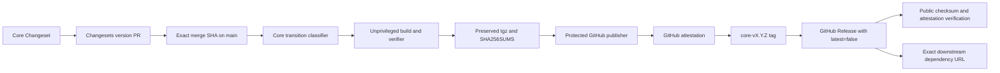
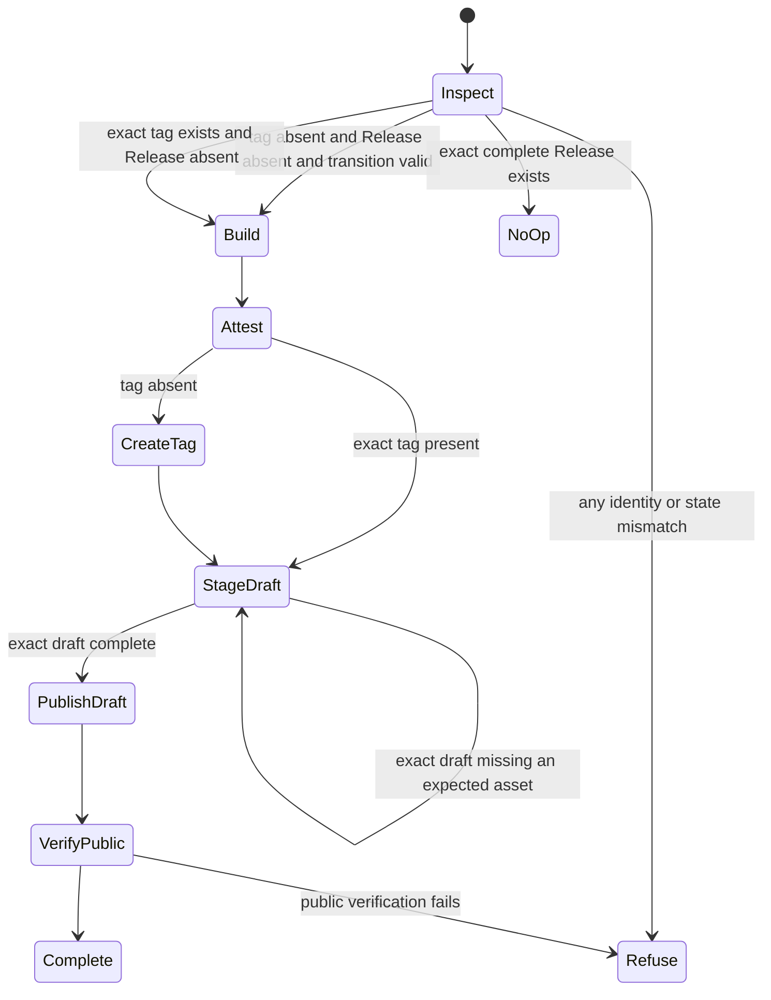

# Private Core GitHub Release Distribution - Plan

## Goal Capsule

- **Objective:** Stop all npm publication of `@swartzrock/llm-now-core` and distribute the verified package tarball from immutable, versioned GitHub Releases without changing the core API, CLI behavior, or native CLI release train.
- **Authority:** The Product Contract owns distribution visibility, package identity, version identity, consumer behavior, and release safety. The Planning Contract owns the workflow shape, manifest and verifier checks, documentation, tests, and first-release sequence. Repository instructions and existing native release invariants remain binding where this plan is silent.
- **Execution profile:** One implementation phase and one pull request from `main`. The pull request includes a core patch Changeset. After merge, the ordinary Changesets version pull request creates the release-shaped core version transition. Merging that version pull request publishes the first core GitHub Release.
- **Stop conditions:** Stop if a direct GitHub Release tarball cannot install in the maintained Node, Bun, and TypeScript NodeNext fixtures; if making the package private prevents deterministic packing; if a core release can replace the native `/releases/latest` target; if core and native tag namespaces can collide; or if the new workflow can delete, move, or overwrite a conflicting public tag or Release.
- **Tail ownership:** LFG implements, verifies, reviews, commits, pushes, opens one pull request, and watches its checks. The later Changesets version pull request and first public `core-v*` Release remain explicit post-merge release operations.

---

## Product Contract

### Summary

The core remains a workspace in the public llm-now repository. Its package manifest is private so npm publication fails closed. The repository continues to build a normal npm-format `.tgz`, but GitHub Releases, not npmjs, distribute that file.

Each released core version has its own `core-vX.Y.Z` Git tag and GitHub Release. The Release contains exactly the verified tarball and `SHA256SUMS`. A downstream project installs the exact versioned asset URL and commits its lockfile. Core Releases never become the repository's latest Release because that identity belongs to the native CLI.

### Problem Frame

The merged core extraction added a public npm publication lane. The first post-merge run failed safely because npm authority was absent. The user does not want the package on npmjs. Supplying an npm token would solve the wrong problem.

A direct repository dependency is also a poor fit. The package lives below `packages/core`, while its generated `dist` files are not committed at the repository root package boundary. A verified GitHub Release tarball preserves the existing package layout and external-consumer tests without creating another repository.

### Requirements

#### Distribution and package safety

- R1. `packages/core/package.json` has `private: true`, has no public `publishConfig`, and retains its scoped name, independent version, root export, engine floors, dependency pins, file allowlist, and ESM/type contract.
- R2. Repository-owned policy rejects a core manifest that is public, has any `publishConfig`, or adds lifecycle scripts that could run during a downstream install.
- R3. The repository contains no active core workflow step that runs `npm publish`, changes npm dist-tags, deprecates an npm version, queries npm package state, or consumes an npm publication secret.
- R4. `npm pack` remains only a local artifact-construction tool. It must produce a private package tarball that installs and runs from an exact file in the maintained Node, Bun, and TypeScript NodeNext fixtures.
- R5. Changesets remains the sole core version authority. Private packages remain versionable, core and CLI versions remain independent, and empty `fixed` and `linked` groups remain unchanged.

#### GitHub core release lane

- R6. A core version transition on protected `main` creates one candidate for tag `core-vX.Y.Z` and assets `swartzrock-llm-now-core-X.Y.Z.tgz` plus `SHA256SUMS` from the exact release commit.
- R7. An unprivileged job checks out the exact release SHA, performs a frozen install, runs the core build and maintained package verifier, and uploads only the expected tarball and checksum as a short-lived workflow artifact.
- R8. A protected publication job downloads that preserved artifact, verifies its one-line checksum manifest and package identity, creates a GitHub artifact attestation for that tarball, and then creates only the tag, draft Release, missing draft assets, or final publication allowed by R10. It does not install dependencies, rebuild the package, or use npm credentials. An exact complete Release is verification-only.
- R9. Repository-level immutable Releases are enabled before the first core release. The protected publisher verifies that setting with an environment-scoped fine-grained GitHub token limited to repository **Administration: read**, then creates `core-vX.Y.Z` only at the classified release SHA, stages the exact two-asset set in a draft, verifies every staged asset digest, and publishes a non-prerelease immutable Release with `--latest=false`.
- R10. The release state machine is fail closed and idempotent: an exact complete immutable Release is a verified no-op; an exact tag without a Release may resume from the same source SHA; an exact draft may accept only missing expected assets without clobber and then publish; a missing tag and Release may publish only from a release-shaped first-parent transition; any source, tag, asset, checksum, attestation, published-Release, or unexpected draft mismatch stops without mutation. Manual dispatch defaults to build-only, and manual publication requires the selected workflow ref and full release SHA to identify the same commit.
- R11. Core release ordering considers only stable `core-vX.Y.Z` Releases and refuses to create an older missing release after a higher core version is public. Native `vX.Y.Z` Releases neither block nor satisfy this rule.
- R12. Core publication does not invoke native builds, CLI changelog handling, signing, Homebrew synchronization, or native release assets. Native publication ignores `core-v*` and retains sole ownership of `vX.Y.Z` and the repository's latest Release. After core publication, latest must still be a stable native tag and may equal the recorded baseline or advance to a higher native version during a concurrent shared release.

#### Consumer and operator contract

- R13. Documentation gives the durable dependency form `https://github.com/swartzrock/llm-now/releases/download/core-vX.Y.Z/swartzrock-llm-now-core-X.Y.Z.tgz`, requires an exact version instead of a floating latest URL, and tells consumers to commit their lockfile.
- R14. Documentation states that `private: true` prevents npm publication but does not make source or GitHub Release assets private in this public repository.
- R15. Consumer verification covers the GitHub Release checksum and GitHub attestation, then repeats the maintained Node, Bun, and TypeScript NodeNext package smokes against the downloaded tarball.
- R16. Release documentation defines main-push publication, exact-SHA recovery, tag-without-Release recovery, already-complete no-op, conflict refusal, fix-forward after ambiguous public state, and the operational rule not to rerun the historical npm workflow.
- R17. This pivot includes a core patch Changeset. The next generated version pull request advances core from `0.1.0` to `0.1.1`; its merge is the first eligible GitHub core release transition.

### Key Decisions

- **Do not publish core on npmjs.** (session-settled: user-directed — chosen over adding a bootstrap npm token because npm registry distribution is not required.) Governs R1-R4 and R14.
- **Distribute verified npm-format tarballs through GitHub Releases.** (session-settled: user-approved — chosen over a direct Git dependency because the workspace is nested and generated `dist` files are not committed.) Governs R4 and R6-R16.
- **Keep core in the llm-now monorepo.** (session-settled: user-approved — chosen over a dedicated repository because another repository and synchronization process add no required capability.) Governs R1, R5-R8, and R12.
- **Keep independent Changesets versions and use `core-vX.Y.Z` tags.** (session-settled: user-approved — chosen over sharing native `vX.Y.Z` tags or abandoning package versions because the two release identities must remain independent.) Governs R5-R12 and R17.

### Actors

- A1. **Core consumer:** pins one GitHub Release tarball URL in a Node or Bun project and commits the resolved lockfile.
- A2. **Release maintainer:** merges Changesets version pull requests, approves protected GitHub publication, and follows fail-closed recovery instructions.
- A3. **Core artifact job:** builds and verifies one exact package candidate without release-write authority.
- A4. **Core publisher:** attests and publishes only the preserved candidate under the exact core tag.
- A5. **Native release lane:** continues to publish CLI binaries and own the repository's latest Release.

### Key Flows

- F1. **Prepare a core release:** a code pull request includes a core Changeset; Changesets later bumps only the selected package identities and updates the matching changelog.
- F2. **Publish from main:** a release-shaped core version transition is classified, built once, verified externally, attested, tagged, published with `--latest=false`, downloaded again, and verified against the source SHA.
- F3. **Recover safely:** a maintainer reruns the exact failed run before tag creation, or dispatches the workflow at the exact release ref when the correct tag exists without a Release. Conflicting or newer public state stops the workflow.
- F4. **Consume core:** a downstream host pins the exact GitHub Release tarball URL, verifies public integrity and provenance when required, installs transitive runtime dependencies through its package manager, and commits the lockfile.
- F5. **Release CLI independently:** a CLI Changesets transition continues through `vX.Y.Z`, native archives, checksums, attestations, latest-Release identity, and Homebrew without invoking the core release lane unless the same version pull request explicitly changes core too.

### Acceptance Examples

- AE1. **Covers R1-R4.** A manifest with `private: true` and no `publishConfig` packs successfully; the tarball has the exact allowlist and passes external Node, Bun, and NodeNext tests. Making the manifest public or adding `publishConfig` fails policy tests.
- AE2. **Covers R3 and R8.** Static workflow tests find no npm publication commands, npm dist-tag or deprecation commands, npm registry endpoint, `NPM_*` variable, trusted-publisher setup, or npm publication environment in the active core release lane.
- AE3. **Covers R5 and R17.** The included patch Changeset selects only core. A generated version transition changes core `0.1.0` to `0.1.1`, consumes that Changeset, updates the core changelog, and leaves the CLI version unchanged.
- AE4. **Covers R6-R9.** A valid core transition yields tag `core-v0.1.1`, the exact versioned `.tgz`, and `SHA256SUMS`; the protected publisher rechecks both, stages and verifies a draft, and publishes a non-latest immutable GitHub Release only after attestation.
- AE5. **Covers R10-R11.** An existing exact complete immutable core Release is a no-op. An exact partial draft can receive only missing expected assets with matching local digests. A wrong tag SHA, Release without a tag, unexpected or changed draft asset, incomplete published Release, bad checksum, absent or wrong-source attestation, prerelease state, or higher core Release stops before further mutation. The lane contains no clobber, published-release upload/edit/delete, or force-tag repair path.
- AE6. **Covers R10 and R16.** A correct tag without a Release resumes only when the selected workflow ref and release SHA are the tagged commit. A dispatch from newer `main` cannot rebuild an older core version.
- AE7. **Covers R11-R12.** Native `v2.7.0` and core `core-v0.1.1` coexist. The core Release uses `--latest=false`; native release policy still recognizes only stable `vX.Y.Z`; neither lane consumes the other's assets or changelog.
- AE8. **Covers R13-R15.** A cold downstream fixture installs the exact GitHub asset URL, resolves the declared runtime dependencies, imports the root API under Node and Bun, resolves declarations under NodeNext, and records the exact asset in its lockfile.
- AE9. **Covers R14.** Documentation says the package is absent from npmjs and is public only as repository source and downloadable GitHub Release bytes.
- AE10. **Covers R16.** The operator guide gives deterministic go/no-go checks for first publication, rerun, partial publication, conflicting state, and historical npm-workflow avoidance without requesting an npm token.

### Success Criteria

- Core cannot be published to npm from the current manifest or active workflow.
- One exact core version produces one immutable, attested, checksum-verified GitHub Release tarball without becoming the repository's latest Release.
- A second project can consume the exact Release URL under the documented Node and Bun floors.
- Core-only, CLI-only, and shared version transitions preserve independent release behavior.
- Automated tests and operator documentation cover every public-state branch in R10.

### Scope Boundaries

#### In scope

- Core manifest, pack verifier, Changesets policy, release classifier, core release workflow, release tests, consumer tests, release documentation, and a core patch Changeset.
- Removal or replacement of active repository code and documentation for npm publication.

#### Out of scope

- Publishing any version to npmjs or configuring an npm token, npm trusted publisher, npm organization, or npm environment.
- Moving core to a new repository, committing generated `dist`, or changing its public API.
- Changing provider behavior, credentials, aliases, routing, voice ownership, CLI bytes, native artifacts, or Homebrew behavior.
- Making the public repository's source or GitHub Release assets private.
- Automatically deleting historical GitHub Actions runs or repository environments; operators keep npm secrets absent and do not approve reruns of the retired workflow.

---

## Planning Contract

### Assumptions

- A1. Reuse the existing protected `release-publication` environment for core GitHub publication. Add a stable `core-v*` tag deployment policy before exact-tag recovery is needed; its current custom policy admits only `main`.
- A2. The first core GitHub Release is `core-v0.1.1`, not a retroactive `core-v0.1.0`. A patch Changeset preserves the strict first-parent version-transition gate and ensures the released manifest is private.
- A3. `npm pack` remains acceptable as a packaging command because it performs no registry mutation. Policy bans npm publication and registry authority, not the npm-format archive itself.
- A4. Downstream installs may still contact package registries for the three declared runtime dependencies. GitHub hosts the core tarball only; it does not vendor transitive dependencies.
- A5. A correct tag without a Release is recoverable because the tag already fixes the source identity. A Release without its tag or with wrong public state is not repaired automatically.
- A6. The old npm workflow becomes inactive when its file is removed or replaced on `main`, but historical reruns use their historical workflow definition. No npm publication secrets exist; operators must not add them or approve those reruns.
- A7. GitHub's repository immutable-release settings endpoint requires repository **Administration: read**, which the workflow `GITHUB_TOKEN` permission map cannot grant. The protected `release-publication` environment supplies `CORE_RELEASE_SETTINGS_TOKEN` as a fine-grained, read-only, repository-scoped settings credential; it has no Contents or release-write permission.

### Key Technical Decisions

- KTD1. **Invert package safety at every authority boundary.** Require `private: true` and forbid `publishConfig` in the live manifest, packed manifest verifier, release classifier, and tests. One check alone is insufficient because packing, classification, and future workflow changes are separate mutation surfaces. Implements R1-R4.
- KTD2. **Keep Changesets versioning but separate it from publication.** Preserve private-package versioning, independent groups, the consumed-Changeset parser, changelog proof, and first-parent transition checks. Replace only the distribution side. Implements R5 and R17.
- KTD3. **Replace the npm workflow with a GitHub core release workflow.** Carry forward the current exact-SHA classifier and unprivileged package-verifier job, then adapt the native release workflow's protected attestation, tag, Release, checksum, and no-op pattern. Classification and packaging run read-only at the event's exact SHA. Only the protected publisher receives GitHub release-write and attestation authority, and it revalidates source, classification, and artifact identity after any environment wait. Do not retain a dormant npm job. Implements R3 and R6-R12.
- KTD4. **Build once and publish one immutable release record.** The unprivileged job creates one tarball and checksum. The protected job only downloads, inspects, attests, stages, and publishes those bytes. The record binds source SHA, tag target, tarball basename and SHA-256, exact two-asset allowlist, action attestation identity, immutable-release attestation, and final Release attributes. Creation, draft resume, and no-op verification validate the complete record. Implements R7-R10.
- KTD5. **Use disjoint release identities and serialized core mutation.** Core uses `core-vX.Y.Z`, exactly two assets, core changelog notes, a fixed non-cancelling core-release concurrency group, and `--latest=false` on every publication path. Native retains `vX.Y.Z`, native assets, CLI changelog notes, latest-Release behavior, and its own concurrency. Shared Changesets merges may trigger both workflows. The latest Release may remain at the recorded native baseline or advance to a higher native version, but it must never become the core tag. Implements R6, R9, R11-R12.
- KTD6. **Use GitHub's immutable-release lifecycle.** Enable repository-level Release immutability. Immediately before protected mutation, check that setting with `CORE_RELEASE_SETTINGS_TOKEN`, a fine-grained environment secret limited to repository **Administration: read**; retain the ordinary `GITHUB_TOKEN` for tag, Release, and attestation operations. The workflow distinguishes absent state, exact tag-only state, an exact draft with zero or partial verified assets, an exact complete immutable Release, an incomplete published Release, and conflicting state. It can create from absent state, resume tag-only state, add only missing assets to an exact draft, publish that draft once, or verify the exact complete state. Every other state fails closed. It never moves a tag, clobbers an asset, mutates a published Release, or backfills an older version after a higher stable core Release. An ambiguous published version is investigated and superseded through a new Changeset version. Implements R9-R11.
- KTD7. **Pin consumers to an asset URL, not a repository ref or latest alias.** The exact tag and filename make upgrades explicit and lockfile-reviewable while preserving the tested package boundary. Implements R13-R15.
- KTD8. **Release `0.1.1` through the normal version PR.** The implementation pull request adds a patch Changeset but does not hand-edit `packages/core/package.json` or its changelog version heading. The Changesets pull request performs those writes and creates the first eligible release commit. Implements R17.

### High-Level Technical Design

The diagrams show lifecycle and authority boundaries. They are not implementation code.

### System-Wide Impact and Risks

- **Package metadata:** Private status changes publication policy only. The packed name, version, exports, declarations, dependencies, and runtime behavior stay stable.
- **Release classification:** Core release transitions still come only from Changesets-generated version and changelog changes. The classifier now requires a private candidate.
- **Workflow authority:** The active core lane trades npm/OIDC authority for GitHub `contents`, `id-token`, `attestations`, and artifact-metadata write authority inside the protected publisher. The publisher rechecks exact source, classifier output, and preserved artifact after the environment wait and before mutation.
- **GitHub Release UX:** `--latest=false` is load-bearing because root install links use the native latest Release. Static tests require it on publication. Public verification requires latest to remain a stable native tag that equals the baseline or a higher native version and never equals the core tag.
- **Partial failure:** A tag or exact draft may remain after failure. Exact-ref recovery can resume tag-only state or add only missing expected assets to the draft. An incomplete published Release or any mismatch is preserved for investigation and superseded by a higher patch, never auto-repaired.
- **Asset immutability:** GitHub's repository-level control locks the tag and assets after draft publication and generates a release attestation. Workflow checks validate the draft before publication and verify the immutable Release, both attestations, exact allowlist, checksum, source digest, and signer workflow on creation and no-op.
- **Cross-lane concurrency:** A fixed non-cancelling core group serializes all core publication attempts. A shared version pull request may still run core and native workflows together because separate groups, tag namespaces, state scans, artifacts, changelogs, and protected publishing paths prevent interference. Public latest verification permits a concurrent monotonic native advance.
- **Historical npm workflow:** Deleting the active file does not rewrite an old run. Fail-closed posture requires no npm credential in `npm-core-publish`, no trusted-publisher relationship that authorizes the old workflow, and the scoped package to remain absent. Documentation and first-release checks make those external controls explicit.
- **Consumer dependency access:** The core tarball is on GitHub, but ordinary resolution of its runtime dependencies can still require their registries. Offline or registry-free distribution is not claimed.
- **Public visibility:** The package is not indexed on npmjs, but the public repository and Release assets remain public. Documentation must avoid calling the package confidential or access-controlled.

### First-Release Go/No-Go

#### Before protected approval

- **Implementation owner:** Confirm the private-manifest, package, workflow-policy, release-plan, and documentation tests pass; the retired npm workflow is absent; and no npm publication authority was requested.
- **Release maintainer:** Confirm the Changesets version pull request changes core `0.1.0` to `0.1.1`, updates the core changelog, consumes the core-only Changeset, and leaves CLI version unchanged unless separate intent selects it.
- **Release maintainer:** Record the version pull request's merge SHA and first parent. Confirm classification reports that SHA, version `0.1.1`, and tag `core-v0.1.1`.
- **Release maintainer:** Record the current native latest Release tag and target SHA as the post-release baseline.
- **Release maintainer:** Confirm no `core-v0.1.1` tag or Release and no higher stable `core-v*` Release exists. Unexpected public state is no-go.
- **Repository administrator:** Confirm `release-publication` still has the intended protection. The artifact job has no write authority; only the protected publisher can write attestations, tags, or Releases.
- **Repository administrator:** Confirm `release-publication` admits protected `main` and stable `core-v*` recovery tags, while feature and pull-request refs remain denied.
- **Repository administrator:** Store `CORE_RELEASE_SETTINGS_TOKEN` only in `release-publication`; scope the fine-grained GitHub token to this repository with **Administration: read**, no Contents or write permission, and a managed expiry.
- **Repository administrator:** Enable repository-level Release immutability and confirm its repository-wide effect on future native and core Releases is accepted. The setting does not retroactively change existing Releases.
- **Repository administrator:** Confirm the retired `npm-core-publish` environment has no npm credential, no npm trusted-publisher relationship authorizes the historical workflow, and the scoped package remains absent from npmjs.
- **Artifact job:** Confirm the preserved artifact contains exactly the versioned tarball and `SHA256SUMS`; the one-line checksum validates; the manifest has the expected private identity; and Node, Bun, and NodeNext fixtures pass.
- **Release maintainer:** Confirm source SHA, tag, version, asset names, tarball digest, signer workflow, draft-to-immutable flow, and `latest=false` are complete and consistent.

The last safe stop is before approval of the protected publisher. Do not approve if any item is unknown or inconsistent.

#### Immediately after publication

- Confirm `core-v0.1.1` and the Release target resolve to the recorded merge SHA.
- Confirm the Release is immutable, non-draft, non-prerelease, explicitly not latest, and contains only the tarball and `SHA256SUMS`.
- Confirm the public tarball digest matches the preserved digest and checksum entry.
- Confirm GitHub verifies both the action artifact attestation and immutable-release attestation against the repository, `.github/workflows/release-core.yml`, exact source SHA, tag, and tarball digest.
- Confirm the repository's latest Release is a stable native `vX.Y.Z` tag, is not the core tag, and equals the recorded baseline or a higher native version.
- Confirm a cold external consumer downloads the exact unauthenticated asset URL, verifies checksum and attestation, passes Node, Bun, and NodeNext smokes, and records the exact URL in its lockfile.
- Record the source SHA, tag, Release URL, asset digest, attestation identity, and native latest-Release baseline/result in the workflow summary.

#### Recovery matrix

- **No attestation, tag, or Release:** Rerun the same workflow at the same release SHA after confirming public state is absent.
- **Attestation only:** Resume only at the same source SHA and tarball digest.
- **Exact tag without Release:** Use exact-ref recovery only when the tag resolves to the recorded SHA and the candidate digest matches.
- **Exact draft:** Add only missing expected assets whose local digests match the preserved record; do not clobber. Publish only after the draft is complete and verified.
- **Exact complete immutable Release:** Rerun only as a full public verification and no-op.
- **Any conflict or ambiguous published state:** Preserve evidence. Do not delete, edit, move, overwrite, or upload into public state. Fix forward with a reviewed higher patch Changeset.
- **Historical npm workflow:** Never rerun it and never add npm credentials to make it pass.

#### First 24 hours

- At `+1h` and `+24h`, confirm immutable status, tag target, Release flags, two-asset allowlist, checksum, and attestations remain unchanged. Confirm latest is still a stable native tag and has not moved backward.
- Repeat the exact-URL cold consumer smoke at least once after caches are cold.
- Treat tag movement, asset replacement, unexpected assets, attestation mismatch, latest-Release change, or consumer install failure as a release incident.

### Implementation Sequencing

One pull request contains U1-U4. U1 makes the package and version classifier fail closed before publication code changes. U2 replaces the release lane using the verified package boundary from U1. U3 updates every consumer and operator contract after workflow behavior is concrete. U4 adds the Changeset and runs cross-lane verification.

---

## Implementation Units

### Phase 1 — Replace npm distribution with GitHub core Releases

### U1. Make the core private and keep the tarball distributable

- **Goal:** Prevent npm publication at the manifest, verifier, and classifier boundaries while retaining a valid installable tarball.
- **Requirements:** R1-R2 and R4-R5.
- **Dependencies:** None.
- **Files:** `packages/core/package.json`, `scripts/verify-core-package.ts`, `scripts/release-plan.ts`, `tests/core-package.test.ts`, `tests/changesets.test.ts`, `tests/release-plan.test.ts`.
- **Approach:** Add `private: true`, remove `publishConfig`, invert packed-manifest and release-transition assertions, and retain all existing file, export, dependency, engine, build, and external-consumer checks. Preserve Changesets private-package versioning and independent groups.
- **Test scenarios:** Private manifest packs and installs; public manifest fails; any `publishConfig` fails; lifecycle scripts fail; core-only version transition with a private after-package succeeds; a public after-package fails both with and without a version bump; unchanged/rollback/wrong-parent/missing-changelog/unselected-Changeset paths retain their current outcomes.
- **Verification:** Focused package, Changesets, and release-plan suites pass, and the real tarball verifier passes Node, Bun, and NodeNext fixtures.

### U2. Replace the npm publisher with a fail-closed GitHub core release lane

- **Goal:** Publish exact verified core tarballs as attested GitHub Releases under a separate tag namespace.
- **Requirements:** R3 and R6-R12.
- **Dependencies:** U1.
- **Files:** remove `.github/workflows/publish-core.yml`; add `.github/workflows/release-core.yml`; update `tests/release-policy.test.ts`; update `scripts/release-plan.ts` only if release metadata output needs a core tag or notes input.
- **Approach:** Reuse the current core classifier and unprivileged artifact job. Adapt the native release state machine for a single package tarball, exact `core-vX.Y.Z` tag, exact two-asset allowlist, action attestation, immutable Release staging, source-digest verification, protected `release-publication` environment, and `--latest=false`. Automatic main transitions publish after classification. Manual dispatch defaults to build-only; manual publication requires the selected ref and full release SHA to identify the same commit. Preserve source SHA, tag target, tarball digest, asset allowlist, both attestation identities, non-latest status, and the native latest baseline through publication, then record them in the workflow summary. Keep all npm registry, token, trusted-publisher, quarantine, dist-tag, and provenance code out of the new workflow.
- **Test scenarios:** Push no-op; valid main transition; manual build-only; manual exact-ref recovery; dispatch from wrong SHA; untagged non-release-shaped dispatch; complete immutable Release no-op with public re-verification; exact tag without Release; exact empty or partial draft; draft asset digest mismatch; wrong tag SHA; Release without tag; incomplete published or prerelease Release; missing, extra, or wrong asset; checksum mismatch; wrong signer workflow or source digest; post-create public verification; higher stable core Release; native release ignored by core ordering; core Release ignored by native ordering; `latest=false`; concurrent native latest may stay or advance but never become core; action pins; publisher consumes only the current run's preserved artifact; no clobber, published-release upload/edit/delete, or force-tag operations; unprivileged job has no write authority; protected publisher has no checkout-dependent build, install, native build, npm mutation, or npm secret.
- **Verification:** Workflow YAML parses, every shell block passes syntax checks, release-policy tests prove ordering and negative boundaries, and the unprivileged artifact job remains the only candidate builder.

### U3. Replace npm consumer and operator documentation

- **Goal:** Make exact GitHub Release URLs, verification, visibility, and recovery the only documented core distribution path.
- **Requirements:** R13-R16.
- **Dependencies:** U2.
- **Files:** `README.md`, `packages/core/README.md`, `packages/core/CHANGELOG.md`, `docs/core-api.md`, `docs/RELEASING.md`, `docs/manual-testing.md`, `.changeset/README.md`, `tests/documentation.test.ts`.
- **Approach:** Replace npm install, trusted publishing, bootstrap-token, registry-smoke, dist-tag, quarantine, and provenance text with an exact-version GitHub asset URL, lockfile policy, checksum and GitHub attestation checks, immutable-release setup, first-release steps, no-op and recovery paths, and the public-visibility/transitive-dependency caveats. Correct the stale `0.1.0` first-public-release narrative without changing its version heading; `0.1.1` is the first GitHub Release. Define rollback as exact-state resume or fix-forward to a higher patch, never public-state deletion or replacement. Keep native release instructions unchanged except for clarifying tag and latest-Release separation.
- **Test scenarios:** Docs contain the exact tag/filename URL shape, lockfile guidance, checksum and both attestation checks, Node/Bun floors, `core-v` versus `v` ownership, repository immutability, draft staging, `latest=false`, first-release 0.1.1 sequence, exact-ref recovery, release-environment tag policy, historical npm-workflow warning, public-asset caveat, and transitive registry caveat; docs contain no instruction to publish core to npm, add npm credentials, or use a floating Release URL.
- **Verification:** Documentation tests pass and every referenced workflow, file, tag shape, asset name, and command contract matches the implemented lane.

### U4. Add the release intent and prove cross-lane behavior

- **Goal:** Prepare the next normal Changesets version transition and verify the repository as one release system.
- **Requirements:** R5, R11-R12, and R17.
- **Dependencies:** U1-U3.
- **Files:** add `.changeset/<generated-private-core-release>.md`; update any release regression fixtures affected by the new intent; include this plan in the branch.
- **Approach:** Add a patch Changeset selecting only `@swartzrock/llm-now-core`. Do not edit the current `0.1.0` version or changelog heading. Run package, workflow, documentation, release classifier, native release, full test, typecheck, build, frozen-lockfile, and diff-integrity gates.
- **Test scenarios:** Changesets status reports a core patch only; core-only transition leaves native release a no-op; CLI-only transition leaves core release a no-op; shared explicit transition can start both independent lanes; lockfile is unchanged unless manifest metadata requires it; no source/API behavior changes.
- **Verification:** All gates in the Verification Contract pass or a documented environment-only limitation is reproduced without weakening the relevant policy test.

---

## Verification Contract

### Focused gates

- `bun test tests/core-package.test.ts tests/changesets.test.ts tests/release-plan.test.ts`
  - Proves the private package contract, deterministic tarball, external consumers, and Changesets release classification.
- `bun test tests/release-policy.test.ts tests/documentation.test.ts`
  - Proves workflow authority, state ordering, tag and asset isolation, no npm path, and documentation parity.
- `bun scripts/verify-core-package.ts dist/core-package`
  - Produces exactly one versioned `.tgz` plus `SHA256SUMS` and passes Node, Bun, and NodeNext external fixtures.

### Repository gates

- `bun install --frozen-lockfile`
  - Proves workspace metadata and the committed lockfile agree.
- `bun run core:build`
  - Proves JavaScript and declarations build before packing.
- `bun test`
  - Proves core, CLI, release, packaging, and documentation behavior remains green.
- `bunx tsc --noEmit`
  - Proves workspace and consumer-facing types resolve.
- `bun scripts/release-validate.ts packages`
  - Proves dependency ownership and native package boundaries remain valid.
- Parse `.github/workflows/release-core.yml` as YAML and syntax-check every `run:` block as Bash.
  - Proves the workflow and embedded state machine are structurally executable.
- `git diff --check`
  - Proves patch integrity.

### Release-state checks that remain GitHub-only

- The first real `core-v0.1.1` tag, Release creation, GitHub attestation publication, direct asset download, and `/releases/latest` preservation can execute only after the feature and Changesets version pull requests merge.
- The maintainer must verify those outcomes through the protected workflow and manual test checklist. Local tests model and statically enforce the state machine; they do not mutate public release state.

---

## Definition of Done

- [ ] The core manifest, packed manifest verifier, and release classifier require `private: true` and forbid `publishConfig`.
- [ ] The active core release workflow contains no npm publication, registry, dist-tag, deprecation, token, or trusted-publisher path.
- [ ] Repository-level immutable Releases are enabled; `release-publication` contains the repository-scoped, **Administration: read** `CORE_RELEASE_SETTINGS_TOKEN`; and the protected exact-SHA workflow stages only an attested `.tgz` and `SHA256SUMS` before publishing `core-vX.Y.Z` with `--latest=false`.
- [ ] The release state machine resumes only exact tag-only or verified draft state, treats exact complete immutable state as a no-op, and refuses every conflicting state without published-state deletion, overwrite, tag movement, or asset replacement.
- [ ] Core and native tag, changelog, artifact, concurrency, latest-Release, and downstream sync identities remain disjoint.
- [ ] Documentation teaches exact GitHub Release URL installation, committed locks, checksum and attestation checks, public visibility, transitive dependencies, first release, and recovery.
- [ ] The protected release environment admits protected `main` and stable `core-v*` recovery tags but denies feature and pull-request refs.
- [ ] A core-only patch Changeset is present; live version and changelog are not hand-edited.
- [ ] Focused and repository verification gates pass, with no core API or CLI behavior regression.
- [ ] The implementation plan is included in the pull request, and LFG completes review, commit, push, pull request creation, and CI babysitting.

### Post-merge operational closure

- [ ] The maintainer records the real `core-v0.1.1` source SHA, Release URL, tarball digest, attestation verification, cold-consumer result, and native latest-Release before/after evidence after the Changesets version pull request merges.

---

## Sources

- [Previous headless core implementation plan](./2026-08-15-1352-feat-headless-core-package-plan.md) — records the extracted package boundary, independent versioning, verifier, and native-release constraints that this pivot preserves.
- [GitHub Releases overview](https://docs.github.com/en/repositories/releasing-projects-on-github/about-releases) — Releases provide versioned downloadable assets tied to tags.
- [GitHub permanent release links](https://docs.github.com/en/repositories/releasing-projects-on-github/linking-to-releases) — supports durable tag-and-asset download URLs.
- [`gh release create`](https://cli.github.com/manual/gh_release_create) — documents exact tag verification and `--latest=false`.
- [Bun add dependencies](https://bun.sh/docs/pm/cli/add) — documents GitHub and remote tarball dependency forms.
- [GitHub artifact attestations](https://docs.github.com/en/actions/security-for-github-actions/using-artifact-attestations/verifying-the-authenticity-of-artifacts-with-artifact-attestations) — supports public verification against repository, workflow, and source identity.
- [GitHub immutable Releases](https://docs.github.com/en/code-security/supply-chain-security/understanding-your-software-supply-chain/immutable-releases) — locks published tags and assets, generates a Release attestation, and recommends draft staging before publication.
- [Enable immutable Releases](https://docs.github.com/en/code-security/supply-chain-security/understanding-your-software-supply-chain/preventing-changes-to-your-releases) — defines the repository setting and its future-release scope.
- [Verify immutable Releases](https://docs.github.com/en/code-security/supply-chain-security/understanding-your-software-supply-chain/verifying-the-integrity-of-a-release) — defines Release and local-asset verification.
- `.github/workflows/release.yml` — repository pattern for protected tag-last GitHub publication, exact public asset verification, attestation, safe no-op, and conflict refusal.
- `scripts/verify-core-package.ts` and `tests/fixtures/core-consumer-*` — current deterministic tarball and external-consumer proof.
- `.changeset/config.json` and `scripts/release-plan.ts` — current private-package versioning and strict release-transition authority.
